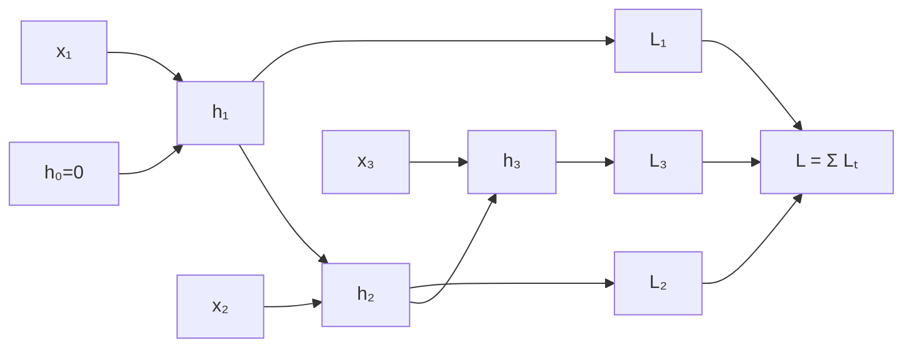
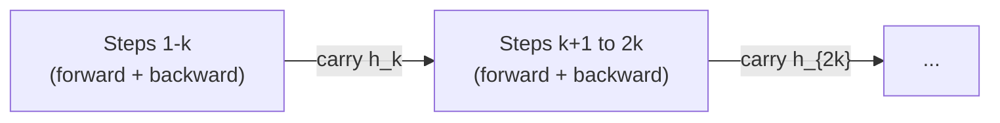

# Backpropagation through time

In a feedforward network, backpropagation flows backward through layers. In a recurrent network, the same weight matrix $W_h$ is applied at every time step — so gradients must flow backward not just through layers, but through time. Backpropagation through time (BPTT) is the name for this: unroll the RNN across $T$ steps and apply standard backpropagation to the unrolled graph.

## One-line definition

Backpropagation through time unrolls an RNN across all $T$ time steps to create a $T$-layer feedforward graph, then applies standard backpropagation — accumulating gradients from all time steps into the shared weight matrices.


*Source: [Wikimedia Commons — Recurrent neural network unfold](https://commons.wikimedia.org/wiki/File:Recurrent_neural_network_unfold.svg) (CC BY-SA 4.0)*

## Why this topic matters

BPTT explains two critical facts about RNN training: (1) computing the gradient is expensive — $O(T)$ sequential operations cannot be parallelized; (2) gradients flowing through many time steps either vanish (when the Jacobian spectral norm < 1) or explode (when it > 1). These are the root causes of long-range dependency failure in vanilla RNNs and the motivation for LSTMs and truncated BPTT.

## Unrolling the RNN

An RNN processes a sequence $x_1, x_2, \ldots, x_T$ with the recurrence:

$$
h_t = \tanh(W_h h_{t-1} + W_x x_t + b)
$$

When unrolled, this looks like a $T$-layer feedforward network where:
- Each "layer" is one time step
- All layers share the same weights $W_h$, $W_x$, $b$



## The total loss and gradient

If the task produces a loss at every time step (e.g., language modeling):

$$
\mathcal{L} = \sum_{t=1}^{T} \mathcal{L}_t
$$

The total gradient of the shared weight $W_h$ accumulates contributions from all time steps:

$$
\frac{\partial \mathcal{L}}{\partial W_h} = \sum_{t=1}^{T} \frac{\partial \mathcal{L}_t}{\partial W_h}
$$

## The gradient for one time step loss

For the loss at time $t$, the gradient with respect to $W_h$ requires flowing backward through all previous time steps:

$$
\frac{\partial \mathcal{L}_t}{\partial W_h} = \sum_{k=1}^{t} \frac{\partial \mathcal{L}_t}{\partial h_t} \cdot \left(\prod_{j=k+1}^{t} \frac{\partial h_j}{\partial h_{j-1}}\right) \cdot \frac{\partial h_k}{\partial W_h}
$$

The product term is the chain of Jacobians from time $k$ back to time $t$:

$$
\prod_{j=k+1}^{t} \frac{\partial h_j}{\partial h_{j-1}} = \prod_{j=k+1}^{t} W_h^T \cdot \text{diag}(\tanh'(z_j))
$$

## Why long sequences cause problems

At each step, the gradient is multiplied by $W_h^T \cdot \text{diag}(\tanh'(z))$.

**Vanishing**: If the spectral norm of $W_h$ is less than 1, the product shrinks exponentially:

$$
\left\| \prod_{j=k+1}^{t} W_h^T \cdot \text{diag}(\tanh'(z_j)) \right\| \leq \left(\rho \cdot \max_z |\tanh'(z)|\right)^{t-k} = (\rho \cdot 1)^{t-k}
$$

where $\rho$ is the spectral radius of $W_h$. For $\rho < 1$, this decays exponentially in $(t-k)$.

**Exploding**: If $\rho > 1$, the same product grows exponentially.

For a sequence of length $T = 100$ and $\rho = 0.9$: the gradient from the first time step contributes $0.9^{100} \approx 2.7 \times 10^{-5}$ of its original signal — effectively zero.

## Truncated BPTT

Full BPTT with very long sequences is both computationally expensive and numerically unstable. Truncated BPTT processes the sequence in chunks of length $k$:

1. Process $k$ time steps forward
2. Backpropagate through those $k$ steps only
3. Carry the hidden state $h_t$ forward to the next chunk (but not the gradient)
4. Repeat



This reduces memory from $O(T)$ to $O(k)$ and makes very long sequences tractable. The tradeoff is that gradients cannot flow further than $k$ steps — dependencies longer than $k$ steps are not captured.

## PyTorch example

```python
import torch
import torch.nn as nn

class RNNModel(nn.Module):
    def __init__(self, input_size, hidden_size, output_size):
        super().__init__()
        self.rnn = nn.RNN(input_size, hidden_size, batch_first=True)
        self.fc = nn.Linear(hidden_size, output_size)

    def forward(self, x, h0=None):
        # x: (batch, seq_len, input_size)
        out, h_n = self.rnn(x, h0)
        # out: (batch, seq_len, hidden_size) — all time step outputs
        logits = self.fc(out)   # (batch, seq_len, output_size)
        return logits, h_n

model = RNNModel(input_size=10, hidden_size=64, output_size=5)
optimizer = torch.optim.Adam(model.parameters(), lr=1e-3)
criterion = nn.CrossEntropyLoss()

# Full BPTT (small sequence)
x = torch.randn(32, 20, 10)   # (batch=32, seq=20, input=10)
y = torch.randint(0, 5, (32, 20))  # target at each time step

optimizer.zero_grad()
logits, _ = model(x)                           # (32, 20, 5)
loss = criterion(logits.reshape(-1, 5), y.reshape(-1))
loss.backward()                                 # BPTT through all 20 steps
optimizer.step()

# Truncated BPTT (long sequence, process in chunks of k=20)
k = 20
long_x = torch.randn(32, 200, 10)  # sequence of 200
long_y = torch.randint(0, 5, (32, 200))

h = None  # carry hidden state between chunks
for start in range(0, 200, k):
    x_chunk = long_x[:, start:start+k, :]
    y_chunk = long_y[:, start:start+k]

    optimizer.zero_grad()
    logits, h = model(x_chunk, h)
    h = h.detach()  # detach from computation graph — no gradient flows back past this point

    loss = criterion(logits.reshape(-1, 5), y_chunk.reshape(-1))
    loss.backward()
    torch.nn.utils.clip_grad_norm_(model.parameters(), max_norm=1.0)
    optimizer.step()
```

The key line is `h = h.detach()` — this breaks the computational graph between chunks, implementing truncated BPTT.

## Interview questions

<details>
<summary>What is backpropagation through time and how does it differ from standard backpropagation?</summary>

BPTT unrolls an RNN across T time steps, creating a T-layer feedforward graph where all layers share the same weights. Standard backpropagation is then applied to this graph. The difference is that (1) gradients must flow backward across time steps, not just layers, and (2) gradients for the shared weight W_h accumulate from all T time steps: ∂L/∂W_h = Σ_t ∂L_t/∂W_h. The result is a very deep unrolled graph (one layer per time step) that is susceptible to vanishing/exploding gradients.
</details>

<details>
<summary>What is truncated BPTT and why is it used?</summary>

Truncated BPTT processes the sequence in fixed-length chunks, backpropagating through each chunk but not across chunk boundaries. This reduces memory from O(T) to O(k) and prevents gradients from traveling farther than k steps. The hidden state is carried forward between chunks (so the RNN still has long-range state), but gradients cannot flow backward past chunk boundaries. Used for very long sequences where full BPTT is computationally intractable.
</details>

<details>
<summary>Why do vanilla RNNs fail at long-range dependencies?</summary>

The gradient from time step t back to time step k passes through the product ∏(W_h^T · diag(tanh'(z_j))) for j from k+1 to t. If the spectral norm of W_h times the max tanh derivative is less than 1, this product shrinks exponentially in (t-k). For sequences of length 100, the gradient from the first step is essentially zero at the last step — the RNN cannot credit early inputs for late outputs.
</details>

## Common mistakes

- Forgetting to `detach()` the hidden state between chunks in truncated BPTT — without detachment, gradients attempt to flow through all previous chunks, consuming memory and defeating the purpose.
- Applying gradient clipping after the backward pass but computing the norm on accumulated gradients from multiple steps — clip after every backward step.
- Using full BPTT on sequences of length > 500 — the memory cost and numerical instability make this impractical with vanilla RNNs.

## Advanced perspective

BPTT is sequential: time step $t$ depends on $t-1$, so the unrolled graph cannot be parallelized across time. This is the fundamental reason transformers replaced RNNs for long-sequence tasks — attention computes all pairwise interactions in parallel, while BPTT requires $O(T)$ sequential steps. Parallel prefix scan algorithms can compute BPTT in $O(\log T)$ depth, but at the cost of $O(T \log T)$ total work. This motivates linear recurrent architectures like S4 and Mamba that achieve $O(T)$ recurrent computation with hardware-efficient parallelism.

## Final takeaway

BPTT is standard backpropagation applied to an unrolled RNN. Its key challenge is that the gradient must flow through $T$ multiplicative Jacobians, causing exponential decay or growth. Truncated BPTT and gradient clipping are the practical tools that make RNN training tractable.

## References

- Werbos, P. J. (1990). Backpropagation Through Time: What It Does and How to Do It.
- Goodfellow, I., Bengio, Y., & Courville, A. (2016). Deep Learning, Chapter 10.
