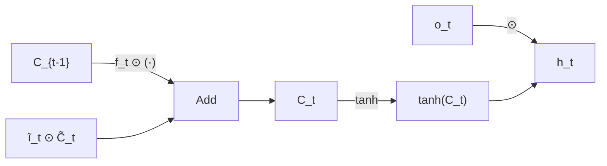

# LSTM architecture and gate-by-gate computation

Note 61 explained why LSTMs were created: to solve the vanishing gradient problem in vanilla RNNs. This note shows the exact mechanism — the five equations inside the LSTM cell, what each gate does, and why the additive cell state update is the key to gradient preservation.

## One-line definition

An LSTM cell at each time step takes the current input $x_t$, the previous hidden state $h_{t-1}$, and the previous cell state $C_{t-1}$, and produces a new hidden state $h_t$ and cell state $C_t$ via four learnable gate operations.

## Why this topic matters

The LSTM gates — forget, input, candidate, and output — work together as a differentiable memory system. Understanding each gate individually is what allows you to reason about why an LSTM can remember useful information across hundreds of time steps, debug vanishing gradients in sequence models, and understand why GRUs and transformers were designed the way they were.

## The two states in LSTM

Unlike a vanilla RNN (which has one state $h_t$), LSTM has two:

- **Cell state** $C_t \in \mathbb{R}^h$: the "long-term memory" — a conveyor belt that runs through time with minimal interaction, allowing gradients to flow far back
- **Hidden state** $h_t \in \mathbb{R}^h$: the "working memory" — the output used for predictions and passed to the next cell

The key architectural insight: the cell state update is **additive**, not multiplicative. This prevents gradients from vanishing.


*Source: [Colah's Blog — Understanding LSTM Networks](https://colah.github.io/posts/2015-08-Understanding-LSTMs/) (CC BY 4.0)*

## The five LSTM equations

Let $[h_{t-1}, x_t]$ denote the concatenation of the previous hidden state and current input, forming a vector of size $h + d$.

**1. Forget gate** — decides what to erase from cell state:

$$
f_t = \sigma(W_f [h_{t-1}, x_t] + b_f)
$$

Output: values in $(0, 1)$. Close to 0 = forget; close to 1 = keep.

**2. Input gate** — decides which new information to write:

$$
i_t = \sigma(W_i [h_{t-1}, x_t] + b_i)
$$

Output: values in $(0, 1)$. Controls how much of the candidate cell state to add.

**3. Candidate cell state** — new content to potentially add:

$$
\tilde{C}_t = \tanh(W_C [h_{t-1}, x_t] + b_C)
$$

Output: values in $(-1, 1)$. The proposed update to cell state (not yet gated).

**4. Cell state update** — the additive combination:

$$
C_t = f_t \odot C_{t-1} + i_t \odot \tilde{C}_t
$$

$\odot$ is element-wise (Hadamard) multiplication. This equation is the key:
- $f_t \odot C_{t-1}$: keeps fraction $f_t$ of old memory
- $i_t \odot \tilde{C}_t$: adds fraction $i_t$ of new candidate content

**5. Output gate and hidden state** — decides what to output:

$$
o_t = \sigma(W_o [h_{t-1}, x_t] + b_o)
$$

$$
h_t = o_t \odot \tanh(C_t)
$$

The tanh squashes $C_t$ to $(-1, 1)$; the output gate $o_t$ selects which dimensions to expose as the hidden state.

## Why the additive cell update prevents vanishing gradients

In a vanilla RNN, the gradient flows through:

$$
\frac{\partial h_t}{\partial h_{t-1}} = W_h^T \cdot \text{diag}(\tanh'(z_t))
$$

This is a multiplication at every time step — gradients decay exponentially.

In LSTM, the gradient flows through the cell state:

$$
\frac{\partial C_t}{\partial C_{t-1}} = f_t
$$

This is just the forget gate — a simple element-wise multiplication. When the forget gate is near 1, the gradient passes through unchanged. When it is near 0, the cell deliberately forgets, which is the model's choice, not a numerical artifact. The network learns when to forget and when to remember.



## Parameter shapes

For input dimension $d$ and hidden dimension $h$:

| Parameter | Shape | Description |
|---|---|---|
| $W_f$ | $(h, h+d)$ | Forget gate weights |
| $W_i$ | $(h, h+d)$ | Input gate weights |
| $W_C$ | $(h, h+d)$ | Candidate weights |
| $W_o$ | $(h, h+d)$ | Output gate weights |
| $b_f, b_i, b_C, b_o$ | $(h,)$ | Biases |

Total parameters: $4h(h + d) + 4h = 4h(h + d + 1)$.

For $h = 256$ and $d = 64$: $4 \times 256 \times (256 + 64 + 1) = 329,728$ parameters per LSTM layer.

## PyTorch example

```python
import torch
import torch.nn as nn

# Using nn.LSTMCell (one time step at a time — full control)
d, h = 64, 256  # input dim, hidden dim
cell = nn.LSTMCell(input_size=d, hidden_size=h)

# Initialize hidden and cell state
batch_size = 32
h_t = torch.zeros(batch_size, h)
C_t = torch.zeros(batch_size, h)

# Process a sequence of length T
T = 10
for t in range(T):
    x_t = torch.randn(batch_size, d)
    h_t, C_t = cell(x_t, (h_t, C_t))
    # h_t: (batch, h) — used for output at this step
    # C_t: (batch, h) — carried to next step

print("h_t shape:", h_t.shape)   # (32, 256)
print("C_t shape:", C_t.shape)   # (32, 256)

# Using nn.LSTM (processes full sequence at once — efficient)
lstm = nn.LSTM(
    input_size=d,
    hidden_size=h,
    num_layers=1,
    batch_first=True   # input shape: (batch, seq_len, input_size)
)

x = torch.randn(batch_size, T, d)   # (batch, seq_len, d)
output, (h_n, C_n) = lstm(x)

print("output shape:", output.shape)  # (32, 10, 256) — all time step outputs
print("h_n shape:", h_n.shape)        # (1, 32, 256) — final hidden state
print("C_n shape:", C_n.shape)        # (1, 32, 256) — final cell state

# For classification from sequence: use h_n (many-to-one)
classifier = nn.Linear(h, 10)
logits = classifier(h_n.squeeze(0))  # (32, 10)
```

## Interview questions

<details>
<summary>What is the purpose of the forget gate in LSTM?</summary>

The forget gate is defined as:

$$
f_t = \sigma(W_f [h_{t-1}, x_t] + b_f)
$$

It decides what fraction of the previous cell state to retain. Values close to $1$ mean "keep this information," while values close to $0$ mean "erase it." For example, when processing the subject of a new sentence, the LSTM might learn to forget the previous sentence's subject. The forget gate makes selective forgetting an explicit learnable decision.
</details>

<details>
<summary>Why is the LSTM cell state update additive and why does this matter?</summary>

The cell state update is:

$$
C_t = f_t \odot C_{t-1} + i_t \odot \tilde{C}_t
$$

This is a sum rather than a matrix product on the previous state. As a result, the key gradient relation is:

$$
\frac{\partial C_t}{\partial C_{t-1}} = f_t
$$

So when $f_t \approx 1$, the gradient flows backward through the cell state almost unchanged. This additive structure is what prevents the exponential gradient decay that plagues vanilla RNNs.
</details>

<details>
<summary>What is the difference between the cell state C_t and the hidden state h_t in LSTM?</summary>

The cell state $C_t$ is the long-term memory. It runs as a "conveyor belt" through time with minimal multiplicative interaction, allowing information to persist for hundreds of steps. The hidden state is the exposed output:

$$
h_t = o_t \odot \tanh(C_t)
$$

It is the cell state translated into what should be exposed at the current time step. The hidden state is used as input to the next layer and for predictions, while the cell state is carried internally as memory.
</details>

<details>
<summary>How many parameters does an LSTM layer have?</summary>

An LSTM layer with hidden size $h$ and input size $d$ has:

$$
4h(h+d+1)
$$

parameters. That comes from four gate weight matrices of size $h \times (h+d)$ and four bias vectors of size $h$. For $h = 256$ and $d = 64$:

$$
4 \times 256 \times 321 = 328{,}704
$$

So an LSTM layer has about four times as many parameters as a comparable vanilla RNN.
</details>

<details>
<summary>What is the difference between nn.LSTMCell and nn.LSTM in PyTorch?</summary>

nn.LSTMCell processes one time step at a time, requiring an explicit loop over the sequence. It offers maximum control and is useful when the computation at each step depends on the previous output (e.g., attention-augmented LSTMs). nn.LSTM processes the entire sequence in one call using optimized CUDA kernels (much faster). Use nn.LSTM for standard sequence processing; use nn.LSTMCell when custom step-level logic is needed.
</details>

## Common mistakes

- Confusing $h_t$ (hidden state) and $C_t$ (cell state) — they are both outputs of the LSTM cell but serve different roles.
- Using the output tensor (all time steps) instead of $h_n$ (final hidden state) for sequence classification tasks.
- Not initializing both $h_0$ and $C_0$ before processing a sequence — PyTorch initializes both to zero by default, but for stateful processing (carry state between batches), you must manage them manually.
- Using LSTM for tasks where transformers are available with sufficient data — LSTMs cannot parallelize across time steps and train much slower.

## Advanced perspective

The LSTM cell can be viewed as a differentiable read-write memory system. The forget, input, and output gates implement soft addressing: they select which memory locations to read, write, and expose at each step. This perspective connects LSTMs to Neural Turing Machines and Differentiable Neural Computers (DNCs), which generalize the memory addressing to content-based access. Modern recurrent architectures like Mamba replace the gating mechanism with a selective state-space model, preserving linear recurrence while achieving competitive performance with transformers.

## Final takeaway

The LSTM's power comes from its additive cell state update. By learning when to forget and when to write through differentiable gates, it controls gradient flow explicitly. The forget gate controls how much of the past survives — when it is near 1, gradients pass backward unchanged through the cell state, solving the vanishing gradient problem.

## References

- Hochreiter, S., & Schmidhuber, J. (1997). Long Short-Term Memory. Neural Computation.
- Greff, K., et al. (2017). LSTM: A Search Space Odyssey. IEEE TNNLS.
