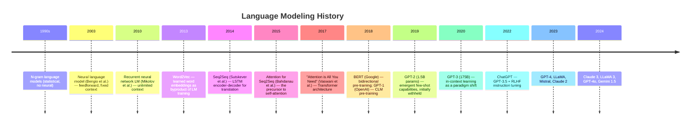
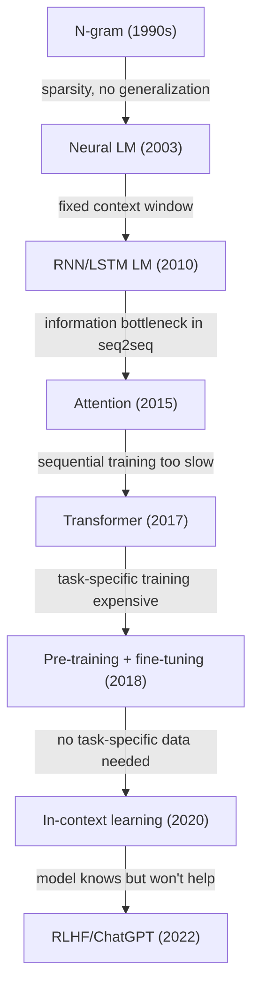

# The history of large language models from LSTMs to ChatGPT

> **TL;DR.** Language modeling started with statistical n-gram counting in the 1990s, moved to neural word embeddings (2003), gained "memory" through RNNs/LSTMs (2010–2014), broke the bottleneck with attention (2015), discarded recurrence entirely with transformers (2017), unlocked transfer learning via pre-training (BERT/GPT, 2018), saw emergent capabilities at scale (GPT-3, 2020), and finally became helpful through alignment (ChatGPT, 2022). Each step solved a concrete limitation of the one before.

Language modeling — predicting the next word given previous words — has been the central task driving NLP for decades. The models that emerged from this task became the foundation for every modern LLM. Understanding the progression from n-gram statistics to LSTM neural LMs to GPT-4 is not just historical context — it explains why each architectural choice was made and what problems it was solving.

## Why this topic matters

Every architectural decision in a modern LLM (transformers, attention heads, positional encoding, RLHF, instruction tuning) exists because some earlier approach had a specific failure mode. Knowing the history is the difference between memorizing the recipe and understanding why each ingredient is in it. It's also the easiest way to predict what *next* — most "new" ideas are direct responses to current limitations, just like every step in this timeline was.

## Timeline




*Source: [Jay Alammar — The Illustrated BERT](https://jalammar.github.io/illustrated-bert/)*

## Try it interactively

To see how these models behave, not just what they look like:

- **[GPT-2 Demo by HuggingFace](https://huggingface.co/openai-community/gpt2)** — interact with the original 2019 GPT-2 in your browser
- **[BERT Embedding Visualizer](https://projector.tensorflow.org/)** — explore word embeddings interactively (point of contrast with static Word2Vec)
- **[Transformer Explainer](https://poloclub.github.io/transformer-explainer/)** — step through a real GPT-2 forward pass
- **[ChatGPT](https://chat.openai.com/)** vs **[GPT-3 base model on Replicate](https://replicate.com/explore)** — try the same prompt against both and feel the impact of RLHF
- **[nanoGPT](https://github.com/karpathy/nanoGPT)** by Karpathy — train a tiny GPT on Shakespeare in ~30 minutes on a laptop

## Era 1: Statistical language models (pre-2003)

N-gram models estimate $P(w_t \mid w_{t-1}, \ldots, w_{t-n+1})$ by counting co-occurrences in a corpus:

$$
P(w_t \mid w_{t-2}, w_{t-1}) \approx \frac{\text{count}(w_{t-2}, w_{t-1}, w_t)}{\text{count}(w_{t-2}, w_{t-1})}
$$

### Tiny worked example

Suppose your corpus is just the sentence "the cat sat on the mat" repeated many times. A bigram model learns:

| Bigram | Count | $P(w_t \mid w_{t-1})$ |
|--------|-------|------------------------|
| "the cat" | 100 | $P(\text{cat} \mid \text{the}) = 0.5$ |
| "the mat" | 100 | $P(\text{mat} \mid \text{the}) = 0.5$ |
| "cat sat" | 100 | $P(\text{sat} \mid \text{cat}) = 1.0$ |
| "the dog" | 0 | $P(\text{dog} \mid \text{the}) = 0$ ❌ |

That last row is the **sparsity problem**: any combination not seen in training has probability zero, even ones that are obviously plausible.

**Problems**:
- Exponential growth in vocabulary combinations (sparsity)
- Fixed, small context window ($n = 2, 3, 4$)
- No generalization: "The cat sat" and "The dog sat" are entirely different patterns

Smoothing techniques (Kneser-Ney, Good-Turing) mitigated sparsity but did not solve the fundamental limitation.

## Era 2: Neural language models and word embeddings (2003–2012)

### Bengio et al. (2003): A Neural Probabilistic Language Model

The first neural LM: embed words into a dense vector space, then use a feedforward network to predict the next word:

$$
P(w_t \mid w_{t-n+1}, \ldots, w_{t-1}) = f(e(w_{t-n+1}), \ldots, e(w_{t-1}))
$$

Key advance: words with similar meanings get similar embeddings through distributed representation. "The cat sat" and "The dog sat" generalize because "cat" and "dog" have similar embeddings.

**Limitation**: still fixed context window — just learned better, not longer.

### Mikolov et al. (2010): Recurrent Neural Network LM

Replace the feedforward with an RNN: unlimited context via the hidden state. The RNN LM became the standard for language modeling and was the first model to significantly reduce speech recognition perplexity.

### Word2Vec (Mikolov et al., 2013)

Not a language model per se — a training trick. Word2Vec trains a shallow network to predict context words (skip-gram) or the current word from context (CBOW). The learned embeddings became the standard input representation for all NLP models.

The famous demonstration:

```
vec("king") - vec("man") + vec("woman") ≈ vec("queen")
```

You can verify this yourself in 5 lines of Python:

```python
import gensim.downloader as api
model = api.load("word2vec-google-news-300")
print(model.most_similar(positive=["king", "woman"], negative=["man"], topn=3))
# [('queen', 0.71), ('monarch', 0.62), ('princess', 0.59)]
```

## Era 3: Sequence-to-sequence and attention (2013–2016)

### Seq2Seq (Sutskever et al., 2014)

LSTM encoder reads the entire source sentence into a single context vector; LSTM decoder generates the target. Achieved near state-of-the-art translation.

**Problem**: the encoder must compress arbitrarily long sentences into a single fixed-size vector. Long sentences lose information at the bottleneck.

### Attention (Bahdanau et al., 2015)

Instead of compressing the source into one vector, attention lets the decoder look at all encoder hidden states and compute a weighted average:

$$
c_t = \sum_s \alpha_{ts} h^{\text{enc}}_s, \quad \alpha_{ts} \propto \exp(e(h^{\text{dec}}_{t-1}, h^{\text{enc}}_s))
$$

This was the critical insight: give the model access to all past computations, not just the most recent hidden state. Attention improved machine translation dramatically and introduced the mechanism that would become the foundation of transformers.

## Era 4: The transformer (2017)

### "Attention is All You Need" (Vaswani et al., 2017)

Replaced the LSTM encoder-decoder with a fully attention-based architecture:
- **Self-attention**: each position attends to all other positions in the same sequence
- **Multi-head attention**: run attention in parallel in multiple subspaces
- **Positional encoding**: add position information since attention is order-agnostic
- **No recurrence**: all positions are processed in parallel — training is dramatically faster

Results: new SOTA on WMT translation. More importantly, the architecture scaled with compute in a way LSTMs did not.

**Why transformers replaced LSTMs:**

| Property | LSTM | Transformer |
|---|---|---|
| Parallel training | No (sequential by step) | Yes (all positions simultaneously) |
| Long-range dependencies | Degraded by gradient | Direct via attention |
| GPU utilization | Poor (sequential) | Excellent (matrix multiply) |
| Scaling behavior | Sublinear with size | Near-linear with size |
| Context limit | Unlimited (theoretically) | Context window (but very long) |

### Real-world analogy

LSTM is like reading a 500-page book one word at a time, with only a small notebook to summarize what you remember. Transformer is like having the whole book open on your desk and freely flipping to any page. Both can finish the book; one of them can answer "what was the name of the cat in chapter 3?" without re-reading from the start.

## Era 5: Pre-training revolution (2018–2019)

### BERT (Devlin et al., 2018)

**Key idea**: pre-train a bidirectional transformer encoder on masked language modeling (predict masked tokens) + next sentence prediction. Then fine-tune on downstream tasks with a task-specific head.

BERT-large: 340M parameters. Achieved state-of-the-art on 11 NLP benchmarks simultaneously. Demonstrated that pre-training on unlabeled text and fine-tuning is a universal recipe.

### GPT-1 (Radford et al., 2018)

Concurrent with BERT but uses a decoder-only (causal) transformer pre-trained on CLM (predict next token). Fine-tuned on downstream tasks. Established that the CLM objective alone, at sufficient scale, produces powerful representations.

### GPT-2 (Radford et al., 2019)

1.5B parameters on WebText (8M Reddit documents). Two surprises:
1. Coherent paragraphs with almost no fine-tuning — the model learned to follow prompts
2. OpenAI initially withheld it from release, citing potential misuse — the first public AI safety controversy

GPT-2 demonstrated **in-context learning**: the model could "follow a task description" from the prompt without gradient updates.

## Era 6: The scaling era (2020–2022)

### GPT-3 (Brown et al., 2020)

175B parameters. The breakthrough: **few-shot in-context learning** as a paradigm:

```
Input: "Translate English to French:
        sea otter → loutre de mer
        cheese → fromage
        horse → "
Output: "cheval"
```

No gradient updates. The model reads examples from the prompt and generalizes to new inputs. This showed that scale alone produced capabilities that no one had explicitly trained for.

### InstructGPT / ChatGPT (2022)

GPT-3 was powerful but often unhelpful, biased, or harmful. OpenAI applied RLHF (see note 95):
1. Supervised fine-tuning on human-written instruction-response pairs
2. Train a reward model on human preference rankings
3. PPO to optimize toward the reward model

The result: ChatGPT. The same model architecture as GPT-3 but dramatically better at following instructions, refusing harmful requests, and maintaining coherent conversations. Released November 30, 2022. Reached 1 million users in 5 days.

## Era 7: Open models and efficiency (2023–present)

### LLaMA (Touvron et al., 2023)

Meta released LLaMA-1 (7B–65B) as research weights. Key insight: train smaller models for many more tokens (see Chinchilla). LLaMA-2 and LLaMA-3 followed with permissive licenses. LLaMA-3 70B competes with GPT-3.5.

### Mistral 7B (2023)

7B parameter model outperforming LLaMA 13B. Introduced sliding window attention and grouped-query attention for efficient inference. Showed that architecture improvements matter as much as scale.

### Claude 2/3 (Anthropic, 2023–2024)

Trained with Constitutional AI (RLAIF) — generates feedback from a model using a written constitution rather than requiring human annotations for every preference. Claude 3 Opus achieves GPT-4 level performance.

## Key inflection points

| Year | Event | Why it mattered |
|---|---|---|
| 2003 | Neural LM | Words as dense vectors; generalization across similar words |
| 2014 | Seq2Seq | End-to-end sequence transformation — no feature engineering |
| 2015 | Attention | Direct access to any part of the context — the core of transformers |
| 2017 | Transformer | Parallel training at scale; replaced all RNN-based models |
| 2018 | BERT/GPT | Pre-train on unlabeled text → fine-tune — universal recipe |
| 2020 | GPT-3 | Scale produces emergent capabilities; in-context learning |
| 2022 | ChatGPT | RLHF turns a language model into an assistant |

## What problem did each era *solve*?



Reading the arrows backward gives you a compact "why does X exist" answer for every modern LLM design choice.

## Cross-references

- **Follow-up:** [68 — Encoder-Decoder Architecture](./68-encoder-decoder-and-sequence-to-sequence-architecture.md) — the seq2seq foundation referenced in Era 3
- **Follow-up:** [69 — Attention for Seq2Seq](./69-attention-mechanism-for-seq2seq-models.md) — the Bahdanau attention from Era 3
- **Follow-up:** [71 — Introduction to Transformers](./71-introduction-to-transformers.md) — Era 4 in depth
- **Follow-up:** [87 — BERT Encoder Pretraining](./87-bert-encoder-pretraining.md) and [88 — GPT Decoder-Only LM](./88-gpt-decoder-only-causal-lm.md) — the two pretraining recipes from Era 5

## Interview questions

<details>
<summary>What was the key limitation of LSTM seq2seq models that attention solved?</summary>

Seq2Seq with LSTM requires compressing the entire source sentence into a single fixed-size context vector — the encoder's final hidden state. This is a severe information bottleneck for long sentences: the model cannot remember all relevant details when the context vector is only 256–1024 dimensions. Bahdanau attention solved this by allowing the decoder to directly query all encoder hidden states at every decoding step. Instead of a single fixed context, the decoder computes a weighted sum of all encoder states, with weights learned based on how relevant each source position is to the current decoding step. This eliminated the bottleneck and enabled handling much longer sequences.
</details>

<details>
<summary>Why did transformers replace LSTMs rather than simply making LSTMs larger?</summary>

LSTMs have two fundamental limits at scale: (1) Sequential computation — each time step depends on the previous, so you cannot parallelize training across the sequence dimension. A 1000-token LSTM requires 1000 sequential operations; a transformer processes all 1000 tokens in parallel. This makes LSTMs far slower on modern GPUs which excel at parallel matrix multiplication. (2) Gradient path — long-range dependencies require gradients to flow through many time steps, which degrades even with LSTM's memory mechanisms. Transformers have a constant-length gradient path between any two positions (one attention step). These two advantages — parallelism and O(1) gradient path — made transformers scale better with data and compute.
</details>

<details>
<summary>What changed between GPT-3 and ChatGPT, and why did it matter?</summary>

The base architecture and parameter count are essentially the same — both are around 175B-parameter decoder-only transformers. The difference is alignment via RLHF: ChatGPT was further trained on (1) human-written instruction-following examples (SFT), (2) a reward model trained on human preference rankings, and (3) PPO optimization toward that reward. The architecture didn't change, but the model went from "good at predicting plausible next tokens" to "good at being helpful, honest, and refusing harmful requests." This reframing — same brain, better behavior — turned a research artifact into a product, and is why so much subsequent work is about post-training alignment rather than architecture.
</details>

<details>
<summary>Why was 2020 the inflection point — what changed with GPT-3?</summary>

GPT-3 introduced few-shot in-context learning: a single trained model could perform a new task just by reading a few examples in its prompt, with no gradient updates. Earlier models required fine-tuning on task-specific data (BERT-style transfer learning). This was a paradigm shift — one model, many tasks, all controlled by prompts. The capability appeared to emerge from scale alone (175B parameters trained on ~300B tokens). It triggered the modern "foundation model" era and made prompting a central skill.
</details>

## Common mistakes

- Treating ChatGPT as a fundamentally new architecture — it's GPT-3 + RLHF, the architecture is unchanged.
- Confusing BERT and GPT pretraining objectives — BERT predicts masked tokens with bidirectional context; GPT predicts the next token with causal (left-only) context.
- Assuming attention was invented for transformers — Bahdanau attention (2015) predates transformers (2017) by two years and was used in LSTMs.
- Saying "LSTMs cannot model long-range dependencies" — they can; the issue is they do so with degrading effectiveness compared to attention's direct path.

## Final takeaway

Language modeling progressed from statistical n-gram counting → neural representations (embeddings) → LSTM recurrence for unlimited context → attention for direct cross-position access → transformers for parallel training at scale → pre-training + fine-tuning as a universal paradigm → RLHF for instruction alignment. Each step solved a concrete limitation of the previous approach. ChatGPT is the combination of a transformer at scale (GPT-3) with RLHF alignment — technically not novel but enormously impactful in demonstrating that alignment turns a raw LM into a usable product.

## References

- Bengio, Y., et al. (2003). A Neural Probabilistic Language Model. JMLR.
- Mikolov, T., et al. (2010). Recurrent Neural Network Based Language Model. Interspeech.
- Mikolov, T., et al. (2013). Efficient Estimation of Word Representations in Vector Space (Word2Vec).
- Sutskever, I., et al. (2014). Sequence to Sequence Learning with Neural Networks. NeurIPS.
- Bahdanau, D., et al. (2015). Neural Machine Translation by Jointly Learning to Align and Translate. ICLR.
- Vaswani, A., et al. (2017). Attention is All You Need. NeurIPS.
- Devlin, J., et al. (2019). BERT: Pre-training of Deep Bidirectional Transformers. NAACL.
- Radford, A., et al. (2019). Language Models are Unsupervised Multitask Learners (GPT-2).
- Brown, T., et al. (2020). Language Models are Few-Shot Learners (GPT-3). NeurIPS.
- Ouyang, L., et al. (2022). Training Language Models to Follow Instructions with Human Feedback (InstructGPT).
