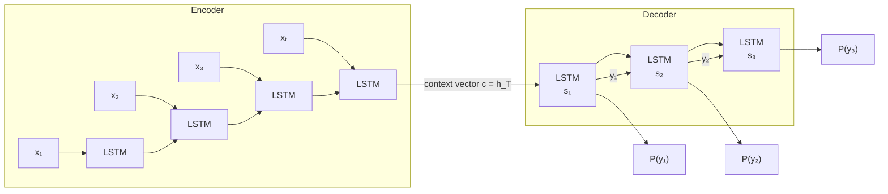

# Encoder-Decoder and Sequence-to-Sequence Architecture

Before transformers, the dominant paradigm for tasks like machine translation, summarization, and speech recognition was the **sequence-to-sequence (seq2seq)** model. Understanding its mechanics—and especially its key limitation, the bottleneck problem—is the conceptual foundation for everything that follows: attention, transformers, and modern LLMs.

## One-line definition

A seq2seq model encodes an entire source sequence into a single fixed-dimensional context vector, then feeds that vector to a decoder which autoregressively generates the target sequence.


*Source: [Wikimedia Commons — Seq2seq RNN encoder-decoder](https://commons.wikimedia.org/wiki/File:Seq2seq_RNN_encoder-decoder_with_attention_mechanism,_detailed_view,_training_and_inferring.png) (CC BY-SA 4.0)*

## Why this topic matters

The encoder-decoder architecture was the first practical solution to sequence transduction problems where input and output lengths differ. Understanding the **bottleneck problem** (all source information compressed into one vector) directly motivates the attention mechanism introduced in the next lesson. Every modern LLM decoder, every translation system, and every conditional text generator descends from this architecture.

## The Architecture

### Encoder

The encoder reads the full source sequence $x = (x_1, x_2, \ldots, x_T)$ one token at a time and updates a hidden state:

$$h_t = f_{\text{enc}}(x_t,\ h_{t-1})$$

where $f_{\text{enc}}$ is typically an LSTM or GRU cell. After processing all $T$ tokens, the final hidden state $h_T$ (and cell state $c_T$ for LSTMs) is taken as the **context vector**:

$$\mathbf{c} = h_T$$

This single vector must encode the entire meaning of the source sentence.

### Decoder

The decoder generates the target sequence $y = (y_1, y_2, \ldots, y_{T'})$ autoregressively. It is initialized with the encoder's final state and generates tokens one at a time:

$$s_t = f_{\text{dec}}(y_{t-1},\ s_{t-1})$$

$$P(y_t \mid y_{<t},\ \mathbf{c}) = \text{softmax}(W_o\, s_t + b_o)$$

During training, **teacher forcing** feeds the ground-truth token $y_{t-1}$ at each step. At inference, the model feeds its own previous prediction.

### The Bottleneck Problem

The critical weakness: for a source sentence of length $T$, the entire semantic content must be squeezed into a single fixed-size vector $\mathbf{c} \in \mathbb{R}^{d}$. For short sentences this works. For long sentences (e.g., a 50-word paragraph), the encoder's final hidden state is dominated by the last few tokens due to the vanishing gradient problem. Earlier tokens' information is attenuated or lost entirely—this is the **bottleneck problem**.



## Teacher Forcing and Exposure Bias

During training, the decoder input at step $t$ is the ground-truth token $y_{t-1}^*$:

$$\mathcal{L} = -\sum_{t=1}^{T'} \log P(y_t^* \mid y_{<t}^*,\ \mathbf{c})$$

At inference, however, $y_{t-1}$ is the model's own prediction—which may be wrong. This mismatch between training and inference distributions is called **exposure bias** and is an inherent limitation of teacher forcing.

## PyTorch example

```python
import torch
import torch.nn as nn

class Encoder(nn.Module):
    def __init__(self, vocab_size, embed_dim, hidden_dim):
        super().__init__()
        self.embed = nn.Embedding(vocab_size, embed_dim)
        self.lstm  = nn.LSTM(embed_dim, hidden_dim, batch_first=True)

    def forward(self, src):
        # src: (batch, src_len)
        embedded = self.embed(src)                      # (batch, src_len, embed_dim)
        _, (h_n, c_n) = self.lstm(embedded)             # h_n, c_n: (1, batch, hidden_dim)
        return h_n, c_n


class Decoder(nn.Module):
    def __init__(self, vocab_size, embed_dim, hidden_dim):
        super().__init__()
        self.embed  = nn.Embedding(vocab_size, embed_dim)
        self.lstm   = nn.LSTM(embed_dim, hidden_dim, batch_first=True)
        self.proj   = nn.Linear(hidden_dim, vocab_size)

    def forward(self, tgt, h, c):
        # tgt: (batch, tgt_len)
        embedded = self.embed(tgt)                       # (batch, tgt_len, embed_dim)
        out, (h, c) = self.lstm(embedded, (h, c))        # out: (batch, tgt_len, hidden_dim)
        logits = self.proj(out)                          # (batch, tgt_len, vocab_size)
        return logits, h, c


# ── demo ──────────────────────────────────────────────────────────────────────
VOCAB, EMBED, HIDDEN = 5000, 128, 256
encoder = Encoder(VOCAB, EMBED, HIDDEN)
decoder = Decoder(VOCAB, EMBED, HIDDEN)

src = torch.randint(0, VOCAB, (4, 10))   # batch=4, src_len=10
tgt = torch.randint(0, VOCAB, (4,  7))   # batch=4, tgt_len=7

h_n, c_n = encoder(src)
logits, _, _ = decoder(tgt, h_n, c_n)
print(logits.shape)   # (4, 7, 5000)
```

## Interview questions

<details>
<summary>What is the bottleneck problem in seq2seq models?</summary>

The entire source sequence is compressed into a single fixed-size vector (the encoder's final hidden state). For long sequences this single vector cannot retain all relevant information, causing the model to "forget" early tokens. The attention mechanism solves this by giving the decoder direct access to all encoder hidden states.
</details>

<details>
<summary>What is teacher forcing and what problem does it create?</summary>

Teacher forcing feeds ground-truth target tokens as decoder inputs during training instead of the model's own predictions. This speeds up training and avoids cascading errors, but it creates **exposure bias**: at inference the model sees its own (potentially incorrect) outputs, a distribution it never encountered during training.
</details>

<details>
<summary>Why is the encoder's final hidden state a poor context vector for long sentences?</summary>

RNNs and LSTMs suffer from vanishing gradients over long sequences. Even with gating (LSTM/GRU), information about tokens processed early in the sequence is gradually overwritten as the hidden state evolves. The final hidden state is therefore dominated by recent tokens.
</details>

<details>
<summary>What is the difference between the encoder hidden state and the context vector?</summary>

Each encoder step produces a hidden state $h_t$ that summarizes the source up to position $t$. The context vector $\mathbf{c}$ in the vanilla seq2seq model is simply $h_T$, the final hidden state. With attention, the context vector becomes a dynamic weighted sum over all encoder hidden states, recomputed at each decoder step.
</details>

## Common mistakes

- Treating the encoder final state as lossless compression of any length source—it isn't for long sequences.
- Confusing the encoder hidden state at each step $h_t$ with the context vector $\mathbf{c}$; they are the same only at $t = T$.
- Forgetting that teacher forcing is a training-only trick; inference is fully autoregressive.
- Using a single shared vocabulary for source and target in multilingual translation without careful handling.

## Advanced perspective

Modern seq2seq models address the bottleneck in two complementary ways. First, **attention** (covered next) replaces the single context vector with a dynamic weighted sum of all encoder states. Second, **bidirectional encoders** (BiLSTM/BiGRU) allow the hidden state at each position to incorporate both past and future context, enriching the representations available to attention. The seq2seq framework itself survives in transformers: the encoder-decoder transformer is the direct architectural successor, with self-attention replacing recurrence and cross-attention replacing the fixed context vector.

## Final takeaway

The seq2seq architecture elegantly frames sequence transduction as compression followed by conditional generation, but it bottlenecks all source information into one vector. This single design choice is what motivated the attention mechanism, which in turn seeded the transformer revolution. Every time you see a conditional generation model—translation, summarization, image captioning—the core encoder-decoder intuition is present.

## References

- Sutskever, I., Vinyals, O., & Le, Q. V. (2014). *Sequence to Sequence Learning with Neural Networks*. NeurIPS.
- Cho, K., et al. (2014). *Learning Phrase Representations using RNN Encoder-Decoder for Statistical Machine Translation*. EMNLP.
