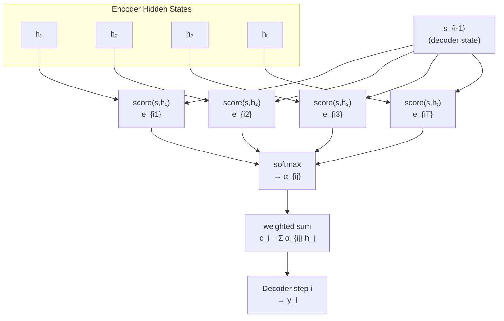

# Attention Mechanism for Seq2Seq Models

The attention mechanism, introduced by Bahdanau et al. (2015), was a watershed moment in NLP. Instead of forcing the decoder to work from a single compressed vector, attention lets the decoder **look back** at every encoder hidden state and dynamically assemble a context vector tuned to the current generation step. This one change dramatically improved translation quality for long sentences and laid the conceptual groundwork for the transformer.

## One-line definition

At each decoder step $i$, attention computes alignment scores between the current decoder state and every encoder hidden state, normalizes them into weights via softmax, and takes a weighted sum of encoder states to form a step-specific context vector.


*Source: [Wikimedia Commons — Seq2seq with attention](https://commons.wikimedia.org/wiki/File:Seq2seq_RNN_encoder-decoder_with_attention_mechanism,_detailed_view,_training_and_inferring.png) (CC BY-SA 4.0)*

## The problem attention solves

Standard encoder-decoder models compress an entire input sentence into a single fixed-length vector before the decoder sees anything. This creates two concrete failure modes:

**Problem 1 — Information bottleneck.** A 50-word sentence carries far more information than a single fixed-size vector can hold. The encoder is forced to discard or blur details, and translation quality degrades sharply for sentences longer than ~25 words.

**Problem 2 — Static representation.** The decoder receives the *same* context vector at every step, even though each output word depends on different parts of the input. To translate the Hindi word "बंद" (for "turn off"), the decoder needs to focus on "turn" and "off"—not the entire sentence. But the fixed vector forces it to drag the full sentence along at every step.

**The human analogy:** When translating a sentence, you don't memorize the whole thing and then produce output blindly. Your eyes and brain focus on an *attention region*—a few relevant words—and that focus shifts as you move forward. Attention gives the model the same ability.

## Why this topic matters

Attention solves both problems above: instead of one fixed context vector $\mathbf{c}$, each decoder step gets its own context vector $\mathbf{c}_i$ that focuses on whichever source tokens are most relevant. This leads to a 2–3 BLEU-point improvement in translation, enables better handling of long sentences, and produces interpretable alignment matrices. Conceptually, attention is the precursor to the self-attention used in transformers.

## The Three-Step Computation

Let $h_j$ ($j = 1, \ldots, T_x$) be the encoder hidden states and $s_{i-1}$ be the decoder hidden state at step $i$.

### Step 1 — Alignment scores

An alignment function $a$ scores how well the decoder state at step $i$ matches each encoder state $h_j$:

$$e_{ij} = a(s_{i-1},\ h_j)$$

Bahdanau's original choice (additive attention):

$$e_{ij} = \mathbf{v}^\top \tanh\!\left(W_1\, s_{i-1} + W_2\, h_j\right)$$

where $W_1 \in \mathbb{R}^{d_a \times d_s}$, $W_2 \in \mathbb{R}^{d_a \times d_h}$, and $\mathbf{v} \in \mathbb{R}^{d_a}$ are learned parameters.

### Step 2 — Attention weights

Normalize scores over all source positions with softmax:

$$\alpha_{ij} = \frac{\exp(e_{ij})}{\sum_{k=1}^{T_x} \exp(e_{ik})}$$

The weights $\alpha_{ij} \geq 0$ and $\sum_j \alpha_{ij} = 1$. They form a probability distribution over source positions—a soft alignment.

### Step 3 — Context vector

Take the weighted sum of encoder hidden states:

$$\mathbf{c}_i = \sum_{j=1}^{T_x} \alpha_{ij}\, h_j$$

This context vector $\mathbf{c}_i$ is now specific to decoder step $i$ and concentrates on the source tokens most relevant to generating $y_i$.

### Worked example — English to Hindi translation

Consider translating "turn off the light" → "लाइट बंद करो".

Encoder states: $h_1$ ("turn"), $h_2$ ("off"), $h_3$ ("the"), $h_4$ ("light").

When generating the second output word "बंद" at decoder step $i=2$:

1. We have $s_1$ (the decoder state after generating "लाइट").
2. Score each encoder state against $s_1$: the alignment model assigns high scores to $h_1$ and $h_2$ because "turn off" is what "बंद" corresponds to.
3. After softmax: $\alpha_{21} \approx 0.45$, $\alpha_{22} \approx 0.45$, $\alpha_{23} \approx 0.05$, $\alpha_{24} \approx 0.05$.
4. Context vector: $\mathbf{c}_2 = 0.45\,h_1 + 0.45\,h_2 + 0.05\,h_3 + 0.05\,h_4$ — mostly "turn" and "off".
5. Decoder inputs for this step: $y_1$ ("लाइट"), $s_1$, and $\mathbf{c}_2$ → outputs "बंद".

The model learned this focus entirely through backpropagation — no manual alignment was specified.

### Decoder update

The decoder uses both its previous state and the new context vector:

$$s_i = f_{\text{dec}}\!\left(y_{i-1},\ s_{i-1},\ \mathbf{c}_i\right)$$

$$P(y_i \mid y_{<i},\ \mathbf{x}) = \text{softmax}\!\left(W_o\, g(s_i, \mathbf{c}_i)\right)$$



## Experimental evidence

**BLEU score vs. sentence length.** The original Bahdanau paper plots translation quality (BLEU) against source sentence length. Non-attention models degrade sharply beyond ~30 words as the fixed vector saturates. Attention-based models stay flat — the decoder can always retrieve relevant encoder states regardless of sentence length.

**Attention weight visualization.** Stacking all $\alpha_{ij}$ into a matrix (output positions × input positions) produces a heatmap. For an English→French pair like "European Economic Area" → "zone économique européenne", the bright cells appear near-diagonally but reordered — "European" aligns with "européenne", "Economic" with "économique", etc. This visualization is interpretable proof that the model learned meaningful alignments without any explicit supervision.

## PyTorch example

```python
import torch
import torch.nn as nn
import torch.nn.functional as F

class BahdanauAttention(nn.Module):
    def __init__(self, hidden_dim, attn_dim):
        super().__init__()
        self.W1 = nn.Linear(hidden_dim, attn_dim, bias=False)  # project decoder state
        self.W2 = nn.Linear(hidden_dim, attn_dim, bias=False)  # project encoder states
        self.v  = nn.Linear(attn_dim, 1, bias=False)           # collapse to scalar score

    def forward(self, s_prev, encoder_states):
        # s_prev:         (batch, 1, hidden_dim)
        # encoder_states: (batch, src_len, hidden_dim)

        # Broadcast decoder state over all src positions
        energy = self.v(torch.tanh(
            self.W1(s_prev) + self.W2(encoder_states)
        ))                                              # (batch, src_len, 1)

        weights = F.softmax(energy.squeeze(-1), dim=1) # (batch, src_len)
        context = torch.bmm(
            weights.unsqueeze(1), encoder_states
        ).squeeze(1)                                    # (batch, hidden_dim)
        return context, weights


# ── demo ──────────────────────────────────────────────────────────────────────
BATCH, SRC_LEN, HIDDEN, ATTN = 4, 10, 256, 128
attn = BahdanauAttention(HIDDEN, ATTN)

encoder_states = torch.randn(BATCH, SRC_LEN, HIDDEN)
s_prev         = torch.randn(BATCH, 1, HIDDEN)

context, weights = attn(s_prev, encoder_states)
print(context.shape)  # (4, 256)  — step-specific context vector
print(weights.shape)  # (4, 10)   — soft alignment over source tokens
```

## Interview questions

<details>
<summary>How does attention solve the bottleneck problem?</summary>

Instead of using a single fixed context vector for the entire decoding process, attention computes a fresh context vector $\mathbf{c}_i$ at each decoder step as a weighted sum of all encoder hidden states. The weights focus on the source positions most relevant to the current generation step, so no information is permanently discarded—the decoder can retrieve any part of the source sequence on demand.
</details>

<details>
<summary>What do the attention weights represent geometrically?</summary>

$\alpha_{ij}$ is the probability that the $j$-th source token is the most relevant input when generating the $i$-th target token. Stacking all $\alpha_{ij}$ into a matrix (decoder steps × source positions) produces an alignment matrix. In machine translation, this matrix is often nearly diagonal for closely aligned language pairs, and can be visualized to understand what the model "looks at" during generation.
</details>

<details>
<summary>Why is this called soft attention rather than hard attention?</summary>

Soft attention takes a weighted average (convex combination) of all encoder states, so every source token contributes to the context vector with some weight. Hard attention selects exactly one source token at each step (a discrete, non-differentiable operation). Soft attention is end-to-end differentiable and thus trainable with standard backpropagation. Hard attention requires reinforcement learning or REINFORCE-style gradient estimators.
</details>

<details>
<summary>What is the time complexity of Bahdanau attention?</summary>

For each of the $T_y$ decoder steps, the alignment function must score all $T_x$ encoder states. The dominant cost is the matrix operations inside the alignment function: $O(T_x \cdot T_y \cdot d)$ where $d$ is the hidden dimension. This quadratic dependence on sequence lengths is also a property of transformer self-attention.
</details>

## Common mistakes

- Forgetting that attention weights are computed fresh at **every** decoder step, not once.
- Mixing up alignment scores $e_{ij}$ (unnormalized, any real value) with attention weights $\alpha_{ij}$ (normalized, in $[0,1]$).
- Assuming attention replaces the decoder's recurrent hidden state—it supplements it with a richer context vector.
- Using dot-product attention without scaling when hidden dimensions are large (this is the motivation for scaled dot-product attention in transformers).

## Advanced perspective

The original Bahdanau paper uses a **bidirectional LSTM** as the encoder. Each encoder hidden state $h_j$ is the concatenation of a forward and backward LSTM state, giving the model both past and future context for every source word. This produces richer $h_j$ vectors for the alignment model to score, but the attention computation itself is identical regardless of encoder architecture.

Bahdanau's additive attention requires separate learned matrices $W_1, W_2, \mathbf{v}$, making it parameter-heavy compared to Luong's multiplicative variants introduced the following year. From the transformer's perspective, attention in seq2seq models is a form of **cross-attention**: queries come from the decoder state and keys/values come from the encoder. The transformer generalizes this by using attention in three distinct modes—encoder self-attention, decoder masked self-attention, and encoder-decoder cross-attention—but the core $\text{softmax}(\text{score}) \cdot V$ computation is identical.

## Final takeaway

Seq2Seq attention is the bridge between the fixed-bottleneck era and the attention-everywhere transformer era. The key insight—compute a dynamic, content-based context vector at each generation step—is the same insight that drives multi-head self-attention in modern LLMs. Understanding the three steps (score → normalize → aggregate) makes every subsequent attention variant immediately recognizable.

## References

- Bahdanau, D., Cho, K., & Bengio, Y. (2015). *Neural Machine Translation by Jointly Learning to Align and Translate*. ICLR.
- Cho, K., et al. (2014). *Learning Phrase Representations using RNN Encoder-Decoder*. EMNLP.
