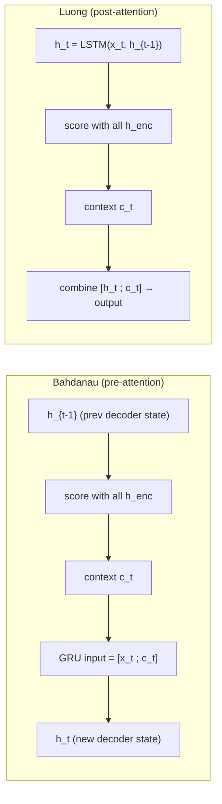

# Bahdanau attention versus Luong attention

> **TL;DR.** Both Bahdanau (2015) and Luong (2015) computed attention by scoring decoder–encoder pairs, softmax-ing, and weighted-summing — same recipe. They differ in *how* they score: **Bahdanau uses a small MLP** (additive); **Luong uses a dot product** (multiplicative). Bahdanau scores using the *previous* decoder state and feeds the context *into* the next step ("pre-attention"); Luong scores using the *current* decoder state and uses the context *after* ("post-attention"). Luong's dot-product is the direct ancestor of transformer attention.

The attention mechanism that transformed sequence-to-sequence models came in two primary forms: the original Bahdanau (additive) attention (2015) and the simpler Luong (multiplicative) attention (2015). Both allow the decoder to query the encoder's hidden states at every step, but they differ in how the relevance score is computed. Understanding both is important because Luong's dot-product scoring is the direct precursor to transformer self-attention.

## One-line definition

Bahdanau attention uses a small feed-forward network to compute alignment scores (additive); Luong attention uses dot products between the decoder hidden state and encoder hidden states (multiplicative). Both produce a weighted context vector at each decoding step.

## Try it interactively

- **[Lena Voita — Seq2Seq with Attention](https://lena-voita.github.io/nlp_course/seq2seq_and_attention.html)** — interactive comparison of additive vs multiplicative scoring with animated examples
- **[Hugging Face Tasks — Translation](https://huggingface.co/tasks/translation)** — try modern translation models that descend from these mechanisms
- **[TensorFlow NMT tutorial](https://www.tensorflow.org/text/tutorials/nmt_with_attention)** — implements Bahdanau attention end-to-end and visualizes the alignment matrix
- **[Karpathy's nanoGPT](https://github.com/karpathy/nanoGPT)** — for the dot-product descendants of Luong's idea, applied to language modeling

## A quick analogy

Imagine you're rating how relevant each source word is to the word you're about to generate.

- **Bahdanau (additive):** you have a *judge* (a learned MLP) that takes both vectors as input and outputs a single score. More flexible, but you have to train the judge.
- **Luong (multiplicative):** you measure relevance by directly *aligning* the two vectors — taking their dot product. Simpler, faster, fewer parameters, but it relies on the vectors already living in compatible spaces.

Both judges work; the multiplicative one happens to scale better and is the one that won.

## The shared framework

Both mechanisms compute the same three quantities:

1. **Alignment scores**: how relevant is each encoder position to the current decoding step?
2. **Attention weights**: softmax over scores to get a probability distribution
3. **Context vector**: weighted sum of encoder hidden states

$$
e_{ts} = \text{score}(h^{\text{dec}}_t,\ h^{\text{enc}}_s)
$$
$$
\alpha_{ts} = \frac{\exp(e_{ts})}{\sum_{s'} \exp(e_{ts'})}
$$
$$
c_t = \sum_s \alpha_{ts} h^{\text{enc}}_s
$$

They differ only in the `score` function.


*Source: [Wikimedia Commons — Seq2seq with attention mechanism](https://commons.wikimedia.org/wiki/File:Seq2seq_RNN_encoder-decoder_with_attention_mechanism,_detailed_view,_training_and_inferring.png) (CC BY-SA 4.0)*

## Bahdanau (additive) attention

Bahdanau et al. (2015) compute the score with a single-hidden-layer feed-forward network:

$$
e_{ts} = v_a^\top \tanh\!\left(W_a h^{\text{dec}}_{t-1} + U_a h^{\text{enc}}_s\right)
$$

where $W_a$, $U_a$, and $v_a$ are learned parameters.

**Key architectural point**: Bahdanau uses $h^{\text{dec}}_{t-1}$ (the hidden state from the *previous* decoder step) to compute alignment. The context vector $c_t$ is then concatenated with the current input before the GRU step:

$$
h^{\text{dec}}_t = \text{GRU}([x_t \; \| \; c_t],\ h^{\text{dec}}_{t-1})
$$

The alignment model is applied *before* the current decoder step produces its hidden state. This is why Bahdanau attention is called **pre-attention**.

## Luong (multiplicative) attention

Luong et al. (2015) proposed three score functions:

**Dot product** (simplest):
$$
e_{ts} = (h^{\text{dec}}_t)^\top h^{\text{enc}}_s
$$

**General** (adds a learned weight matrix):
$$
e_{ts} = (h^{\text{dec}}_t)^\top W_a h^{\text{enc}}_s
$$

**Concat** (similar to Bahdanau, included for completeness):
$$
e_{ts} = v_a^\top \tanh\!\left(W_a [h^{\text{dec}}_t \; \| \; h^{\text{enc}}_s]\right)
$$

**Key architectural point**: Luong uses $h^{\text{dec}}_t$ (the hidden state at the *current* step) to compute alignment. Attention is computed *after* the decoder step:

$$
h^{\text{dec}}_t = \text{LSTM}(x_t,\ h^{\text{dec}}_{t-1})
$$
$$
c_t = \text{Attention}(h^{\text{dec}}_t,\ \{h^{\text{enc}}_s\})
$$
$$
\tilde{h}_t = \tanh\!\left(W_c [h^{\text{dec}}_t \; \| \; c_t]\right)
$$
$$
P(y_t) = \text{softmax}(W_s \tilde{h}_t)
$$

This is called **post-attention**.

### Pre vs post attention, visually



## Side-by-side comparison

| Property | Bahdanau (additive) | Luong (dot product) |
|---|---|---|
| Score function | $v_a^\top \tanh(W_a h^{dec} + U_a h^{enc})$ | $h^{dec} \cdot h^{enc}$ |
| Parameters in scorer | $W_a$, $U_a$, $v_a$ | 0 (dot) or $W_a$ (general) |
| When applied | Before decoder step (pre-attention) | After decoder step (post-attention) |
| Query | $h^{dec}_{t-1}$ | $h^{dec}_t$ |
| Computational cost | Higher (MLP per pair) | Lower (dot product) |
| Connection to transformers | Less direct | Dot product → scaled dot product attention |
| Typical performance | Comparable | Comparable |

## PyTorch implementation

```python
import torch
import torch.nn as nn
import torch.nn.functional as F
import math


# ============================================================
# Bahdanau (additive) attention
# ============================================================
class BahdanauAttention(nn.Module):
    """
    Additive attention: score = v^T tanh(W_a * q + U_a * k)
    q = decoder query (B, H_dec)
    k = encoder keys  (B, T_src, H_enc)
    """
    def __init__(self, query_dim: int, key_dim: int, attn_dim: int = 128):
        super().__init__()
        self.W_a = nn.Linear(query_dim, attn_dim, bias=False)
        self.U_a = nn.Linear(key_dim, attn_dim, bias=False)
        self.v_a = nn.Linear(attn_dim, 1, bias=False)

    def forward(self, query: torch.Tensor,
                keys: torch.Tensor,
                mask: torch.Tensor = None) -> tuple[torch.Tensor, torch.Tensor]:
        """
        query: (B, H_dec)
        keys:  (B, T_src, H_enc)
        mask:  (B, T_src) — True where padding (to mask out)
        Returns: context (B, H_enc), weights (B, T_src)
        """
        # Broadcast query to (B, 1, attn_dim) for addition with keys (B, T, attn_dim)
        q_proj = self.W_a(query).unsqueeze(1)   # (B, 1, attn_dim)
        k_proj = self.U_a(keys)                  # (B, T, attn_dim)

        # Compute scores
        energy = self.v_a(torch.tanh(q_proj + k_proj)).squeeze(-1)  # (B, T)

        if mask is not None:
            energy = energy.masked_fill(mask, float("-inf"))

        weights = F.softmax(energy, dim=-1)              # (B, T)
        context = torch.bmm(weights.unsqueeze(1), keys).squeeze(1)  # (B, H_enc)
        return context, weights


# ============================================================
# Luong attention (dot product and general variants)
# ============================================================
class LuongAttention(nn.Module):
    """
    Multiplicative attention.
    score_type: "dot" | "general" | "scaled_dot"
    """
    def __init__(self, query_dim: int, key_dim: int,
                 score_type: str = "general"):
        super().__init__()
        self.score_type = score_type
        self.scale = math.sqrt(key_dim)

        if score_type == "general":
            self.W_a = nn.Linear(key_dim, query_dim, bias=False)

    def forward(self, query: torch.Tensor,
                keys: torch.Tensor,
                mask: torch.Tensor = None) -> tuple[torch.Tensor, torch.Tensor]:
        """
        query: (B, H_dec)
        keys:  (B, T_src, H_enc)
        """
        if self.score_type == "dot":
            # Direct dot product: query · each key
            scores = torch.bmm(keys, query.unsqueeze(-1)).squeeze(-1)  # (B, T)

        elif self.score_type == "general":
            # Learned linear projection of keys before dot
            projected = self.W_a(keys)  # (B, T, H_dec)
            scores = torch.bmm(projected, query.unsqueeze(-1)).squeeze(-1)  # (B, T)

        elif self.score_type == "scaled_dot":
            # Transformer-style: divide by sqrt(d_k)
            scores = torch.bmm(keys, query.unsqueeze(-1)).squeeze(-1) / self.scale

        if mask is not None:
            scores = scores.masked_fill(mask, float("-inf"))

        weights = F.softmax(scores, dim=-1)
        context = torch.bmm(weights.unsqueeze(1), keys).squeeze(1)  # (B, H_enc)
        return context, weights


# ============================================================
# Try it: same inputs, both mechanisms
# ============================================================
B, T_src, H = 2, 8, 64
query = torch.randn(B, H)
keys = torch.randn(B, T_src, H)

bah = BahdanauAttention(H, H, attn_dim=128)
lng = LuongAttention(H, H, score_type="general")

ctx_b, w_b = bah(query, keys)
ctx_l, w_l = lng(query, keys)

print("Bahdanau context:", ctx_b.shape, " weights:", w_b.shape)
print("Luong    context:", ctx_l.shape, " weights:", w_l.shape)
print("Both should sum to 1 per row:", w_b.sum(-1), w_l.sum(-1))
```

### Try it yourself: experiments

| Question | Try this |
|----------|----------|
| Are dot-product scores larger when hidden dim is large? | Compute scores at H=16, 64, 256, 1024; std grows with √H |
| What does adding scaling do? | Use `score_type="scaled_dot"` — softmax stops collapsing for large H |
| Compare parameter counts | `sum(p.numel() for p in bah.parameters())` vs same for lng |
| Mask out the last 3 source tokens | Pass `mask = torch.tensor([[F]*5 + [T]*3]*2)`; attention weights on those positions become 0 |

## Connection to transformer attention

Luong's scaled dot-product attention is exactly the core of transformer attention:

$$
\text{Attention}(Q, K, V) = \text{softmax}\!\left(\frac{QK^\top}{\sqrt{d_k}}\right) V
$$

In the Luong formulation:
- Query $q = h^{\text{dec}}_t$
- Keys $K = \{h^{\text{enc}}_s\}$
- Values $V = \{h^{\text{enc}}_s\}$ (same as keys in Luong; separate in transformers)
- Score = $q \cdot k / \sqrt{d_k}$

The transformer extends this by: (1) separating keys and values (allowing $K \ne V$), (2) applying learned linear projections ($W_Q, W_K, W_V$), and (3) computing multiple attention heads in parallel.

## Attention weight interpretation

A well-trained attention mechanism should show clear alignment patterns:

```
Source: "The cat sat on the mat"
Target: "Le  chat s'est  assis sur le  tapis"

Expected alignment:
  Le     → The       (high weight on position 0)
  chat   → cat       (high weight on position 1)
  s'est  → sat       (high weight on position 2)
  assis  → sat       (high weight on position 2)
  sur    → on        (high weight on position 3)
  tapis  → mat       (high weight on position 5)
```

When a model fails, the attention weights become diffuse — every source position gets nearly equal weight, and the context vector is a noisy average that carries little useful information.

## Cross-references

- **Prerequisite:** [69 — Attention Mechanism for Seq2Seq](./69-attention-mechanism-for-seq2seq-models.md) — the framework both variants share
- **Follow-up:** [73 — Self-Attention with Code](./73-self-attention-in-transformers-with-code.md) — Luong's dot-product attention generalized to a single sequence
- **Follow-up:** [74 — Scaled Dot-Product Attention](./74-scaled-dot-product-attention.md) — why the $\sqrt{d_k}$ scaling factor was needed
- **Follow-up:** [82 — Cross-Attention](./82-cross-attention-in-transformers.md) — the modern transformer version of seq2seq attention

## Interview questions

<details>
<summary>What is the key difference between Bahdanau and Luong attention?</summary>

The primary difference is the scoring function and when attention is applied. Bahdanau uses an additive score $v^\top \tanh(W_a h^{dec} + U_a h^{enc})$ — a small feed-forward network — and applies attention before the decoder's current step (using the previous hidden state as the query). Luong uses a multiplicative score (dot product or general) and applies attention after the decoder step (using the current hidden state as the query). Bahdanau requires more parameters in the scorer; Luong's dot product is parameter-free. Both achieve similar empirical performance; Luong's dot product scoring is more directly connected to transformer attention.
</details>

<details>
<summary>How does seq2seq attention solve the bottleneck problem?</summary>

In vanilla seq2seq, the encoder must compress the entire source sentence into a single fixed-size vector (the final hidden state). For long sentences, this is insufficient — relevant details are lost. Attention eliminates this bottleneck by keeping all encoder hidden states $\{h^{enc}_1, \ldots, h^{enc}_T\}$ and allowing the decoder to directly access any of them. At each decoding step, the model computes a weighted average (context vector) over all encoder states, with weights learned to focus on the most relevant source positions. The context carries fresh, position-specific information rather than a single compressed summary.
</details>

<details>
<summary>How does Luong attention relate to transformer scaled dot-product attention?</summary>

Luong's "general" score is $h^{dec\top} W_a h^{enc}$ — a bilinear form. The "scaled dot" variant adds $1/\sqrt{d}$ scaling. In transformers, the same operation is expressed as $Q K^\top / \sqrt{d_k}$ where $Q = h^{dec} W_Q$ and $K = h^{enc} W_K$. The key difference: transformers apply separate learned projections to both queries and keys (via $W_Q, W_K$) and also separate values ($V = h^{enc} W_V$), whereas Luong uses the raw encoder hidden states as both keys and values. Transformer multi-head attention runs $h$ independent Luong-style dot-product attentions in parallel in projected subspaces.
</details>

<details>
<summary>Why did the field eventually settle on dot-product (Luong-style) over additive (Bahdanau-style)?</summary>

Three reasons: (1) **Speed** — a dot product is one matmul; an additive score is a small MLP per pair, much slower in practice. (2) **GPU friendliness** — multiplicative attention reduces directly to large matrix multiplies (`Q @ K.T`), which GPUs are optimized for. (3) **Generalization** — once the $\sqrt{d_k}$ scaling was added (transformers), dot-product attention became numerically stable at any hidden size. The two are roughly equally expressive for typical hidden sizes, but Luong's flavor scales better, and that's what mattered when sequences and models grew.
</details>

## Common mistakes

- Confusing `keys` and `values` when implementing attention — in classic seq2seq attention, keys and values are the same (encoder hidden states). In transformers, they are separate projections.
- Using the wrong query in Bahdanau attention — it uses $h^{dec}_{t-1}$ (previous step), not $h^{dec}_t$ (current step).
- Not masking padding positions before softmax — padding should get $-\infty$ score so the attention weight is 0 on padding tokens.
- Using unscaled dot-product attention when hidden dim is large — softmax saturates and gradients vanish; this is exactly the problem $\sqrt{d_k}$ scaling solves.

## Final takeaway

Bahdanau attention (additive, feed-forward scorer) and Luong attention (multiplicative, dot-product scorer) both let the decoder directly query all encoder hidden states, eliminating the bottleneck of compressing a sentence to a single vector. Luong's scaled dot-product scoring is the direct precursor to transformer self-attention — the same operation, extended with separate key/value projections and multi-head parallelism. Understanding both mechanisms makes transformer attention immediately intuitive: it is the same idea, generalized and parallelized.

## References

- Bahdanau, D., Cho, K., & Bengio, Y. (2015). *Neural Machine Translation by Jointly Learning to Align and Translate*. ICLR.
- Luong, M.-T., Pham, H., & Manning, C. D. (2015). *Effective Approaches to Attention-based Neural Machine Translation*. EMNLP.
- Vaswani, A., et al. (2017). *Attention is All You Need*. NeurIPS.
