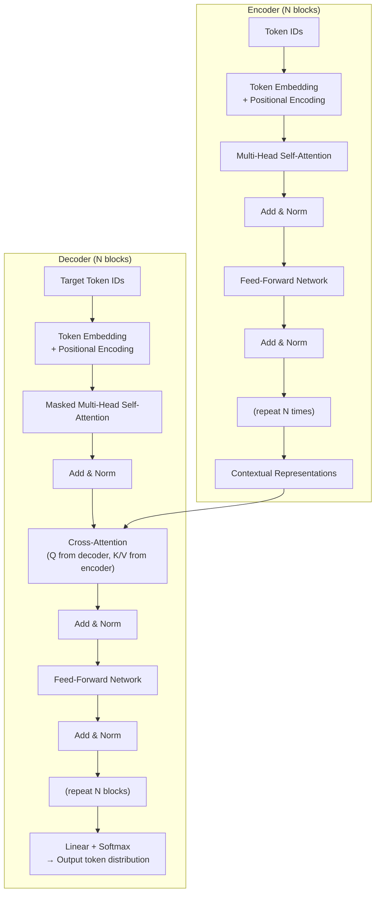

# Introduction to transformers

The transformer architecture (Vaswani et al., 2017) is the foundation of every modern large language model. It replaced RNNs not by improving them incrementally but by discarding recurrence entirely and replacing it with a mechanism — attention — that processes the whole sequence in parallel.

## One-line definition

A transformer is a sequence model built entirely from attention and feed-forward layers, with no recurrence, that processes all tokens in parallel during training and produces rich contextual representations at each position.

It *transforms* one sequence into another — e.g., an English sentence in, a Hindi translation out.

### Where transformers fit in the architecture landscape

| Architecture | Designed for |
|---|---|
| ANN | Tabular / structured data |
| CNN | Grid-based data (images, video) |
| RNN / LSTM | Sequential data (text, time series) — one token at a time |
| **Transformer** | **Sequence-to-sequence tasks — all tokens in parallel** |


*Source: [Jay Alammar — The Illustrated Transformer](https://jalammar.github.io/illustrated-transformer/)*

## Why this topic matters

Every major language model since 2018 — BERT, GPT, T5, LLaMA, Claude, Gemini — is built on the transformer. Understanding the architecture from first principles is the prerequisite for understanding how these models are trained, fine-tuned, and deployed. Transformers also generalize beyond text: vision, audio, protein structure, and time series all use the same architecture.

## Historical timeline

| Year | Milestone | Key insight |
|---|---|---|
| 2000–2014 | RNNs and LSTMs dominate NLP | Sequential processing only |
| 2014 | Seq2Seq Learning (Sutskever et al.) | Encoder–decoder with LSTMs |
| 2014 | Attention Mechanism (Bahdanau et al.) | Dynamic context vectors improve long-sentence translation |
| **2017** | **Attention Is All You Need (Vaswani et al.)** | **No RNNs — self-attention only, parallel training** |
| 2018 | BERT and GPT released | Transfer learning arrives in NLP |
| 2018–2020 | Vision Transformers, AlphaFold | Architecture generalizes beyond text |
| 2021+ | Generative AI explosion | ChatGPT, DALL·E, Codex, Stable Diffusion |

## Origin story: the three papers

The transformer did not appear from nowhere. Three papers form a direct chain of cause and effect.

### Paper 1 — Seq2Seq Learning with Neural Networks (Sutskever et al., 2014)

Proposed an encoder–decoder architecture using LSTMs for machine translation:

```
"My name is Nitesh"  →  [LSTM Encoder]  →  fixed context vector  →  [LSTM Decoder]  →  translation
```

**Problem:** A single fixed-length vector cannot capture all information from long sentences. Translation quality degrades sharply beyond ~30 words.

### Paper 2 — Neural Machine Translation by Jointly Learning to Align and Translate (Bahdanau et al., 2014)

Introduced the **attention mechanism** to fix the context-vector bottleneck. Instead of one fixed summary, the decoder receives a *different* context vector at each output step — a weighted sum of all encoder hidden states:

$$
c_i = \sum_j \alpha_{ij} \cdot h_j
$$

- $\alpha_{ij}$: attention weight — how much encoder step $j$ matters for decoder step $i$
- $h_j$: encoder hidden state at step $j$

**Example:** translating "turn off the lights" → "light band karo"
- To generate "light" → attention focuses on "lights" ($h_4$)
- To generate "band" → attention focuses on "turn" ($h_1$) + "off" ($h_2$)

**Problem still remaining:** Training is still sequential (LSTM-based) → slow → cannot scale to huge datasets → no transfer learning.

### Paper 3 — Attention Is All You Need (Vaswani et al., 2017)

Removed all LSTMs and RNNs. Built the entire model from self-attention and feed-forward layers. This is the transformer.

| Innovation | Benefit |
|---|---|
| Self-attention instead of LSTMs | Parallel processing across all positions |
| Multi-head attention | Captures different relationship types simultaneously |
| Residual connections | Gradient highways through deep stacks |
| Layer normalization | Stabilizes training |
| Positional encoding | Preserves word order (no recurrence to do it implicitly) |

## The problem with RNNs

Before transformers, the best sequence models were LSTMs and GRUs — recurrent networks that process tokens one step at a time:

$$
h_t = f(x_t,\ h_{t-1})
$$

This creates two fundamental problems:

**1. Sequential computation bottleneck.** Token $t$ cannot be computed until token $t-1$ is done. You cannot parallelize across the sequence. On modern GPUs with thousands of cores, this wastes almost all compute.

**2. Long-range dependency degradation.** To connect token $t=1$ to token $t=100$, information must pass through 99 hidden state updates. Gradients must flow back through all 99 steps. Vanishing gradients mean the model effectively forgets long-range context.

| Limitation | RNN / LSTM | Transformer |
|---|---|---|
| Training parallelism | None (sequential) | Full (all positions at once) |
| Path from token $i$ to token $j$ | $O(|i-j|)$ steps | $O(1)$ direct attention |
| Gradient path for long-range | Through all intermediate steps | Direct |
| Max practical context | ~100–200 tokens | Thousands to millions |

## The transformer solution: attention

Instead of passing information through hidden state, a transformer lets every token **directly attend to** every other token through the attention mechanism:

$$
\text{Attention}(Q, K, V) = \text{softmax}\!\left(\frac{QK^T}{\sqrt{d_k}}\right)V
$$

- $Q$: what each token is looking for (query)
- $K$: what each token advertises (key)
- $V$: what each token carries (value)

The output for each token is a weighted blend of all other tokens' values, with weights determined by content similarity (the query-key dot product). Token $i$ can now directly "see" token $j$, regardless of how far apart they are.

## High-level architecture

The original transformer (Vaswani 2017) is an encoder-decoder model. Modern LLMs typically use encoder-only or decoder-only variants.



## The five key components

### 1. Token embeddings

Discrete token IDs are converted to continuous $d_{\text{model}}$-dimensional vectors. For BERT-base: $d_{\text{model}} = 768$, vocabulary size 30,522.

### 2. Positional encoding

Attention is order-agnostic — it computes similarity between all pairs regardless of position. Position must be injected explicitly:

$$
\text{input}_i = \text{TokenEmbedding}(w_i) + \text{PositionalEncoding}(i)
$$

Without positional encoding, "The dog bit the man" and "The man bit the dog" are identical to the transformer.

### 3. Multi-head self-attention

The core computation. Runs $h$ parallel attention operations in $d_k = d_{\text{model}}/h$ dimensional subspaces, then combines them. Allows the model to simultaneously attend to different relationship types (syntax, semantics, coreference).

### 4. Feed-forward sublayer

A two-layer MLP applied independently to each token position:

$$
\text{FFN}(x) = W_2 \cdot \text{GELU}(W_1 x + b_1) + b_2
$$

The intermediate dimension is $4 \times d_{\text{model}}$. Conceptually: attention handles token routing, FFN handles content transformation.

### 5. Residual connections + LayerNorm

Each sublayer is wrapped with:

$$
H' = \text{LayerNorm}(x + \text{Sublayer}(x))
$$

Residual connections provide gradient highways through deep stacks. LayerNorm keeps activations stable. Without both, training stacks of 12+ blocks is practically impossible.

## Three transformer architectures

| Architecture | Attention type | Pre-training | Use cases | Examples |
|---|---|---|---|---|
| Encoder-only | Bidirectional self-attention | Masked Language Model (MLM) | Classification, NER, retrieval | BERT, RoBERTa |
| Decoder-only | Causal (masked) self-attention | Causal Language Model (CLM) | Text generation, reasoning, chat | GPT, LLaMA, Claude |
| Encoder-decoder | Encoder: bidirectional; Decoder: causal + cross-attention | Various (T5: span corruption) | Translation, summarization, QA | T5, BART, mT5 |

## Why transformers scale better than RNNs

The key insight from the scaling era: transformer performance improves predictably with more data, compute, and parameters. RNNs do not scale this way — they hit fundamental bottlenecks.

Three reasons transformers scale:
1. **Parallelism**: training on 100 billion tokens with full GPU utilization is possible
2. **Dense attention**: every layer can route information between any two tokens — no bottleneck
3. **No inductive bias**: the architecture learns what structure is useful from data, rather than hard-coding sequential structure

## Transformer parameter count

For BERT-base ($d_{\text{model}}=768$, 12 heads, 12 layers):

| Component | Parameters |
|---|---|
| Token embedding ($30522 \times 768$) | 23.4M |
| Per layer: MHA ($4 \times 768^2$) | 2.36M |
| Per layer: FFN ($768 \times 3072 \times 2$) | 4.72M |
| Total (12 layers) | ~110M |

GPT-3 (175B parameters) uses the same architecture with $d_{\text{model}}=12288$, 96 layers, 96 heads.

## Minimal PyTorch example

```python
import torch
import torch.nn as nn

# Minimal transformer encoder using PyTorch built-ins
d_model = 512
nhead = 8
num_layers = 6
batch_size = 4
seq_len = 20

# Token embeddings + positional embeddings
vocab_size = 10000
token_emb = nn.Embedding(vocab_size, d_model)
pos_emb = nn.Embedding(512, d_model)   # max 512 positions

# Transformer encoder
encoder_layer = nn.TransformerEncoderLayer(
    d_model=d_model,
    nhead=nhead,
    dim_feedforward=2048,
    dropout=0.1,
    activation="gelu",
    batch_first=True,         # (batch, seq, d_model) — standard convention
    norm_first=True,          # pre-norm (modern standard)
)
encoder = nn.TransformerEncoder(encoder_layer, num_layers=num_layers)

# Forward pass
token_ids = torch.randint(0, vocab_size, (batch_size, seq_len))
positions = torch.arange(seq_len).unsqueeze(0).expand(batch_size, -1)

x = token_emb(token_ids) + pos_emb(positions)   # (4, 20, 512)
output = encoder(x)                              # (4, 20, 512)

print(f"Input shape:  {token_ids.shape}")        # (4, 20)
print(f"Output shape: {output.shape}")           # (4, 20, 512) — same shape, richer content
print(f"Params: {sum(p.numel() for p in encoder.parameters()):,}")
```

## The transformer in one paragraph

A transformer takes a sequence of token IDs, converts them to embeddings, adds positional information, and passes them through $N$ identical blocks. Each block has two sublayers: multi-head self-attention (which routes information between tokens based on content) and a feed-forward network (which transforms each token's representation independently). Each sublayer is wrapped with a residual connection and layer normalization. After $N$ blocks, the model has produced one contextual vector per token — the same shape as the input, but now each vector encodes the meaning of that token in the context of the whole sequence.

## Impact of transformers

Five ways transformers changed AI:

**1. Revolutionized NLP** — 50 years of incremental progress compressed into 5–6 years. Human-level reading comprehension, translation, and text generation are now routine.

**2. Democratized AI** — Before transformers, every new NLP task required building a model from scratch: large labeled datasets, weeks of training, significant compute budget. After: download a pre-trained model from Hugging Face, fine-tune on a small dataset with a few lines of code. Startups and individuals can now achieve state-of-the-art results.

**3. Accelerated generative AI** — Transformers are the engine behind the generative AI wave: text (ChatGPT, GPT-4), images (DALL·E, Midjourney, Stable Diffusion), video (Runway ML, Pika Labs), audio/music, and photo editing (Adobe Firefly).

**4. Unified deep learning** — Before 2017: separate architectures for every modality (ANN for tabular, CNN for images, RNN for text, GANs for generation). Now: one architecture handles NLP, computer vision, speech, reinforcement learning, biology, and more.

**5. Easy integration with other techniques** — Transformers combine naturally with other AI paradigms:
- Transformers + GANs → image generation (DALL·E)
- Transformers + reinforcement learning → game-playing and reasoning agents
- Transformers + CNNs → visual search, image captioning

## Real-world applications

| Application | Description | Example |
|---|---|---|
| **ChatGPT / GPT-4** | Conversational AI | Code generation, writing, reasoning |
| **DALL·E / Midjourney** | Text-to-image generation | "Astronaut on horse" → photorealistic image |
| **AlphaFold** | Protein structure prediction | Solved a 50-year biology grand challenge |
| **GitHub Copilot** | Natural language to code | Comment → working code snippet |
| **BERT** | Understanding tasks | Sentiment analysis, NER, search ranking |
| **Stable Diffusion** | Image synthesis | Open-source image generation |

Transformers now span text, images, audio, video, protein sequences, and sensor data — a single architecture unifying what previously required domain-specific models.

## Advantages of transformers

**1. Scalability** — parallel self-attention fully utilizes GPU/TPU cores; training on terabyte-scale corpora is practical.

**2. Transfer learning** — pre-train once on massive unlabeled data (unsupervised), then fine-tune on a small labeled dataset for any specific task. Before transformers, every new NLP project required training from scratch.

**3. Multimodal capability** — the same architecture handles text (BERT, GPT), images (ViT), audio (Whisper), and protein sequences (AlphaFold) with minimal changes.

**4. Flexible architecture** — encoder-only for understanding, decoder-only for generation, encoder-decoder for seq2seq. One design covers almost every task.

**5. Vibrant ecosystem** — Hugging Face hosts tens of thousands of pre-trained models; fine-tuning takes a few lines of code. Abundant tutorials, research papers, and an active community make transformers the most accessible deep learning architecture to build on.

## Limitations

| Limitation | Explanation |
|---|---|
| **Quadratic attention cost** | Self-attention is $O(n^2)$ in sequence length — memory and compute grow fast with context |
| **Data hungry** | Need large datasets to train well; pre-training + fine-tuning mitigates this but doesn't eliminate it |
| **Compute cost** | Training large models requires expensive GPU clusters and significant energy |
| **Black-box interpretability** | Hard to explain *why* a specific output was produced — a concern for healthcare, banking, legal |
| **Bias** | Models inherit biases present in web-scale training data |
| **Ethical / legal issues** | Training data often scraped without explicit consent; ongoing litigation |

## Future directions

- **Efficiency:** Pruning, quantization, and knowledge distillation to shrink model size while preserving quality; FlashAttention and sparse attention to reduce the $O(n^2)$ bottleneck.
- **Extended multimodality:** Unified models over sensor data, biometrics, time series, and multiple simultaneous modalities.
- **Domain-specific models:** Legal, medical, and educational transformers fine-tuned on specialist corpora for higher precision.
- **Interpretability:** Moving from black-box to white-box — understanding *why* outputs are produced, critical for regulated industries.
- **Multilingual coverage:** Most pre-training data is English; regional-language transformers (e.g., for Hindi and other Indian languages) are an active research and product area.
- **Responsible development:** Techniques to audit and reduce bias, address data-provenance concerns, and improve energy efficiency.

## Interview questions

<details>
<summary>Why did transformers replace RNNs as the dominant sequence model?</summary>

Two reasons: training efficiency and long-range modeling. RNNs are inherently sequential — token $t$ cannot be computed until $t-1$ is done, so training on modern parallel hardware is wasteful. Transformers process all positions simultaneously via attention matrix computation, fully utilizing GPU parallelism. For long-range dependencies, RNNs must propagate information through many recurrence steps, causing vanishing gradients. Transformers compute a direct attention score between any two positions in $O(1)$ operations, so long-range connections are as easy to learn as short-range ones.
</details>

<details>
<summary>What are the three transformer architecture families and when do you use each?</summary>

Encoder-only (BERT-style): processes the full input bidirectionally. Best for understanding tasks — classification, named entity recognition, semantic search — where you want the richest possible representation of the input. Decoder-only (GPT-style): processes tokens causally (each token can only see previous tokens). Best for generation — text completion, chat, code generation. Encoder-decoder (T5-style): encoder reads the input, decoder generates the output attending to encoder representations via cross-attention. Best for sequence-to-sequence tasks — translation, summarization, question answering — where input and output are different sequences.
</details>

<details>
<summary>What is the computational complexity of self-attention and why does it matter?</summary>

Self-attention is $O(n^2 d)$ in both time and memory, where $n$ is the sequence length and $d$ is the model dimension. The $n^2$ factor comes from computing pairwise scores between all tokens. For $n=512$: manageable. For $n=32768$: requires ~4 GB of attention matrix memory per layer per batch item. This is why context length is the key constraint for transformers and why efficient attention variants (FlashAttention, sparse attention, linear attention) exist.
</details>

<details>
<summary>Why are residual connections critical in transformers?</summary>

Two roles: gradient flow and identity initialization. Deep networks (12–96 layers) suffer from vanishing gradients — backpropagating through many stacked transformations multiplies small gradients until they vanish. Residual connections create gradient "highways" that bypass each sublayer. For identity initialization: at the start of training, the sublayer outputs are near zero, so $h = x + \text{Sublayer}(x) \approx x$. Each block starts as an identity function and learns to add incremental refinements, which is a much more stable optimization landscape than learning each block from scratch.
</details>

## Common mistakes

- Thinking "transformer" always means encoder-decoder — decoder-only models (GPT, LLaMA) have no encoder at all.
- Forgetting that positional encoding is mandatory — without it, "cat sat on mat" and "mat on sat cat" are identical.
- Confusing the pre-norm (modern) and post-norm (original 2017) formulations — they train differently and need different hyperparameters.
- Treating $d_{\text{model}}$ as a single embedding dimension — it is the dimension throughout the whole model, governing both attention and FFN.

## Final takeaway

Transformers replaced RNNs by replacing sequential recurrence with parallel attention. Every token attends directly to every other token in one matrix operation, solving both the parallelism bottleneck and the long-range dependency problem simultaneously. The architecture's simplicity — just attention, FFN, residuals, and normalization — is what enables it to scale to hundreds of billions of parameters without fundamental redesign.

## References

- Vaswani, A., et al. (2017). Attention is All You Need. NeurIPS.
- Devlin, J., et al. (2019). BERT: Pre-training of Deep Bidirectional Transformers. NAACL.
- Brown, T., et al. (2020). Language Models are Few-Shot Learners (GPT-3). NeurIPS.
