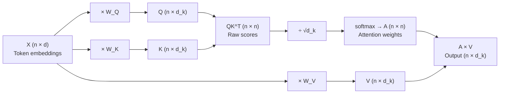

# What self-attention is

RNNs pass information forward through a hidden state: to connect token $t$ to token $t-100$, information must travel through 100 sequential recurrence steps. Attention bypasses this bottleneck by creating a **direct connection** between any two positions in the sequence — in a single operation. Self-attention is the special case where queries, keys, and values all come from the same sequence.

## One-line definition

Self-attention computes a new representation for each token by attending to all other tokens in the same sequence — each token's output is a weighted combination of all other tokens' values, with weights determined by content similarity.


*Source: [Jay Alammar — The Illustrated Transformer](https://jalammar.github.io/illustrated-transformer/)*

## Why this topic matters

Self-attention is the core computational primitive of transformers. Every major modern language model (BERT, GPT, LLaMA, Gemini, Claude) is built on stacked self-attention layers. Understanding self-attention is the key to understanding how transformers process language, why they generalize better than RNNs for long sequences, and how capabilities like in-context learning emerge.

## The coreference problem: motivation

Consider the sentence:

> "The animal didn't cross the street because **it** was too tired."

What does "it" refer to — the animal or the street? To understand the sentence, a model must connect "it" to "animal" (not "street"). In a vanilla RNN, this information flows through every intermediate token (didn't, cross, the, street, because). If the gradient vanishes, the connection is lost.

With self-attention, "it" and "animal" have a **direct computation path** — the attention score between them is computed explicitly, regardless of how many tokens separate them.

## The attention computation: step by step

For a sequence of $n$ tokens with $d$-dimensional embeddings (input matrix $X \in \mathbb{R}^{n \times d}$):

**Step 1 — Project to queries, keys, and values:**

$$
Q = X W^Q, \quad K = X W^K, \quad V = X W^V
$$

- $W^Q, W^K, W^V \in \mathbb{R}^{d \times d_k}$ are learned projection matrices
- $Q, K, V \in \mathbb{R}^{n \times d_k}$

**Step 2 — Compute attention scores (raw similarity):**

$$
\text{scores} = Q K^T \in \mathbb{R}^{n \times n}
$$

Entry $\text{scores}[i,j]$ measures how much token $i$ should attend to token $j$.

**Step 3 — Scale and normalize:**

$$
A = \text{softmax}\!\left(\frac{QK^T}{\sqrt{d_k}}\right) \in \mathbb{R}^{n \times n}
$$

$A[i,j]$ is now the attention weight from token $i$ to token $j$, summing to 1 over $j$.

**Step 4 — Compute weighted combination of values:**

$$
\text{Output} = A V \in \mathbb{R}^{n \times d_k}
$$

Row $i$ of the output is $\sum_j A[i,j] \cdot V[j]$ — a weighted blend of all value vectors.



## What the attention matrix means

The attention matrix $A \in \mathbb{R}^{n \times n}$ is the heart of self-attention:

- Row $i$ contains the distribution of attention from token $i$ to all other tokens
- $A[i,j] \approx 1$ means token $i$ "copies" mostly from token $j$
- $A[i,j] \approx 0$ means token $j$ is mostly ignored by token $i$

For the example "The animal didn't cross the street because it was too tired":
- The attention row for "it" should have high weight on "animal"
- The attention row for "street" should have high weight on "cross"

The key insight: **which tokens attend to which is learned from data**, not hard-coded by position.

## The Q, K, V analogy: database retrieval

The names query, key, and value come from database analogy:

| Database term | Attention equivalent |
|---|---|
| Query | What you are looking for (token's question) |
| Key | What each record advertises (token's fingerprint) |
| Value | The actual content retrieved |

When you search a database with a query, you compare the query against all keys, then retrieve the values for matching keys. Self-attention does this softly: instead of retrieving one record, it retrieves a weighted blend of all values.

## Why self-attention is powerful

| Property | RNN | Self-attention |
|---|---|---|
| Distance between any two tokens | O(n) sequential steps | O(1) direct computation |
| Gradient path length | O(n) | O(1) |
| Parallelism across positions | None | Full |
| Context window | Limited by vanishing gradients | Limited only by memory (O(n²)) |

## PyCharm / Python code

```python
import torch
import torch.nn.functional as F
import math


def self_attention(X: torch.Tensor, W_Q: torch.Tensor,
                   W_K: torch.Tensor, W_V: torch.Tensor) -> torch.Tensor:
    """
    Compute single-head self-attention.

    Args:
        X:   Input token embeddings, shape (batch, seq_len, d_model)
        W_Q: Query projection, shape (d_model, d_k)
        W_K: Key projection,   shape (d_model, d_k)
        W_V: Value projection, shape (d_model, d_k)

    Returns:
        Output: shape (batch, seq_len, d_k)
    """
    d_k = W_Q.shape[1]

    # Step 1: project to Q, K, V
    Q = X @ W_Q   # (batch, seq_len, d_k)
    K = X @ W_K   # (batch, seq_len, d_k)
    V = X @ W_V   # (batch, seq_len, d_k)

    # Step 2 & 3: scaled dot-product attention
    scores = Q @ K.transpose(-2, -1) / math.sqrt(d_k)   # (batch, seq_len, seq_len)
    A = F.softmax(scores, dim=-1)                         # attention weights

    # Step 4: weighted sum of values
    output = A @ V    # (batch, seq_len, d_k)

    return output, A


# Demo
batch_size, seq_len, d_model, d_k = 2, 6, 64, 32

torch.manual_seed(42)
X = torch.randn(batch_size, seq_len, d_model)
W_Q = torch.randn(d_model, d_k) * 0.1
W_K = torch.randn(d_model, d_k) * 0.1
W_V = torch.randn(d_model, d_k) * 0.1

output, attn_weights = self_attention(X, W_Q, W_K, W_V)

print(f"Input shape:          {X.shape}")              # (2, 6, 64)
print(f"Output shape:         {output.shape}")          # (2, 6, 32)
print(f"Attention matrix:     {attn_weights.shape}")    # (2, 6, 6)
print(f"Attention row sums:   {attn_weights[0].sum(-1)}")  # all 1.0
```

## Interview questions

<details>
<summary>What is self-attention and how does it differ from attention in seq2seq models?</summary>

In seq2seq (encoder-decoder) attention, queries come from the decoder hidden states while keys and values come from encoder hidden states — attention between two different sequences. In self-attention, all three (Q, K, V) come from the same sequence. Each token attends to all other tokens in its own sequence, building contextual representations that depend on the full surrounding context.
</details>

<details>
<summary>Why can self-attention model long-range dependencies better than RNNs?</summary>

In an RNN, information from token i to token j must pass through |i-j| sequential hidden state updates, and gradients must flow through the same path during training. Long paths cause vanishing gradients. In self-attention, the attention score between token i and token j is computed directly from their query-key dot product — a single O(1) computation with a direct gradient path. Distance in the sequence does not increase the difficulty of learning the connection.
</details>

<details>
<summary>What do the Q, K, V projections do and why are they necessary?</summary>

Without projections, Q = K = V = X — the model can only compare tokens in their original embedding space, which may not be the right space for measuring relevance. The learned projections W_Q, W_K, W_V transform embeddings into separate subspaces: Q into the "what am I looking for" space, K into the "what do I advertise" space, V into the "what information do I carry" space. These projections let the model learn to decompose token representations for the purpose of attention computation.
</details>

## Common mistakes

- Confusing the attention weight matrix $A$ with the output — $A$ is the weight distribution, the output is $AV$ (the weighted blend of values).
- Assuming attention always attends locally — attention can focus on any position, including the very beginning of a long sequence.
- Forgetting that all three projections $W^Q, W^K, W^V$ are learned — they are not fixed (unlike a database retrieval system).

## Final takeaway

Self-attention gives every token a direct, content-based communication channel to every other token. The mechanism is three projections, a dot-product similarity, a softmax, and a weighted average — five operations that enable the entire capability of modern transformers.

## References

- Vaswani, A., et al. (2017). Attention is All You Need. NeurIPS.
- Alammar, J. The Illustrated Transformer. jalammar.github.io.
