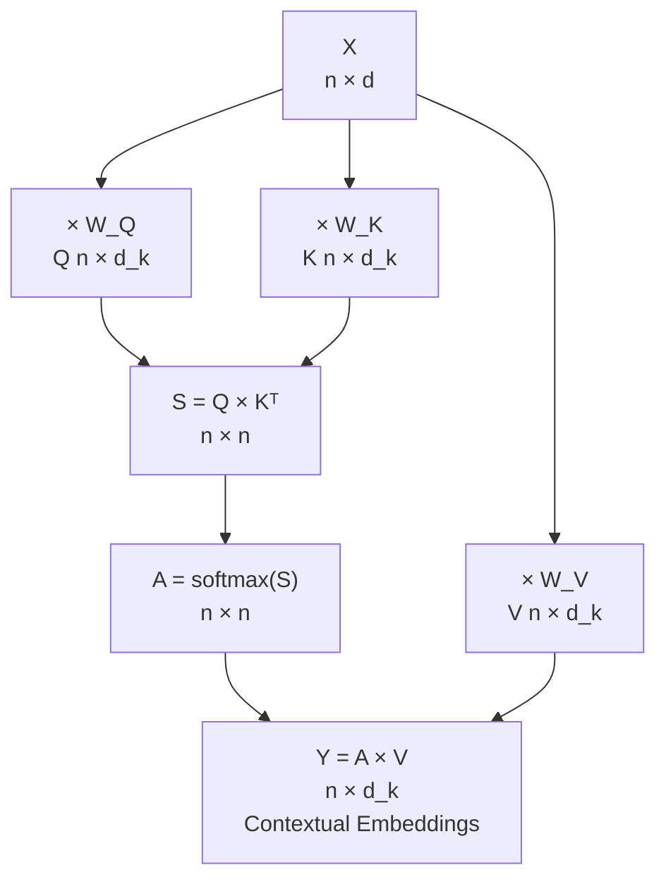

# Self-attention in transformers with code

> **TL;DR.** Self-attention in code is five operations, no more: (1) project input X to Q, K, V via three learned matrices; (2) compute `Q @ K.T / sqrt(d_k)`; (3) softmax row-wise; (4) multiply by V; (5) the output has the same shape as X but each row is now a context-aware blend. This note traces every shape and every operation with concrete numbers — once you've run it once on small inputs, transformers feel mechanical.

Self-attention is best understood by tracing a real example through the computation step by step: what enters, what the matrices look like, and what the output means. This note walks through single-head self-attention completely — from token embeddings to context vectors — with exact shapes at every step.

## Try it interactively

- **[Transformer Explainer](https://poloclub.github.io/transformer-explainer/)** — watch every shape transform in a real GPT-2 forward pass
- **[Karpathy — nanoGPT walkthrough](https://www.youtube.com/watch?v=kCc8FmEb1nY)** — line-by-line implementation of self-attention
- **[Hugging Face attention docs](https://huggingface.co/docs/transformers/attention)** — official API for attention modules in production transformers
- **[PyTorch nn.MultiheadAttention](https://pytorch.org/docs/stable/generated/torch.nn.MultiheadAttention.html)** — the production implementation that wraps everything in this note

## One-line definition

Self-attention maps a sequence of $n$ token embeddings to $n$ context vectors, each being a weighted blend of all other tokens' value projections, with weights determined by the content similarity of query-key pairs.


*Source: [Jay Alammar — The Illustrated Transformer](https://jalammar.github.io/illustrated-transformer/)*

## Why this topic matters

Understanding the mechanics of attention at the code level removes the mystery from transformers. Once you can trace shapes and values through a single attention head, multi-head attention, encoder blocks, and decoder blocks are straightforward extensions. Every debugging task in transformer training starts here.

## Building self-attention from first principles

Before diving into the formal computation, it helps to *derive* self-attention as if inventing it — this gives intuition for *why* the QKV machinery exists and *why* the projection matrices have to be learned.

### The starting problem

Take two sentences with the word "Bank" in different contexts:

| Sentence | Context | Meaning |
|----------|---------|---------|
| "Money bank grows" | Financial | Institution |
| "River bank flows" | Geography | River edge |

Static embeddings give "Bank" the same vector in both. Our goal is to produce a representation that is context-dependent.

### Step 1 — Represent each word as a combination of all words

The key insight: instead of representing "Bank" as just itself, represent it as a weighted blend of *all* words in the sentence. For "Money Bank Grows":

```
y_money = α₁₁ · e_money + α₁₂ · e_bank + α₁₃ · e_grows
y_bank  = α₂₁ · e_money + α₂₂ · e_bank + α₂₃ · e_grows
y_grows = α₃₁ · e_money + α₃₂ · e_bank + α₃₃ · e_grows
```

Now `y_bank` differs between "Money bank grows" and "River bank flows" because the surrounding words differ.

### Step 2 — Similarity via dot product

The weights α should reflect **how related each pair of words is**. The standard mathematical tool for measuring vector similarity is the dot product:

```
similarity(eᵢ, eⱼ) = eᵢ · eⱼ
```

| Pair | Dot Product | Meaning |
|------|-------------|---------|
| (6,1) · (4,2) | 6×4 + 1×2 = 26 | High similarity |
| (6,1) · (1,5) | 6×1 + 1×5 = 11 | Low similarity |

Then apply softmax row-wise to turn raw scores into weights that sum to 1:

```
αᵢⱼ = softmax(eᵢ · eⱼ)
```

This is already a complete (but naive) self-attention. It runs fully in parallel — every output vector can be computed simultaneously. But it has two problems.

### Problem 1 — No sequence order

Parallel computation discards word order. "Dog bites man" and "Man bites dog" would produce the same set of contextual embeddings. This is later solved by **positional encoding**.

### Problem 2 — No learnable parameters

The naive version has zero trainable weights — dot product and softmax are fixed operations. As a result:

- Embeddings are general-purpose, not task-specific
- "Piece of cake" would always lean toward the literal meaning (food), never the idiomatic meaning (easy task)
- "Break a leg" would mean physical injury, not good luck

Different downstream tasks need different contextual embeddings. The model must be able to *learn* what context matters for the task at hand.

### The QKV solution: three roles, three vectors

When computing `y_bank`, the embedding of "Bank" plays three distinct roles:

| Role | Function |
|------|----------|
| **Query (Q)** | "How similar are you to me?" — asks the question |
| **Key (K)** | "Here's what I advertise" — answers the query |
| **Value (V)** | "Here's my actual content" — provides what gets blended |

A useful analogy: a matrimonial profile. Using one document for all three roles is like submitting your 300-page autobiography as your dating profile, search criteria, *and* conversation starter. Each role needs a focused, specialized representation. The same logic applies to word embeddings — we need three specialized vectors per word, produced by three learnable projection matrices:

```
q = e × W_Q    (Query vector)
k = e × W_K    (Key vector)
v = e × W_V    (Value vector)
```

`W_Q`, `W_K`, `W_V` are trained by backpropagation, shared across all words in the sentence, and learn the projections that produce the best contextual embeddings for the downstream task.

### Putting it together — the full mechanism

For sentence "Money Bank Grows":

1. **Static embeddings:** `e_money`, `e_bank`, `e_grows`
2. **Project to Q, K, V** using `W_Q`, `W_K`, `W_V`
3. **Similarity scores:** `sᵢⱼ = qᵢ · kⱼ` for all pairs
4. **Softmax → weights:** `αᵢⱼ = softmax(sᵢⱼ)` per row
5. **Weighted sum of Values:** `yᵢ = Σⱼ αᵢⱼ · vⱼ`

In matrix form (fully parallelizable on GPU):



The full derivation in one table:

| Step | Discovery | Why it matters |
|------|-----------|----------------|
| 1 | Words need vectors | Computers require numbers |
| 2 | Static embeddings lose context | "Bank" = same vector everywhere |
| 3 | Blend all words together | Context changes the representation |
| 4 | Dot product measures similarity | Principled way to weight the blend |
| 5 | Softmax normalizes weights | Scores → probabilities summing to 1 |
| 6 | No learning parameters | Can't adapt to specific tasks |
| 7 | Separate Q, K, V roles | Specialized vectors for each function |
| 8 | Learnable W_Q, W_K, W_V | Task-specific contextual embeddings |

## The complete computation: step by step

Given input matrix $X \in \mathbb{R}^{n \times d_{\text{model}}}$ (a sequence of $n$ token embeddings):

**Step 1 — Project to Q, K, V:**

$$
Q = X W^Q, \quad K = X W^K, \quad V = X W^V
$$

where $W^Q, W^K, W^V \in \mathbb{R}^{d_{\text{model}} \times d_k}$ are learned weight matrices.

**Step 2 — Compute raw attention scores:**

$$
S = \frac{QK^T}{\sqrt{d_k}} \in \mathbb{R}^{n \times n}
$$

Entry $S[i, j]$ is the (scaled) dot product between query $i$ and key $j$ — how much token $i$ wants to attend to token $j$.

**Step 3 — Normalize scores to weights:**

$$
A = \text{softmax}(S, \text{dim}=-1) \in \mathbb{R}^{n \times n}
$$

Row $i$ of $A$ sums to 1. $A[i, j]$ is the fraction of attention that token $i$ gives to token $j$.

**Step 4 — Weighted blend of values:**

$$
\text{Output} = A V \in \mathbb{R}^{n \times d_k}
$$

Row $i$ of the output is $\sum_j A[i,j] \cdot V[j]$ — the representation of token $i$ enriched by context.

## Concrete numerical example

Let $n=3$ tokens, $d_{\text{model}} = 4$, $d_k = 4$ (no dimension change for simplicity):

```
X = [[1, 0, 1, 0],    # token 0: "animal"
     [0, 1, 0, 1],    # token 1: "it"
     [1, 1, 0, 0]]    # token 2: "tired"
```

Using identity weights ($W^Q = W^K = W^V = I$), so $Q = K = V = X$:

$$
S = \frac{QK^T}{\sqrt{4}} = \frac{1}{2}\begin{bmatrix} 2 & 0 & 1 \\ 0 & 2 & 1 \\ 1 & 1 & 2 \end{bmatrix}
= \begin{bmatrix} 1.0 & 0.0 & 0.5 \\ 0.0 & 1.0 & 0.5 \\ 0.5 & 0.5 & 1.0 \end{bmatrix}
$$

After softmax (row-wise):
- Token 0 ("animal") attends mostly to itself and a bit to "tired"
- Token 1 ("it") attends mostly to itself, but in a real model with learned weights it would attend strongly to "animal"
- Token 2 ("tired") distributes across all three

The output vector for each token is then a blend of value vectors weighted by these probabilities.

## Full shape tracking

For batch size 2, sequence length 6, $d_{\text{model}}=64$, $d_k=32$:

| Step | Operation | Shape |
|---|---|---|
| Input | $X$ | $(2, 6, 64)$ |
| Query projection | $Q = X W^Q$ | $(2, 6, 32)$ |
| Key projection | $K = X W^K$ | $(2, 6, 32)$ |
| Value projection | $V = X W^V$ | $(2, 6, 32)$ |
| Raw scores | $QK^T / \sqrt{d_k}$ | $(2, 6, 6)$ |
| Attention weights | $\text{softmax}(\cdot)$ | $(2, 6, 6)$ |
| Output | $AV$ | $(2, 6, 32)$ |

The attention matrix is $(n \times n)$ per batch — this is the $O(n^2)$ memory cost.

## Python code: from scratch

```python
import torch
import torch.nn as nn
import torch.nn.functional as F
import math


class SingleHeadSelfAttention(nn.Module):
    """
    Single-head self-attention.
    Input:  (batch, seq_len, d_model)
    Output: (batch, seq_len, d_k)
    """

    def __init__(self, d_model: int, d_k: int):
        super().__init__()
        self.d_k = d_k
        self.W_Q = nn.Linear(d_model, d_k, bias=False)
        self.W_K = nn.Linear(d_model, d_k, bias=False)
        self.W_V = nn.Linear(d_model, d_k, bias=False)

    def forward(self, x: torch.Tensor,
                mask: torch.Tensor = None) -> tuple[torch.Tensor, torch.Tensor]:
        """
        Args:
            x:    (batch, seq_len, d_model)
            mask: (batch, seq_len, seq_len) — True positions are masked to -inf
        Returns:
            output: (batch, seq_len, d_k)
            attn:   (batch, seq_len, seq_len)
        """
        # Step 1: project to queries, keys, values
        Q = self.W_Q(x)   # (batch, seq_len, d_k)
        K = self.W_K(x)   # (batch, seq_len, d_k)
        V = self.W_V(x)   # (batch, seq_len, d_k)

        # Step 2: scaled dot-product scores
        scores = Q @ K.transpose(-2, -1) / math.sqrt(self.d_k)  # (batch, seq, seq)

        # Step 3: optional masking (for causal or padding)
        if mask is not None:
            scores = scores.masked_fill(mask, float("-inf"))

        # Step 4: softmax to attention weights
        attn = F.softmax(scores, dim=-1)   # (batch, seq_len, seq_len)

        # Step 5: weighted blend of values
        output = attn @ V   # (batch, seq_len, d_k)

        return output, attn


# ============================================================
# Demo: trace shapes through a full forward pass
# ============================================================
torch.manual_seed(0)
batch, seq_len, d_model, d_k = 2, 6, 64, 32

attn_layer = SingleHeadSelfAttention(d_model=d_model, d_k=d_k)
X = torch.randn(batch, seq_len, d_model)

output, weights = attn_layer(X)

print(f"Input shape:        {X.shape}")         # (2, 6, 64)
print(f"Output shape:       {output.shape}")    # (2, 6, 32)
print(f"Attention matrix:   {weights.shape}")   # (2, 6, 6)
print(f"Row sums (= 1.0):   {weights[0].sum(-1).round(decimals=4)}")


# ============================================================
# Visualize the attention matrix for a small example
# ============================================================
tokens = ["The", "animal", "didn't", "cross", "it", "tired"]
n = len(tokens)
d_small = 8

attn_small = SingleHeadSelfAttention(d_model=d_small, d_k=d_small)
X_small = torch.randn(1, n, d_small)
_, weights_small = attn_small(X_small)

print("\nAttention weights (token × token):")
header = f"{'':8}" + "".join(f"{t:8}" for t in tokens)
print(header)
for i, row_token in enumerate(tokens):
    row = weights_small[0, i].detach().numpy()
    vals = "".join(f"{v:8.3f}" for v in row)
    print(f"{row_token:8}{vals}")
```

## What the attention matrix reveals

The attention matrix $A \in \mathbb{R}^{n \times n}$ is interpretable:

- **Row $i$**: where does token $i$ look? High values at column $j$ means token $i$ heavily attends to token $j$.
- **Column $j$**: which tokens look at token $j$? High values across rows means token $j$ is "important" as a key.
- **Diagonal**: a model attending to itself — common when a token doesn't need much external context.

For the sentence "The animal didn't cross the street because **it** was too tired":
- Row for "it" should have high weight on "animal" (learned from pretraining data)
- Row for "cross" should have high weight on "street"
- Rows for articles ("the", "a") often distribute broadly

## Attention is differentiable retrieval

The formal analogy to a database lookup:

| Database | Attention |
|---|---|
| Query | $q_i = W^Q x_i$ — "what am I searching for?" |
| Key | $k_j = W^K x_j$ — "what do I advertise?" |
| Score | $q_i \cdot k_j / \sqrt{d_k}$ — relevance measure |
| Retrieval | $A[i,j] = \text{softmax}(\text{score})$ — soft selection weight |
| Value | $v_j = W^V x_j$ — actual content retrieved |
| Output | $\sum_j A[i,j] \cdot v_j$ — blended retrieval result |

The key insight: unlike a hard database lookup (retrieve exactly one record), attention retrieves a **soft blend** of all records, weighted by relevance. This is differentiable and therefore trainable end-to-end.

## Masking in self-attention

Self-attention can mask out certain positions before softmax by setting their logits to $-\infty$ (which maps to weight 0 after softmax):

```python
# Causal mask: token i cannot attend to token j > i
seq_len = 5
causal_mask = torch.triu(torch.ones(seq_len, seq_len), diagonal=1).bool()
# tensor([[False,  True,  True,  True,  True],
#         [False, False,  True,  True,  True],
#         [False, False, False,  True,  True],
#         [False, False, False, False,  True],
#         [False, False, False, False, False]])

# Padding mask: mask out padding tokens (token ID = 0)
token_ids = torch.tensor([[5, 3, 7, 0, 0]])   # last 2 are padding
padding_mask = (token_ids == 0).unsqueeze(1).expand(-1, 5, -1)  # (1, 5, 5)
```

## Key terminology

| Term | Symbol | Definition |
|------|--------|------------|
| Static embedding | e | Fixed vector — same regardless of context |
| Contextual embedding | y | Dynamic vector — changes based on surrounding words |
| Query | q | Vector that asks "how relevant are you to me?" |
| Key | k | Vector that answers similarity queries |
| Value | v | Vector providing content to aggregate |
| Attention weight | α | Importance score; sums to 1 across all positions |
| Learnable matrix | W_Q, W_K, W_V | Trained to produce optimal Q, K, V for the task |

## Interview questions

<details>
<summary>Walk me through the shapes at each step of self-attention for a batch of 4 sentences, each 20 tokens long, with d_model=512 and d_k=64.</summary>

Input $X$: $(4, 20, 512)$. Query projection $Q = XW^Q$: $(4, 20, 64)$ where $W^Q$ is $(512, 64)$. Same for $K$ and $V$. Raw scores $QK^T$: $(4, 20, 20)$ — a $20\times20$ attention matrix per batch item. After scaling by $\sqrt{64}=8$ and softmax: still $(4, 20, 20)$. Output $AV$: $(4, 20, 64)$ — same sequence length, but now each vector is a context-aware blend of all value vectors.
</details>

<details>
<summary>Why does self-attention scale poorly with sequence length?</summary>

The attention score matrix $QK^T$ has shape $(n, n)$ per batch item. Both computing it ($O(n^2 d_k)$) and storing it ($O(n^2)$ floats) scale quadratically with sequence length $n$. For $n=512$: a 512×512 matrix — trivial. For $n=8192$: a 67M-element matrix per layer per batch item, ~270 MB in float32. For $n=100000$: 40 GB per layer. This is why FlashAttention (which avoids materializing the full matrix) and sparse attention variants exist.
</details>

<details>
<summary>Why do we need separate W_Q, W_K, W_V projections? Why not use X directly?</summary>

Using raw embeddings as Q, K, V collapses the query, key, and value spaces into one. The embedding space is optimized to represent token identity; the query space should encode "what am I searching for," the key space "what do I advertise," and the value space "what information do I carry." These are different roles that benefit from different linear transformations. The projections let the model learn separate representations for each role during training.
</details>

## Common mistakes

- Transposing the wrong axes in `Q @ K.T` — for batched tensors use `K.transpose(-2, -1)`, not `.T`.
- Applying softmax on `dim=-2` (over queries) instead of `dim=-1` (over keys) — the attention should sum to 1 over keys, not over queries.
- Forgetting to scale by $\sqrt{d_k}$ — attention scores grow with $d_k$, softmax saturates, gradients vanish.
- Using the wrong mask convention — `True = mask out` in PyTorch's `masked_fill` with `-inf`.

## Final takeaway

Self-attention is five operations: three linear projections, one scaled dot-product score computation, one softmax, and one weighted sum. Everything else in a transformer — multi-head, encoder, decoder — is built by composing, specializing, and stacking these five operations. Trace the shapes, run the code on small examples, and the architecture becomes mechanical.

## References

- Vaswani, A., et al. (2017). Attention is All You Need. NeurIPS.
- Alammar, J. The Illustrated Transformer. jalammar.github.io.
