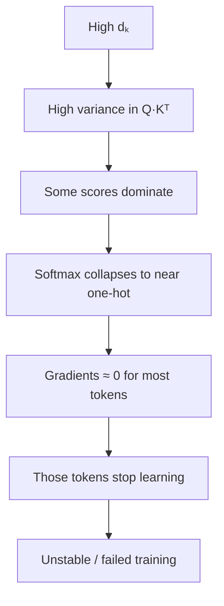
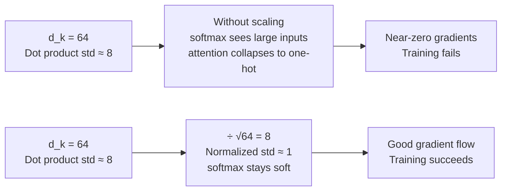

# Scaled dot-product attention

The dot-product between query and key vectors is a natural measure of similarity. But in high dimensions, this dot-product grows large simply because more dimensions accumulate more signal — not because the tokens are more relevant to each other. Scaling by $\sqrt{d_k}$ corrects for this dimensional growth and prevents the softmax from saturating.

## One-line definition

Scaled dot-product attention normalizes the query-key dot products by $\sqrt{d_k}$ before softmax, preventing the attention distribution from collapsing to a one-hot vector in high-dimensional spaces.


*Source: [Jay Alammar — The Illustrated Transformer](https://jalammar.github.io/illustrated-transformer/)*

## Why this topic matters

The scaling factor is a small but critical detail. Without it, deep transformers fail to train due to near-zero softmax gradients. Understanding *why* the scaling works requires understanding the variance of dot products in high-dimensional spaces — a concept that connects to initialization, normalization, and numerical stability throughout deep learning.

## The full formula

$$
\text{Attention}(Q, K, V) = \text{softmax}\!\left(\frac{QK^T}{\sqrt{d_k}}\right)\!V
$$

where:
- $Q \in \mathbb{R}^{n \times d_k}$: query matrix ($n$ queries, each of dimension $d_k$)
- $K \in \mathbb{R}^{m \times d_k}$: key matrix ($m$ keys)
- $V \in \mathbb{R}^{m \times d_v}$: value matrix ($m$ values, each of dimension $d_v$)
- Output $\in \mathbb{R}^{n \times d_v}$

If you compare this to the unscaled formula derived from first principles — `softmax(Q × Kᵀ) × V` — the only difference is the $\sqrt{d_k}$ factor. Why is it there?

## What is $d_k$, and why does it matter?

$d_k$ is simply the dimension of the Key (and Query) vectors — the output dimension of the projection $W^K$ (and $W^Q$):

```
Word embedding (e)  : 1 × d_model
         ×
Weight matrix (Wᴷ)  : d_model × d_k
         =
Key vector (k)      : 1 × d_k
```

| Model scale | d_model | d_k |
|-------------|---------|-----|
| Tiny example | 3 | 3 |
| Medium | 100 | 100 |
| Original Transformer | 512 | 64 (per head) |

The reason $d_k$ matters is that the dot product $q \cdot k$ is a sum of $d_k$ individual products — and the more terms you sum, the larger the variance grows.

## Why the $\sqrt{d_k}$ scaling is necessary

### The variance argument

Assume query and key vectors have components drawn independently from $\mathcal{N}(0, 1)$. The dot product between a single query $q \in \mathbb{R}^{d_k}$ and a single key $k \in \mathbb{R}^{d_k}$ is:

$$
q \cdot k = \sum_{i=1}^{d_k} q_i k_i
$$

Each term $q_i k_i$ has mean 0 and variance 1 (product of two independent standard normals). By the central limit theorem, the sum of $d_k$ independent terms with variance 1 has variance $d_k$:

$$
\text{Var}(q \cdot k) = d_k
$$

The standard deviation is $\sqrt{d_k}$. As $d_k$ grows, the dot products grow in magnitude. For $d_k = 512$: typical dot products have magnitude ~$\sqrt{512} \approx 22.6$.

This shows up clearly in experiments — sample 1000 random vector pairs at each dimension and look at the spread of their dot products:

| Vector dimension | Typical dot product range | Variance |
|-----------------|--------------------------|---------|
| 3 | −5 to +5 | Low |
| 100 | −10 to +10 | Medium |
| 1000 | −30 to +30 | High |

The variance scales **linearly** with $d_k$.

### The softmax saturation problem

The softmax function:

$$
\text{softmax}(x_i) = \frac{e^{x_i}}{\sum_j e^{x_j}}
$$

When some inputs are large (e.g., 22.6 vs 0), the softmax output becomes nearly one-hot:

$$
\text{softmax}([22.6, 0, 0, 0]) \approx [1, 0, 0, 0]
$$

You can see this on a smaller scale too:

| Softmax input | Softmax output | Effect |
|---------------|----------------|--------|
| [2, 3, 4] | [0.09, 0.24, 0.67] | Balanced — good |
| [2, 3, 100] | [≈0, ≈0, ≈1] | Near one-hot — bad |

In saturated regions, softmax gradients are near zero:

$$
\frac{\partial \text{softmax}(x_i)}{\partial x_i} = \text{softmax}(x_i)(1 - \text{softmax}(x_i)) \approx 1 \times 0 = 0
$$

Training stalls because gradients cannot flow back through the attention layer. The full failure chain:



A useful analogy: imagine a classroom where the teacher only notices the tallest children waving their hands highest — shorter children's questions are never answered. High-variance attention behaves the same way: only the loudest signal gets through, and everything else is invisible to backpropagation.

### The fix: scale by $1/\sqrt{d_k}$

Dividing the dot products by $\sqrt{d_k}$ normalizes the variance:

$$
\text{Var}\!\left(\frac{q \cdot k}{\sqrt{d_k}}\right) = \frac{\text{Var}(q \cdot k)}{d_k} = \frac{d_k}{d_k} = 1
$$

The scaled dot products have unit variance regardless of $d_k$. The softmax now operates on inputs with standard deviation ~1, producing well-calibrated attention distributions.

To pick the scaling constant from scratch: we want the constant $c$ such that variance stays at $\sigma^2$:

$$\text{Var}\!\left(\frac{q \cdot k}{c}\right) = \frac{1}{c^2} \cdot \text{Var}(q \cdot k) = \frac{d_k \cdot \sigma^2}{c^2} = \sigma^2$$

Solving gives $c^2 = d_k$, hence $c = \sqrt{d_k}$. The effect across dimensions:

| $d_k$ | Unscaled variance | Scaling factor | Scaled variance |
|----|-------------------|----------------|-----------------|
| 1 | $\sigma^2$ | ÷ 1 | $\sigma^2$ |
| 2 | $2\sigma^2$ | ÷ √2 | $\sigma^2$ |
| 64 | $64\sigma^2$ | ÷ 8 | $\sigma^2$ |
| 512 | $512\sigma^2$ | ÷ ~22.6 | $\sigma^2$ |



## Step-by-step numerical example

Suppose $d_k = 4$ and we have 3 tokens:

$$
q = [1, 0, 1, 0], \quad K = \begin{bmatrix} 1 & 1 & 0 & 0 \\ 0 & 0 & 1 & 1 \\ 1 & 0 & 1 & 0 \end{bmatrix}
$$

**Dot products:**

$$
q \cdot K^T = [1, 1, 2]
$$

**Without scaling (scores = [1, 1, 2]):**

$$
\text{softmax}([1, 1, 2]) = [0.212, 0.212, 0.576]
$$

**With scaling ($d_k = 4$, divide by $\sqrt{4} = 2$):**

$$
\text{softmax}([0.5, 0.5, 1.0]) = [0.272, 0.272, 0.456]
$$

The scaled version produces a less peaked distribution — more information from multiple tokens, not just the top-1.

## The complete algorithm

```
Input: Q (n × d_k), K (m × d_k), V (m × d_v)

1. Compute raw scores: S = Q @ K^T              # shape: (n × m)
2. Scale:              S = S / sqrt(d_k)         # normalize variance
3. Optional masking:   S[mask] = -inf            # for causal attention
4. Softmax:            A = softmax(S, dim=-1)    # shape: (n × m), rows sum to 1
5. Weighted values:    out = A @ V              # shape: (n × d_v)
```

## PyCharm / Python code: from scratch

```python
import torch
import torch.nn.functional as F
import math


def scaled_dot_product_attention(
    Q: torch.Tensor,
    K: torch.Tensor,
    V: torch.Tensor,
    mask: torch.Tensor = None,
) -> tuple[torch.Tensor, torch.Tensor]:
    """
    Scaled dot-product attention.

    Args:
        Q:    Query tensor,  shape (..., seq_q, d_k)
        K:    Key tensor,    shape (..., seq_k, d_k)
        V:    Value tensor,  shape (..., seq_k, d_v)
        mask: Optional boolean mask, shape (..., seq_q, seq_k)
              True positions are masked out (set to -inf)

    Returns:
        output: (..., seq_q, d_v)
        attn:   (..., seq_q, seq_k)  — attention weights
    """
    d_k = Q.shape[-1]

    # Step 1: scaled dot-product scores
    scores = Q @ K.transpose(-2, -1) / math.sqrt(d_k)   # (..., seq_q, seq_k)

    # Step 2: optional masking (causal / padding)
    if mask is not None:
        scores = scores.masked_fill(mask, float("-inf"))

    # Step 3: softmax attention weights
    attn = F.softmax(scores, dim=-1)   # (..., seq_q, seq_k)

    # Step 4: weighted sum of values
    output = attn @ V                  # (..., seq_q, d_v)

    return output, attn


# Example: 3-token sequence, d_k = d_v = 8
batch, seq, d_k, d_v = 1, 5, 8, 8

torch.manual_seed(0)
Q = torch.randn(batch, seq, d_k)
K = torch.randn(batch, seq, d_k)
V = torch.randn(batch, seq, d_v)

output, attn = scaled_dot_product_attention(Q, K, V)

print(f"Q shape:      {Q.shape}")        # (1, 5, 8)
print(f"Output shape: {output.shape}")   # (1, 5, 8)
print(f"Attn shape:   {attn.shape}")     # (1, 5, 5)
print(f"Attn row sum: {attn.sum(-1)}")   # [1., 1., 1., 1., 1.]

# Verify variance argument
d_k_test = 512
q_test = torch.randn(1000, d_k_test)
k_test = torch.randn(1000, d_k_test)
dot_prods = (q_test * k_test).sum(dim=-1)
print(f"\nd_k={d_k_test}: dot product std = {dot_prods.std():.2f}")   # ~22.6
print(f"After scaling:  std = {(dot_prods / math.sqrt(d_k_test)).std():.2f}")  # ~1.0
```

## Relationship to other attention formulations

| Method | Score function | Notes |
|---|---|---|
| Scaled dot-product | $QK^T / \sqrt{d_k}$ | Efficient, standard |
| Additive (Bahdanau) | $v^T \tanh(W_1 Q + W_2 K)$ | More parameters, slower |
| Cosine similarity | $QK^T / (\|Q\| \|K\|)$ | Normalized, sometimes used |
| Dot-product (unscaled) | $QK^T$ | Fails at large $d_k$ |

Scaled dot-product is the fastest (pure matrix multiplication) and the standard in transformers.

## Computational complexity

| Operation | Complexity | Notes |
|---|---|---|
| $QK^T$ computation | $O(n^2 d_k)$ | Bottleneck for long sequences |
| Softmax | $O(n^2)$ | Over all pairs |
| $AV$ computation | $O(n^2 d_v)$ | Second bottleneck |
| **Total** | **$O(n^2 d)$** | Quadratic in sequence length |

For $n = 1024$ and $d = 512$: ~$5 \times 10^8$ multiply-adds per attention layer. This is why efficient attention variants (FlashAttention, sparse attention) are active research areas.

## Summary

| Concept | Explanation |
|---------|-------------|
| **$d_k$** | Dimension of Key/Query vectors |
| **Problem** | Dot product variance grows linearly with $d_k$ |
| **Consequence** | Softmax saturates → vanishing gradients |
| **Solution** | Divide by $\sqrt{d_k}$ before softmax |
| **Result** | Constant variance; stable training at any scale |

> **One-sentence summary:** We divide by $\sqrt{d_k}$ to keep the variance of $Q \cdot K^T$ constant, preventing softmax from saturating and ensuring gradients can flow during training regardless of embedding dimension.

## Interview questions

<details>
<summary>Why is the scaling factor based on d_k?</summary>

The dot product $q \cdot k$ is a sum of $d_k$ independent products, each with variance 1 if queries and keys have unit variance. That gives $\mathrm{Var}(q \cdot k) = d_k$, so the standard deviation grows like $\sqrt{d_k}$. Dividing by $\sqrt{d_k}$ keeps the score scale roughly stable. Dividing by $d_k$ would over-shrink the logits, while using no scaling would let their variance grow with dimension.
</details>

<details>
<summary>What happens to softmax gradients when inputs are very large?</summary>

If one input logit is much larger than the rest, softmax becomes almost one-hot. In that regime, the derivative of softmax becomes very small, so gradients vanish and backpropagation through the attention layer becomes weak. This is the saturation problem that scaling helps avoid.
</details>

<details>
<summary>What is the memory complexity of scaled dot-product attention and why is it a problem?</summary>

The attention matrix has shape $n \times n$, so its memory cost grows quadratically with sequence length. For $n = 4096$ tokens in float32, one attention matrix needs about $4096^2 \times 4$ bytes, which is roughly 64 MB per head per batch item. With many heads, layers, and batch elements, this becomes a major memory bottleneck. FlashAttention reduces this by avoiding full materialization of the matrix and computing attention in tiles.
</details>

## Common mistakes

- Forgetting the scaling factor when implementing attention from scratch — training will appear to work at first but fail on longer sequences or larger d_k.
- Applying softmax on the wrong dimension — `dim=-1` normalizes over keys (what we attend to); applying on `dim=-2` would normalize over queries (meaningless).
- Not masking padding tokens — without masking, attention leaks into padding positions, producing nonsensical representations.

## Final takeaway

The $\sqrt{d_k}$ scaling is a small but load-bearing detail. It ensures that dot-product magnitudes stay near unit variance regardless of model dimension, keeping softmax in a region with useful gradients. Without it, scaled models train poorly; with it, the same formula works from $d_k = 64$ to $d_k = 8192$.

## References

- Vaswani, A., et al. (2017). Attention is All You Need. NeurIPS.
- Press, O., & Wolf, L. (2017). Using the Output Embedding to Improve Language Models.
