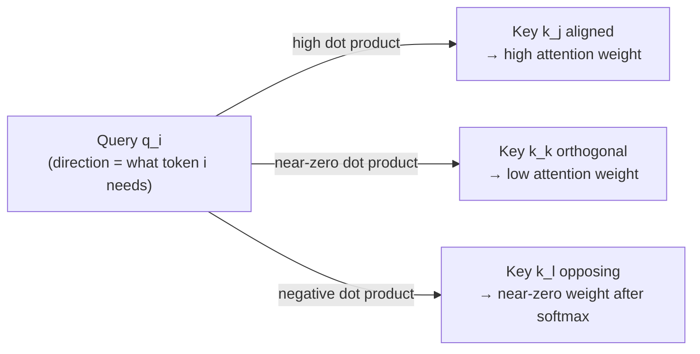
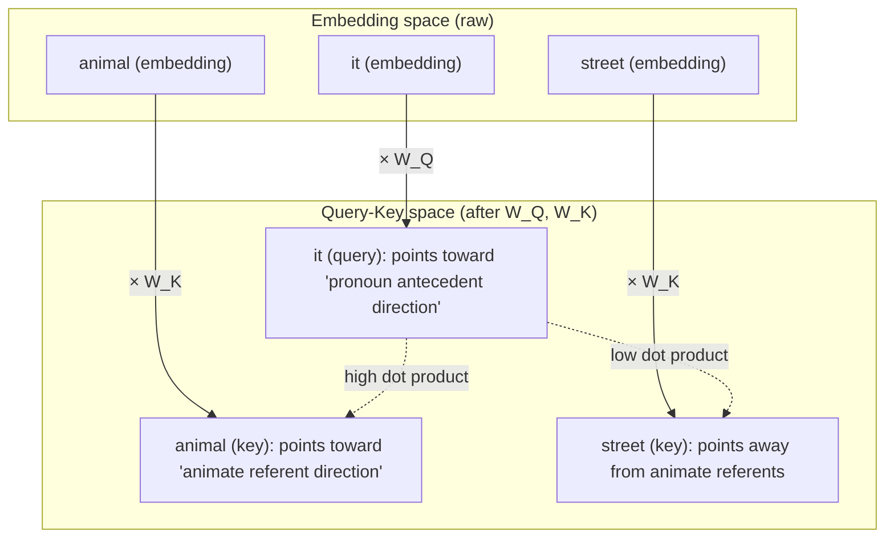

# Geometric intuition for self-attention

Formulas for attention are easy to write. The harder question is: **why does the dot product measure what tokens are relevant to each other?** This note builds the geometric picture: what queries, keys, and values represent in vector space, why similar directions produce high attention, and how learned projections reshape the similarity geometry.

## One-line definition

Self-attention computes token relevance as the cosine-like similarity between query and key vectors in a learned subspace, then uses those similarities to blend value vectors — turning raw embeddings into context-aware representations.


*Source: [Jay Alammar — The Illustrated Transformer](https://jalammar.github.io/illustrated-transformer/)*

## Why this topic matters

The geometric view explains several otherwise puzzling facts: why scaling by $\sqrt{d_k}$ is necessary (high-dimensional dot products grow in magnitude), why different attention heads learn different "perspectives" (each head uses a different projection), and why attention patterns are interpretable (high attention weight = directional alignment between query and key).

## A concrete 2D walkthrough: "Money Bank"

Before going abstract, let's trace the geometry through a small worked example with two words.

**Setup:**

| Symbol | Value | Meaning |
|--------|-------|---------|
| **e_money** | (2, 5) | Static embedding of "Money" |
| **e_bank** | (7, 3) | Static embedding of "Bank" |
| **W_Q, W_K, W_V** | 2×2 matrices | Learnable projection weights |

Plotted in a 2D plane, e_money and e_bank are far apart — they live in different semantic regions.

**Step 1 — Three new vectors per word.** Multiplying each embedding by W_Q, W_K, W_V moves it to a **new position** in vector space:

```
e_money (2,5) → q_money, k_money, v_money   (three different locations)
e_bank  (7,3) → q_bank,  k_bank,  v_bank    (three different locations)
```

The same original vector lands in three different positions because each matrix rotates and scales space differently.

**Step 2 — Similarity by angle.** To compute the contextual embedding of "Bank" (`y_bank`), we need two similarity scores:

| Operation | Question |
|-----------|----------|
| q_bank · k_money | How much should "Bank" attend to "Money"? |
| q_bank · k_bank | How much should "Bank" attend to itself? |

Each is a dot product, which measures angular alignment:

| Angle θ | cos θ | Dot product | Similarity |
|---------|-------|-------------|------------|
| 0° (same direction) | 1 | Maximum | Very high |
| 90° (perpendicular) | 0 | Zero | None |
| 180° (opposite) | −1 | Negative | Dissimilar |

Suppose the geometry works out to:

```
q_bank vs k_money → large angle → dot product = 10  (low similarity)
q_bank vs k_bank  → small angle → dot product = 32  (high similarity)
```

**Step 3 — Scale, then softmax.** With $d_k = 2$ (so $\sqrt{2} \approx 1.414$):

| Raw score | After ÷ √2 |
|-----------|------------|
| 10 | 7.07 |
| 32 | 22.63 |

After softmax (illustrative result):
- $w_{21} = 0.2$ (weight from "Money" → 20% influence)
- $w_{22} = 0.8$ (weight from "Bank" itself → 80% influence)

**Step 4 — Vector addition.** Scale each value vector by its attention weight, then add them:

```
Scaled v_money = 0.2 · v_money   (short — small contribution)
Scaled v_bank  = 0.8 · v_bank    (longer — large contribution)

y_bank = (0.2 · v_money) + (0.8 · v_bank)   [parallelogram law]
```

Geometrically the result is a **convex combination** — a point inside the region spanned by the value vectors, pulled toward the higher-weight ones.

### The "gravity" insight

Comparing the original and contextual embeddings:

| Embedding | Position | Character |
|-----------|----------|-----------|
| e_bank (original) | Far from e_money | Static — ignores context |
| y_bank (contextual) | **Pulled toward e_money** | Dynamic — encodes context |

Self-attention acts like gravity: surrounding words exert a pull on each word's embedding proportional to their similarity (attention weight). Same static embedding, different sentences:

- "Money bank" context → e_bank pulled toward the financial cluster
- "River bank" context → e_bank pulled toward the geographical cluster

Two very different contextual embeddings emerge from one static embedding, just by changing the surrounding words.

### Step-by-step geometric summary

| Step | Operation | Geometric meaning |
|------|-----------|-------------------|
| 1 | Get embeddings | Points in vector space |
| 2 | Multiply by W_Q, W_K, W_V | Move points to new positions (rotation + scaling) |
| 3 | Dot product Q·K | Measure angle between vectors (directional similarity) |
| 4 | Scale by √dₖ | Normalize variance — keep softmax well-behaved |
| 5 | Softmax | Convert scores to competitive probability weights |
| 6 | Multiply weights × V | Scale vectors by their importance |
| 7 | Vector addition | Parallelogram law — combine scaled vectors |
| 8 | Result Y | Weighted average — new point in value space |

## Dot products as directional similarity

For two vectors $a, b \in \mathbb{R}^d$:

$$
a \cdot b = \|a\|\|b\|\cos\theta
$$

where $\theta$ is the angle between them.

- $a \cdot b > 0$: vectors point in the same general direction (acute angle)
- $a \cdot b \approx 0$: vectors are nearly orthogonal (irrelevant to each other)
- $a \cdot b < 0$: vectors point in opposite directions (negatively correlated)

When query $q_i$ and key $k_j$ are parallel ($\theta = 0$): maximum attention. When orthogonal: zero attention before softmax. **Attention is directional alignment.**



## Why raw embeddings are the wrong similarity space

Suppose we compute attention directly on raw embeddings ($Q = K = V = X$, no projection). Then attention weight between token $i$ and token $j$ is determined by how similar their **embedding vectors** are.

But embedding similarity is not the same as contextual relevance:
- "bank" (financial institution) and "bank" (river bank) have the same embedding — but should attend to different tokens depending on context
- "it" and "animal" may be dissimilar in embedding space — but "it" should attend to "animal" in the right context
- Common words like "the" have high dot products with many tokens — creating spurious attention

The learned projections $W^Q$, $W^K$, $W^V$ rotate and scale the embedding space into three **task-adapted subspaces** where the geometry is meaningful for attention.

## Projections reshape the similarity geometry

The query projection $W^Q$ maps tokens to a "query subspace" — a space where directions encode **what I am looking for**.

The key projection $W^K$ maps tokens to a "key subspace" — a space where directions encode **what I advertise as my content**.

These are the same $d_k$-dimensional space, and the dot product $q_i \cdot k_j = (x_i W^Q) \cdot (x_j W^K)$ measures alignment in this shared query-key space.

Crucially:
- $W^Q$ and $W^K$ are learned separately — they can project the same input in very different directions
- "it" under $W^Q$ points toward antecedents; "animal" under $W^K$ advertises itself as a valid antecedent
- This asymmetry is what makes attention a query-key retrieval rather than mere similarity



## Why high-dimensional dot products need scaling

In $d_k$ dimensions, with $q_i$ and $k_j$ drawn from $\mathcal{N}(0, 1)$:

$$
\text{Var}(q_i \cdot k_j) = d_k
$$

The dot product's standard deviation grows as $\sqrt{d_k}$. For $d_k = 512$: typical dot products have magnitude $\approx 22.6$. After softmax, inputs with such large magnitudes produce near one-hot distributions — the model "collapses" to attending to a single token and ignores all others.

Dividing by $\sqrt{d_k}$ normalizes the variance to 1 regardless of dimension:

$$
\text{Var}\!\left(\frac{q_i \cdot k_j}{\sqrt{d_k}}\right) = 1
$$

Geometrically: scaling makes the attention distribution robust to the number of dimensions — the "effective angle resolution" stays the same whether $d_k = 64$ or $d_k = 1024$.

## What softmax does geometrically

Before softmax, attention scores are raw dot products: $S[i, j] = q_i \cdot k_j / \sqrt{d_k}$.

Softmax turns these into a probability distribution over keys:

$$
A[i, j] = \frac{e^{S[i,j]}}{\sum_k e^{S[i,k]}}
$$

Geometrically:
- The key most aligned with query $q_i$ gets the largest exponential weight
- All other keys get exponentially smaller weights as their angular distance increases
- The result is a **competitive selection**: the most relevant token "wins" but others still get some weight

When scores are spread (many keys are equally aligned): uniform attention (soft averaging).  
When one score dominates: near one-hot attention (selective copying from one token).

## What the output represents geometrically

The output for token $i$:

$$
\text{out}_i = \sum_j A[i,j] \cdot v_j
$$

is a point in value space that is a **convex combination** of all value vectors (since $A[i,j] \geq 0$ and $\sum_j A[i,j] = 1$).

- If token $i$ attends uniformly to all tokens: the output is the centroid of all value vectors
- If token $i$ attends almost entirely to token $j$: the output is approximately $v_j$ — the model "copies" token $j$'s value representation into position $i$

This is exactly the gravity picture from the 2D walkthrough at scale: each token's contextual representation is *pulled* toward the value vectors of the tokens it attends to most. Attention is sometimes described as a **routing mechanism**: it moves information from wherever it is needed to wherever it is requested.

## Python code: visualizing attention geometry

```python
import torch
import torch.nn.functional as F
import math


def visualize_attention_geometry():
    """
    Build simple 2D vectors to show that dot product = directional alignment.
    """
    # Hand-crafted tokens in 2D space
    # "it" query points NE; "animal" key points NE; "street" key points NW
    q_it = torch.tensor([[1.0, 1.0]])          # query for "it"
    k_animal = torch.tensor([[0.9, 0.8]])       # key for "animal" — similar direction
    k_street = torch.tensor([[-0.8, 0.9]])      # key for "street" — orthogonal/opposite
    k_tired = torch.tensor([[0.3, 1.0]])        # key for "tired" — some alignment

    keys = torch.cat([k_animal, k_street, k_tired], dim=0)   # (3, 2)
    d_k = 2

    # Raw dot products
    scores = (q_it @ keys.T) / math.sqrt(d_k)   # (1, 3)
    weights = F.softmax(scores, dim=-1)

    print("=== Geometric attention example ===")
    print(f"Tokens: ['animal', 'street', 'tired']")
    print(f"Raw scores:      {scores[0].tolist()}")
    print(f"Attention weights: {[f'{w:.3f}' for w in weights[0].tolist()]}")
    # "animal" should have highest weight — it's most aligned with q_it


def effect_of_projection(d_model=16, d_k=8, n=5):
    """
    Show that learned projections change the similarity geometry.
    """
    torch.manual_seed(42)
    X = torch.randn(1, n, d_model)   # 5 tokens

    # Without projection: similarity in raw embedding space
    raw_scores = (X @ X.transpose(-2, -1)) / math.sqrt(d_model)
    raw_weights = F.softmax(raw_scores, dim=-1)

    # With projection: similarity in learned query-key space
    W_Q = torch.randn(d_model, d_k) * 0.1
    W_K = torch.randn(d_model, d_k) * 0.1
    Q = X @ W_Q
    K = X @ W_K
    proj_scores = (Q @ K.transpose(-2, -1)) / math.sqrt(d_k)
    proj_weights = F.softmax(proj_scores, dim=-1)

    print("\n=== Effect of projection ===")
    print("Raw attention weights (row 0):")
    print([f"{w:.3f}" for w in raw_weights[0, 0].tolist()])
    print("Projected attention weights (row 0):")
    print([f"{w:.3f}" for w in proj_weights[0, 0].tolist()])
    # Different geometry → different attention patterns


def high_dim_dot_product_variance():
    """
    Demonstrate why sqrt(d_k) scaling is needed.
    """
    print("\n=== Dot product magnitude vs d_k ===")
    for d_k in [8, 64, 512]:
        q = torch.randn(1000, d_k)
        k = torch.randn(1000, d_k)
        dots = (q * k).sum(dim=-1)
        print(f"d_k={d_k:4d}: std(q·k) = {dots.std():.2f}  "
              f"  std(q·k/√d_k) = {(dots/math.sqrt(d_k)).std():.2f}")


visualize_attention_geometry()
effect_of_projection()
high_dim_dot_product_variance()
```

## Multi-head attention: multiple geometric perspectives

Each attention head uses different projection matrices $W_i^Q$, $W_i^K$, $W_i^V$ — projecting into different $d_k$-dimensional subspaces. This means each head defines a different **similarity geometry**:

- Head 1 might learn a "syntactic subspace" where subject and verb are aligned
- Head 2 might learn a "semantic subspace" where synonyms are aligned
- Head 3 might learn a "positional subspace" where adjacent tokens are aligned

After attention, all heads' outputs are concatenated and projected back to $d_{\text{model}}$. The model can simultaneously reason about multiple types of token relationships.

## Summary of the geometric picture

| Component | Geometric role |
|---|---|
| $W^Q$ projection | Maps tokens to "query directions" (what each token is looking for) |
| $W^K$ projection | Maps tokens to "key directions" (what each token advertises) |
| Dot product $q_i \cdot k_j$ | Measures directional alignment — relevance |
| $\sqrt{d_k}$ scaling | Normalizes variance so softmax doesn't collapse |
| Softmax | Turns raw alignments into competitive probability weights |
| $W^V$ projection | Maps tokens to "value content" (what gets retrieved) |
| Output $\sum_j A[i,j] v_j$ | Convex combination — weighted position in value space |

> **One-line geometric summary:** Self-attention geometrically "pulls" each word's embedding toward surrounding words in proportion to their relevance — different contexts produce different pulls, and therefore different contextual embeddings for the same word.

## Interview questions

<details>
<summary>Why does the dot product measure relevance between tokens?</summary>

For vectors $q$ and $k$, the dot product $q \cdot k = \|q\|\|k\|\cos\theta$. High dot product means the vectors point in similar directions (small angle). In the learned query-key subspace, similar directions were trained to correspond to relevant pairs — the model learns that query vectors for pronouns should be aligned with key vectors for their antecedents. The dot product is used rather than, say, Euclidean distance because it is efficient to compute (matrix multiplication) and corresponds to the inner product structure that makes softmax and gradients well-behaved.
</details>

<details>
<summary>What does it mean geometrically when attention weights are uniform vs. peaked?</summary>

Uniform attention weights (all $A[i,j] \approx 1/n$): the output is the centroid of all value vectors — the model averages all token representations. This happens when query-key dot products are all similar (all keys are equally aligned with the query). Peaked attention (one $A[i,j] \approx 1$): the output is approximately $v_j$ — the model copies one token's value vector. This happens when one key is much more aligned with the query than all others. In practice, heads learn to be somewhere in between — selectively attending to a few relevant tokens.
</details>

## Common mistakes

- Thinking attention is just "embedding similarity" — the learned projections completely change the similarity space from raw embeddings.
- Assuming the query and key are in the same space as the value — all three are in different projected subspaces.
- Not understanding why uniform attention is a failure mode — when no key is clearly more aligned than others, information is diffused instead of routed.

## Final takeaway

Self-attention is directional alignment in a learned subspace. Tokens whose query-key vectors point in similar directions attend to each other; the $\sqrt{d_k}$ scaling prevents high-dimensional dot products from collapsing the softmax; and the output is a convex combination of value vectors weighted by alignment. The geometric view makes it clear why learned projections are essential, why multiple heads are useful, and why attention is interpretable as a routing mechanism.

## References

- Vaswani, A., et al. (2017). Attention is All You Need. NeurIPS.
- Elhage, N., et al. (2021). A Mathematical Framework for Transformer Circuits. Anthropic.
