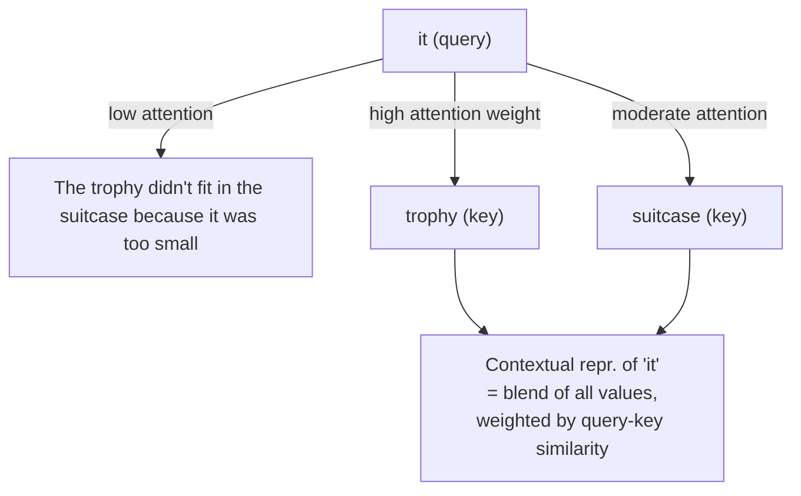
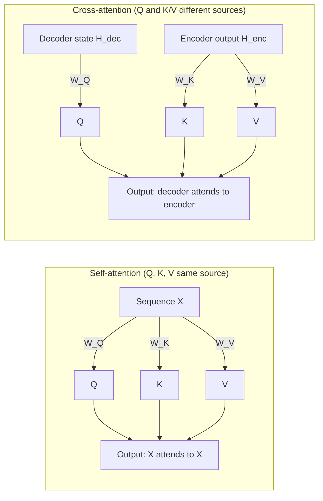

# Why self-attention is called self-attention

The word "self" in self-attention has a precise meaning: **queries, keys, and values all come from the same sequence**. This is in contrast to cross-attention, where queries come from one sequence (the decoder) and keys/values come from another (the encoder). Understanding this distinction clarifies the role of each attention type in the full transformer architecture.

## One-line definition

Self-attention is attention where a sequence attends to itself — $Q$, $K$, and $V$ are all computed from the same input $X$, so each token can look at every other token in the same sequence to build its contextual representation.


*Source: [Jay Alammar — The Illustrated Transformer](https://jalammar.github.io/illustrated-transformer/)*

## Why this topic matters

The "self" vs. "cross" distinction determines what information a model can access at each layer. Self-attention builds rich within-sequence context; cross-attention bridges two sequences. Knowing which type is used where explains why encoder-only models (BERT) are good at understanding, why decoder-only models (GPT) generate autoregressively, and why encoder-decoder models (T5) work for translation.

## The naming: where Q, K, V come from

In the general attention framework:

$$
\text{Attention}(Q, K, V) = \text{softmax}\!\left(\frac{QK^T}{\sqrt{d_k}}\right)V
$$

The source of $Q$, $K$, $V$ defines the attention type:

| Attention type | Q source | K source | V source | Used in |
|---|---|---|---|---|
| **Self-attention** | Same sequence $X$ | Same sequence $X$ | Same sequence $X$ | Encoder, decoder (first sublayer) |
| **Cross-attention** | Decoder state $H_{\text{dec}}$ | Encoder output $H_{\text{enc}}$ | Encoder output $H_{\text{enc}}$ | Decoder (second sublayer) |
| **Seq2Seq attention** (Bahdanau) | Decoder state | Encoder states | Encoder states | Pre-transformer models |

In self-attention, the sequence attends to itself:

$$
Q = X W^Q, \quad K = X W^K, \quad V = X W^V \quad \text{(all from the same } X\text{)}
$$

## What "self" enables: within-sequence context

Because Q, K, and V all come from the same sequence, every token can gather information from every other token in the same sequence.

**Example sentence**: *"The trophy didn't fit in the suitcase because it was too small."*

What does "it" refer to — the trophy or the suitcase? To resolve this, the model must relate "it" to both "trophy" and "suitcase" and use semantic knowledge about size. Self-attention does this directly: the query for "it" can attend to both noun tokens, compare their key representations, and blend the relevant information.



## Cross-attention: attending to a different sequence

In the encoder-decoder transformer, the decoder contains a **cross-attention** sublayer where queries come from the decoder's current state and keys/values come from the encoder's output. The decoder asks: "given what I've generated so far, which parts of the input are most relevant?"

$$
Q = H_{\text{dec}} W^Q, \quad K = H_{\text{enc}} W^K, \quad V = H_{\text{enc}} W^V
$$



## Three attention patterns in the full transformer

| Position | Type | What it does |
|---|---|---|
| Encoder (all layers) | Self-attention | Build rich contextual representations of the input |
| Decoder (odd sublayers) | Masked self-attention | Build causal representations of the output so far |
| Decoder (even sublayers) | Cross-attention | Look up relevant input information from encoder |

In a GPT-style decoder-only model, there is no encoder — only causal self-attention at every layer. In a BERT-style encoder-only model, there is only bidirectional self-attention — no masking, no cross-attention.

## Why encoder self-attention is bidirectional

The encoder has no generation task — it processes the full input at once. Token $i$ can attend to all other tokens including those that appear later in the sequence. This bidirectional context produces richer representations:

- "bank" in "I went to the bank to withdraw money" correctly captures the financial sense because it attends to both "withdrew" (right side) and "money"
- A right-only or left-only model would miss half the context

## Why decoder self-attention is causal (masked)

The decoder generates tokens one by one. At training time, the whole target sequence is processed in parallel using teacher forcing — but with a **causal mask** that prevents position $t$ from attending to positions $> t$:

$$
\text{CausalAttn}(Q, K, V) = \text{softmax}\!\left(\frac{QK^T + M}{\sqrt{d_k}}\right)V
$$

where $M[i, j] = -\infty$ if $j > i$, else $0$.

Without the causal mask, the model can "cheat" by looking at the answer during training. The mask enforces the same condition as inference — each token can only see its own past.

## Python code: self vs cross-attention shapes

```python
import torch
import torch.nn as nn
import torch.nn.functional as F
import math


def self_attention(x: torch.Tensor, W_Q, W_K, W_V) -> torch.Tensor:
    """
    Self-attention: Q, K, V all from the same sequence x.
    x: (batch, seq_len, d_model)
    """
    Q = x @ W_Q   # (batch, seq_len, d_k)
    K = x @ W_K
    V = x @ W_V
    d_k = Q.shape[-1]
    scores = Q @ K.transpose(-2, -1) / math.sqrt(d_k)
    return F.softmax(scores, dim=-1) @ V   # (batch, seq_len, d_k)


def cross_attention(query_seq, memory_seq, W_Q, W_K, W_V) -> torch.Tensor:
    """
    Cross-attention: Q from query_seq, K/V from memory_seq.
    query_seq: (batch, tgt_len, d_model)   — decoder state
    memory_seq: (batch, src_len, d_model)  — encoder output
    """
    Q = query_seq @ W_Q    # (batch, tgt_len, d_k)
    K = memory_seq @ W_K   # (batch, src_len, d_k)
    V = memory_seq @ W_V   # (batch, src_len, d_k)
    d_k = Q.shape[-1]
    scores = Q @ K.transpose(-2, -1) / math.sqrt(d_k)  # (batch, tgt_len, src_len)
    return F.softmax(scores, dim=-1) @ V   # (batch, tgt_len, d_k)


# Parameters
d_model, d_k = 64, 32
W_Q = torch.randn(d_model, d_k) * 0.1
W_K = torch.randn(d_model, d_k) * 0.1
W_V = torch.randn(d_model, d_k) * 0.1

# Self-attention: encoder processing a 10-token input
encoder_input = torch.randn(2, 10, d_model)
enc_output = self_attention(encoder_input, W_Q, W_K, W_V)
print(f"Self-attention: input={encoder_input.shape} → output={enc_output.shape}")
# (2, 10, 32) — same number of tokens, each has attended to all 10 tokens

# Cross-attention: decoder (5 tokens generated so far) attending to encoder (10 tokens)
decoder_state = torch.randn(2, 5, d_model)
enc_memory = torch.randn(2, 10, d_model)
cross_output = cross_attention(decoder_state, enc_memory, W_Q, W_K, W_V)
print(f"Cross-attention: query={decoder_state.shape}, memory={enc_memory.shape} → output={cross_output.shape}")
# (2, 5, 32) — 5 decoder tokens, each has attended to 10 encoder tokens


# Using PyTorch's built-in MultiheadAttention
mha = nn.MultiheadAttention(embed_dim=64, num_heads=8, batch_first=True)

# Self-attention: same tensor for Q, K, V
src = torch.randn(2, 10, 64)
self_out, self_weights = mha(src, src, src)
print(f"\nBuilt-in self-attention:  weights shape = {self_weights.shape}")  # (2, 10, 10)

# Cross-attention: different tensors for Q vs K/V
tgt = torch.randn(2, 5, 64)
mem = torch.randn(2, 10, 64)
cross_out, cross_weights = mha(tgt, mem, mem)
print(f"Built-in cross-attention: weights shape = {cross_weights.shape}")  # (2, 5, 10)
```

## The attention matrix shape tells you the type

| Attention type | Q length | K length | Score matrix shape |
|---|---|---|---|
| Self-attention | $n$ | $n$ | $(n \times n)$ — square |
| Cross-attention | $m$ (target len) | $n$ (source len) | $(m \times n)$ — rectangular |

A square attention matrix means self-attention. A rectangular matrix means cross-attention — the row dimension is decoder length, the column dimension is encoder length.

## Interview questions

<details>
<summary>What is the precise meaning of "self" in self-attention?</summary>

"Self" means queries, keys, and values are all computed from the same input sequence. The sequence attends to itself — every token can look at every other token in the same sequence. In contrast, cross-attention uses queries from one sequence (decoder) and keys/values from another (encoder). Self-attention builds within-sequence context; cross-attention bridges two sequences.
</details>

<details>
<summary>Why does the encoder use bidirectional self-attention while the decoder uses causal (masked) self-attention?</summary>

The encoder processes the complete input with no generation task — it can use the full context in both directions, producing the richest possible representations. The decoder generates tokens sequentially (one at a time at inference). At training time, it processes the whole target in parallel, but the causal mask enforces the rule that position $t$ can only see positions $\leq t$ — matching inference conditions and preventing the model from "cheating" by looking at future target tokens.
</details>

<details>
<summary>In a seq2seq transformer, how many attention operations happen per decoder layer?</summary>

Two: (1) masked self-attention — the decoder attends to itself causally, building context from previously generated tokens; (2) cross-attention — the decoder queries the encoder's output to retrieve relevant source information. These are two separate attention blocks, each with its own W_Q, W_K, W_V weights. Self-attention gives the decoder a representation of what it has generated; cross-attention gives it access to what the encoder understood about the source.
</details>

## Common mistakes

- Calling cross-attention "self-attention" because it uses the same formula — the formula is identical but the sources of Q, K, V are different.
- Thinking encoder self-attention is "self" because it's in the encoder — the word "self" refers to Q, K, V source, not the module name.
- Assuming all transformers have cross-attention — decoder-only models (GPT, LLaMA) have no encoder and therefore no cross-attention.

## Final takeaway

"Self" in self-attention refers precisely to where Q, K, and V come from: the same sequence. A sequence attends to itself. Cross-attention is when Q comes from a different sequence than K and V. In the full transformer, encoder self-attention builds bidirectional input representations, decoder masked self-attention builds causal output representations, and decoder cross-attention bridges input and output via the encoder's memory.

## References

- Vaswani, A., et al. (2017). Attention is All You Need. NeurIPS.
- Bahdanau, D., et al. (2015). Neural Machine Translation by Jointly Learning to Align and Translate.
