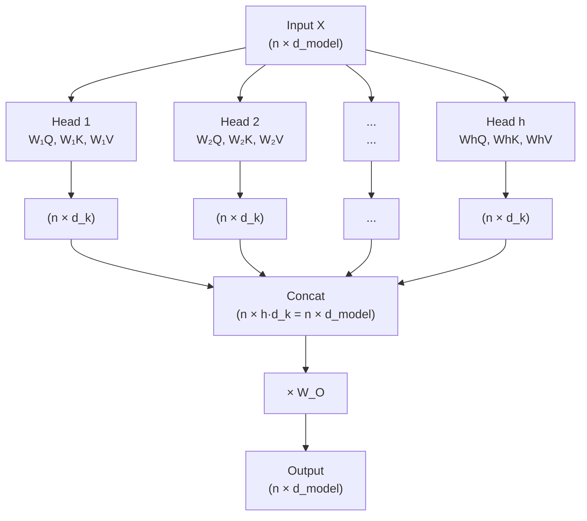

# Multi-head attention in transformers

> **TL;DR.** A single attention head can only learn one "perspective" on the sentence — but language often has *multiple simultaneous structures* (syntax, coreference, semantics, position). Multi-head attention runs **h independent attention operations in parallel**, each in a smaller `d_k = d_model/h`-dim subspace, then concatenates outputs and projects back via `W_O`. With h=8 heads of dim 64 (instead of 1 head of dim 512), you get 8 perspectives at the same compute budget. That's it.

Single-head self-attention computes one attention distribution per query position. Multi-head attention runs $h$ parallel attention operations in lower-dimensional subspaces, then combines their outputs. This allows the model to attend to different types of relationships simultaneously — syntactic dependencies, semantic similarity, positional proximity — in a single layer.

## Try it interactively

- **[BertViz Head View](https://github.com/jessevig/bertviz)** — see all 12 heads of BERT side by side, watch each one specialize on different patterns (syntax, coreference, etc.)
- **[Transformer Explainer](https://poloclub.github.io/transformer-explainer/)** — multi-head attention is highlighted in the GPT-2 visualization
- **[Anthropic Transformer Circuits](https://transformer-circuits.pub/)** — research on what individual attention heads actually learn
- **[Attention Head Analysis tool](https://github.com/clarkkev/attention-analysis)** — code for analyzing emergent head specialization in BERT

## One-line definition

Multi-head attention projects queries, keys, and values into $h$ separate subspaces, runs scaled dot-product attention in each, and concatenates the results — enabling the simultaneous modeling of multiple relationship types.


*Source: [Jay Alammar — The Illustrated Transformer](https://jalammar.github.io/illustrated-transformer/)*

## Why this topic matters

The jump from single-head to multi-head attention is the key architectural move that makes transformers powerful in practice. A single attention head can only attend to one type of relationship at once. Multiple heads allow the model to build a richer, multi-perspective representation of context. Understanding multi-head attention is understanding the core computation in every transformer block.

## The ambiguity problem: motivation

Self-attention generates a single contextual embedding per token, which means it can only express **one perspective** on the sentence. But natural language is often genuinely ambiguous, and a good model should be able to consider multiple readings at once. Consider:

> "The man saw the astronomer with a telescope."

Two valid interpretations exist:

| Interpretation | Meaning | Strong relationship |
|----------------|---------|---------------------|
| **(1)** The man used a telescope to see the astronomer | "with a telescope" attaches to "saw" | **man ↔ telescope** |
| **(2)** The man saw an astronomer who had a telescope | "with a telescope" attaches to "astronomer" | **astronomer ↔ telescope** |

A single self-attention head will tend to learn one of these patterns — high attention from "telescope" to "man" *or* from "telescope" to "astronomer", but not both. Real applications need both: a summarizer should be able to surface either reading, a question-answering system should know which interpretation matches the question, and so on.

The fix is simple in spirit: **run several self-attention modules in parallel**, each free to learn its own attention pattern. Each parallel module is called a **head**. With $h$ heads, the model can simultaneously capture $h$ different perspectives on the same sequence — and crucially, since the heads are independent they can be computed in parallel with no extra wall-clock cost.

## The multi-head attention formula

$$
\text{MultiHead}(Q, K, V) = \text{Concat}(\text{head}_1, \ldots, \text{head}_h) W^O
$$

where each head is:

$$
\text{head}_i = \text{Attention}(Q W_i^Q,\ K W_i^K,\ V W_i^V)
$$

and:

$$
\text{Attention}(Q, K, V) = \text{softmax}\!\left(\frac{QK^T}{\sqrt{d_k}}\right)V
$$

Parameters:
- $W_i^Q \in \mathbb{R}^{d_{\text{model}} \times d_k}$: query projection for head $i$
- $W_i^K \in \mathbb{R}^{d_{\text{model}} \times d_k}$: key projection for head $i$
- $W_i^V \in \mathbb{R}^{d_{\text{model}} \times d_v}$: value projection for head $i$
- $W^O \in \mathbb{R}^{h d_v \times d_{\text{model}}}$: output projection

The standard choice: $d_k = d_v = d_{\text{model}} / h$.

## Step-by-step walkthrough

Take a tiny example: sentence "Money Bank" with $d_{\text{model}} = 4$ and $h = 2$ heads (so $d_k = 2$ per head).

**Step 1 — Static embeddings:**
```
e_money, e_bank ∈ ℝ⁴
X = [e_money; e_bank]   # shape (2 × 4)
```

**Step 2 — One set of projection matrices per head.** Instead of one set $(W^Q, W^K, W^V)$, create $h = 2$ sets:
```
Head 1: W_Q¹, W_K¹, W_V¹    (each 4 × 2 if d_k = 2 per head)
Head 2: W_Q², W_K², W_V²    (each 4 × 2)
```

**Step 3 — Q, K, V per head:**
```
Q¹ = X · W_Q¹,   K¹ = X · W_K¹,   V¹ = X · W_V¹
Q² = X · W_Q²,   K² = X · W_K²,   V² = X · W_V²
```

**Step 4 — Self-attention inside each head:**
```
Z¹ = softmax(Q¹ · (K¹)ᵀ / √d_k) · V¹   # shape (2 × d_k) per head
Z² = softmax(Q² · (K²)ᵀ / √d_k) · V²
```
Each `Zⁱ` is a set of contextual embeddings produced from head $i$'s perspective.

**Step 5 — Concatenate the heads' outputs:**
```
Z = concat(Z¹, Z²)   # shape (2 × h·d_k) = (2 × 4)
```

**Step 6 — Output projection $W^O$:**
```
Output = Z · W^O   # W^O is (h·d_k × d_model) = (4 × 4)
```
This brings the result back to $d_{\text{model}}$ and lets the model *learn how to combine* the perspectives — `W^O` weights and mixes the heads.

## Why multiple heads?

A single attention head learns one "way of looking at" the sequence — one set of query-key relationships. Different linguistic phenomena require different attention patterns:

| Head type (emergent) | What it might learn |
|---|---|
| Syntactic heads | Subject-verb agreement, dependencies |
| Semantic heads | Related concepts, coreference |
| Positional heads | Adjacent tokens, local context |
| Entity heads | Connecting pronouns to referents |

With $h = 8$ heads of dimension $d_k = 64$ each, the model can simultaneously represent 8 different "perspectives" on the sequence, then combine them.

For the ambiguous sentence "The man saw the astronomer with a telescope", attention visualization tools typically show one head with strong **man ↔ telescope** weight (interpretation 1) and a different head with strong **astronomer ↔ telescope** weight (interpretation 2). Both readings live inside the same forward pass.

## Dimension accounting

For a transformer with $d_{\text{model}} = 512$ and $h = 8$ (the original paper's setup):

- Each head dimension: $d_k = d_v = 512 / 8 = 64$
- Each head produces output: $(n \times 64)$
- Concatenation: $(n \times 8 \times 64) = (n \times 512)$
- After $W^O$ projection: $(n \times 512)$ (back to $d_{\text{model}}$)

The total computation is equivalent to one full-dimensional attention operation, but split across 8 independent subspaces. The trade-off is summarized by the per-head dimension reduction:

| Approach | Per-head dimension | Total computation | Perspectives |
|----------|--------------------|--------------------|--------------|
| 1 head, full $d_{\text{model}}$ | 512 | $\approx O(n^2 \cdot 512)$ | 1 |
| 8 heads, $d_{\text{model}}/h$ each | 64 | $8 \cdot O(n^2 \cdot 64) = O(n^2 \cdot 512)$ | **8** |

Same FLOPs, eight perspectives.



## Why concat + $W^O$?

The two trailing operations are not just bookkeeping — each plays a specific role:

| Step | Purpose |
|------|---------|
| **Concatenation** | Stack each head's perspective into one vector per token |
| **Linear projection $W^O$** | Learn how to weight and mix the perspectives |
| **Output dimension match** | Bring the result back to $d_{\text{model}}$ so layers can stack |

Without $W^O$, the heads would be independent slabs of representation glued together with no mechanism for the model to combine them. With $W^O$, every output dimension is a learned linear combination of all heads' outputs — effectively
$$
\text{Final}_d = w_{d,1} \cdot \text{head}_1 + w_{d,2} \cdot \text{head}_2 + \cdots + w_{d,h} \cdot \text{head}_h
$$
where the $w_{d,i}$ are learned during training.

## Single-head vs multi-head: comparison

| Aspect | Single-head self-attention | Multi-head attention |
|--------|----------------------------|----------------------|
| Number of perspectives | 1 | $h$ (typically 8) |
| Number of weight matrices | 3 ($W^Q, W^K, W^V$) | $3h + 1$ ($h$ sets of QKV plus $W^O$) |
| Per-head dimension | $d_{\text{model}}$ | $d_{\text{model}} / h$ |
| Final combination | Direct output | Concat + linear projection |
| Computational cost | Base | $\approx$ same (due to dimension reduction) |
| Capability | Single relationship type | Multiple relationship types in parallel |

## PyCharm / Python code

### From scratch

```python
import torch
import torch.nn as nn
import torch.nn.functional as F
import math


class MultiHeadAttention(nn.Module):
    """
    Multi-head attention as in 'Attention is All You Need'.
    """

    def __init__(self, d_model: int, num_heads: int):
        super().__init__()
        assert d_model % num_heads == 0, "d_model must be divisible by num_heads"

        self.d_model = d_model
        self.num_heads = num_heads
        self.d_k = d_model // num_heads

        # Single linear layer for all heads (more efficient than separate layers)
        self.W_Q = nn.Linear(d_model, d_model, bias=False)
        self.W_K = nn.Linear(d_model, d_model, bias=False)
        self.W_V = nn.Linear(d_model, d_model, bias=False)
        self.W_O = nn.Linear(d_model, d_model, bias=False)

        # Initialize weights
        nn.init.xavier_uniform_(self.W_Q.weight)
        nn.init.xavier_uniform_(self.W_K.weight)
        nn.init.xavier_uniform_(self.W_V.weight)
        nn.init.xavier_uniform_(self.W_O.weight)

    def split_heads(self, x: torch.Tensor) -> torch.Tensor:
        """
        Reshape (batch, seq, d_model) → (batch, num_heads, seq, d_k)
        so each head sees its own slice of the representation.
        """
        batch, seq, d_model = x.shape
        x = x.reshape(batch, seq, self.num_heads, self.d_k)
        return x.transpose(1, 2)   # (batch, num_heads, seq, d_k)

    def forward(self, Q: torch.Tensor, K: torch.Tensor, V: torch.Tensor,
                mask: torch.Tensor = None) -> torch.Tensor:
        """
        Args:
            Q, K, V: shape (batch, seq, d_model)
            mask:    shape (batch, 1, seq_q, seq_k), True = mask out

        Returns:
            output: shape (batch, seq_q, d_model)
        """
        batch = Q.shape[0]

        # Step 1: project and split into heads
        Q = self.split_heads(self.W_Q(Q))   # (batch, h, seq_q, d_k)
        K = self.split_heads(self.W_K(K))   # (batch, h, seq_k, d_k)
        V = self.split_heads(self.W_V(V))   # (batch, h, seq_k, d_k)

        # Step 2: scaled dot-product attention (per head)
        scores = Q @ K.transpose(-2, -1) / math.sqrt(self.d_k)   # (batch, h, seq_q, seq_k)
        if mask is not None:
            scores = scores.masked_fill(mask, float("-inf"))
        attn = F.softmax(scores, dim=-1)   # attention weights

        # Step 3: weighted values
        x = attn @ V   # (batch, h, seq_q, d_k)

        # Step 4: concatenate heads
        x = x.transpose(1, 2).reshape(batch, -1, self.d_model)   # (batch, seq_q, d_model)

        # Step 5: output projection
        return self.W_O(x)


# Demo
d_model, num_heads, seq_len, batch = 512, 8, 20, 4

mha = MultiHeadAttention(d_model=d_model, num_heads=num_heads)
X = torch.randn(batch, seq_len, d_model)
output = mha(X, X, X)    # self-attention (Q=K=V=X)
print(f"Input:  {X.shape}")       # (4, 20, 512)
print(f"Output: {output.shape}")  # (4, 20, 512)
```

### Using PyTorch's built-in MHA

```python
import torch
import torch.nn as nn

# PyTorch built-in multi-head attention
mha = nn.MultiheadAttention(
    embed_dim=512,
    num_heads=8,
    dropout=0.1,
    batch_first=True    # (batch, seq, d_model) instead of (seq, batch, d_model)
)

batch, seq, d = 4, 20, 512
X = torch.randn(batch, seq, d)

# Self-attention: query = key = value = X
output, attn_weights = mha(X, X, X)
print(f"Output shape:       {output.shape}")       # (4, 20, 512)
print(f"Attention weights:  {attn_weights.shape}") # (4, 20, 20)

# Cross-attention: Q from decoder, K/V from encoder
X_decoder = torch.randn(batch, 10, d)   # decoder has different seq len
X_encoder = torch.randn(batch, 20, d)
cross_output, _ = mha(X_decoder, X_encoder, X_encoder)
print(f"Cross-attn output: {cross_output.shape}")  # (4, 10, 512)
```

## Parameter count

For $d_{\text{model}} = 512$, $h = 8$:

| Parameter | Shape | Count |
|---|---|---|
| $W_i^Q$ (all heads) | $(512, 512)$ | 262,144 |
| $W_i^K$ (all heads) | $(512, 512)$ | 262,144 |
| $W_i^V$ (all heads) | $(512, 512)$ | 262,144 |
| $W^O$ | $(512, 512)$ | 262,144 |
| **Total MHA** | | **1,048,576** |

## Visualizing what different heads learn

Attention head analysis studies have found different heads emergently specialize:
- Some heads track syntactic structure (dependency trees)
- Some heads attend to rare or unexpected tokens
- Some heads attend to positional neighbors
- Some heads copy information directly (attending mostly to self)

This interpretability is one reason transformers are easier to analyze than RNNs. Going back to the telescope example: visualization tools commonly show one head focusing the "telescope" query on "man", while another head focuses the same query on "astronomer" — the two competing readings live inside different heads of the same layer.

## Interview-ready answer

> "Self-attention can only capture one perspective from a sentence — but language is often ambiguous (e.g., 'The man saw the astronomer with a telescope' has two readings). Multi-head attention solves this by running several self-attention modules in parallel, each with its own learned $W^Q$, $W^K$, $W^V$ matrices. Each head can specialize in a different relationship — one head might bind 'telescope' to 'man', another to 'astronomer'. The original transformer uses 8 heads of dimension 64 (from $d_{\text{model}} = 512$); their outputs are concatenated and passed through a final linear projection $W^O$ that learns how to mix the perspectives. The clever part is that 8 heads of dimension 64 cost roughly the same FLOPs as 1 head of dimension 512, so we get 8 perspectives essentially for free."

## Interview questions

<details>
<summary>Why use multiple heads instead of one large attention head?</summary>

Multiple heads allow the model to simultaneously attend to different types of relationships. One head might capture syntactic dependencies, another semantic similarity, another positional proximity. A single head of full dimension would have to capture all relationship types with a single attention distribution per query — severely limiting what can be expressed at once. Multiple heads partition the representation space, each learning a specialized view.
</details>

<details>
<summary>How does multi-head attention maintain the same computational cost as single-head?</summary>

Each head operates on a d_k = d_model/h dimensional subspace. The cost per head is O(n² d_k). Total cost for h heads: O(h × n² d_k) = O(n² d_model) — same as one large head of dimension d_model. The number of parameters is also the same. The benefit is representational diversity, not efficiency.
</details>

<details>
<summary>What is the output projection W^O and why is it needed?</summary>

After concatenating all h heads, we have an (n × h·d_k = n × d_model) tensor where each dimension slice comes from a different head. W^O projects this concatenated representation back to d_model, mixing information across heads. Without W^O, the model cannot combine information from different heads — it would just be h independent parallel attention operations with no interaction.
</details>

<details>
<summary>In self-attention, what is passed as Q, K, and V?</summary>

In self-attention, Q = K = V = X (the same input sequence). The projections W^Q, W^K, W^V then transform this common input into separate query, key, and value spaces. "Self" means the sequence attends to itself, not to another sequence.
</details>

## Common mistakes

- Confusing $d_k$ (per-head dimension) with $d_{\text{model}}$ (full dimension) when counting parameters or shapes.
- Forgetting the output projection $W^O$ — without it, the heads are independent and cannot combine their information.
- Assuming more heads are always better — beyond a certain point, more heads means smaller per-head dimension, which may be too small to capture useful relationships. Typically 8–16 heads is standard.
- Not using `batch_first=True` in PyTorch's `nn.MultiheadAttention` — the default expects `(seq, batch, d)` which is inconsistent with most other PyTorch layers.
- Treating heads as if they were post-hoc averaging — they are independent learned subspaces, with their interactions fully delegated to $W^O$.

## Final takeaway

Multi-head attention is scaled dot-product attention run in $h$ parallel subspaces, followed by concatenation and an output projection. The multiple heads are what gives transformers their ability to simultaneously track syntactic structure, semantic content, and positional patterns — enabling the rich contextual representations that power modern language models. One forward pass, many perspectives, the same compute budget.

## References

- Vaswani, A., et al. (2017). Attention is All You Need. NeurIPS.
- Voita, E., et al. (2019). Analyzing Multi-Head Self-Attention. ACL.
