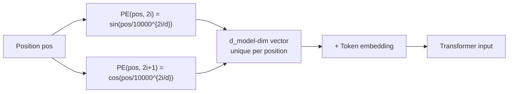

# Positional encoding in transformers

Attention computes similarity between any pair of tokens regardless of their positions in the sequence. This is powerful for global context but means the model is inherently **permutation-invariant**: if you shuffle the tokens, the attention output changes only because the tokens themselves change, not because their positions changed. Without positional information, "The dog bit the man" and "The man bit the dog" would produce the same representation.

## One-line definition

Positional encoding adds a position-dependent signal to token embeddings so the transformer can distinguish tokens not just by their content but also by their position in the sequence.


*Source: [Jay Alammar — The Illustrated Transformer](https://jalammar.github.io/illustrated-transformer/)*

## Why this topic matters

Positional encoding is what gives transformers sequence awareness. Without it, the model is a bag-of-words at each layer. Understanding the different positional encoding schemes — sinusoidal, learned, rotary (RoPE), ALiBi — explains how modern LLMs handle different context lengths and why they generalize to longer sequences than seen during training.

## The problem: attention is order-agnostic

In self-attention:

$$
\text{Attention}(Q, K, V) = \text{softmax}\!\left(\frac{QK^T}{\sqrt{d_k}}\right)V
$$

If we permute the input rows of $X$ (shuffle tokens), the attention scores change, but only because different tokens are now in different positions in the matrix — not because the positions themselves are encoded. The model has no intrinsic way to know that token 3 comes after token 2.

An MLP has no position sensitivity either. Position must be added explicitly.

## Solution: add positional signal to embeddings

The input to the transformer is:

$$
\text{Input}_i = \text{TokenEmbedding}(w_i) + \text{PositionalEncoding}(i)
$$

where $i$ is the position index (0-based). After this addition, the model can distinguish position through the embedding values.

## Sinusoidal positional encoding (original transformer)

From "Attention is All You Need" (Vaswani et al., 2017):

$$
\text{PE}(\text{pos}, 2i) = \sin\!\left(\frac{\text{pos}}{10000^{2i/d_{\text{model}}}}\right)
$$

$$
\text{PE}(\text{pos}, 2i+1) = \cos\!\left(\frac{\text{pos}}{10000^{2i/d_{\text{model}}}}\right)
$$

where:
- $\text{pos}$: position in the sequence (0 to $n-1$)
- $i$: dimension index (0 to $d_{\text{model}}/2 - 1$)
- $d_{\text{model}}$: embedding dimension

Each dimension $2i$ uses a different frequency $1/10000^{2i/d_{\text{model}}}$.

### Intuition: positional binary clock

Think of the position as a binary counter. In binary, digit 0 (least significant) oscillates at the highest frequency; digit $k$ oscillates at frequency $2^{-k}$. The sinusoidal encoding does something similar but with continuous sines:

- Small $i$ → large frequency → oscillates rapidly with position
- Large $i$ → small frequency → slowly varying with position

Together, the encoding provides a unique "fingerprint" for each position.

### Properties of sinusoidal encoding

**Bounded**: $\text{PE}(\text{pos}, j) \in [-1, 1]$ — does not dominate the token embeddings.

**Relative position awareness**: For any fixed offset $k$, $\text{PE}(\text{pos}+k)$ can be expressed as a linear function of $\text{PE}(\text{pos})$:

$$
\text{PE}(\text{pos}+k)_j = \alpha_j \text{PE}(\text{pos})_j + \beta_j \text{PE}(\text{pos})_{j'}
$$

This allows the model to represent relative positions through attention operations.

**Extrapolation**: Since the encoding is a mathematical formula, it can be applied to positions beyond the training context length.

## Sinusoidal PE: visual pattern

The encoding matrix (rows = positions, columns = dimensions) has a distinctive pattern:

- Columns near $i=0$: rapidly alternating columns (high-frequency)
- Columns near $i=d/2$: slowly varying, nearly constant (low-frequency)



## Learned positional embeddings

Modern LLMs (BERT, GPT-2, GPT-3) use learned embeddings instead of sinusoidal:

$$
\text{PE}(\text{pos}) = E_{\text{pos}}
$$

where $E_{\text{pos}} \in \mathbb{R}^{d_{\text{model}}}$ is a learnable vector for position $\text{pos}$, trained alongside the model.

**Advantages:**
- Can learn the optimal position representation for the task
- Often performs slightly better than sinusoidal on the training sequence length

**Disadvantages:**
- Fixed maximum sequence length — cannot generalize to longer sequences
- Requires seeing all positions during training

## Rotary Position Embedding (RoPE)

Used in LLaMA, GPT-NeoX, Mistral, and most modern open-source LLMs. Instead of adding a positional encoding to embeddings, RoPE **rotates** query and key vectors by a position-dependent rotation matrix:

$$
Q_{\text{pos}} = R_\theta^{\text{pos}} Q, \quad K_{\text{pos}} = R_\theta^{\text{pos}} K
$$

where $R_\theta^{\text{pos}}$ is a block-diagonal rotation matrix. The dot product $Q_{\text{pos}} \cdot K_{\text{pos}'}$ then naturally encodes the **relative** position $\text{pos} - \text{pos}'$ rather than absolute positions.

**Key advantage:** Superior length generalization. Since it encodes relative positions, it can generalize to sequences longer than seen during training (with some techniques like NTK scaling, YaRN).

## ALiBi (Attention with Linear Biases)

Instead of modifying embeddings, ALiBi adds a distance-based bias to attention scores:

$$
\text{score}(i, j) = Q_i K_j^T / \sqrt{d_k} - m \cdot |i - j|
$$

where $m$ is a head-specific slope. Closer tokens get smaller penalties. This enforces a recency bias and improves length extrapolation significantly.

## Comparison of positional encoding methods

| Method | Type | Extrapolation | Parameters | Used in |
|---|---|---|---|---|
| Sinusoidal | Fixed | Good | 0 | Original transformer |
| Learned | Learned | Poor | n_max × d | BERT, GPT-2 |
| RoPE | Fixed rotation | Very good | 0 | LLaMA, Mistral, GPT-NeoX |
| ALiBi | Fixed bias | Very good | 0 | MPT, BLOOM |

## PyCharm / Python code

### Sinusoidal positional encoding

```python
import torch
import torch.nn as nn
import math


class SinusoidalPositionalEncoding(nn.Module):
    """
    Sinusoidal positional encoding from 'Attention is All You Need'.
    PE(pos, 2i)   = sin(pos / 10000^(2i/d_model))
    PE(pos, 2i+1) = cos(pos / 10000^(2i/d_model))
    """

    def __init__(self, d_model: int, max_len: int = 5000, dropout: float = 0.1):
        super().__init__()
        self.dropout = nn.Dropout(p=dropout)

        # Create encoding matrix: (max_len, d_model)
        pe = torch.zeros(max_len, d_model)
        position = torch.arange(max_len).unsqueeze(1).float()         # (max_len, 1)
        div_term = torch.exp(
            torch.arange(0, d_model, 2).float() * (-math.log(10000.0) / d_model)
        )   # (d_model/2,)  — equivalent to 1/10000^(2i/d_model)

        pe[:, 0::2] = torch.sin(position * div_term)   # even dimensions
        pe[:, 1::2] = torch.cos(position * div_term)   # odd dimensions
        pe = pe.unsqueeze(0)   # (1, max_len, d_model) — broadcast over batch

        self.register_buffer("pe", pe)   # not a parameter, but saved in state_dict

    def forward(self, x: torch.Tensor) -> torch.Tensor:
        """
        Args:
            x: token embeddings, shape (batch, seq_len, d_model)
        Returns:
            x + positional encoding, shape (batch, seq_len, d_model)
        """
        x = x + self.pe[:, :x.size(1), :]
        return self.dropout(x)


# Demo
d_model, max_len = 64, 100
pe = SinusoidalPositionalEncoding(d_model=d_model, max_len=max_len)

batch, seq = 4, 20
x = torch.randn(batch, seq, d_model)   # token embeddings
out = pe(x)
print(f"Input:  {x.shape}")    # (4, 20, 64)
print(f"Output: {out.shape}")  # (4, 20, 64)

# Visualize the encoding for first 50 positions, all dimensions
import matplotlib.pyplot as plt

positions = torch.arange(50)
dims = torch.arange(d_model)
encoding_matrix = pe.pe[0, :50, :].numpy()

plt.figure(figsize=(12, 4))
plt.imshow(encoding_matrix.T, aspect="auto", cmap="RdYlBu", origin="lower")
plt.xlabel("Position")
plt.ylabel("Dimension")
plt.title("Sinusoidal Positional Encoding")
plt.colorbar()
plt.tight_layout()
plt.savefig("positional_encoding.png", dpi=150)
plt.show()
```

### Learned positional embeddings

```python
class LearnedPositionalEncoding(nn.Module):
    """Learned position embeddings — used in BERT, GPT-2."""

    def __init__(self, d_model: int, max_len: int = 512, dropout: float = 0.1):
        super().__init__()
        self.pos_embedding = nn.Embedding(max_len, d_model)
        self.dropout = nn.Dropout(p=dropout)
        nn.init.normal_(self.pos_embedding.weight, std=0.02)

    def forward(self, x: torch.Tensor) -> torch.Tensor:
        batch, seq_len, d_model = x.shape
        positions = torch.arange(seq_len, device=x.device).unsqueeze(0)  # (1, seq_len)
        return self.dropout(x + self.pos_embedding(positions))


# In a complete embedding layer (like BERT)
class TransformerEmbedding(nn.Module):
    def __init__(self, vocab_size: int, d_model: int, max_len: int = 512):
        super().__init__()
        self.token_emb = nn.Embedding(vocab_size, d_model)
        self.pos_emb = LearnedPositionalEncoding(d_model, max_len)
        self.norm = nn.LayerNorm(d_model)

    def forward(self, token_ids: torch.Tensor) -> torch.Tensor:
        x = self.token_emb(token_ids)   # (batch, seq, d_model)
        return self.norm(self.pos_emb(x))
```

## Interview questions

<details>
<summary>Why does attention not inherently capture positional information?</summary>

Scaled dot-product attention computes Q @ K^T, where each row of Q corresponds to a token and each column of K corresponds to a token. The computation is purely based on content (the values in Q and K), not on which row/column the token occupies. If you permute the input sequence (shuffle rows of X), the output for each token changes only because different tokens are now co-occurring, not because the transformer "knows" the order changed. Positional encoding injects order information into the content.
</details>

<details>
<summary>What is the advantage of sinusoidal encoding over learned embeddings for length generalization?</summary>

Sinusoidal encoding is a mathematical formula that can be computed for any position, including positions beyond the training length. Learned embeddings have a fixed table size — position 513 in a model trained with max_len=512 has no embedding. Sinusoidal and relative encodings (RoPE, ALiBi) generalize to longer sequences without modification.
</details>

<details>
<summary>What is RoPE and why is it used in most modern LLMs?</summary>

RoPE (Rotary Position Embedding) encodes position by rotating query and key vectors by position-dependent angles. The dot product Q_pos · K_pos' naturally depends only on the relative offset (pos - pos'), not absolute positions. This makes attention inherently relative-position-aware. RoPE generalizes well to longer contexts and can be extended with NTK-aware scaling or YaRN to lengths far beyond training. It is used in LLaMA, Mistral, Gemma, Qwen, and most open-source LLMs.
</details>

## Common mistakes

- Using sinusoidal encoding without adding it to the token embeddings — just computing it without adding is a no-op.
- Not using `register_buffer` for the positional encoding matrix — if it is not registered, it will not move to GPU when `.to(device)` is called, causing device mismatch errors.
- Setting max_len too small and encountering index-out-of-bounds errors at inference time for long inputs.
- Forgetting that positional encoding adds to embeddings, not replaces them — token identity and position are both preserved.

## Final takeaway

Positional encoding is how transformers learn sequence order. Sinusoidal encoding is elegant and generalizes to longer sequences; learned embeddings perform well within the training length. Modern LLMs use RoPE or ALiBi to achieve superior length generalization. Without positional encoding, a transformer is a bag-of-words model that ignores word order entirely.

## References

- Vaswani, A., et al. (2017). Attention is All You Need. NeurIPS.
- Su, J., et al. (2023). RoFormer: Enhanced Transformer with Rotary Position Embedding.
- Press, O., et al. (2022). Train Short, Test Long: Attention with Linear Biases (ALiBi).
