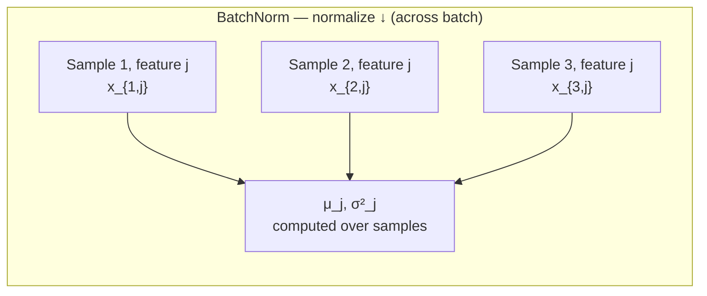
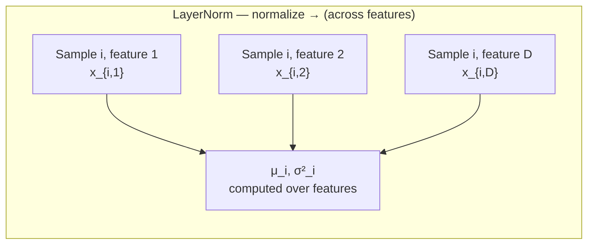

# Layer normalization versus batch normalization

> **TL;DR.** BatchNorm and LayerNorm both rescale activations to mean 0, std 1 — but they differ in **which axis they average over**. BatchNorm averages across the batch (good for CNNs, where each image is a fixed-size i.i.d. sample). LayerNorm averages across features within a single sample (good for transformers, where sequences have variable length and inference often runs at batch size 1). The single-axis difference is what makes LayerNorm the right choice for every modern LLM.

Batch normalization (note 31) was the normalization standard for CNNs. Transformers use layer normalization instead. The difference is a single axis: where the mean and variance are computed. That axis change has profound practical consequences for variable-length sequences, small batches, and autoregressive generation.

## Try it interactively

- **[Distill — Feature visualization](https://distill.pub/2017/feature-visualization/)** — see what normalization does to feature distributions
- **[PyTorch nn.LayerNorm docs](https://pytorch.org/docs/stable/generated/torch.nn.LayerNorm.html)** — official walkthrough with shape examples
- **[Yannic Kilcher — Layer Normalization explained (YouTube)](https://www.youtube.com/results?search_query=yannic+kilcher+layer+normalization)** — visual derivation of the differences
- **[Karpathy — makemore (Part 3, BatchNorm)](https://www.youtube.com/watch?v=P6sfmUTpUmc)** — Andrej walks through BatchNorm and its failure modes in detail; LayerNorm follows naturally

## A real-world analogy

Imagine you and 31 classmates take a test. Two ways to "normalize" your scores:

- **BatchNorm**: For each *question*, compute the class average and standard deviation, then z-score everyone's answer for that question. Your normalized score for Q3 depends on how the rest of the class did on Q3.
- **LayerNorm**: For each *student*, compute their personal mean and standard deviation across all questions, then z-score their own answers. Your normalized scores depend only on your own paper.

LayerNorm is what you want when (a) sometimes only one student takes the test (batch size 1 at inference), (b) different students answer different numbers of questions (variable-length sequences), or (c) you don't trust the rest of the class to be a representative sample.

## One-line definition

Batch normalization normalizes each feature across the batch dimension; layer normalization normalizes each sample across the feature dimension — making LayerNorm batch-size-independent and suitable for sequential and autoregressive models.


*Source: [Jay Alammar — The Illustrated Transformer](https://jalammar.github.io/illustrated-transformer/)*

## Why this topic matters

Every transformer block uses LayerNorm (or its variants). Understanding why requires understanding when BatchNorm fails — specifically at batch size 1, with variable-length sequences, and during autoregressive inference. These are exactly the conditions that transformers operate under.

## BatchNorm: normalize across the batch

For a feature $j$ in a mini-batch of size $B$:

$$
\hat{x}_{i,j} = \frac{x_{i,j} - \mu_j}{\sqrt{\sigma_j^2 + \epsilon}}, \quad \mu_j = \frac{1}{B}\sum_{i=1}^B x_{i,j}, \quad \sigma_j^2 = \frac{1}{B}\sum_{i=1}^B (x_{i,j} - \mu_j)^2
$$

Then scale and shift: $y_{i,j} = \gamma_j \hat{x}_{i,j} + \beta_j$

**Key**: statistics $\mu_j$ and $\sigma_j^2$ depend on the **entire batch**. Each sample's normalization is affected by other samples.



## LayerNorm: normalize across features

For a single sample $i$ with $D$ features:

$$
\hat{x}_{i,j} = \frac{x_{i,j} - \mu_i}{\sqrt{\sigma_i^2 + \epsilon}}, \quad \mu_i = \frac{1}{D}\sum_{j=1}^D x_{i,j}, \quad \sigma_i^2 = \frac{1}{D}\sum_{j=1}^D (x_{i,j} - \mu_i)^2
$$

Then scale and shift: $y_{i,j} = \gamma_j \hat{x}_{i,j} + \beta_j$

**Key**: statistics $\mu_i$ and $\sigma_i^2$ are computed from the $D$ features of **one sample**. Each sample normalizes itself independently.



## Visualization: which dimensions are normalized

For a 3D tensor (batch × seq_len × d_model):

| Method | Normalize over | Statistics shape |
|---|---|---|
| BatchNorm | batch × seq_len (for each feature $j$) | $(d_{\text{model}},)$ |
| LayerNorm | d_model (for each sample × position) | Scalar per (batch, seq) |
| InstanceNorm | seq_len (for each batch × feature) | per (batch, feature) |
| GroupNorm | groups of features (for each sample × group) | per (batch, group) |

## Why BatchNorm fails for transformers

### Problem 1: Variable-length sequences

In NLP, sequences have different lengths. BatchNorm must compute statistics across all positions of all sequences simultaneously. For positions near the end of shorter sequences (padded positions), the statistics are contaminated by padding values. LayerNorm computes per-sample statistics and is naturally immune to sequence length variation.

### Problem 2: Batch size 1 at inference

Autoregressive generation (GPT generating text token by token) often runs with batch size 1. BatchNorm with batch size 1 computes statistics from a single sample — the mean and variance are exactly 0 and 0, making normalization degenerate. Instead, PyTorch uses stored running statistics during `model.eval()`. LayerNorm has no such problem — it always computes statistics from the feature dimension.

### Problem 3: Sequential dependencies

For recurrent processing or autoregressive generation, the "batch" dimension does not always represent independent samples. BatchNorm's cross-sample statistics mix information across what may be dependent samples.

## The formulas side by side

| | BatchNorm | LayerNorm |
|---|---|---|
| Normalization axis | Batch (per feature) | Features (per sample) |
| Statistics depend on | All samples in batch | Only current sample |
| Works at batch=1? | Poorly (degenerate) | Yes |
| Variable-length sequences? | No | Yes |
| Autoregressive generation? | No | Yes |
| Learnable params $\gamma, \beta$ | Per-feature | Per-feature |
| Running stats needed for inference? | Yes | No |

## Pre-norm vs post-norm

In the original transformer (Vaswani 2017), LayerNorm was applied **after** the residual connection (post-norm):

$$
h = \text{LayerNorm}(x + \text{Attention}(x))
$$

Modern transformers (GPT-2, LLaMA, etc.) use **pre-norm** (apply LayerNorm before the sublayer):

$$
h = x + \text{Attention}(\text{LayerNorm}(x))
$$

Pre-norm is more stable for deeper models and is the standard today. Post-norm requires careful learning rate warmup to avoid training instability.

## PyCharm / Python code

```python
import torch
import torch.nn as nn


# ============================================================
# LayerNorm from scratch
# ============================================================
class LayerNorm(nn.Module):
    """
    Layer normalization: normalize across the last dimension (d_model).
    Applied to shape (batch, seq, d_model) → normalizes each (batch, seq) slice.
    """

    def __init__(self, d_model: int, eps: float = 1e-5):
        super().__init__()
        self.gamma = nn.Parameter(torch.ones(d_model))   # scale
        self.beta = nn.Parameter(torch.zeros(d_model))   # shift
        self.eps = eps

    def forward(self, x: torch.Tensor) -> torch.Tensor:
        # x: (batch, seq, d_model)
        mean = x.mean(dim=-1, keepdim=True)          # (batch, seq, 1)
        std = x.std(dim=-1, keepdim=True, unbiased=False)   # (batch, seq, 1)
        x_norm = (x - mean) / (std + self.eps)       # (batch, seq, d_model)
        return self.gamma * x_norm + self.beta        # learnable scale+shift


# ============================================================
# Using PyTorch built-ins
# ============================================================
batch, seq, d_model = 4, 20, 512

x = torch.randn(batch, seq, d_model)

# LayerNorm (for transformers)
layer_norm = nn.LayerNorm(d_model)
out_ln = layer_norm(x)
print(f"LayerNorm output: {out_ln.shape}")              # (4, 20, 512)
print(f"Mean per sample (should be ~0): {out_ln.mean(dim=-1).abs().max():.6f}")
print(f"Std per sample (should be ~1): {out_ln.std(dim=-1).mean():.6f}")

# BatchNorm (for comparison — used in CNNs)
batch_norm = nn.BatchNorm1d(d_model)
# BatchNorm1d expects (batch, features) or (batch, features, length)
x_bn = x.reshape(batch * seq, d_model)
out_bn = batch_norm(x_bn)
print(f"\nBatchNorm output: {out_bn.shape}")             # (80, 512)

# BatchNorm at batch_size=1 (shows degenerate behavior)
batch_norm.eval()   # use running stats in eval mode
x_single = torch.randn(1, d_model)
out_single = batch_norm(x_single)
print(f"\nBatchNorm at batch=1 (eval mode): {out_single.shape}")  # OK in eval


# ============================================================
# In a transformer block (pre-norm style, modern standard)
# ============================================================
class TransformerBlock(nn.Module):
    def __init__(self, d_model: int, num_heads: int, dim_feedforward: int,
                 dropout: float = 0.1):
        super().__init__()
        self.attn = nn.MultiheadAttention(d_model, num_heads, batch_first=True)
        self.ff = nn.Sequential(
            nn.Linear(d_model, dim_feedforward),
            nn.GELU(),          # modern transformers use GELU
            nn.Dropout(dropout),
            nn.Linear(dim_feedforward, d_model),
        )
        self.norm1 = nn.LayerNorm(d_model)   # pre-norm for attention
        self.norm2 = nn.LayerNorm(d_model)   # pre-norm for feedforward
        self.dropout = nn.Dropout(dropout)

    def forward(self, x: torch.Tensor, mask: torch.Tensor = None) -> torch.Tensor:
        # Pre-norm self-attention with residual
        x_norm = self.norm1(x)
        attn_out, _ = self.attn(x_norm, x_norm, x_norm, attn_mask=mask)
        x = x + self.dropout(attn_out)

        # Pre-norm feed-forward with residual
        x = x + self.dropout(self.ff(self.norm2(x)))
        return x


block = TransformerBlock(d_model=512, num_heads=8, dim_feedforward=2048)
x = torch.randn(4, 20, 512)
out = block(x)
print(f"\nTransformer block output: {out.shape}")   # (4, 20, 512)
```

### Try it yourself: experiments

| Question | Try this |
|----------|----------|
| What does BatchNorm fail at batch=1 in train mode? | `nn.BatchNorm1d(8); bn.train(); bn(torch.randn(1, 8))` — produces NaN or zeros |
| Does LayerNorm change with batch size? | Run LayerNorm on the same vector with different batch sizes; output is identical for that vector |
| RMSNorm vs LayerNorm | Implement `x / torch.sqrt(x.pow(2).mean(-1, keepdim=True) + eps) * gamma`; check it's roughly equivalent |
| Pre-norm vs post-norm gradient | Compute `torch.autograd.grad` through both — pre-norm gradients are noticeably larger at deep stacks |
| What if epsilon is too small? | Set `eps=0` and feed an all-zero input — division by zero blows up |

## RMSNorm: a simpler LayerNorm variant

Used in LLaMA, Mistral, Gemma:

$$
\text{RMSNorm}(x)_j = \frac{x_j}{\sqrt{\frac{1}{D}\sum_k x_k^2 + \epsilon}} \cdot \gamma_j
$$

RMSNorm removes the mean subtraction, keeping only the RMS (root mean square) normalization. Empirically matches LayerNorm performance at lower computational cost.

## Cross-references

- **Prerequisite:** [31 — Batch Normalization](./31-batch-normalization.md) — the original normalization technique LayerNorm replaces in transformers
- **Follow-up:** [80 — Transformer Encoder Architecture](./80-transformer-encoder-architecture.md) — where LayerNorm sits in each block (pre-norm vs post-norm)
- **Follow-up:** [83 — Transformer Decoder Architecture](./83-transformer-decoder-architecture.md) — the same Add & Norm pattern in the decoder
- **Related:** Modern LLMs (LLaMA, Mistral, Gemma) use **RMSNorm** — see the section above for the simplified variant

## Interview questions

<details>
<summary>What is the fundamental difference between BatchNorm and LayerNorm in terms of which dimensions are normalized?</summary>

BatchNorm normalizes each feature across the batch dimension: for feature j, it computes mean and variance over all B samples. LayerNorm normalizes each sample across the feature dimension: for sample i, it computes mean and variance over all D features. BatchNorm statistics depend on the batch; LayerNorm statistics depend only on the current sample — making LayerNorm batch-size-independent.
</details>

<details>
<summary>Why is LayerNorm preferred over BatchNorm for transformers?</summary>

Three reasons: (1) Variable-length sequences — BatchNorm statistics are inconsistent when sequences have different lengths; LayerNorm computes per-sample statistics and is unaffected. (2) Autoregressive inference — generating one token at a time gives batch size 1, where BatchNorm statistics are degenerate; LayerNorm works correctly at any batch size. (3) Sequence modeling — the "batch" of tokens at a given position are not independent samples, so averaging statistics across them (as BatchNorm does) is inappropriate.
</details>

<details>
<summary>What is the difference between pre-norm and post-norm transformers?</summary>

Post-norm (original transformer): LayerNorm(x + Sublayer(x)) — normalization after the residual. Pre-norm (modern): x + Sublayer(LayerNorm(x)) — normalization before the sublayer. Pre-norm is more stable for deep models because the gradients flow directly through the residual connection without passing through the normalization. Post-norm requires careful warmup to avoid instability early in training. GPT-2, LLaMA, and most modern LLMs use pre-norm.
</details>

## Common mistakes

- Using `nn.BatchNorm1d` in a transformer — it will fail or give wrong results for variable-length sequences and single-sample inference.
- Using the wrong `normalized_shape` in `nn.LayerNorm` — it should be `d_model` (the last dimension), not `seq_len` or the full input shape.
- Applying LayerNorm after the residual connection (post-norm) in deep models without careful warmup — this leads to training instability beyond ~12 layers.

## Final takeaway

The choice of normalization axis is what separates BatchNorm from LayerNorm. Normalizing over features (LayerNorm) rather than the batch gives independence from batch size and sequence length — both essential properties for transformer training and inference. Pre-norm has become the standard for stable training of deep models.

## References

- Ba, J. L., Kiros, J. R., & Hinton, G. E. (2016). Layer Normalization.
- Xiong, R., et al. (2020). On Layer Normalization in the Transformer Architecture.
- Zhang, B., & Sennrich, R. (2019). Root Mean Square Layer Normalization (RMSNorm).
