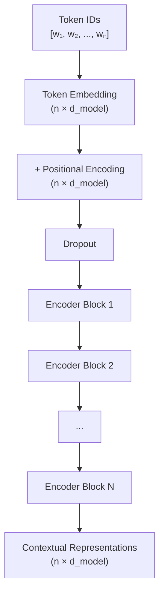
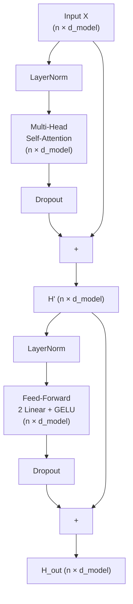

# Transformer encoder architecture

The transformer encoder takes a sequence of tokens and produces a sequence of **contextual representations** — one vector per token that captures the meaning of that token in the context of all surrounding tokens. This is in contrast to word embeddings, which are context-free (the same word always has the same embedding).

## One-line definition

The transformer encoder is a stack of $N$ identical blocks, each containing multi-head self-attention and a feed-forward sublayer with residual connections and layer normalization — transforming input token embeddings into rich contextual representations.


*Source: [Jay Alammar — The Illustrated Transformer](https://jalammar.github.io/illustrated-transformer/)*

## Why this topic matters

The encoder is the backbone of BERT, RoBERTa, and all encoder-based language models. Understanding its architecture teaches you how contextual representations are built, why stacking layers helps, and what each component contributes. Encoder representations power tasks like classification, named entity recognition, and question answering.

## High-level architecture



## Inside one encoder block

Each encoder block contains two sublayers:

1. **Multi-head self-attention** (MHA)
2. **Position-wise feed-forward network** (FFN)

Each sublayer uses a residual connection and layer normalization.

**Pre-norm formulation** (modern standard):

$$
H' = X + \text{MHA}(\text{LayerNorm}(X))
$$

$$
H_{\text{out}} = H' + \text{FFN}(\text{LayerNorm}(H'))
$$

**Post-norm formulation** (original paper):

$$
H' = \text{LayerNorm}(X + \text{MHA}(X))
$$

$$
H_{\text{out}} = \text{LayerNorm}(H' + \text{FFN}(H'))
$$



## The feed-forward sublayer

The FFN is a two-layer MLP applied independently to each token position:

$$
\text{FFN}(x) = W_2 \cdot \text{GELU}(W_1 x + b_1) + b_2
$$

- $W_1 \in \mathbb{R}^{d_{\text{model}} \times d_{\text{ff}}}$: expands to $d_{\text{ff}} = 4 d_{\text{model}}$
- $W_2 \in \mathbb{R}^{d_{\text{ff}} \times d_{\text{model}}}$: projects back to $d_{\text{model}}$

The expansion ratio of 4× is a design choice that gives the FFN most of the representational capacity in the model. For $d_{\text{model}} = 512$: $d_{\text{ff}} = 2048$.

**Why does the FFN matter?** Self-attention mixes information across positions but applies the same linear transformation to all positions. The FFN then processes each position's representation independently with a nonlinear transformation. Conceptually: attention handles routing, FFN handles content transformation.

## Dimension tracking through a block

For $d_{\text{model}} = 512$, $h = 8$ heads, $n = 20$ tokens, batch = 4:

| Step | Input shape | Output shape |
|---|---|---|
| Token embedding | $(4, 20)$ token IDs | $(4, 20, 512)$ |
| + Positional encoding | $(4, 20, 512)$ | $(4, 20, 512)$ |
| LayerNorm | $(4, 20, 512)$ | $(4, 20, 512)$ |
| Multi-head attention | $(4, 20, 512)$ | $(4, 20, 512)$ |
| Residual add | $(4, 20, 512)$ | $(4, 20, 512)$ |
| LayerNorm | $(4, 20, 512)$ | $(4, 20, 512)$ |
| FFN (expand $W_1$) | $(4, 20, 512)$ | $(4, 20, 2048)$ |
| FFN (contract $W_2$) | $(4, 20, 2048)$ | $(4, 20, 512)$ |
| Residual add | $(4, 20, 512)$ | $(4, 20, 512)$ |

The shape never changes from $(4, 20, 512)$ once inside the encoder — the $n \times d_{\text{model}}$ representation is refined at each block.

## PyCharm / Python code

```python
import torch
import torch.nn as nn
import math


class EncoderBlock(nn.Module):
    """One transformer encoder block with pre-norm."""

    def __init__(self, d_model: int, num_heads: int, dim_feedforward: int,
                 dropout: float = 0.1):
        super().__init__()
        self.norm1 = nn.LayerNorm(d_model)
        self.norm2 = nn.LayerNorm(d_model)
        self.attn = nn.MultiheadAttention(
            embed_dim=d_model,
            num_heads=num_heads,
            dropout=dropout,
            batch_first=True,
        )
        self.ffn = nn.Sequential(
            nn.Linear(d_model, dim_feedforward),
            nn.GELU(),
            nn.Dropout(dropout),
            nn.Linear(dim_feedforward, d_model),
            nn.Dropout(dropout),
        )

    def forward(self, x: torch.Tensor,
                src_key_padding_mask: torch.Tensor = None) -> torch.Tensor:
        """
        Args:
            x:                    (batch, seq, d_model)
            src_key_padding_mask: (batch, seq) — True for padded positions

        Returns:
            (batch, seq, d_model)
        """
        # Pre-norm self-attention with residual
        x = x + self.attn(
            self.norm1(x), self.norm1(x), self.norm1(x),
            key_padding_mask=src_key_padding_mask,
        )[0]

        # Pre-norm feed-forward with residual
        x = x + self.ffn(self.norm2(x))
        return x


class TransformerEncoder(nn.Module):
    """
    Complete transformer encoder:
    Embedding + Positional Encoding + N × EncoderBlock + Final LayerNorm
    """

    def __init__(self, vocab_size: int, d_model: int, num_heads: int,
                 num_layers: int, dim_feedforward: int, max_len: int = 512,
                 dropout: float = 0.1):
        super().__init__()
        self.token_emb = nn.Embedding(vocab_size, d_model, padding_idx=0)
        self.pos_emb = nn.Embedding(max_len, d_model)
        self.dropout = nn.Dropout(dropout)
        self.blocks = nn.ModuleList([
            EncoderBlock(d_model, num_heads, dim_feedforward, dropout)
            for _ in range(num_layers)
        ])
        self.norm = nn.LayerNorm(d_model)   # final normalization (pre-norm style)
        self._init_weights()

    def _init_weights(self):
        nn.init.normal_(self.token_emb.weight, std=0.02)
        nn.init.normal_(self.pos_emb.weight, std=0.02)

    def forward(self, token_ids: torch.Tensor,
                padding_mask: torch.Tensor = None) -> torch.Tensor:
        """
        Args:
            token_ids:    (batch, seq) — integer token IDs
            padding_mask: (batch, seq) — True for padded positions

        Returns:
            (batch, seq, d_model) — contextual representations
        """
        batch, seq = token_ids.shape
        positions = torch.arange(seq, device=token_ids.device).unsqueeze(0)  # (1, seq)

        # Embeddings + positional
        x = self.dropout(
            self.token_emb(token_ids) + self.pos_emb(positions)
        )

        # Pass through encoder blocks
        for block in self.blocks:
            x = block(x, src_key_padding_mask=padding_mask)

        return self.norm(x)   # final layer norm


# BERT-base scale configuration
encoder = TransformerEncoder(
    vocab_size=30522,       # BERT vocabulary size
    d_model=768,            # BERT hidden size
    num_heads=12,
    num_layers=12,
    dim_feedforward=3072,   # 4 × 768
    max_len=512,
    dropout=0.1,
)

# Forward pass
token_ids = torch.randint(1, 30522, (4, 128))   # (batch=4, seq=128)
padding_mask = token_ids == 0                    # False for all (no padding here)

output = encoder(token_ids, padding_mask=None)
print(f"Input shape:  {token_ids.shape}")         # (4, 128)
print(f"Output shape: {output.shape}")            # (4, 128, 768)
print(f"Model params: {sum(p.numel() for p in encoder.parameters()):,}")
```

## What each component contributes

| Component | Role |
|---|---|
| Token embedding | Maps discrete token IDs to continuous vectors |
| Positional encoding | Injects sequence order information |
| Multi-head self-attention | Routes information between tokens based on content |
| Feed-forward sublayer | Applies nonlinear transformation to each position independently |
| Residual connection | Provides gradient highway; allows the block to focus on the residual |
| Layer normalization | Keeps activations stable; speeds training |
| Stack of $N$ blocks | Each block refines representations; deeper = more complex patterns |

## Interview questions

<details>
<summary>What is the difference between token embeddings and contextual embeddings in a transformer encoder?</summary>

Token embeddings are context-free: the word "bank" always maps to the same vector. Contextual embeddings (the encoder output) depend on the surrounding sequence: "bank" near "river" produces a different representation than "bank" near "money." Self-attention is what creates this context-dependence — each token's representation is a weighted blend of all other tokens' values, so the same word in different contexts produces different output vectors.
</details>

<details>
<summary>Why does the feed-forward sublayer expand to 4× d_model?</summary>

The FFN's intermediate dimension d_ff = 4·d_model is a design choice that allows the FFN to represent complex transformations. With a larger intermediate dimension, the model has more parameters per FFN and more expressiveness at each position. Research suggests the FFN stores factual knowledge in its weight matrices — "key-value memories" that the attention retrieves. The 4× ratio was found empirically to work well and has become standard.
</details>

<details>
<summary>What do residual connections do in the transformer encoder?</summary>

Residual connections (h = x + Sublayer(x)) serve two purposes: (1) Gradient flow — gradients can bypass each sublayer and flow directly from later layers to earlier ones, enabling training of deep stacks. (2) Identity initialization — at the start of training, sublayer outputs are small (near-zero with proper initialization), so the residual connection ensures the block is approximately identity — a stable starting point for learning incremental refinements.
</details>

## Common mistakes

- Forgetting the `src_key_padding_mask` for padded tokens — without masking, attention leaks into padding positions, producing incorrect representations.
- Confusing pre-norm and post-norm: in pre-norm, LayerNorm is inside the residual branch (applied to x before the sublayer); in post-norm, it is outside (applied to x + sublayer(x)).
- Using `nn.TransformerEncoderLayer` without setting `batch_first=True` — the default expects `(seq, batch, d_model)` which is inconsistent with most PyTorch code.

## Final takeaway

The transformer encoder is a stack of attention-plus-FFN blocks with residual connections and LayerNorm. Each block refines token representations by mixing information across positions (attention) and transforming each position independently (FFN). After $N$ blocks, each token's representation captures its meaning in the full surrounding context — the foundation of all encoder-based language models.

## References

- Vaswani, A., et al. (2017). Attention is All You Need. NeurIPS.
- Devlin, J., et al. (2019). BERT: Pre-training of Deep Bidirectional Transformers. NAACL.
