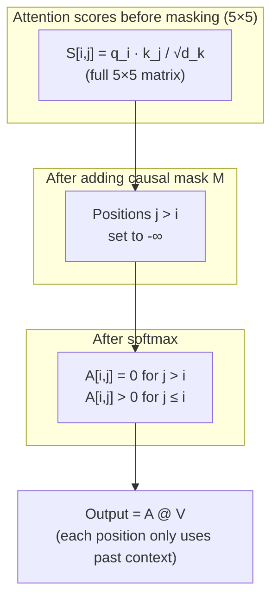

# Masked self-attention in the transformer decoder

The transformer decoder is trained to predict the next token at every position simultaneously — a technique called teacher forcing. But if position $t$ can see the target token at position $t+1$ during training, it is cheating. The causal mask prevents this: it blocks each position from attending to any future position, enforcing the same constraint that holds during inference.

## One-line definition

Masked self-attention is self-attention with an upper-triangular mask that sets future-position scores to $-\infty$ before softmax, so each token can only attend to positions at or before its own position — enforcing the autoregressive constraint.


*Source: [Jay Alammar — The Illustrated Transformer](https://jalammar.github.io/illustrated-transformer/)*

## Why this topic matters

The causal mask is non-negotiable for any generative model. Without it, the model learns trivial shortcuts (copy the next token from the input) and fails completely at inference time when future tokens are unavailable. The mask is also the mechanism that makes teacher forcing work — you can train the model on the entire target sequence in one parallel forward pass while still respecting the sequential generation constraint.

## The problem: teacher forcing enables future-leakage

During training, the decoder receives the complete target sequence as input (shifted right by one position):

- Input: `[BOS, "The", "cat", "sat"]`
- Target: `["The", "cat", "sat", EOS]`

Without masking, the attention layer at position 0 ("The") can see positions 1, 2, 3 ("cat", "sat", EOS). The model trivially learns to copy the next token rather than learning to predict it from context. At inference, there is no future — the model breaks.

The causal mask enforces: position $t$ can attend **only** to positions $0, 1, \ldots, t$.

## The mask construction

The causal mask is an upper-triangular matrix of $-\infty$ values (positions above the diagonal):

$$
M[i, j] = \begin{cases} 0 & \text{if } j \leq i \\ -\infty & \text{if } j > i \end{cases}
$$

Applied before softmax:

$$
\text{MaskedAttn}(Q, K, V) = \text{softmax}\!\left(\frac{QK^T}{\sqrt{d_k}} + M\right)V
$$

After adding $M$: positions $j > i$ have score $-\infty$. After softmax: $e^{-\infty} = 0$, so those positions get zero attention weight.

For sequence length 5:

$$
M = \begin{pmatrix}
0 & -\infty & -\infty & -\infty & -\infty \\
0 & 0 & -\infty & -\infty & -\infty \\
0 & 0 & 0 & -\infty & -\infty \\
0 & 0 & 0 & 0 & -\infty \\
0 & 0 & 0 & 0 & 0
\end{pmatrix}
$$

- Row 0: position 0 can only attend to itself
- Row 1: position 1 can attend to positions 0 and 1
- Row 4: position 4 can attend to all 5 positions



## Training vs. inference: same constraint, different mechanism

| Phase | Mechanism | Input |
|---|---|---|
| Training | Full sequence + causal mask | Ground-truth tokens |
| Inference | Sequential generation (no mask needed — future doesn't exist yet) | Previously generated tokens |

During training: the full target sequence is fed at once. The causal mask simulates the left-to-right constraint. All positions are predicted in parallel — efficient GPU training.

During inference: generation is truly sequential. At step $t$, only positions $0, \ldots, t-1$ exist — no mask is needed because there are no future positions to block. (With KV caching, each step processes only the new token.)

## Two masks that can coexist

In practice, the decoder often handles two masks simultaneously:

1. **Causal mask**: blocks future positions ($j > i$)
2. **Padding mask**: blocks padding tokens (for batches with variable-length sequences)

Both are applied to the score matrix:

$$
S_{\text{masked}} = S + M_{\text{causal}} + M_{\text{padding}}
$$

The padding mask is needed so that attention doesn't mix real tokens with padding tokens whose values are meaningless.

## Python code: complete implementation

```python
import torch
import torch.nn as nn
import torch.nn.functional as F
import math


def make_causal_mask(seq_len: int, device: str = "cpu") -> torch.Tensor:
    """
    Create causal mask: True at positions to be masked (future positions).
    Shape: (seq_len, seq_len)
    In PyTorch's masked_fill convention: True = mask out.
    """
    mask = torch.triu(torch.ones(seq_len, seq_len, device=device), diagonal=1).bool()
    return mask


def make_padding_mask(token_ids: torch.Tensor, pad_id: int = 0) -> torch.Tensor:
    """
    Create padding mask: True at padding positions.
    token_ids: (batch, seq_len)
    Returns: (batch, 1, seq_len) — will broadcast over query dimension
    """
    return (token_ids == pad_id).unsqueeze(1)


def masked_self_attention(
    x: torch.Tensor,
    W_Q: torch.Tensor,
    W_K: torch.Tensor,
    W_V: torch.Tensor,
    causal_mask: torch.Tensor = None,
) -> tuple[torch.Tensor, torch.Tensor]:
    """
    Masked self-attention.
    x:           (batch, seq_len, d_model)
    causal_mask: (seq_len, seq_len) — True at positions to mask
    Returns:
        output: (batch, seq_len, d_k)
        attn:   (batch, seq_len, seq_len)
    """
    Q = x @ W_Q   # (batch, seq_len, d_k)
    K = x @ W_K
    V = x @ W_V
    d_k = Q.shape[-1]

    scores = Q @ K.transpose(-2, -1) / math.sqrt(d_k)   # (batch, seq, seq)

    if causal_mask is not None:
        # Broadcast mask across batch dimension
        scores = scores.masked_fill(causal_mask.unsqueeze(0), float("-inf"))

    attn = F.softmax(scores, dim=-1)
    # NaN guard: if entire row is -inf (all padding), softmax returns NaN
    attn = torch.nan_to_num(attn, nan=0.0)

    output = attn @ V
    return output, attn


# ============================================================
# Demo: trace masked vs unmasked attention weights
# ============================================================
torch.manual_seed(42)
batch, seq_len, d_model, d_k = 1, 5, 16, 8

W_Q = torch.randn(d_model, d_k) * 0.1
W_K = torch.randn(d_model, d_k) * 0.1
W_V = torch.randn(d_model, d_k) * 0.1

x = torch.randn(batch, seq_len, d_model)
causal = make_causal_mask(seq_len)

_, attn_unmasked = masked_self_attention(x, W_Q, W_K, W_V, causal_mask=None)
_, attn_masked = masked_self_attention(x, W_Q, W_K, W_V, causal_mask=causal)

print("=== Unmasked attention weights (row 2) ===")
print([f"{w:.3f}" for w in attn_unmasked[0, 2].tolist()])
# All 5 positions have non-zero weight

print("\n=== Masked attention weights (row 2) ===")
print([f"{w:.3f}" for w in attn_masked[0, 2].tolist()])
# Only positions 0, 1, 2 have non-zero weight; positions 3, 4 are 0


# ============================================================
# PyTorch built-in: nn.MultiheadAttention with causal mask
# ============================================================
mha = nn.MultiheadAttention(embed_dim=32, num_heads=4, batch_first=True)
seq_len = 6
x_mha = torch.randn(2, seq_len, 32)

# Create causal mask using PyTorch
causal_mask_builtin = nn.Transformer.generate_square_subsequent_mask(seq_len)
# Shape: (seq_len, seq_len) with -inf in upper triangle

output, weights = mha(x_mha, x_mha, x_mha, attn_mask=causal_mask_builtin)
print(f"\nBuilt-in masked MHA output: {output.shape}")   # (2, 6, 32)

# Verify: weights at future positions are 0
print(f"Weight at position (2, 4): {weights[0, 2, 4]:.6f}")  # should be 0.0
print(f"Weight at position (2, 1): {weights[0, 2, 1]:.6f}")  # should be > 0.0


# ============================================================
# Verify: masking does not change inference (single token step)
# ============================================================
# At inference, each step only has past tokens — no future exists
# Mask is equivalent to running without mask on truncated sequence
x_inf = torch.randn(1, 3, 32)   # 3 tokens generated so far
out_inf, _ = mha(x_inf, x_inf, x_inf,
                 attn_mask=nn.Transformer.generate_square_subsequent_mask(3))
print(f"\nInference step (3 tokens): {out_inf.shape}")   # (1, 3, 32)
```

## What attention patterns look like with the causal mask

```
Attention matrix A for a 5-token sequence (after masking):

        tok0  tok1  tok2  tok3  tok4
tok0  [ 1.00  0.00  0.00  0.00  0.00 ]   # tok0 sees only itself
tok1  [ 0.40  0.60  0.00  0.00  0.00 ]   # tok1 can see tok0, tok1
tok2  [ 0.30  0.25  0.45  0.00  0.00 ]   # tok2 can see tok0-2
tok3  [ 0.15  0.20  0.30  0.35  0.00 ]   # tok3 can see tok0-3
tok4  [ 0.10  0.15  0.20  0.25  0.30 ]   # tok4 can see all
```

Each row is a valid probability distribution over the tokens it is allowed to see.

## The decoder's causal mask vs. the encoder's padding mask

| | Encoder | Decoder (self-attention) |
|---|---|---|
| Mask type | Padding mask only | Causal mask + padding mask |
| Purpose | Ignore pad tokens | Ignore future + ignore pad |
| Shape | `(batch, 1, src_len)` | `(seq_len, seq_len)` + `(batch, 1, tgt_len)` |
| Symmetric? | Yes (padding is symmetric) | No (lower-triangular pattern) |

## Interview questions

<details>
<summary>Why does the decoder use a causal mask but the encoder does not?</summary>

The encoder processes the entire input at once with no generation task — it can see all tokens in both directions. Full bidirectional context produces the richest possible representations. The decoder generates tokens sequentially: at position $t$, only positions $0, \ldots, t-1$ exist at inference. During training, teacher forcing feeds the full target but the causal mask enforces the same constraint — position $t$ cannot see $t+1, t+2, \ldots$ — so training and inference are consistent.
</details>

<details>
<summary>Why is $-\infty$ used in the mask rather than, say, 0?</summary>

Setting masked positions to $-\infty$ before softmax gives $e^{-\infty} = 0$ after softmax — a clean zero probability. If you added 0 instead, the score would be unchanged and those positions would still receive non-zero attention. If you added a large negative number like $-10^9$, it works in practice but can cause numerical issues. Using `float("-inf")` is exact: it guarantees zero attention weight regardless of the scale of other scores.
</details>

<details>
<summary>What happens during inference — do you still apply the causal mask?</summary>

At inference, the model generates one token at a time. When generating position $t$, only positions $0, \ldots, t-1$ are in the context — there is no position $t+1$ to mask. If you process the full generated prefix and apply the causal mask, you get the same result as not masking, since future positions simply don't exist. With KV caching, you process only the new token at each step, so the mask is irrelevant. In practice: the causal mask is critical for training; at inference, the autoregressive loop naturally enforces the constraint.
</details>

## Common mistakes

- Building the mask with `diagonal=0` instead of `diagonal=1` — this masks the token's own position too, so tokens can't attend to themselves.
- Forgetting to broadcast the mask across the batch dimension — PyTorch's `masked_fill` needs the mask shape to match the scores shape.
- Confusing the mask convention: in `nn.MultiheadAttention`, `attn_mask` uses `-inf` for masked positions; `key_padding_mask` uses `True` for masked positions.
- Not using `nan_to_num` when a row is entirely masked (e.g., a padding-only position) — the softmax of all-`-inf` produces `NaN`.

## Final takeaway

The causal mask is what makes the transformer decoder work. By setting all future-position scores to $-\infty$ before softmax, it enforces the autoregressive constraint — each position only sees its own past. This allows training on the full target sequence in parallel (efficient) while maintaining the same sequential dependency structure as inference (correct). Without the mask, the model learns trivial shortcuts and fails to generalize.

## References

- Vaswani, A., et al. (2017). Attention is All You Need. NeurIPS.
- Radford, A., et al. (2019). Language Models are Unsupervised Multitask Learners (GPT-2).
