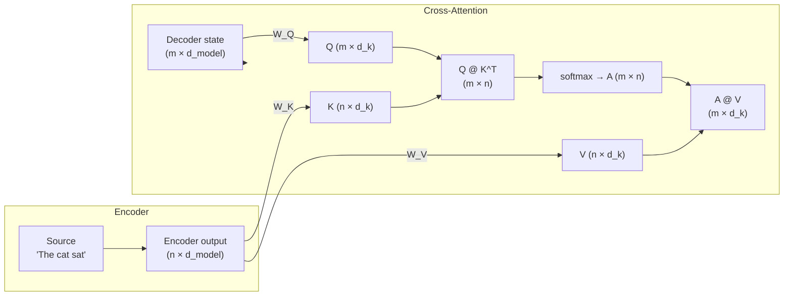
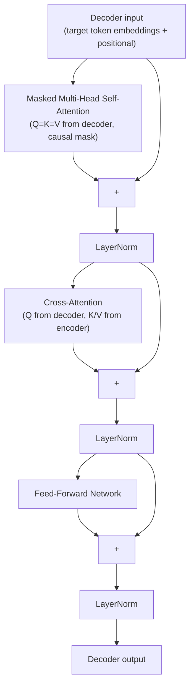

# Cross-attention in transformers

> **TL;DR.** Self-attention has Q, K, V all coming from the same sequence. Cross-attention has Q coming from the **decoder** and K, V coming from the **encoder** — that's the only difference. It's how the decoder asks the encoder, "of all the source tokens you encoded, which ones matter for the word I'm generating right now?" The resulting score matrix is **rectangular** (target_len × source_len), and the encoder output is computed once and reused at every decoder layer.

In a seq2seq transformer (translation, summarization, question answering), the encoder builds a complete representation of the input and the decoder generates the output. Cross-attention is the bridge: at each decoder layer, it lets the decoder query the encoder's output to selectively retrieve relevant source information for each generated token.

## Try it interactively

- **[Tensor2Tensor visualization Colab](https://colab.research.google.com/github/tensorflow/tensor2tensor/blob/master/tensor2tensor/notebooks/hello_t2t.ipynb)** — visualize cross-attention alignment heatmaps in a real translation model
- **[Hugging Face MarianMT](https://huggingface.co/docs/transformers/model_doc/marian)** — load a translation model and access `output_attentions=True` to inspect cross-attention weights
- **[BertViz](https://github.com/jessevig/bertviz)** — visualize cross-attention in T5 / BART
- **[BART summarization demo](https://huggingface.co/facebook/bart-large-cnn)** — try summarization (a perfect cross-attention use case) in your browser

## A real-world analogy

Imagine you're writing the **subtitle for a foreign film** in real time. The encoder is the team that watched the original (it has read the whole script and produced a rich set of "scene notes"). The decoder is you, typing the subtitles one word at a time. As you write each word, you don't re-read the whole script — you point at one or two scene notes that are most relevant *right now* and base your word on them. That pointing-and-querying is cross-attention. The decoder's question changes every word; the encoder's notes stay the same.

## One-line definition

Cross-attention is attention where queries come from the decoder's current state and keys/values come from the encoder's output — allowing each decoder position to dynamically look up which parts of the encoded source are relevant at each generation step.


*Source: [Jay Alammar — The Illustrated Transformer](https://jalammar.github.io/illustrated-transformer/)*

## Why this topic matters

Cross-attention is what gives encoder-decoder models their translation capability. The decoder doesn't have the source text as context — it only has what it has generated so far. Cross-attention is the mechanism that gives it access to source information on demand. Without cross-attention, a seq2seq model would be equivalent to a language model with no conditioning on the input.

## The mechanism

Given:
- Decoder hidden state at layer $\ell$: $H^{\ell}_{\text{dec}} \in \mathbb{R}^{m \times d_{\text{model}}}$ ($m$ = target length)
- Encoder output: $H_{\text{enc}} \in \mathbb{R}^{n \times d_{\text{model}}}$ ($n$ = source length)

Cross-attention computes:

$$
Q = H^{\ell}_{\text{dec}} W^Q, \quad K = H_{\text{enc}} W^K, \quad V = H_{\text{enc}} W^V
$$

$$
\text{CrossAttn} = \text{softmax}\!\left(\frac{QK^T}{\sqrt{d_k}}\right)V
$$

- $Q \in \mathbb{R}^{m \times d_k}$: decoder queries
- $K \in \mathbb{R}^{n \times d_k}$: encoder keys
- $V \in \mathbb{R}^{n \times d_k}$: encoder values
- Score matrix $\in \mathbb{R}^{m \times n}$: each decoder position scores against all encoder positions
- Output $\in \mathbb{R}^{m \times d_k}$: decoder representations enriched with source context

The output shape matches the decoder — the decoder sequence length is preserved, but each position now carries information retrieved from the encoder.

## Shape tracking

For batch=2, source length $n=10$, target length $m=7$, $d_{\text{model}}=512$, $d_k=64$:

| Step | Operation | Shape |
|---|---|---|
| Decoder state | $H_{\text{dec}}$ | $(2, 7, 512)$ |
| Encoder output | $H_{\text{enc}}$ | $(2, 10, 512)$ |
| Query projection | $Q = H_{\text{dec}} W^Q$ | $(2, 7, 64)$ |
| Key projection | $K = H_{\text{enc}} W^K$ | $(2, 10, 64)$ |
| Value projection | $V = H_{\text{enc}} W^V$ | $(2, 10, 64)$ |
| Cross-attention scores | $QK^T / \sqrt{d_k}$ | $(2, 7, 10)$ |
| Attention weights | softmax | $(2, 7, 10)$ |
| Output | $AV$ | $(2, 7, 64)$ |

Key observation: the score matrix is **rectangular** ($m \times n$), not square. Every decoder position can attend to every encoder position.



## What cross-attention learns: alignment

Cross-attention learns **alignment** between the source and target. For translation from English to French:

- When generating "chat" (French for "cat"), the cross-attention weights at that position should peak on the English token "cat"
- When generating "sur" (on), the weights should peak on "sat" or "on"
- When generating articles and function words, the weights may be more distributed

This alignment is fully learned — not hard-coded. It emerges from training on paired data.

```
Cross-attention weights for "The cat sat on the mat" → "Le chat était assis sur le tapis"

           The   cat   sat   on   the   mat
Le       [ 0.7  0.1   0.0  0.0   0.1  0.1 ]
chat     [ 0.1  0.8   0.0  0.0   0.0  0.1 ]
était    [ 0.0  0.0   0.7  0.1   0.1  0.1 ]
assis    [ 0.0  0.1   0.6  0.2   0.1  0.0 ]
sur      [ 0.0  0.0   0.1  0.8   0.0  0.1 ]
le       [ 0.1  0.0   0.0  0.0   0.6  0.3 ]
tapis    [ 0.0  0.1   0.0  0.0   0.1  0.8 ]
```

## Cross-attention in the decoder block structure

Each decoder layer contains three sublayers (all with residual connections and LayerNorm):



Note: the encoder output $H_{\text{enc}}$ is computed **once** and reused at all $N$ decoder layers. Each decoder layer has its own $W^Q$, $W^K$, $W^V$ projections for cross-attention.

## Python code: full implementation

```python
import torch
import torch.nn as nn
import torch.nn.functional as F
import math


class CrossAttention(nn.Module):
    """
    Multi-head cross-attention.
    Queries from decoder, keys/values from encoder.
    """

    def __init__(self, d_model: int, num_heads: int, dropout: float = 0.1):
        super().__init__()
        assert d_model % num_heads == 0
        self.num_heads = num_heads
        self.d_k = d_model // num_heads

        self.W_Q = nn.Linear(d_model, d_model, bias=False)  # decoder → Q
        self.W_K = nn.Linear(d_model, d_model, bias=False)  # encoder → K
        self.W_V = nn.Linear(d_model, d_model, bias=False)  # encoder → V
        self.W_O = nn.Linear(d_model, d_model, bias=False)  # output projection
        self.dropout = nn.Dropout(dropout)

    def forward(
        self,
        decoder_state: torch.Tensor,   # (batch, tgt_len, d_model)
        encoder_output: torch.Tensor,  # (batch, src_len, d_model)
        src_key_padding_mask: torch.Tensor = None,  # (batch, src_len) True=pad
    ) -> tuple[torch.Tensor, torch.Tensor]:
        """
        Returns:
            output:       (batch, tgt_len, d_model)
            attn_weights: (batch, tgt_len, src_len)
        """
        batch = decoder_state.size(0)
        tgt_len = decoder_state.size(1)
        src_len = encoder_output.size(1)

        # Project
        Q = self.W_Q(decoder_state)    # (batch, tgt_len, d_model)
        K = self.W_K(encoder_output)   # (batch, src_len, d_model)
        V = self.W_V(encoder_output)   # (batch, src_len, d_model)

        # Split into heads: (batch, heads, seq_len, d_k)
        def split_heads(t, seq_len):
            return t.reshape(batch, seq_len, self.num_heads, self.d_k).transpose(1, 2)

        Q = split_heads(Q, tgt_len)   # (batch, h, tgt_len, d_k)
        K = split_heads(K, src_len)   # (batch, h, src_len, d_k)
        V = split_heads(V, src_len)   # (batch, h, src_len, d_k)

        # Cross-attention scores: (batch, h, tgt_len, src_len)
        scores = Q @ K.transpose(-2, -1) / math.sqrt(self.d_k)

        # Mask padding positions in the source
        if src_key_padding_mask is not None:
            # (batch, 1, 1, src_len) — broadcast over heads and tgt positions
            mask = src_key_padding_mask.unsqueeze(1).unsqueeze(2)
            scores = scores.masked_fill(mask, float("-inf"))

        attn = F.softmax(scores, dim=-1)
        attn = torch.nan_to_num(attn, nan=0.0)
        attn = self.dropout(attn)

        # Weighted values
        x = attn @ V   # (batch, h, tgt_len, d_k)

        # Merge heads: (batch, tgt_len, d_model)
        x = x.transpose(1, 2).reshape(batch, tgt_len, -1)

        # Output projection
        output = self.W_O(x)

        # Average attention weights across heads for interpretability
        avg_attn = attn.mean(dim=1)   # (batch, tgt_len, src_len)
        return output, avg_attn


# ============================================================
# Demo
# ============================================================
d_model, num_heads = 64, 8
batch = 2
src_len = 10   # English sentence length
tgt_len = 7    # French sentence length (being generated)

cross_attn = CrossAttention(d_model=d_model, num_heads=num_heads)

encoder_output = torch.randn(batch, src_len, d_model)
decoder_state = torch.randn(batch, tgt_len, d_model)

# No padding
output, attn_weights = cross_attn(decoder_state, encoder_output)
print(f"Cross-attn output shape:  {output.shape}")       # (2, 7, 64)
print(f"Attention weights shape:  {attn_weights.shape}") # (2, 7, 10)

# With source padding (last 2 source positions are padding)
src_ids = torch.ones(batch, src_len, dtype=torch.long)
src_ids[:, -2:] = 0   # padding token ID = 0
padding_mask = (src_ids == 0)   # (2, 10)

output_masked, attn_masked = cross_attn(decoder_state, encoder_output, padding_mask)
print(f"\nWith padding mask:")
print(f"Attention to padded positions (should be ~0): {attn_masked[0, :, -1].mean():.6f}")


# Using PyTorch's nn.MultiheadAttention for cross-attention
mha = nn.MultiheadAttention(embed_dim=64, num_heads=8, batch_first=True)

# Cross-attention: query from decoder, key/value from encoder
cross_out, cross_weights = mha(
    query=decoder_state,
    key=encoder_output,
    value=encoder_output,
)
print(f"\nPyTorch built-in cross-attn: {cross_out.shape}")  # (2, 7, 64)
print(f"Weight matrix shape:         {cross_weights.shape}") # (2, 7, 10)
```

### Try it yourself: experiments

| Question | Try this |
|----------|----------|
| Visualize the alignment | After training a tiny translation model, `plt.imshow(attn_weights[0].detach())` — diagonal-ish alignment |
| Effect of source length on memory | Time the forward pass for src_len in `[10, 100, 1000]` — linear in src_len for cross-attention |
| What if you swap Q and K/V sources? | Use encoder for Q and decoder for K/V — model can no longer translate |
| Caching K, V at inference | Precompute `K = encoder_out @ W_K, V = encoder_out @ W_V` once per source — same answer, much faster |
| Ablation: skip cross-attention | Set its output to zero — model degrades to "language model that ignores the source" |

## Cross-attention vs. self-attention: key differences

| Property | Self-attention | Cross-attention |
|---|---|---|
| Q source | Same as K/V | Decoder state |
| K/V source | Same as Q | Encoder output |
| Score matrix shape | Square $(n \times n)$ | Rectangular $(m \times n)$ |
| Can apply causal mask? | Yes (decoder) or no (encoder) | No — decoder can attend to all source positions |
| Computed once per sequence? | Every layer | K/V fixed (from encoder), Q changes each layer |

## Why cross-attention doesn't use a causal mask

The source sequence is already complete and fixed when decoding begins. There is no notion of "future source tokens" — the entire source is known. Each decoder position should be free to attend to any source position to find the most relevant information. Masking source positions would only hurt the quality of information retrieval.

## Cross-references

- **Prerequisite:** [69 — Attention for Seq2Seq](./69-attention-mechanism-for-seq2seq-models.md) — Bahdanau attention, the conceptual ancestor
- **Prerequisite:** [76 — Why Self-Attention](./76-why-self-attention-is-called-self-attention.md) — comparison of self vs cross
- **Prerequisite:** [81 — Masked Self-Attention](./81-masked-self-attention-in-the-transformer-decoder.md) — the *first* attention sublayer in each decoder block
- **Follow-up:** [83 — Transformer Decoder Architecture](./83-transformer-decoder-architecture.md) — where this fits in the full decoder
- **Follow-up:** [89 — T5 Encoder-Decoder Pretraining](./89-t5-encoder-decoder-pretraining.md) — the most prominent modern use of cross-attention

## Interview questions

<details>
<summary>How does cross-attention differ from self-attention mechanically?</summary>

In self-attention, Q, K, and V all come from the same sequence — the sequence attends to itself. In cross-attention, Q is computed from one sequence (decoder state) while K and V are computed from a different sequence (encoder output). The attention score matrix is $(m \times n)$ where $m$ is the decoder length and $n$ is the encoder length. Each of the $m$ decoder positions can attend to all $n$ encoder positions, retrieving relevant source information for each generation step.
</details>

<details>
<summary>Why is the encoder output reused at every decoder layer instead of being recomputed?</summary>

The encoder output $H_{\text{enc}}$ is a fixed representation of the source — it does not change across decoder layers or time steps. Computing it once and reusing it saves computation proportional to the number of decoder layers. The K and V projections from the encoder output are often precomputed and cached before decoding begins: $K_\ell = H_{\text{enc}} W^K_\ell$ and $V_\ell = H_{\text{enc}} W^V_\ell$ for each decoder layer $\ell$. This is especially important for efficient inference.
</details>

<details>
<summary>What does the cross-attention weight matrix reveal about the model?</summary>

The cross-attention weight matrix $A \in \mathbb{R}^{m \times n}$ shows the alignment between target and source positions. For a well-trained translation model, row $t$ (the weights for generating target token $t$) should have high weight on the source token(s) that were translated into target token $t$. This emergent alignment — learned purely from training on paired data with no explicit supervision — is one of the most interpretable outputs of a seq2seq transformer.
</details>

## Common mistakes

- Swapping Q and K/V sources — if the encoder provides Q and the decoder provides K/V, the decoder cannot attend to source information
- Not caching encoder K/V projections during inference — computing them at every decoding step wastes $O(n \times d)$ computation per step per layer
- Applying a causal mask to cross-attention — there are no future source positions to hide; masking hurts performance
- Assuming all transformers have cross-attention — decoder-only models (GPT, LLaMA) have no encoder and therefore no cross-attention layer

## Final takeaway

Cross-attention is how a seq2seq transformer bridges encoder and decoder. Decoder queries retrieve source-conditioned information from encoder keys and values. The resulting rectangular attention weight matrix is the model's learned alignment. Without cross-attention, the decoder would have no access to the source and could only generate based on what it has already produced — a language model, not a conditional generator.

## References

- Vaswani, A., et al. (2017). Attention is All You Need. NeurIPS.
- Bahdanau, D., et al. (2015). Neural Machine Translation by Jointly Learning to Align and Translate.
- Raffel, C., et al. (2020). Exploring the Limits of Transfer Learning with T5. JMLR.
