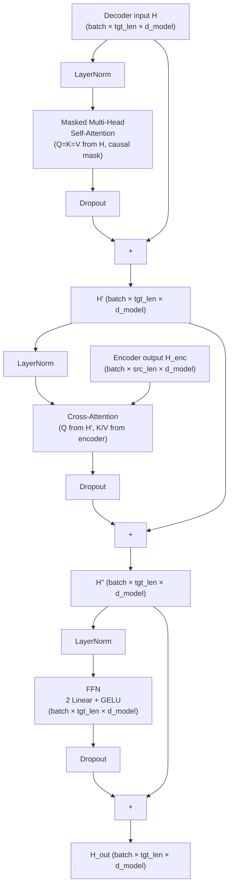
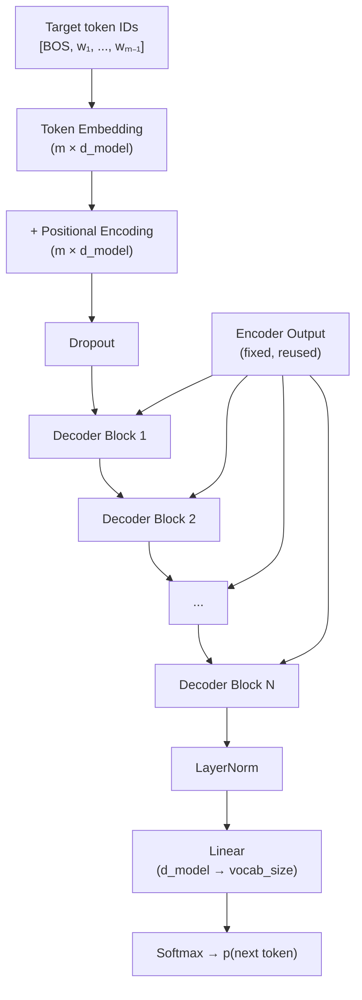

# Transformer decoder architecture

> **TL;DR.** A decoder block is what an encoder block becomes when (1) you add a causal mask to its self-attention so it can't peek at future tokens, and (2) you slip a second attention sublayer in between — *cross-attention* — that lets the decoder read the encoder's output. So an encoder block has 2 sublayers (self-attn + FFN); a decoder block has 3 (masked self-attn + cross-attn + FFN). Decoder-only models like GPT drop the cross-attention and revert to 2 sublayers but with the causal mask still in place.

The transformer encoder takes a full input and produces contextual representations. The transformer decoder generates an output sequence token by token, conditioned on both its own previous output and (in seq2seq models) the encoder's representation of the input. This note covers the full decoder architecture — three sublayers, their interactions, and how the architecture differs between encoder-decoder and decoder-only variants.

## Try it interactively

- **[Transformer Explainer](https://poloclub.github.io/transformer-explainer/)** — step through GPT-2 (decoder-only), see masked self-attention in action
- **[bbycroft LLM Visualization](https://bbycroft.net/llm)** — animated 3D walk through every component of a decoder
- **[Hugging Face MarianMT](https://huggingface.co/docs/transformers/model_doc/marian)** — load an encoder-decoder translation model and inspect both attention types
- **[Karpathy — Let's build GPT (YouTube)](https://www.youtube.com/watch?v=kCc8FmEb1nY)** — implements a complete decoder-only transformer from scratch
- **[Hugging Face BART](https://huggingface.co/facebook/bart-large)** — a classic encoder-decoder; play with summarization to see both stacks at work

## A real-world analogy

Continuing the workshop analogy from the encoder note: if the encoder is a group of subject-matter experts who summarize a topic together, the decoder is a **panel of speakers giving a presentation** based on that summary.

- Each speaker can hear what other speakers have already said (masked self-attention — but only past speakers, never future ones).
- They can also peek at the experts' notes whenever they want (cross-attention to the encoder).
- They polish what they want to say (the FFN) before speaking the next word.

The "panel speakers can't see future panel speakers" rule is the causal mask. The "they can read the experts' notes" channel is cross-attention. In a GPT-style decoder-only model there are no separate experts — the speakers reference each other and an opening prompt.

## One-line definition

The transformer decoder is a stack of $N$ identical blocks, each containing masked multi-head self-attention (causal), cross-attention over the encoder output, and a feed-forward sublayer — transforming target embeddings into output token distributions conditioned on the source.


*Source: [Jay Alammar — The Illustrated Transformer](https://jalammar.github.io/illustrated-transformer/)*

## Why this topic matters

The decoder is what makes transformers generative. Understanding its architecture explains how GPT generates text, how a translation model produces output, and why the decoder is more complex than the encoder. Every large language model deployed today — GPT, LLaMA, Claude, Gemini — is either a full decoder or a decoder-only transformer.

## Inside one decoder block

Each decoder block has **three sublayers**, each wrapped with a residual connection and LayerNorm:

**Sublayer 1 — Masked multi-head self-attention (causal):**

$$
H' = H + \text{MaskedMHA}(\text{LayerNorm}(H))
$$

- Q, K, V all from decoder input $H$
- Causal mask prevents attending to future positions
- Builds a representation of what has been generated so far

**Sublayer 2 — Cross-attention (encoder-decoder attention):**

$$
H'' = H' + \text{CrossAttn}(\text{LayerNorm}(H'),\ H_{\text{enc}})
$$

- Q from decoder $H'$, K and V from encoder output $H_{\text{enc}}$
- No mask — decoder can attend to all source positions
- Retrieves relevant source information for each generated position

**Sublayer 3 — Feed-forward network:**

$$
H_{\text{out}} = H'' + \text{FFN}(\text{LayerNorm}(H''))
$$

- Applied independently at each position
- Intermediate dimension $4 \times d_{\text{model}}$ (same as encoder FFN)



## Dimension tracking through a decoder block

For $d_{\text{model}} = 512$, $h = 8$ heads, src len $n = 10$, tgt len $m = 7$, batch = 2:

| Step | Shape |
|---|---|
| Decoder input $H$ | $(2, 7, 512)$ |
| After masked self-attention | $(2, 7, 512)$ |
| After cross-attention | $(2, 7, 512)$ |
| After FFN | $(2, 7, 512)$ |
| Encoder output $H_{\text{enc}}$ | $(2, 10, 512)$ |
| Cross-attention score matrix | $(2, 7, 10)$ — rectangular |

The decoder output always has the same shape as the decoder input: $(batch, tgt\_len, d_{\text{model}})$.

## The full decoder stack



## Encoder-decoder vs. decoder-only

Modern LLMs have diverged from the original encoder-decoder transformer. Understanding the difference is essential:

| Property | Encoder-Decoder | Decoder-Only |
|---|---|---|
| Examples | T5, BART, mT5, MarianMT | GPT, LLaMA, Claude, Gemini |
| Encoder present? | Yes | No |
| Cross-attention? | Yes | No |
| Sublayers per block | 3 (masked SA + cross-attn + FFN) | 2 (causal SA + FFN) |
| Input conditioning | Via cross-attention | Via prefix/prompt in same sequence |
| Training objective | Seq-to-seq (span corruption, denoising) | Causal language modeling |
| Best for | Translation, summarization | Open-ended generation, reasoning, chat |

**Decoder-only simplification**: No encoder, no cross-attention. The prompt and response are concatenated into a single sequence. The causal mask allows the prompt to influence response tokens but not vice versa.

## The output projection (LM head)

After the final decoder block and LayerNorm, a linear layer projects to vocabulary logits:

$$
\text{logits} = H_{\text{out}} W^{\text{vocab}} \in \mathbb{R}^{m \times |\text{vocab}|}
$$

where $W^{\text{vocab}} \in \mathbb{R}^{d_{\text{model}} \times |\text{vocab}|}$. For BERT vocabulary size 30,522 and $d_{\text{model}} = 512$: this linear layer has $512 \times 30522 \approx 15.6$M parameters.

Training loss — cross-entropy at each position:

$$
\mathcal{L} = -\frac{1}{m}\sum_{t=1}^{m} \log p_\theta(x_t \mid x_{<t})
$$

## Python code: complete decoder implementation

```python
import torch
import torch.nn as nn
import math


class DecoderBlock(nn.Module):
    """
    One transformer decoder block with pre-norm.
    Three sublayers: masked self-attention, cross-attention, FFN.
    """

    def __init__(self, d_model: int, num_heads: int, dim_feedforward: int,
                 dropout: float = 0.1):
        super().__init__()
        self.norm1 = nn.LayerNorm(d_model)
        self.norm2 = nn.LayerNorm(d_model)
        self.norm3 = nn.LayerNorm(d_model)

        # Masked self-attention (causal)
        self.self_attn = nn.MultiheadAttention(
            embed_dim=d_model, num_heads=num_heads,
            dropout=dropout, batch_first=True,
        )
        # Cross-attention (decoder queries encoder output)
        self.cross_attn = nn.MultiheadAttention(
            embed_dim=d_model, num_heads=num_heads,
            dropout=dropout, batch_first=True,
        )
        # Feed-forward
        self.ffn = nn.Sequential(
            nn.Linear(d_model, dim_feedforward),
            nn.GELU(),
            nn.Dropout(dropout),
            nn.Linear(dim_feedforward, d_model),
            nn.Dropout(dropout),
        )

    def forward(
        self,
        tgt: torch.Tensor,                        # (batch, tgt_len, d_model)
        memory: torch.Tensor,                     # (batch, src_len, d_model) encoder output
        tgt_mask: torch.Tensor = None,            # causal mask (tgt_len, tgt_len)
        tgt_key_padding_mask: torch.Tensor = None,  # (batch, tgt_len) True=pad
        memory_key_padding_mask: torch.Tensor = None,  # (batch, src_len) True=pad
    ) -> torch.Tensor:
        """Returns: (batch, tgt_len, d_model)"""
        # Sublayer 1: masked self-attention
        tgt2, _ = self.self_attn(
            self.norm1(tgt), self.norm1(tgt), self.norm1(tgt),
            attn_mask=tgt_mask,
            key_padding_mask=tgt_key_padding_mask,
        )
        tgt = tgt + tgt2

        # Sublayer 2: cross-attention (Q from tgt, K/V from memory)
        tgt2, _ = self.cross_attn(
            self.norm2(tgt),   # queries: decoder state
            memory,            # keys:    encoder output
            memory,            # values:  encoder output
            key_padding_mask=memory_key_padding_mask,
        )
        tgt = tgt + tgt2

        # Sublayer 3: feed-forward
        tgt = tgt + self.ffn(self.norm3(tgt))

        return tgt


class TransformerDecoder(nn.Module):
    """
    Full seq2seq decoder: embedding + positional + N × DecoderBlock + final LM head.
    """

    def __init__(self, vocab_size: int, d_model: int, num_heads: int,
                 num_layers: int, dim_feedforward: int, max_len: int = 512,
                 dropout: float = 0.1):
        super().__init__()
        self.token_emb = nn.Embedding(vocab_size, d_model, padding_idx=0)
        self.pos_emb = nn.Embedding(max_len, d_model)
        self.dropout = nn.Dropout(dropout)
        self.blocks = nn.ModuleList([
            DecoderBlock(d_model, num_heads, dim_feedforward, dropout)
            for _ in range(num_layers)
        ])
        self.norm = nn.LayerNorm(d_model)
        self.lm_head = nn.Linear(d_model, vocab_size, bias=False)

        # Weight tying: lm_head shares weights with token embedding (common trick)
        self.lm_head.weight = self.token_emb.weight

        nn.init.normal_(self.token_emb.weight, std=0.02)
        nn.init.normal_(self.pos_emb.weight, std=0.02)

    def forward(
        self,
        tgt_ids: torch.Tensor,     # (batch, tgt_len)
        memory: torch.Tensor,      # (batch, src_len, d_model)
        tgt_mask: torch.Tensor = None,
        tgt_padding_mask: torch.Tensor = None,
        src_padding_mask: torch.Tensor = None,
    ) -> torch.Tensor:
        """Returns logits: (batch, tgt_len, vocab_size)"""
        batch, tgt_len = tgt_ids.shape
        positions = torch.arange(tgt_len, device=tgt_ids.device).unsqueeze(0)

        x = self.dropout(self.token_emb(tgt_ids) + self.pos_emb(positions))

        for block in self.blocks:
            x = block(
                x, memory,
                tgt_mask=tgt_mask,
                tgt_key_padding_mask=tgt_padding_mask,
                memory_key_padding_mask=src_padding_mask,
            )

        x = self.norm(x)
        return self.lm_head(x)   # (batch, tgt_len, vocab_size)


# ============================================================
# Demo: seq2seq setup (e.g., translation)
# ============================================================
vocab_size = 30000
d_model, num_heads, num_layers = 512, 8, 6
dim_feedforward = 2048
batch, src_len, tgt_len = 2, 15, 10

decoder = TransformerDecoder(
    vocab_size=vocab_size, d_model=d_model, num_heads=num_heads,
    num_layers=num_layers, dim_feedforward=dim_feedforward,
)

# Simulated encoder output (in practice, comes from the encoder)
encoder_output = torch.randn(batch, src_len, d_model)

# Target token IDs (shifted right: starts with BOS)
tgt_ids = torch.randint(1, vocab_size, (batch, tgt_len))

# Causal mask for target
tgt_mask = nn.Transformer.generate_square_subsequent_mask(tgt_len)

# Forward pass
logits = decoder(tgt_ids, encoder_output, tgt_mask=tgt_mask)
print(f"Encoder output shape:  {encoder_output.shape}")   # (2, 15, 512)
print(f"Target input shape:    {tgt_ids.shape}")           # (2, 10)
print(f"Decoder logits shape:  {logits.shape}")            # (2, 10, 30000)

probs = logits.softmax(dim=-1)
print(f"Next-token probs sum:  {probs[0, 0].sum():.4f}")   # 1.0000

param_count = sum(p.numel() for p in decoder.parameters())
print(f"Decoder parameters:    {param_count:,}")


# ============================================================
# Decoder-only (GPT-style): no encoder, no cross-attention
# ============================================================
class DecoderOnlyBlock(nn.Module):
    """Decoder-only block: only causal self-attention + FFN. No cross-attention."""

    def __init__(self, d_model, num_heads, dim_feedforward, dropout=0.1):
        super().__init__()
        self.norm1 = nn.LayerNorm(d_model)
        self.norm2 = nn.LayerNorm(d_model)
        self.attn = nn.MultiheadAttention(d_model, num_heads, dropout=dropout, batch_first=True)
        self.ffn = nn.Sequential(
            nn.Linear(d_model, dim_feedforward),
            nn.GELU(),
            nn.Dropout(dropout),
            nn.Linear(dim_feedforward, d_model),
        )

    def forward(self, x, causal_mask=None):
        x2, _ = self.attn(self.norm1(x), self.norm1(x), self.norm1(x), attn_mask=causal_mask)
        x = x + x2
        x = x + self.ffn(self.norm2(x))
        return x


# GPT-style: 2 layers, process prompt of 8 tokens
gpt_block = nn.Sequential(*[DecoderOnlyBlock(64, 8, 256) for _ in range(2)])
seq_len = 8
x_gpt = torch.randn(1, seq_len, 64)
causal = nn.Transformer.generate_square_subsequent_mask(seq_len)
# nn.Sequential doesn't pass extra args — call manually
out = x_gpt
for block in gpt_block:
    out = block(out, causal)
print(f"\nDecoder-only output: {out.shape}")   # (1, 8, 64)
```

### Try it yourself: experiments

| Question | Try this |
|----------|----------|
| Is the decoder bigger than the encoder? | Compare param counts — decoder has 3 sublayers per block vs encoder's 2; ~50% more params per layer |
| What if you swap mask order? | Apply causal mask to cross-attention (wrong) — model can't see "future" source tokens, hurts quality |
| Compare seq2seq vs decoder-only on translation | Train both on the same translation pair; encoder-decoder usually wins on short, well-aligned tasks |
| Effect of weight tying | Toggle `lm_head.weight = token_emb.weight` — saves ~30% of parameters with little quality loss |
| Inspect cross-attention heatmap | After training, plot `cross_weights[0]` — should show source→target alignment |

## Comparison: encoder block vs. decoder block

| | Encoder block | Decoder block |
|---|---|---|
| Sublayers | 2 (self-attn + FFN) | 3 (masked SA + cross-attn + FFN) |
| Self-attention mask | None (bidirectional) | Causal mask |
| Cross-attention | No | Yes (to encoder output) |
| Input | Source tokens | Target tokens (shifted right) |
| Output | Contextual representations | Contextualized target reps |
| Used for | Understanding | Generation |

## Cross-references

- **Prerequisite:** [80 — Transformer Encoder Architecture](./80-transformer-encoder-architecture.md) — the encoder counterpart with 2 sublayers
- **Prerequisite:** [81 — Masked Self-Attention](./81-masked-self-attention-in-the-transformer-decoder.md) — first sublayer of every decoder block
- **Prerequisite:** [82 — Cross-Attention](./82-cross-attention-in-transformers.md) — second sublayer (skipped in decoder-only models)
- **Follow-up:** [84 — Transformer Inference](./84-transformer-inference-step-by-step.md) — how the decoder generates tokens at inference
- **Follow-up:** [88 — GPT (Decoder-Only)](./88-gpt-decoder-only-causal-lm.md) — the simplified 2-sublayer variant
- **Follow-up:** [89 — T5 (Encoder-Decoder)](./89-t5-encoder-decoder-pretraining.md) — the full 3-sublayer variant in production

## Interview questions

<details>
<summary>Why does the decoder have three sublayers while the encoder has two?</summary>

The encoder only needs to build contextual representations of the source — self-attention and FFN suffice. The decoder must do two things: (1) maintain context of what it has generated so far (masked self-attention), and (2) condition on the source input (cross-attention). The third sublayer is the cross-attention that bridges decoder context with encoder memory. Decoder-only models drop the cross-attention and return to two sublayers, using the prompt as a prefix in the same sequence instead.
</details>

<details>
<summary>What is the role of the causal mask in the decoder's self-attention?</summary>

The decoder is trained to predict target tokens at all positions simultaneously using teacher forcing. Without masking, position $t$ can see the correct target token at position $t+1$, making prediction trivial and training useless. The causal mask sets scores for positions $j > i$ to $-\infty$, so those positions get zero attention weight. This enforces the autoregressive constraint during training, making it identical to the inference regime where future tokens don't exist yet.
</details>

<details>
<summary>In a decoder-only model like GPT, how does the model condition on the prompt if there's no encoder?</summary>

The prompt and response are concatenated into a single sequence. The model processes both with causal self-attention. Because the mask is lower-triangular, response tokens can attend to all prompt tokens (they come earlier in the sequence), but prompt tokens cannot see the response. This gives response tokens full access to the prompt context without any explicit encoding step. The tradeoff: the prompt is re-processed at every generation step (or cached with KV cache), whereas in encoder-decoder models it is encoded once.
</details>

## Common mistakes

- Confusing the two decoder attention types — masked self-attention (tgt attends to tgt, causal) vs. cross-attention (tgt queries attend to enc memory)
- Forgetting that cross-attention Q comes from the decoder but K/V come from the encoder — mixing them up produces incorrect shapes
- Using `nn.TransformerDecoder` without passing the `memory` argument — cross-attention has nothing to attend to and will error
- Assuming decoder-only models don't use masking — they still use causal self-attention masks

## Final takeaway

The transformer decoder generates output by stacking three sublayers: masked self-attention (builds causal target context), cross-attention (retrieves source information), and FFN (transforms each position). Encoder-decoder models use all three; decoder-only models drop cross-attention and condition on the prompt via prefix. $N$ decoder blocks refine the target representation, and a final linear projection converts it to vocabulary logits for next-token prediction.

## References

- Vaswani, A., et al. (2017). Attention is All You Need. NeurIPS.
- Radford, A., et al. (2018). Improving Language Understanding by Generative Pre-Training (GPT).
- Raffel, C., et al. (2020). Exploring the Limits of Transfer Learning with a Unified Text-to-Text Transformer (T5). JMLR.
