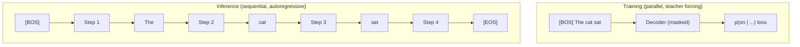
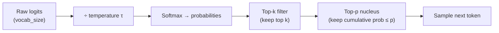
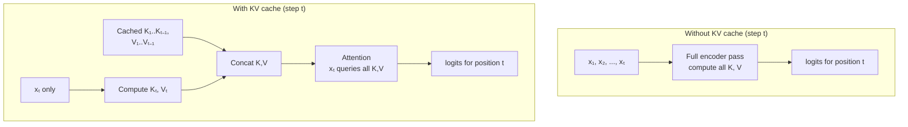

# Transformer inference step by step

Training a transformer uses teacher forcing: the decoder sees the ground-truth prefix at every step in parallel. Inference is different — the model must generate tokens one at a time, each step feeding its own previous output back as input. This autoregressive loop is the fundamental regime of all text generation.

## One-line definition

Transformer inference is an autoregressive process: at each step, the model conditions on all previously generated tokens to produce a probability distribution over the vocabulary, picks the next token, appends it, and repeats until the end-of-sequence token is reached.


*Source: [Jay Alammar — The Illustrated Transformer](https://jalammar.github.io/illustrated-transformer/)*

## Why this topic matters

Inference mechanics explain why language models behave the way they do in practice. Greedy decoding produces repetitive text; beam search balances quality and diversity; temperature and top-p sampling control creativity. KV caching is why modern LLMs can generate hundreds of tokens per second despite recomputing attention at every step. Understanding these details is essential for deploying and debugging generation systems.

## Training vs. inference: teacher forcing vs. autoregression

During **training**, the decoder processes the full target sequence in parallel using teacher forcing:

$$
\mathcal{L} = -\sum_{t=1}^{T} \log p_\theta(x_t \mid x_1, \ldots, x_{t-1})
$$

The ground-truth tokens $x_1, \ldots, x_{t-1}$ are fed as input; the model predicts all positions simultaneously using the causal mask.

During **inference**, the model has no ground-truth prefix. It starts with only the start token $\langle \text{BOS} \rangle$ and generates one token at a time:

$$
x_{t+1} \sim p_\theta(\cdot \mid x_1, x_2, \ldots, x_t)
$$

Each generated token is appended to the sequence and becomes part of the context for the next step.



## The autoregressive generation loop

```
Algorithm: Autoregressive generation

Input: encoder output (for seq2seq) or prompt token IDs
Output: generated token sequence

1. x = [BOS_TOKEN_ID]          # start with begin-of-sequence token
2. while len(x) < max_length:
3.     logits = model(x)[-1]   # get logits for last position: (vocab_size,)
4.     next_id = decode(logits) # apply decoding strategy
5.     x.append(next_id)
6.     if next_id == EOS_TOKEN_ID:
7.         break
8. return x[1:]                 # strip BOS, return generated tokens
```

At each step, only the last position's logits matter — the model predicts only $x_{t+1}$, not all positions.

## Decoding strategies

### Greedy decoding

Always pick the highest-probability token:

$$
x_{t+1} = \arg\max_v p_\theta(v \mid x_{\leq t})
$$

**Advantage**: fast, deterministic.  
**Disadvantage**: tends to produce repetitive or suboptimal sequences. Locally optimal choices can lead to globally poor outputs ("the cat sat on the cat sat on...").

### Beam search

Maintain the top $B$ candidate sequences (beams) at each step, expand each by one token, keep the top $B$ by cumulative log-probability:

$$
\text{score}(x_{1:t}) = \sum_{i=1}^{t} \log p_\theta(x_i \mid x_{<i})
$$

**Advantage**: considers multiple hypotheses; usually better output quality than greedy.  
**Disadvantage**: $B$ times more computation; tends to produce generic, safe text; degrades in open-ended generation.

Beam search is standard for translation and summarization ($B = 4$ or $B = 5$); less suitable for creative generation.

### Temperature sampling

Scale logits by temperature $\tau$ before softmax:

$$
p_\tau(v) = \frac{\exp(z_v / \tau)}{\sum_{v'} \exp(z_{v'} / \tau)}
$$

- $\tau = 1$: unmodified distribution
- $\tau < 1$ (e.g., 0.7): sharper distribution — more confident, less diverse
- $\tau > 1$ (e.g., 1.5): flatter distribution — more random, more creative
- $\tau \to 0$: approaches greedy decoding
- $\tau \to \infty$: approaches uniform random sampling

### Top-$k$ sampling

Sample only from the $k$ highest-probability tokens (zero out the rest):

$$
\tilde{p}(v) \propto p(v) \cdot \mathbb{1}[v \in \text{top-}k]
$$

Prevents the model from accidentally sampling from the long tail of nonsense tokens. GPT-2 defaults to $k = 50$.

### Top-$p$ (nucleus) sampling

Sample from the smallest set of tokens whose cumulative probability exceeds $p$:

$$
\mathcal{V}^{(p)} = \arg\min_{V' \subseteq V} \left\{ \sum_{v \in V'} p(v) \geq p \right\}
$$

The set $\mathcal{V}^{(p)}$ adapts in size: when the model is confident, the nucleus is small (1–3 tokens); when uncertain, the nucleus is large. Top-$p = 0.9$ is a common default that works better than fixed top-$k$.



## KV caching

Without caching, generating step $t$ requires recomputing keys and values for all $t-1$ previous tokens — $O(t^2)$ total work over the generation. KV caching stores computed key-value pairs from previous steps and only computes for the new token at each step.

**Without KV cache**: at step $t$, re-run the full forward pass on $x_{1:t}$. Cost per step: $O(t \cdot d)$. Total cost for $T$ tokens: $O(T^2 \cdot d)$.

**With KV cache**: at step $t$, compute $K_t$ and $V_t$ only for the new token, concatenate with cached $K_{1:t-1}$ and $V_{1:t-1}$, run attention. Cost per step: $O(t \cdot d)$ for attention but $O(d)$ for new key-value computation. The cache grows by one entry per step.



**Memory cost of KV cache**: for each layer, storing all keys and values for a sequence of length $T$ requires:

$$
\text{memory} = 2 \times n_{\text{layers}} \times n_{\text{heads}} \times T \times d_{\text{head}} \times \text{bytes\_per\_float}
$$

For a 7B-parameter model with 32 layers, 32 heads, $d_{\text{head}} = 128$, sequence length 4096, float16: ~2 GB per batch item. This is why context length directly limits batch size during inference.

## Stopping criteria

Generation stops when:
1. The model produces `[EOS]` (end-of-sequence token)
2. `max_new_tokens` is reached
3. A stop string is matched (e.g., `\n\n`, `</answer>`)

## Python code

### Complete autoregressive generation from scratch

```python
import torch
import torch.nn.functional as F


def greedy_decode(model, encoder_output, start_id: int, end_id: int,
                  max_len: int = 50, device: str = "cpu") -> list[int]:
    """
    Greedy decoding for a seq2seq transformer.
    Returns list of generated token IDs (excluding BOS, including EOS).
    """
    model.eval()
    generated = [start_id]

    with torch.no_grad():
        for _ in range(max_len):
            tgt = torch.tensor([generated], device=device)  # (1, current_len)

            # Build causal mask for current target length
            tgt_len = tgt.size(1)
            tgt_mask = torch.triu(
                torch.ones(tgt_len, tgt_len, device=device), diagonal=1
            ).bool()  # True = masked

            # Forward pass through decoder only (encoder output is cached)
            logits = model.decode(tgt, encoder_output, tgt_mask)  # (1, tgt_len, vocab)
            next_logits = logits[0, -1, :]  # logits for last position: (vocab,)

            # Greedy: pick the highest probability token
            next_id = next_logits.argmax().item()
            generated.append(next_id)

            if next_id == end_id:
                break

    return generated[1:]  # strip BOS


def temperature_sample(logits: torch.Tensor, temperature: float = 1.0,
                       top_k: int = 0, top_p: float = 1.0) -> int:
    """
    Sample next token with temperature, top-k, and top-p filtering.
    Args:
        logits:      (vocab_size,) raw logits
        temperature: scaling factor (1.0 = unmodified)
        top_k:       if > 0, keep only the top k tokens
        top_p:       nucleus sampling threshold (0.0–1.0)
    Returns:
        sampled token ID
    """
    # Apply temperature
    logits = logits / max(temperature, 1e-8)

    # Top-k filtering
    if top_k > 0:
        top_k = min(top_k, logits.size(-1))
        kth_val = logits.topk(top_k).values[-1]
        logits[logits < kth_val] = float("-inf")

    # Top-p (nucleus) filtering
    if top_p < 1.0:
        sorted_logits, sorted_indices = logits.sort(descending=True)
        cumulative_probs = sorted_logits.softmax(dim=-1).cumsum(dim=-1)
        # Remove tokens with cumulative probability above the threshold
        sorted_indices_to_remove = cumulative_probs - sorted_logits.softmax(dim=-1) > top_p
        sorted_logits[sorted_indices_to_remove] = float("-inf")
        logits[sorted_indices] = sorted_logits

    # Sample from the filtered distribution
    probs = F.softmax(logits, dim=-1)
    return torch.multinomial(probs, num_samples=1).item()


# ============================================================
# Demonstrate the decoding strategies
# ============================================================
torch.manual_seed(42)
vocab_size = 10
logits = torch.tensor([0.5, 1.2, 0.3, 2.1, 0.1, 0.8, 1.5, 0.2, 0.9, 0.4])

print("=== Greedy decoding ===")
greedy_id = logits.argmax().item()
print(f"Next token: {greedy_id}")  # Always token 3 (highest logit 2.1)

print("\n=== Temperature sampling (τ=0.7, τ=1.5) ===")
for tau in [0.7, 1.0, 1.5]:
    counts = {}
    for _ in range(2000):
        tid = temperature_sample(logits.clone(), temperature=tau)
        counts[tid] = counts.get(tid, 0) + 1
    top3 = sorted(counts.items(), key=lambda x: -x[1])[:3]
    print(f"  τ={tau}: most sampled tokens = {top3}")

print("\n=== Top-p sampling (p=0.9) ===")
counts = {}
for _ in range(2000):
    tid = temperature_sample(logits.clone(), temperature=1.0, top_p=0.9)
    counts[tid] = counts.get(tid, 0) + 1
print(f"  Sampled tokens: {sorted(counts.keys())}")
```

### KV cache in practice (GPT-style decoder-only)

```python
import torch
import torch.nn as nn


class CachedMultiHeadAttention(nn.Module):
    """
    Multi-head attention with KV cache support for inference.
    """

    def __init__(self, d_model: int, num_heads: int):
        super().__init__()
        self.num_heads = num_heads
        self.d_k = d_model // num_heads
        self.W_Q = nn.Linear(d_model, d_model, bias=False)
        self.W_K = nn.Linear(d_model, d_model, bias=False)
        self.W_V = nn.Linear(d_model, d_model, bias=False)
        self.W_O = nn.Linear(d_model, d_model, bias=False)

    def forward(self, x: torch.Tensor,
                past_kv: tuple[torch.Tensor, torch.Tensor] = None
                ) -> tuple[torch.Tensor, tuple[torch.Tensor, torch.Tensor]]:
        """
        Args:
            x:       (batch, 1, d_model)   — single new token at inference
            past_kv: (past_K, past_V) cached from previous steps
        Returns:
            output, (new_K, new_V)
        """
        batch, seq, _ = x.shape

        Q = self.W_Q(x)
        K = self.W_K(x)
        V = self.W_V(x)

        # Reshape to (batch, heads, seq, d_k)
        def split(t):
            return t.reshape(batch, seq, self.num_heads, self.d_k).transpose(1, 2)

        Q, K, V = split(Q), split(K), split(V)

        # Append new K, V to cache
        if past_kv is not None:
            past_K, past_V = past_kv
            K = torch.cat([past_K, K], dim=2)  # (batch, heads, past+1, d_k)
            V = torch.cat([past_V, V], dim=2)

        new_kv = (K, V)

        # Attention: query is only the new token, keys/values span all past tokens
        import math
        scores = Q @ K.transpose(-2, -1) / math.sqrt(self.d_k)  # (batch, heads, 1, past+1)
        attn = scores.softmax(dim=-1)
        out = attn @ V  # (batch, heads, 1, d_k)

        # Merge heads
        out = out.transpose(1, 2).reshape(batch, seq, -1)
        return self.W_O(out), new_kv


# Simulate 5-step generation with KV cache
d_model, num_heads, vocab_size = 64, 4, 100
attn = CachedMultiHeadAttention(d_model=d_model, num_heads=num_heads)
lm_head = nn.Linear(d_model, vocab_size)

generated = []
past_kv = None

for step in range(5):
    x = torch.randn(1, 1, d_model)   # in practice: embed the last generated token
    out, past_kv = attn(x, past_kv)
    logits = lm_head(out[:, -1, :])  # (1, vocab_size)
    next_id = logits.argmax(dim=-1).item()
    generated.append(next_id)
    K_shape = past_kv[0].shape  # (batch, heads, step+1, d_k)
    print(f"Step {step+1}: token={next_id}, KV cache shape={K_shape}")

print(f"Generated: {generated}")
```

## Comparison of decoding strategies

| Strategy | Deterministic? | Quality | Diversity | Speed | Use case |
|---|---|---|---|---|---|
| Greedy | Yes | Moderate | Low | Fastest | Quick baseline |
| Beam search ($B=5$) | Yes | High | Low | $B\times$ slower | Translation, summarization |
| Top-$k$ sampling | No | Good | Medium | Fast | Creative generation |
| Top-$p$ sampling | No | Good | Adaptive | Fast | Open-ended generation |
| Temperature + top-$p$ | No | Tunable | High | Fast | Chatbots, storytelling |

## Interview questions

<details>
<summary>Why can't you use teacher forcing during inference?</summary>

Teacher forcing feeds ground-truth tokens as context during training. During inference, there are no ground-truth tokens — you are generating them. The model must use its own previously generated tokens as context. This train/inference mismatch (called "exposure bias") means errors compound: if the model generates a wrong token, all subsequent tokens are conditioned on that error. Training techniques like scheduled sampling try to reduce this gap.
</details>

<details>
<summary>What is the difference between greedy decoding and beam search?</summary>

Greedy decoding picks the highest-probability token at each step — locally optimal but globally suboptimal. Beam search maintains $B$ candidate sequences and expands all of them at each step, keeping the top $B$ by cumulative log-probability. This explores more of the output space and generally produces higher-quality outputs for tasks with structured, correct answers (translation, summarization). However, beam search is $B$ times slower and tends to produce generic output for creative tasks.
</details>

<details>
<summary>What does KV caching speed up and how does it work?</summary>

Without caching, each new decoding step re-runs the full transformer on the entire sequence history — O(t) work per step, O(T²) total for T tokens. KV caching saves the key and value tensors computed in previous steps. At step t, only the new token's Q, K, V are computed; the new K and V are appended to the cache and full attention is run with the accumulated K, V. This reduces per-step computation for new tokens from O(t) to O(1) for key/value projection (though attention itself is still O(t) because the new query attends to all cached keys).
</details>

<details>
<summary>What is top-p sampling and why is it preferred over top-k?</summary>

Top-k sampling always keeps exactly k tokens regardless of the probability distribution. When the model is confident (one token has very high probability), k=50 includes many improbable tokens. When the model is uncertain (probability spread over hundreds of tokens), k=50 cuts off plausible options. Top-p (nucleus) sampling adapts: it keeps the smallest set of tokens whose cumulative probability reaches p. When the model is confident, the nucleus is small (1–3 tokens); when uncertain, the nucleus is large. This gives better calibration between quality and diversity.
</details>

## Common mistakes

- Calling `model(full_sequence)` at every step without KV caching — generates correctly but is $O(T^2)$ slower than necessary.
- Applying softmax twice — `F.cross_entropy` expects raw logits; `torch.multinomial` needs probabilities. Confusing these gives wrong sampling.
- Forgetting to set `model.eval()` during generation — dropout is active in training mode, giving different (stochastic) outputs each run.
- Using beam search for open-ended generation (chatbots, stories) — it degenerates to repetitive, safe text; top-p sampling is better.
- Not passing a causal mask when running the decoder for multi-token prompts — the prompt tokens must not attend to future positions.

## Final takeaway

Transformer inference is token-by-token autoregressive generation. The model predicts a probability distribution at each step, a decoding strategy (greedy, beam search, or sampling) selects the next token, and the loop continues until EOS. KV caching makes this efficient by reusing previously computed key-value pairs. The choice of decoding strategy — not just model quality — determines whether the output is repetitive, generic, or diverse and creative.

## References

- Vaswani, A., et al. (2017). Attention is All You Need. NeurIPS.
- Holtzman, A., et al. (2020). The Curious Case of Neural Text Degeneration. ICLR. (introduces nucleus/top-p sampling)
- Pope, R., et al. (2023). Efficiently Scaling Transformer Inference. MLSys.
