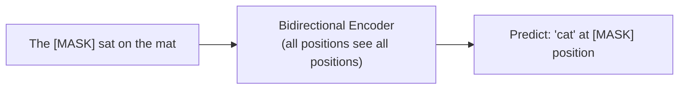
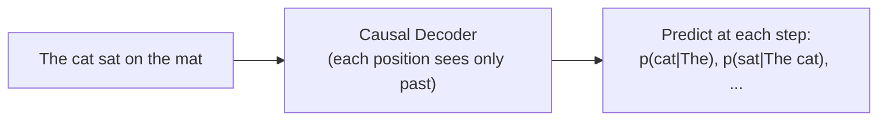
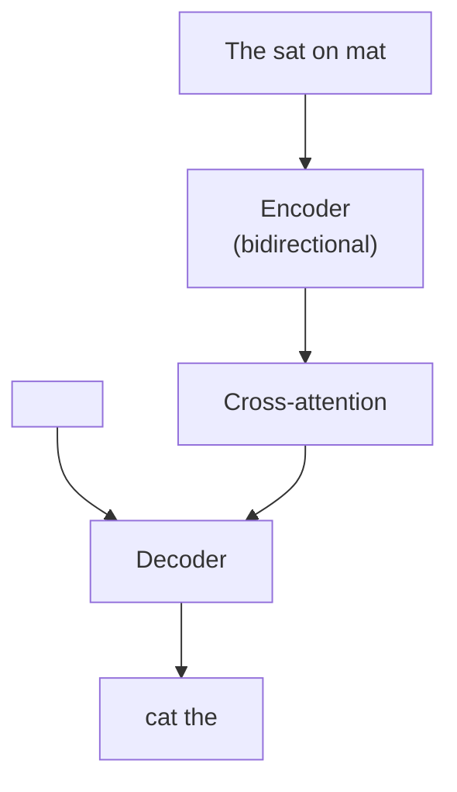

# Transformer training objectives

> **TL;DR.** Transformers learn from raw text by *hiding* part of it and predicting what was hidden. Three flavors dominate: **MLM** hides ~15% of random tokens and predicts them with bidirectional context (BERT, encoder-only). **CLM** predicts the next token from everything to the left (GPT, decoder-only). **Span corruption** hides contiguous *chunks* and asks an encoder-decoder model to regenerate them (T5). The objective is what *defines* the architecture — change the objective, change the model.

Transformers learn from unlabeled text by predicting parts of the text that have been hidden. The choice of what to hide and how to predict it defines the **training objective** — and this choice determines the architecture, the type of representations learned, and what downstream tasks the model is suited for.

## Try it interactively

- **[Hugging Face Fill-Mask widget](https://huggingface.co/bert-base-uncased)** — feed `"The [MASK] sat on the mat"` to a real BERT and see top-5 predictions
- **[OpenAI Tokenizer](https://platform.openai.com/tokenizer)** — see how GPT splits text and predicts the next token
- **[T5 demo](https://huggingface.co/google-t5/t5-base)** — try span infilling on text in your browser
- **[Karpathy — Let's build GPT (YouTube)](https://www.youtube.com/watch?v=kCc8FmEb1nY)** — implements the CLM training loop from scratch
- **[BertViz Fill-Mask](https://github.com/jessevig/bertviz)** — visualize which tokens BERT looks at when predicting a masked one

## A real-world analogy

Three different ways to learn a language by playing **fill-in-the-blank**:

- **MLM (BERT)**: A teacher gives you a sentence with random *single words* hidden (`"The ___ sat on the ___"`). You can read everything before AND after each blank, then guess. You learn rich understanding because every blank gives you full surrounding context.
- **CLM (GPT)**: The teacher reveals the sentence one word at a time, asking you to predict the next one each time. You only ever see what came before. You learn to *generate* — you have to know what plausibly comes next, which is exactly what a writer does.
- **Span corruption (T5)**: The teacher hides whole *phrases* (`"The ___ on the ___"`) and asks you to fill in each phrase. You see everything around the blanks bidirectionally (encoder), then write out the full missing chunks (decoder). It's a hybrid: understand globally, generate locally.

## One-line definition

A transformer pre-training objective defines what the model must predict from what context: masked language modeling predicts random masked tokens bidirectionally, causal language modeling predicts the next token left-to-right, and span corruption predicts multiple masked spans in a seq2seq format.

![BERT masked language modeling — some tokens are replaced with [MASK]; the bidirectional encoder must predict them using context from both sides](https://jalammar.github.io/images/BERT-language-modeling-masked-lm.png)
*Source: [Jay Alammar — The Illustrated BERT](https://jalammar.github.io/illustrated-bert/)*

## Why this topic matters

The pre-training objective is the most important design decision in a language model. It determines whether the encoder is bidirectional or causal, what information the model's representations capture, and how well it transfers to downstream tasks. MLM → BERT → understanding tasks. CLM → GPT → generation tasks. Span corruption → T5 → seq2seq tasks. Confusing these leads to using the wrong model for the wrong task.

## Objective 1: Masked Language Modeling (MLM) — BERT

**Used in**: BERT, RoBERTa, ALBERT, DeBERTa

**Idea**: randomly mask 15% of input tokens and predict the original tokens at those positions.

**Procedure** (BERT masking strategy):
- 80% of chosen tokens: replace with `[MASK]`
- 10% of chosen tokens: replace with a random token
- 10% of chosen tokens: keep the original token (unchanged)

**Loss**: cross-entropy at masked positions only:

$$
\mathcal{L}_{\text{MLM}} = -\frac{1}{|\mathcal{M}|} \sum_{i \in \mathcal{M}} \log p_\theta(x_i \mid \tilde{x})
$$

where $\mathcal{M}$ is the set of masked positions and $\tilde{x}$ is the masked input.

**Architecture requirement**: **bidirectional encoder** — predicting a masked token at position $i$ requires context from both left and right. A causal mask would block the right context, making the task much harder and preventing full bidirectional representations.

**What it learns**: a model that understands context. The representation of each token captures its meaning given the full surrounding context — both left and right. This is why BERT excels at classification, NER, and question answering.



## Objective 2: Causal Language Modeling (CLM) — GPT

**Used in**: GPT, GPT-2, GPT-3, LLaMA, Claude, Gemini, Mistral

**Idea**: predict the next token given all previous tokens.

$$
\mathcal{L}_{\text{CLM}} = -\sum_{t=1}^{T} \log p_\theta(x_t \mid x_1, x_2, \ldots, x_{t-1})
$$

This is the classic language modeling objective. On a sequence of length $T$, the model makes $T-1$ predictions simultaneously (at positions 1 through $T-1$), each predicting the token at the next position.

**Architecture requirement**: **causal (decoder-only)** transformer with a lower-triangular mask. Each position can only see its own left context — exactly the autoregressive constraint.

**What it learns**: a model that predicts what comes next. This naturally captures language generation, few-shot learning, and reasoning. The unidirectional context is a tradeoff: each token only sees its left context, but the training signal is denser (every position contributes to loss, not just ~15% of them).



**Training efficiency**: CLM is extremely data-efficient — a single sentence of length $T$ provides $T-1$ training signals.

## Objective 3: Span Corruption (Denoising) — T5

**Used in**: T5, BART (similar), UL2

**Idea**: replace contiguous spans of input tokens with sentinel tokens (`<extra_id_0>`, `<extra_id_1>`, ...) and train the decoder to reconstruct all the corrupted spans.

For T5 specifically:
- Sample spans with mean length 3 tokens, covering 15% of input
- Replace each span with a unique sentinel token
- Target: all original spans concatenated, each preceded by their sentinel

**Example**:
- Input: `"The <extra_id_0> sat on <extra_id_1> mat"`
- Target: `"<extra_id_0> cat <extra_id_1> the"`

**Architecture requirement**: **encoder-decoder** — the encoder reads the corrupted input bidirectionally; the decoder generates the original spans autoregressively.

**What it learns**: a model that can both understand context (encoder) and generate sequences (decoder). Span corruption is a "middle ground" — better bidirectional understanding than pure CLM, better generation than pure MLM.



## Side-by-side comparison

| Property | MLM (BERT) | CLM (GPT) | Span Corruption (T5) |
|---|---|---|---|
| Architecture | Encoder-only | Decoder-only | Encoder-Decoder |
| Context | Bidirectional | Unidirectional (left) | Encoder: bi; Decoder: causal |
| What's predicted | Masked tokens | Next token | Masked spans |
| Fraction of tokens in loss | ~15% | 100% | Masked span tokens |
| Training signals per sentence | Few (~0.15T) | Many (T-1) | Medium |
| Best for | Classification, NER, QA | Generation, chat, code | Seq2seq, summarization |
| Knowledge representation | Rich token-level | Sequential predictive | Both |

## Next-sentence prediction (NSP) — BERT's second objective

Original BERT was trained with a second objective: given two sentences A and B, predict whether B follows A in the original document.

$$
\mathcal{L}_{\text{NSP}} = -\log p_\theta(\text{IsNext} \mid [\text{CLS}] A [\text{SEP}] B)
$$

The `[CLS]` token's representation is used for the binary classification. **However**, RoBERTa (2019) showed NSP provides minimal benefit and can even hurt performance. Most modern encoders drop it.

## Python code: implementing each objective

```python
import torch
import torch.nn as nn
import torch.nn.functional as F
from typing import Tuple


# ============================================================
# Objective 1: MLM data collator
# ============================================================
def create_mlm_batch(
    token_ids: torch.Tensor,   # (batch, seq_len)
    vocab_size: int,
    mask_token_id: int,
    pad_token_id: int = 0,
    mask_prob: float = 0.15,
) -> Tuple[torch.Tensor, torch.Tensor]:
    """
    Apply BERT-style masking and return (masked_input, labels).
    labels[i] = original token ID if masked, else -100 (ignored in loss).
    """
    labels = token_ids.clone()
    # Sample positions to mask (~15%)
    probability_matrix = torch.full(token_ids.shape, mask_prob)
    # Don't mask special tokens (padding)
    probability_matrix[token_ids == pad_token_id] = 0
    masked_indices = torch.bernoulli(probability_matrix).bool()

    # Only compute loss on masked positions
    labels[~masked_indices] = -100   # -100 is ignored by CrossEntropyLoss

    # Apply masking strategy:
    # 80% → [MASK], 10% → random token, 10% → unchanged
    indices_replaced = torch.bernoulli(torch.full(token_ids.shape, 0.8)).bool() & masked_indices
    indices_random = torch.bernoulli(torch.full(token_ids.shape, 0.5)).bool() & masked_indices & ~indices_replaced

    masked_input = token_ids.clone()
    masked_input[indices_replaced] = mask_token_id
    random_tokens = torch.randint(0, vocab_size, token_ids.shape)
    masked_input[indices_random] = random_tokens[indices_random]
    # Remaining masked positions keep original token (10%)

    return masked_input, labels


# Demo
token_ids = torch.tensor([[5, 10, 3, 7, 12, 8, 2, 0, 0, 0]])   # last 3 are padding
masked_input, labels = create_mlm_batch(
    token_ids, vocab_size=30000, mask_token_id=103, pad_token_id=0
)
print("=== MLM ===")
print(f"Original:     {token_ids[0].tolist()}")
print(f"Masked input: {masked_input[0].tolist()}")
print(f"Labels:       {labels[0].tolist()}")   # -100 where not masked


# ============================================================
# Objective 2: CLM loss computation
# ============================================================
def compute_clm_loss(
    logits: torch.Tensor,    # (batch, seq_len, vocab_size)
    token_ids: torch.Tensor, # (batch, seq_len)
    pad_id: int = 0,
) -> torch.Tensor:
    """
    Causal LM loss: predict token[t] from token[0..t-1].
    Shift by 1: input = token_ids[:, :-1], target = token_ids[:, 1:]
    """
    # Shift: input is all tokens except last; target is all tokens except first
    logits_shifted = logits[:, :-1, :]           # (batch, seq_len-1, vocab)
    targets = token_ids[:, 1:].clone()            # (batch, seq_len-1)

    # Ignore padding positions
    targets[targets == pad_id] = -100

    # Flatten for cross-entropy
    loss = F.cross_entropy(
        logits_shifted.reshape(-1, logits_shifted.size(-1)),
        targets.reshape(-1),
        ignore_index=-100,
    )
    return loss


# Demo
batch, seq_len, vocab_size = 2, 10, 1000
logits = torch.randn(batch, seq_len, vocab_size)
token_ids = torch.randint(1, vocab_size, (batch, seq_len))
token_ids[0, -3:] = 0   # some padding

loss = compute_clm_loss(logits, token_ids)
print(f"\n=== CLM ===")
print(f"CLM loss: {loss.item():.4f}")
print(f"Perplexity: {loss.exp().item():.1f}")


# ============================================================
# Objective 3: Span corruption (T5-style) — data preparation
# ============================================================
def create_span_corruption_batch(
    token_ids: list[int],
    sentinel_start_id: int = 32000,
    noise_density: float = 0.15,
    mean_span_length: float = 3.0,
) -> Tuple[list[int], list[int]]:
    """
    Apply T5-style span corruption.
    Returns (input_ids, target_ids) where:
    - input_ids: original with spans replaced by sentinels
    - target_ids: sentinel + original_span for each corrupted span
    """
    import random
    n = len(token_ids)
    num_noise_tokens = int(round(n * noise_density))
    num_spans = max(1, int(round(num_noise_tokens / mean_span_length)))

    # Sample span start positions
    span_starts = sorted(random.sample(range(n), min(num_spans, n)))
    span_lengths = [max(1, int(random.gauss(mean_span_length, 1))) for _ in span_starts]

    # Build noise mask
    noise_mask = [False] * n
    for start, length in zip(span_starts, span_lengths):
        for i in range(start, min(start + length, n)):
            noise_mask[i] = True

    # Build input and target
    input_ids, target_ids = [], []
    sentinel_id = sentinel_start_id
    prev_noise = False

    for i, (tok, noisy) in enumerate(zip(token_ids, noise_mask)):
        if noisy and not prev_noise:
            input_ids.append(sentinel_id)
            target_ids.append(sentinel_id)
            sentinel_id += 1
        if noisy:
            target_ids.append(tok)
        else:
            input_ids.append(tok)
        prev_noise = noisy

    return input_ids, target_ids


tokens = [5, 10, 3, 7, 12, 8, 2, 15, 22, 11, 4, 6, 9]
inp, tgt = create_span_corruption_batch(tokens, sentinel_start_id=32000)
print(f"\n=== Span Corruption (T5) ===")
print(f"Original: {tokens}")
print(f"Input:    {inp}")
print(f"Target:   {tgt}")
# Input has fewer tokens (spans replaced by sentinels)
# Target reconstructs the original spans
```

### Try it yourself: experiments

| Question | Try this |
|----------|----------|
| What if mask probability is 50% instead of 15%? | Set `mask_prob=0.5` — too few unmasked tokens to give context; loss plateaus higher |
| Skip the 80/10/10 strategy | Replace all masked tokens with `[MASK]` only — model learns the artifact and degrades on real text |
| CLM perplexity on different model sizes | Run the same loss on a GPT-2 (124M) and DistilGPT-2 (82M) — bigger model usually has lower perplexity |
| Span corruption with mean span = 1 | Set `mean_span_length=1.0` — degenerates to token-level masking, similar to MLM |
| Compare gradient signal density | Print `(labels != -100).float().mean()` for MLM (~15%) vs CLM (~100%) on the same batch |

## Which objective to use?

| Task | Best pre-training | Model family |
|---|---|---|
| Text classification | MLM | BERT, RoBERTa |
| Named entity recognition | MLM | BERT, DeBERTa |
| Semantic similarity / embeddings | MLM | BERT, sentence-BERT |
| Open-ended text generation | CLM | GPT, LLaMA |
| Instruction following / chat | CLM | LLaMA, Claude |
| Translation | Span corruption / seq2seq | T5, BART, mT5 |
| Summarization | CLM or span corruption | GPT-4, T5 |
| Code generation | CLM | Codex, Code Llama |

## Cross-references

- **Prerequisite:** [80 — Encoder Architecture](./80-transformer-encoder-architecture.md) — what MLM trains
- **Prerequisite:** [83 — Decoder Architecture](./83-transformer-decoder-architecture.md) — what CLM and span corruption train
- **Follow-up:** [86 — Tokenization](./86-tokenization-bpe-wordpiece-sentencepiece.md) — what tokens these objectives operate on
- **Follow-up:** [87 — BERT Pretraining](./87-bert-encoder-pretraining.md) — MLM in production detail
- **Follow-up:** [88 — GPT Pretraining](./88-gpt-decoder-only-causal-lm.md) — CLM in production detail
- **Follow-up:** [89 — T5 Pretraining](./89-t5-encoder-decoder-pretraining.md) — span corruption in production detail

## Interview questions

<details>
<summary>Why does BERT use bidirectional attention while GPT uses causal attention?</summary>

The pre-training objectives require different attention patterns. MLM masks tokens and predicts them from both left and right context — bidirectional access is essential; blocking right context would make the task much harder. CLM predicts the next token from only past tokens — causal masking is required both for training correctness and for inference (future tokens don't exist during generation). The objective defines the mask, and the mask defines the architecture.
</details>

<details>
<summary>Why does CLM produce more training signal per sentence than MLM?</summary>

In CLM, every token position generates a prediction and contributes to the loss: $T-1$ predictions per sequence of length $T$. In MLM, only ~15% of tokens are masked and predicted — $0.15T$ predictions per sequence. A sequence of 100 tokens gives 99 CLM training signals but only ~15 MLM signals. However, MLM predictions are harder (they require understanding bidirectional context), so the quality per signal may be higher. In practice, CLM models benefit greatly from this training signal density and tend to scale better.
</details>

<details>
<summary>What is the advantage of span corruption over both MLM and CLM?</summary>

MLM is bidirectional but only predicts individual tokens — it cannot generate multi-token sequences. CLM generates multi-token sequences but is unidirectional. Span corruption combines both: the encoder processes the full input bidirectionally (better understanding), and the decoder generates entire corrupted spans autoregressively (generative capability). T5's claim is that span corruption is a unified objective that works well across both understanding and generation tasks.
</details>

## Common mistakes

- Using a BERT-style model (encoder-only) for generation — it has no causal mask and no mechanism for next-token prediction
- Using GPT-style model for embeddings/classification without a task-specific head — its representations are optimized for generation, not understanding
- Confusing the 80/10/10 masking strategy with "just replace everything with [MASK]" — the 10% random and 10% unchanged help prevent the model from learning that `[MASK]` always requires a prediction
- Applying NSP when training a new BERT — research shows it adds noise rather than signal in most settings

## Final takeaway

The three dominant pre-training objectives — MLM, CLM, span corruption — each match a specific architecture and use case. MLM gives bidirectional encoders for understanding; CLM gives causal decoders for generation; span corruption gives encoder-decoders for seq2seq. The objective is not a detail — it is the core learning signal that determines everything about what a model knows and what it can do.

## References

- Devlin, J., et al. (2019). BERT: Pre-training of Deep Bidirectional Transformers for Language Understanding. NAACL.
- Radford, A., et al. (2018). Improving Language Understanding by Generative Pre-Training (GPT). OpenAI.
- Raffel, C., et al. (2020). Exploring the Limits of Transfer Learning with a Unified Text-to-Text Transformer. JMLR.
- Liu, Y., et al. (2019). RoBERTa: A Robustly Optimized BERT Pretraining Approach.
