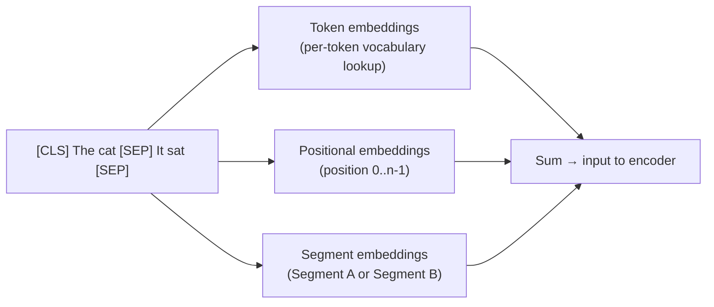

# BERT: encoder-only pre-training

BERT (Bidirectional Encoder Representations from Transformers) demonstrated that pre-training a deep bidirectional transformer on unlabeled text with masked language modeling produces representations that transfer powerfully to nearly every NLP task. Before BERT (2018), NLP models were trained from scratch for each task. After BERT, the dominant paradigm became: pre-train once on a huge corpus, fine-tune cheaply on small labeled datasets.

## One-line definition

BERT is a bidirectional transformer encoder pre-trained on masked language modeling and next-sentence prediction, producing contextual token representations that can be fine-tuned for classification, tagging, and question answering by adding a small task-specific head.

![BERT masked language modeling — random tokens are replaced with [MASK] and the model must predict the original token using bidirectional context](https://jalammar.github.io/images/BERT-language-modeling-masked-lm.png)
*Source: [Jay Alammar — The Illustrated BERT](https://jalammar.github.io/illustrated-bert/)*

## Why this topic matters

BERT established the pre-train-then-fine-tune paradigm that defines modern NLP. Understanding BERT's architecture and training procedure is the foundation for understanding encoder-only models (RoBERTa, DeBERTa, ALBERT), semantic search, and NLP fine-tuning in industry. BERT-family models dominate production NLP systems for text understanding tasks.

## Architecture

BERT is a stack of $N$ transformer encoder blocks with bidirectional self-attention — no causal mask.

| Model | $d_{\text{model}}$ | Layers $N$ | Heads $h$ | Parameters |
|---|---|---|---|---|
| BERT-base | 768 | 12 | 12 | 110M |
| BERT-large | 1024 | 24 | 16 | 340M |

The architecture is identical to the transformer encoder described in note 80 — the key differences are in how BERT is trained.

## Input representation

BERT's input combines three embeddings:

$$
\text{Input}_i = \text{TokenEmbedding}(w_i) + \text{PositionalEmbedding}(i) + \text{SegmentEmbedding}(s_i)
$$



**Special tokens**:
- `[CLS]`: prepended to every input. Its final hidden state is used as the sequence-level representation for classification.
- `[SEP]`: separates segment A and segment B (two sentences in pair tasks).

**Segment embeddings**: token-type IDs (0 for sentence A, 1 for sentence B) allow BERT to distinguish between two sentences in paired tasks (NLI, QA).

## Pre-training task 1: Masked Language Modeling (MLM)

15% of input tokens are selected for prediction:
- 80%: replaced with `[MASK]` token
- 10%: replaced with a random token
- 10%: left unchanged (forces the model to produce contextual representations for all tokens)

Only masked positions contribute to the loss:

$$
\mathcal{L}_{\text{MLM}} = -\sum_{i \in \mathcal{M}} \log p_\theta(x_i \mid \tilde{x})
$$

The 80/10/10 split prevents the model from only learning to predict `[MASK]` tokens and ensures the representation is useful for all tokens.

## Pre-training task 2: Next Sentence Prediction (NSP)

50% of the time, sentence B follows sentence A. 50% of the time, sentence B is a random sentence. The `[CLS]` representation is classified as IsNext / NotNext.

**Note**: RoBERTa (2019) showed NSP hurts more than it helps and removed it. Most modern BERT variants do not use NSP.

## What BERT's representations look like

After pre-training, BERT produces:
- One vector per token: $h_i \in \mathbb{R}^{d_{\text{model}}}$, contextual (the same word has different representations in different contexts)
- `[CLS]` vector: $h_0 \in \mathbb{R}^{d_{\text{model}}}$, often used as the sequence representation for classification

```
"The bank is by the river"     → bank → [0.2, -0.8, ..., 0.4]  (river sense)
"I deposited money at the bank" → bank → [0.9, 0.3, ..., -0.2]  (financial sense)
```

The same word "bank" has completely different representations depending on context.

## Fine-tuning for downstream tasks

Fine-tuning adds a small task-specific head on top of the pre-trained BERT and trains on labeled data with a low learning rate:

| Task | Head | What's fine-tuned |
|---|---|---|
| Classification (sentiment, topic) | Linear on `[CLS]` vector | Full model + head |
| Token classification (NER) | Linear on each token vector | Full model + head |
| Extractive QA (SQuAD) | Start/end span classifiers | Full model + head |
| Sentence pair (NLI) | Linear on `[CLS]` | Full model + head |

**Fine-tuning recipe**:
- Learning rate: 2e-5 to 5e-5
- Batch size: 16–32
- Epochs: 3–4
- Warm up + linear decay scheduler

## Python code

```python
# pip install transformers datasets
import torch
import torch.nn as nn
from transformers import BertModel, BertTokenizer, BertForSequenceClassification

# ============================================================
# 1. Extract BERT representations (feature extraction)
# ============================================================
tokenizer = BertTokenizer.from_pretrained("bert-base-uncased")
bert = BertModel.from_pretrained("bert-base-uncased")
bert.eval()

texts = [
    "The bank is by the river.",
    "I deposited money at the bank.",
]
encoded = tokenizer(texts, padding=True, truncation=True, return_tensors="pt")

with torch.no_grad():
    outputs = bert(**encoded)

# outputs.last_hidden_state: (batch, seq_len, 768) — all token representations
# outputs.pooler_output:     (batch, 768) — [CLS] token, transformed by tanh
last_hidden = outputs.last_hidden_state
cls_repr = last_hidden[:, 0, :]   # [CLS] token is at position 0

print(f"All token representations: {last_hidden.shape}")  # (2, seq_len, 768)
print(f"[CLS] representation:      {cls_repr.shape}")      # (2, 768)

# Verify: "bank" has different representations in the two sentences
bank_pos_1 = tokenizer.encode(texts[0], add_special_tokens=True).index(
    tokenizer.convert_tokens_to_ids("bank")
)
bank_pos_2 = tokenizer.encode(texts[1], add_special_tokens=True).index(
    tokenizer.convert_tokens_to_ids("bank")
)

bank_repr_1 = last_hidden[0, bank_pos_1]   # (768,)
bank_repr_2 = last_hidden[1, bank_pos_2]   # (768,)
cosine_sim = torch.nn.functional.cosine_similarity(
    bank_repr_1.unsqueeze(0), bank_repr_2.unsqueeze(0)
)
print(f"\nCosine similarity between 'bank' representations: {cosine_sim.item():.4f}")
# Should be significantly less than 1.0 — different contexts → different vectors


# ============================================================
# 2. Fine-tuning for text classification
# ============================================================
class BertClassifier(nn.Module):
    """BERT fine-tuned for binary sentiment classification."""

    def __init__(self, num_labels: int = 2, dropout: float = 0.1):
        super().__init__()
        self.bert = BertModel.from_pretrained("bert-base-uncased")
        self.dropout = nn.Dropout(dropout)
        self.classifier = nn.Linear(768, num_labels)

    def forward(self, input_ids, attention_mask, token_type_ids=None):
        outputs = self.bert(
            input_ids=input_ids,
            attention_mask=attention_mask,
            token_type_ids=token_type_ids,
        )
        cls_output = outputs.last_hidden_state[:, 0, :]  # [CLS] token
        cls_output = self.dropout(cls_output)
        logits = self.classifier(cls_output)             # (batch, num_labels)
        return logits


# Using HuggingFace's built-in fine-tuning wrapper
model = BertForSequenceClassification.from_pretrained(
    "bert-base-uncased",
    num_labels=2,
)

# Simulate a training step
texts = ["I love this movie!", "This was terrible."]
labels = torch.tensor([1, 0])   # positive, negative
encoded = tokenizer(texts, padding=True, truncation=True, return_tensors="pt")

outputs = model(**encoded, labels=labels)
loss = outputs.loss
logits = outputs.logits

print(f"\nClassification loss:   {loss.item():.4f}")
print(f"Logits:                {logits.detach()}")
print(f"Predicted classes:     {logits.argmax(dim=-1).tolist()}")


# ============================================================
# 3. Token classification (NER)
# ============================================================
from transformers import BertForTokenClassification

# NER: each token gets a label (O, B-PER, I-PER, B-ORG, ...)
ner_model = BertForTokenClassification.from_pretrained(
    "bert-base-uncased",
    num_labels=9,  # typical NER label count
)

text = "Barack Obama was born in Honolulu."
encoded = tokenizer(text, return_tensors="pt")
outputs = ner_model(**encoded)

token_logits = outputs.logits   # (1, seq_len, 9)
token_preds = token_logits.argmax(dim=-1)   # (1, seq_len)
tokens = tokenizer.convert_ids_to_tokens(encoded["input_ids"][0])

print(f"\n=== NER token predictions ===")
for tok, pred in zip(tokens, token_preds[0]):
    print(f"  {tok:15} → label {pred.item()}")
```

## BERT variants

| Model | Key change | Performance |
|---|---|---|
| RoBERTa | Remove NSP, more data, larger batches, byte-level BPE | +3–5% on GLUE |
| ALBERT | Parameter sharing across layers, factorized embeddings | 90% fewer params |
| DistilBERT | Knowledge distillation from BERT-base | 40% smaller, 60% faster, 97% performance |
| DeBERTa | Disentangled attention (separate position and content) | State-of-art on many tasks |
| ELECTRA | Replaced token detection instead of MLM | More efficient training |

## When to use BERT vs. GPT

| Use case | Model family | Reason |
|---|---|---|
| Sentence classification | BERT | `[CLS]` + bidirectional context |
| Named entity recognition | BERT | Per-token labels with full context |
| Semantic search embeddings | BERT | Sentence-level representations |
| Text generation | GPT | Causal autoregressive |
| Few-shot tasks | GPT | In-context learning via prompting |
| Question answering (extractive) | BERT | Span extraction from passage |
| Question answering (generative) | GPT/T5 | Generate answer free-form |

## Interview questions

<details>
<summary>Why does BERT use bidirectional attention instead of causal attention?</summary>

BERT's pre-training task is masked language modeling — predicting randomly masked tokens from context. To predict a masked token, the model needs context from both left and right sides. A causal mask blocks right context, making MLM much harder and the representations less rich. Bidirectional attention allows BERT to build the best possible contextual representation of each token, which is exactly what downstream understanding tasks need.
</details>

<details>
<summary>What is the role of the [CLS] token?</summary>

`[CLS]` is a special token prepended to every input. It has no inherent meaning — it serves as a "summary token" that can accumulate sequence-level information through self-attention. During MLM pre-training, `[CLS]` attends to all tokens in the sequence. After pre-training and during fine-tuning, a linear layer on top of the `[CLS]` representation is used for sequence-level tasks (classification, sentence-pair scoring). The model learns to put global information useful for classification into the `[CLS]` position during fine-tuning.
</details>

<details>
<summary>What is the difference between BERT's output and a word embedding?</summary>

A word embedding maps each token to a fixed vector regardless of context — "bank" always has the same embedding. BERT's output is a contextual representation — the vector for "bank" depends on the surrounding sentence. The same token can have very different representations: "bank" in "river bank" vs. "financial bank" produces different BERT output vectors. This is because self-attention mixes information from all surrounding tokens to produce each token's representation.
</details>

## Common mistakes

- Using `pooler_output` instead of `last_hidden_state[:, 0, :]` — `pooler_output` passes the `[CLS]` representation through an extra tanh layer, which can hurt performance for some tasks
- Not adding a learning rate warmup when fine-tuning — BERT fine-tuning is sensitive to early large updates that can destroy pre-trained knowledge
- Fine-tuning too many epochs on small datasets — overfitting is common after 4+ epochs on datasets smaller than ~10k examples
- Not applying the attention mask — padding positions should not influence the `[CLS]` representation

## Final takeaway

BERT established that pre-training a bidirectional transformer encoder with masked language modeling on billions of words produces representations that transfer to nearly any NLP task. The `[CLS]` token gives a sequence-level summary; per-token representations power span extraction and tagging. Fine-tuning requires only a small task-specific head and a few epochs of supervised training. BERT's architecture is unchanged from the transformer encoder — the innovation was in how it was trained.

## References

- Devlin, J., et al. (2019). BERT: Pre-training of Deep Bidirectional Transformers for Language Understanding. NAACL.
- Liu, Y., et al. (2019). RoBERTa: A Robustly Optimized BERT Pretraining Approach.
- Clark, K., et al. (2020). ELECTRA: Pre-training Text Encoders as Discriminators Rather Than Generators. ICLR.
