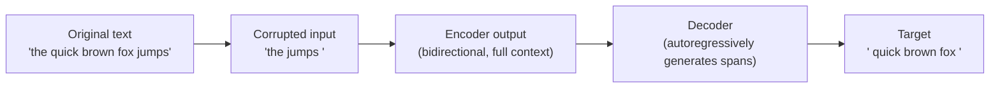

# T5 and encoder-decoder pre-training

> **TL;DR.** T5 reframes every NLP task as **string-in, string-out**. Sentiment classification? `"sst2 sentence: I loved it"` → `"positive"`. Translation? `"translate English to French: hi"` → `"salut"`. Summarization? `"summarize: <long text>"` → `"<summary>"`. The architecture is a vanilla encoder-decoder transformer; the pretraining objective is **span corruption** (mask out chunks of text and ask the decoder to regenerate them). One model, one loss, one fine-tuning recipe — for every task.

T5 (Text-to-Text Transfer Transformer) reformulated every NLP task as a seq2seq problem: classification, translation, summarization, question answering — all become "convert this input text to this output text." This unification with a single model architecture and a single training objective is what made T5 influential.

## Try it interactively

- **[T5 demo on HuggingFace](https://huggingface.co/google-t5/t5-base)** — paste any input with task prefix and see the generated output
- **[FLAN-T5 demo](https://huggingface.co/google/flan-t5-large)** — instruction-tuned variant; works on natural-language prompts
- **[BART summarization demo](https://huggingface.co/facebook/bart-large-cnn)** — encoder-decoder for abstractive summarization
- **[mT5 multilingual demo](https://huggingface.co/google/mt5-base)** — same architecture, 101 languages
- **[Hugging Face fine-tuning T5 tutorial](https://huggingface.co/docs/transformers/model_doc/t5)** — official guide for fine-tuning T5 on a custom seq2seq task

## A real-world analogy

T5 is like a **universal translator** that has been trained to convert between every variety of "language": English-to-French, "raw text" to "summary", "question + passage" to "answer", "sentence" to "sentiment label". Internally, every problem becomes the same shape — read input string, write output string — and the model uses the same encoder-decoder machinery for all of them. The task prefix is the *dialect indicator* that tells the translator which conversion to perform.

## One-line definition

T5 is an encoder-decoder transformer pre-trained with span corruption (replacing random contiguous spans with sentinel tokens and training the decoder to reconstruct them), then fine-tuned for any NLP task by framing it as text generation.


*Source: [Jay Alammar — The Illustrated Transformer](https://jalammar.github.io/illustrated-transformer/)*

## Why this topic matters

Encoder-decoder models dominate seq2seq tasks (translation, summarization, structured prediction). BART powers Facebook's summarization and translation. mT5 is the standard multilingual encoder-decoder. T5-style models are still widely used in production for tasks where the output has a complex, multi-token structure. Understanding T5 completes the trifecta of transformer architectures: BERT (encoder-only), GPT (decoder-only), T5 (encoder-decoder).

## The text-to-text framework

T5's central idea: every NLP task is a text-to-text problem.

| Task | Input | Output |
|---|---|---|
| Sentiment classification | `sentiment: The movie was great.` | `positive` |
| Translation | `translate English to French: Hello world` | `Bonjour le monde` |
| Summarization | `summarize: Long article text...` | `Short summary` |
| QA | `question: What is Paris? context: Paris is the capital of France.` | `the capital of France` |
| NER | `recognize entities: Barack Obama was born in Hawaii.` | `person: Barack Obama location: Hawaii` |

A single model, a single objective, a single fine-tuning procedure. The task prefix tells the model what to do.

## Architecture

T5 uses the original encoder-decoder transformer architecture (note 80 + 83) with minor modifications:
- **Relative position biases** instead of absolute or sinusoidal positional encodings — each attention head learns position biases that depend on the relative offset between tokens, not absolute positions
- No bias terms in most layers
- Pre-norm (LayerNorm before each sublayer)

| Model | Parameters | $d_{\text{model}}$ | Layers (enc/dec) | Heads |
|---|---|---|---|---|
| T5-small | 60M | 512 | 6/6 | 8 |
| T5-base | 220M | 768 | 12/12 | 12 |
| T5-large | 770M | 1024 | 24/24 | 16 |
| T5-XL | 3B | 2048 | 24/24 | 32 |
| T5-XXL | 11B | 4096 | 24/24 | 64 |
| T5-v1.1 / FLAN-T5 | — | — | — | Improved versions |

## Pre-training: span corruption

T5's pre-training task replaces random contiguous spans with unique sentinel tokens:

1. Sample spans from the input with mean length 3, targeting ~15% corruption
2. Replace each span with a unique sentinel token (`<extra_id_0>`, `<extra_id_1>`, ...)
3. Train the decoder to generate the original spans, each preceded by its sentinel

**Example**:
- Original: `The quick brown fox jumps over the lazy dog`
- Corrupted input: `The quick <extra_id_0> jumps over <extra_id_1> dog`
- Target: `<extra_id_0> brown fox <extra_id_1> the lazy`

The decoder must produce all corrupted spans in order, separated by their sentinel tokens, and end with `<extra_id_N>` as EOS.



## BART: denoising with a broader set of corruptions

BART (Lewis et al., 2020) is another encoder-decoder model with a similar denoising approach but uses a wider range of corruption strategies:
- **Token masking**: replace tokens with `[MASK]` (like BERT)
- **Token deletion**: remove tokens (model must determine what's missing)
- **Text infilling**: replace a span of tokens with a single `[MASK]`
- **Sentence permutation**: shuffle sentence order
- **Document rotation**: rotate the document to start at a random token

The decoder always reconstructs the original uncorrupted document (not just the corrupted spans). BART excels at abstractive summarization and text generation tasks.

## Python code: T5 with HuggingFace

```python
# pip install transformers sentencepiece
import torch
from transformers import T5ForConditionalGeneration, T5Tokenizer, AutoTokenizer

tokenizer = T5Tokenizer.from_pretrained("t5-small")
model = T5ForConditionalGeneration.from_pretrained("t5-small")
model.eval()


# ============================================================
# Task 1: Translation (English → French)
# ============================================================
def translate(text: str) -> str:
    input_ids = tokenizer.encode(
        f"translate English to French: {text}",
        return_tensors="pt",
        max_length=512,
        truncation=True,
    )
    output_ids = model.generate(
        input_ids,
        max_length=128,
        num_beams=4,           # beam search for translation quality
        early_stopping=True,
    )
    return tokenizer.decode(output_ids[0], skip_special_tokens=True)


print("=== Translation ===")
print(translate("Hello, how are you today?"))


# ============================================================
# Task 2: Summarization
# ============================================================
def summarize(text: str) -> str:
    input_ids = tokenizer.encode(
        f"summarize: {text}",
        return_tensors="pt",
        max_length=512,
        truncation=True,
    )
    output_ids = model.generate(
        input_ids,
        max_length=64,
        min_length=10,
        num_beams=4,
        no_repeat_ngram_size=2,
    )
    return tokenizer.decode(output_ids[0], skip_special_tokens=True)


long_text = (
    "The transformer architecture, introduced in 2017, replaced recurrent neural networks "
    "for sequence modeling. It uses attention mechanisms to process all tokens in parallel, "
    "enabling more efficient training on large datasets. BERT, GPT, and T5 are all based "
    "on transformers."
)
print(f"\n=== Summarization ===")
print(summarize(long_text))


# ============================================================
# Task 3: Classification as text generation
# ============================================================
def classify_sentiment(text: str) -> str:
    input_ids = tokenizer.encode(
        f"sst2 sentence: {text}",   # T5 uses "sst2 sentence:" for SST-2
        return_tensors="pt",
    )
    output_ids = model.generate(input_ids, max_length=10)
    return tokenizer.decode(output_ids[0], skip_special_tokens=True)


print(f"\n=== Sentiment classification (text-to-text) ===")
print(classify_sentiment("The movie was absolutely fantastic!"))
print(classify_sentiment("I really did not enjoy this experience."))


# ============================================================
# Forward pass: understanding encoder-decoder structure
# ============================================================
model.train()
input_text = "translate English to German: I love transformers."
target_text = "Ich liebe Transformatoren."

input_ids = tokenizer.encode(input_text, return_tensors="pt")
# T5 uses -100 for padding in labels (ignored in loss computation)
labels = tokenizer.encode(target_text, return_tensors="pt")

outputs = model(input_ids=input_ids, labels=labels)
loss = outputs.loss
logits = outputs.logits

print(f"\n=== Forward pass ===")
print(f"Input shape:      {input_ids.shape}")
print(f"Encoder output shape: {outputs.encoder_last_hidden_state.shape}")
print(f"Decoder logits:   {logits.shape}")   # (1, target_len, vocab_size)
print(f"Training loss:    {loss.item():.4f}")


# ============================================================
# BART for summarization (better than T5 for abstractive tasks)
# ============================================================
from transformers import BartForConditionalGeneration, BartTokenizer

bart_tokenizer = BartTokenizer.from_pretrained("facebook/bart-large-cnn")
bart_model = BartForConditionalGeneration.from_pretrained("facebook/bart-large-cnn")
bart_model.eval()

article = (
    "The transformer architecture has revolutionized artificial intelligence. "
    "First introduced in 2017 by Vaswani et al., it replaced recurrent architectures "
    "with attention mechanisms, enabling parallel training and better long-range modeling."
)

inputs = bart_tokenizer(article, return_tensors="pt", max_length=1024, truncation=True)
with torch.no_grad():
    summary_ids = bart_model.generate(
        inputs["input_ids"],
        max_length=60,
        min_length=20,
        num_beams=4,
        length_penalty=2.0,
    )

print(f"\n=== BART Summary ===")
print(bart_tokenizer.decode(summary_ids[0], skip_special_tokens=True))
```

### Try it yourself: experiments

| Question | Try this |
|----------|----------|
| What if you skip the task prefix? | Send raw text to T5 with no prefix — output is gibberish or echoes input |
| Compare beam search vs greedy | Set `num_beams=1` vs `num_beams=4` — beam search wins on translation by 1–3 BLEU |
| Can a single fine-tuning teach two tasks? | Train T5 on a mixed batch (translate + summarize) — emerges multi-task capability |
| Inspect cross-attention | Pass `output_attentions=True`, plot `cross_attentions[0][0]` heatmap |
| FLAN-T5 vs T5 zero-shot | Same instruction-style prompt to both — FLAN-T5 follows it; vanilla T5 doesn't |

## T5 vs. BERT vs. GPT

| Property | T5 | BERT | GPT |
|---|---|---|---|
| Architecture | Encoder-decoder | Encoder-only | Decoder-only |
| Pre-training | Span corruption | MLM | CLM |
| Context | Encoder: bidirectional; Decoder: causal | Bidirectional | Causal |
| Best for | Seq2seq, structured generation | Classification, NER, embedding | Generation, reasoning, prompting |
| Fine-tuning | Text-to-text format for all tasks | Task-specific head | Fine-tune or prompt |
| Generation | Yes (decoder) | No | Yes |
| Understanding | Yes (encoder) | Yes | Limited (unidirectional) |
| Production use | Summarization, translation | Semantic search, classification | Chat, code, long-form generation |

## FLAN-T5: instruction-tuned T5

FLAN-T5 (Wei et al., 2022) fine-tunes T5 on over 1,000 NLP tasks formatted as natural language instructions:

```
Input: "Please classify the sentiment of the following review as positive or negative:
The acting was superb but the plot was confusing."
Output: "negative"
```

FLAN-T5 follows instructions zero-shot far better than vanilla T5 — the key insight is that fine-tuning on many tasks in instruction format improves generalization to new tasks.

## Cross-references

- **Prerequisite:** [82 — Cross-Attention](./82-cross-attention-in-transformers.md) — what bridges T5's encoder and decoder
- **Prerequisite:** [83 — Decoder Architecture](./83-transformer-decoder-architecture.md) — the 3-sublayer decoder T5 uses
- **Prerequisite:** [85 — Training Objectives (Span Corruption)](./85-transformer-training-objectives.md) — T5's pretraining objective
- **Prerequisite:** [86 — Tokenization](./86-tokenization-bpe-wordpiece-sentencepiece.md) — T5 uses SentencePiece
- **Related:** [87 — BERT (Encoder-Only)](./87-bert-encoder-pretraining.md), [88 — GPT (Decoder-Only)](./88-gpt-decoder-only-causal-lm.md) — the other two paradigms
- **Follow-up:** [90 — Fine-Tuning](./90-fine-tuning-transformers.md) — adapting T5 to new tasks via the text-to-text format

## Interview questions

<details>
<summary>What is the advantage of T5's text-to-text framework?</summary>

Unification: every NLP task uses the same model, the same loss (cross-entropy on the target sequence), and the same fine-tuning procedure. There is no need for task-specific architectures (classification heads vs. span extractors vs. sequence generators). A single model can be fine-tuned for sentiment, translation, summarization, and QA by just changing the prompt prefix. This simplifies the entire pipeline and makes multi-task fine-tuning straightforward.
</details>

<details>
<summary>How does span corruption differ from BERT's MLM?</summary>

MLM masks individual tokens; span corruption masks contiguous spans of multiple tokens. MLM is bidirectional — the masked token prediction is embedded in the encoder's forward pass. Span corruption is seq2seq — the encoder reads the corrupted input, and the decoder generates the original spans autoregressively. Span corruption is more suitable for training an encoder-decoder: the decoder gets experience generating text from encoder context, not just predicting a single token.
</details>

<details>
<summary>Why would you choose T5 over GPT for summarization?</summary>

T5's encoder can process the full source document bidirectionally, building a rich representation that the decoder can attend to via cross-attention. GPT processes everything causally — the model must hold the entire document in its left context and generate the summary afterward. For long documents where the summary depends on understanding the whole document (not just its beginning), the encoder-decoder setup is more naturally suited. In practice, the difference has narrowed as GPT models have gotten much larger context windows.
</details>

## Common mistakes

- Forgetting the task prefix — T5 requires prefixes like "translate English to German:" or "summarize:" to activate task-specific behavior
- Using T5 with too long inputs without truncation — T5-base has max length 512; exceeding this causes errors
- Setting `labels` to raw token IDs including padding (should be -100 for padding) — padding positions should not contribute to loss
- Using greedy decoding for translation — beam search is standard for seq2seq tasks that require higher quality output

## Final takeaway

T5 unified NLP into a single text-to-text framework: every task is a string-in, string-out problem. Span corruption pre-training teaches the encoder-decoder to understand and generate text simultaneously. BART extends this with broader corruption strategies, excelling at abstractive summarization. Together with BERT (understanding) and GPT (generation), T5 completes the three canonical transformer paradigms that underpin modern NLP infrastructure.

## References

- Raffel, C., et al. (2020). Exploring the Limits of Transfer Learning with a Unified Text-to-Text Transformer. JMLR.
- Lewis, M., et al. (2020). BART: Denoising Sequence-to-Sequence Pre-training for Natural Language Generation, Translation, and Comprehension. ACL.
- Wei, J., et al. (2022). Finetuned Language Models Are Zero-Shot Learners (FLAN). ICLR.
