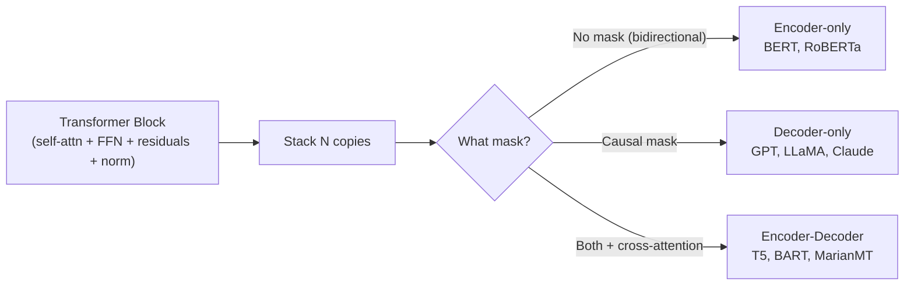
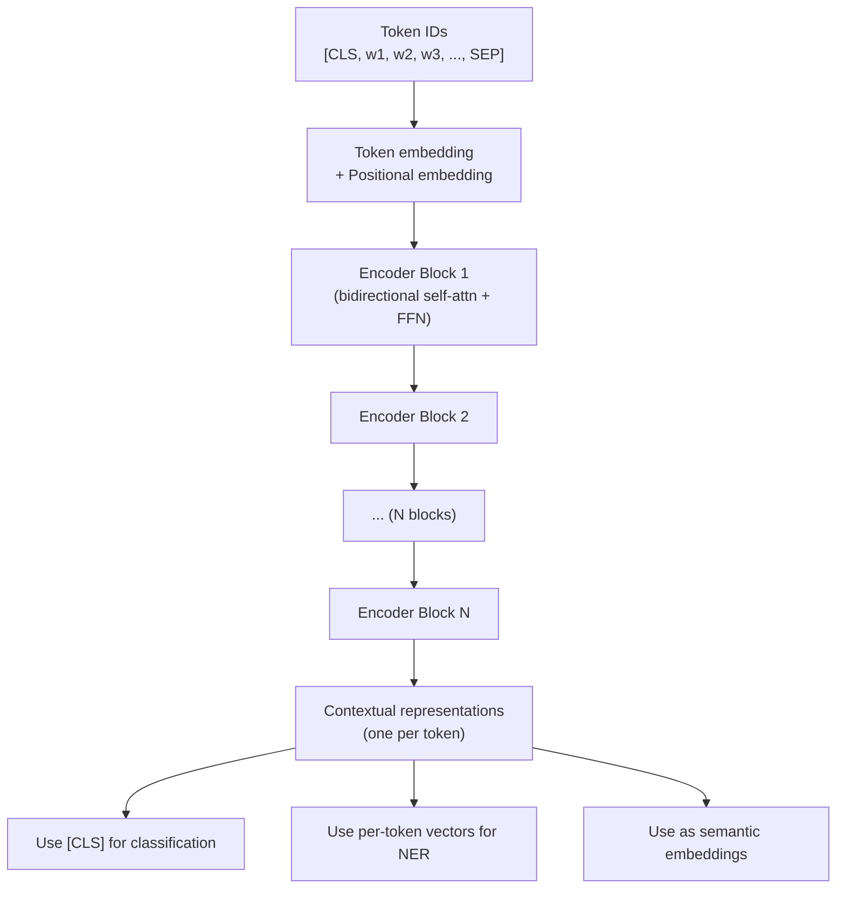
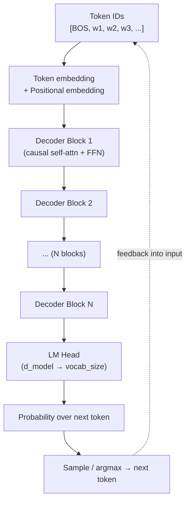
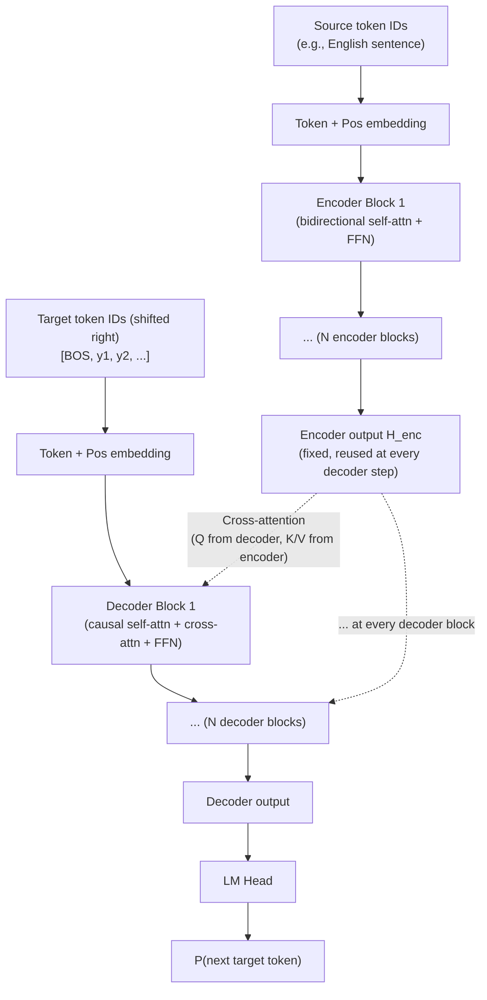
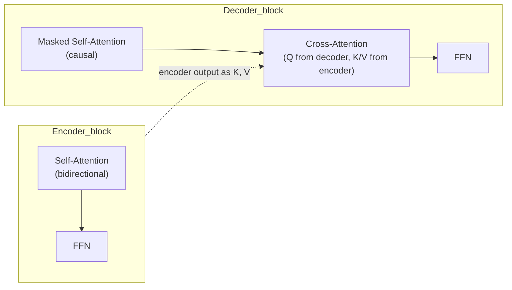
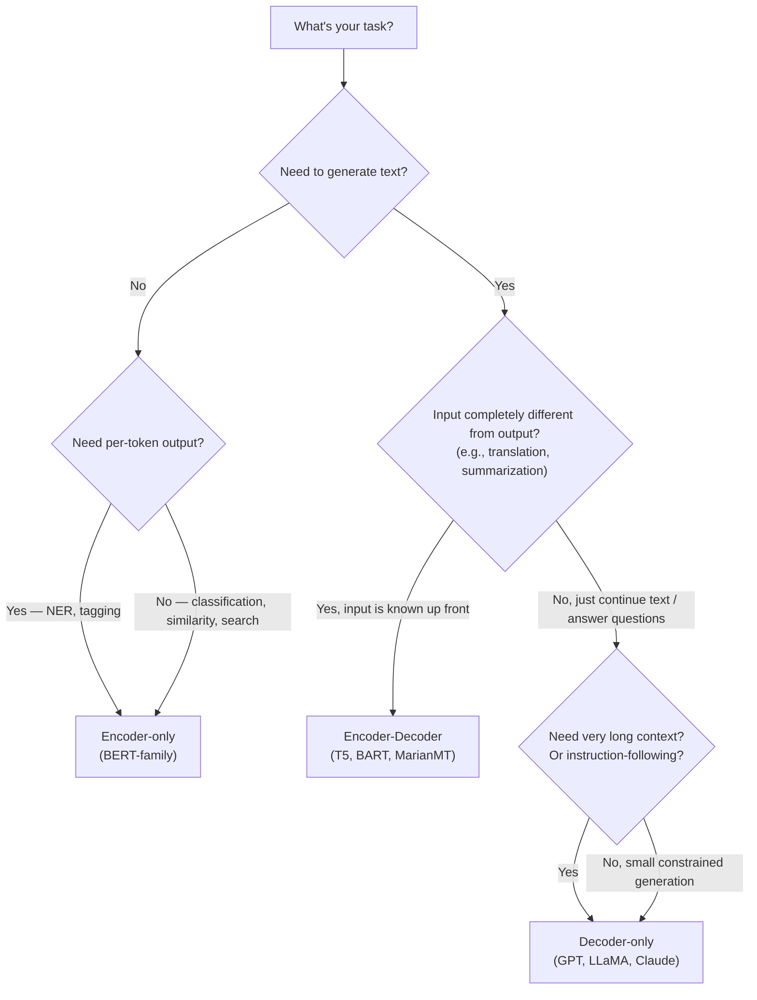
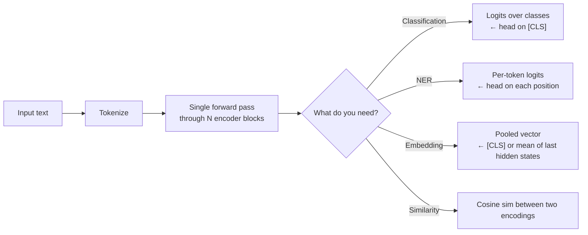
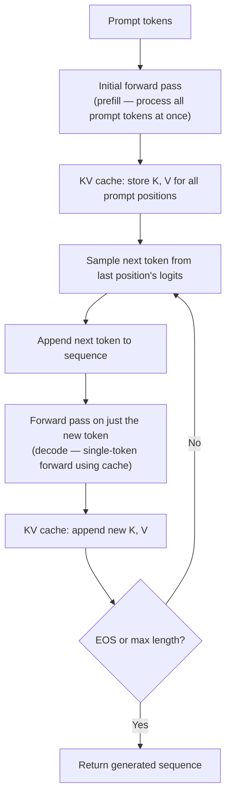
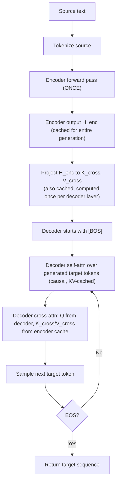
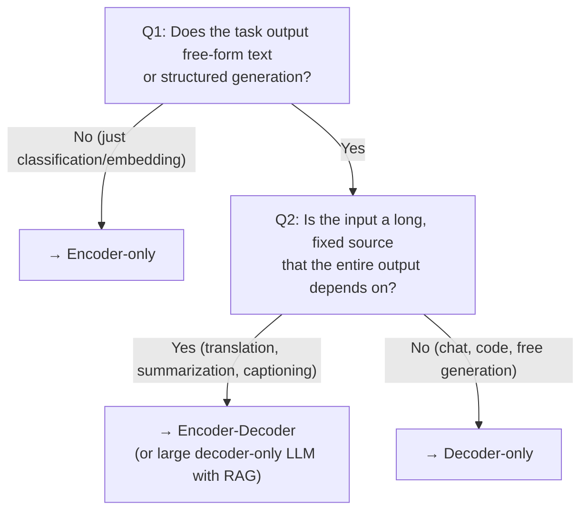

# Encoder-only vs Decoder-only vs Encoder-Decoder: a deep comparison

> **TL;DR.** The transformer block is one Lego brick; the three model families
> differ only in **how you stack it and what mask you apply**. Encoder-only
> (BERT) stacks blocks with _no mask_ — every token attends to every token,
> bidirectionally — and pretrains by hiding random tokens (MLM). Decoder-only
> (GPT) stacks blocks with a _causal mask_ — each token only sees its past — and
> pretrains by predicting the next token (CLM). Encoder-Decoder (T5) does both:
> an encoder stack reads the input bidirectionally, a decoder stack generates
> output causally while attending to the encoder via _cross-attention_. Same
> Lego brick, three architectural philosophies, three regimes of capability.

The transformer architecture (Vaswani et al., 2017) was introduced as an
encoder-decoder model for machine translation. But within a year, two simpler
variants split off — encoder-only (BERT, 2018) for understanding, and
decoder-only (GPT, 2018) for generation. Today these three families dominate
every NLP application. Knowing which one to reach for is the single most
consequential design decision in applied LLM work.

## Why this topic matters

Pick the wrong family and you're stuck:

- Trying to use BERT to generate text? It can't — no causal head, no
  autoregressive loop.
- Trying to use GPT for token classification on a long document? It can only see
  tokens to the left of each position; the rightward context is invisible.
- Trying to use T5 when you only need embeddings? You're paying for a decoder
  you'll never use.

Modern LLM applications make this choice constantly: BERT for retrieval, GPT for
chat, T5 for translation pipelines, ColBERT for re-ranking, instruction-tuned
LLaMA for assistant tasks. The architecture decides the capability ceiling. This
note gives you the mental model to make that choice.

## Try it interactively

Before reading further, get hands-on with each family in your browser:

- **[BERT (encoder-only) Fill-Mask](https://huggingface.co/bert-base-uncased)**
  — paste `"The capital of France is [MASK]"` and watch BERT predict
  bidirectionally
- **[GPT-2 (decoder-only) generation](https://huggingface.co/openai-community/gpt2)**
  — write a prompt, see autoregressive completion
- **[T5 (encoder-decoder) translation](https://huggingface.co/google-t5/t5-base)**
  — try `"translate English to German: I love transformers"`
- **[FLAN-T5](https://huggingface.co/google/flan-t5-large)** — instruction-tuned
  T5; the same model handles every task by reading a prefix
- **[BertViz](https://github.com/jessevig/bertviz)** — visualize each family's
  attention patterns side by side
- **[bbycroft LLM visualizer](https://bbycroft.net/llm)** — animated 3D
  walkthrough of a decoder-only forward pass
- **[Transformer Explainer](https://poloclub.github.io/transformer-explainer/)**
  — step through GPT-2's decoder-only computation

A revealing experiment you can run in 60 seconds: feed the same sentence to a
BERT-based sentiment classifier and a GPT zero-shot prompt. Both can solve it —
but the API surfaces (fill-mask vs generate) and inference speeds are
fundamentally different.

## A real-world analogy

Three roles in a publishing house:

- **Encoder-only (BERT)** = the **research analyst**. Reads everything carefully
  (bidirectionally, no order constraints), builds deep understanding, but
  doesn't write the final article. Outputs _representations_ (numerical
  summaries) that classifiers, search engines, or downstream tools can use.
  They're the best in the office at understanding, the worst at composing prose.

- **Decoder-only (GPT)** = the **columnist writing live**. Composes word by
  word, can only use what they've already written (causal — no looking ahead).
  Every output influences the next. Highly creative and fluent, but builds
  context incrementally.

- **Encoder-Decoder (T5)** = the **professional translator**. First reads the
  source document fully (encoder), then composes the target language word by
  word while continuously glancing back at the source notes (cross-attention).
  Combines deep reading with generation.

These three roles correspond to three different jobs. A research analyst can't
do real-time translation; a columnist can't give you the perfect embedding for
semantic search. The transformer block is the same brain in all three — the
difference is how the brain is structured into a job.


_Source:
[Jay Alammar — The Illustrated Transformer](https://jalammar.github.io/illustrated-transformer/)_

## The shared transformer DNA

All three families are built from the same components. Understanding what they
share clarifies what changes between them.

| Component              | Description                                              | Same in all three? |
| ---------------------- | -------------------------------------------------------- | ------------------ |
| Token embeddings       | Map token IDs → d_model vectors                          | ✅ Yes             |
| Positional encoding    | Inject sequence order (sinusoidal, learned, RoPE, ALiBi) | ✅ Yes             |
| Multi-head attention   | Q·Kᵀ similarity → softmax → weighted V                   | ✅ Yes (same math) |
| Feed-forward sublayer  | Per-position 2-layer MLP (or SwiGLU)                     | ✅ Yes             |
| Residual connections   | x + Sublayer(x)                                          | ✅ Yes             |
| LayerNorm (or RMSNorm) | Normalize activations                                    | ✅ Yes             |

What changes between families:

| Difference                   | Encoder-only                              | Decoder-only                   | Encoder-Decoder                                              |
| ---------------------------- | ----------------------------------------- | ------------------------------ | ------------------------------------------------------------ |
| Self-attention **mask**      | None (bidirectional)                      | Causal (lower-triangular)      | Encoder: none. Decoder: causal.                              |
| **Cross-attention** present? | ❌ No                                     | ❌ No                          | ✅ In decoder only                                           |
| Sublayers per block          | 2 (self-attn + FFN)                       | 2 (causal self-attn + FFN)     | Encoder: 2. Decoder: 3 (causal self-attn + cross-attn + FFN) |
| Pretraining objective        | Masked LM (predict masked tokens)         | Causal LM (predict next token) | Span corruption (predict masked spans)                       |
| Output head                  | Task-specific (e.g., classifier on [CLS]) | LM head → vocab logits         | LM head on decoder                                           |

That's the entire difference. Everything else is identical.


_Source: [Jay Alammar — The Illustrated Transformer](https://jalammar.github.io/illustrated-transformer/)_



## Architecture 1: Encoder-Only (BERT-style)

### Diagram

![BERT's input/output structure — a [CLS] token at the start whose final hidden state is used for classification, followed by the actual tokens whose final hidden states carry per-token contextual meaning.](https://jalammar.github.io/images/bert-input-output.png)
_Source: [Jay Alammar — The Illustrated BERT](https://jalammar.github.io/illustrated-bert/)_




_Source: [Jay Alammar — The Illustrated Transformer](https://jalammar.github.io/illustrated-transformer/)_

### How attention works in an encoder

Every token can see every other token. The attention matrix is **square, dense,
and unmasked**:

```
Token 0 can attend to: tokens 0, 1, 2, 3, 4, 5
Token 1 can attend to: tokens 0, 1, 2, 3, 4, 5
Token 2 can attend to: tokens 0, 1, 2, 3, 4, 5
Token 3 can attend to: tokens 0, 1, 2, 3, 4, 5
Token 4 can attend to: tokens 0, 1, 2, 3, 4, 5
Token 5 can attend to: tokens 0, 1, 2, 3, 4, 5
```

This is essential for MLM: to predict a masked token at position 3, the model
must use context from positions 0–2 AND 4–5. Causal masking would block half the
context.

### Pretraining: Masked Language Modeling

![Masked Language Modeling — BERT replaces ~15% of input tokens with [MASK] and is trained to predict the original tokens from bidirectional context. Only the masked positions contribute to the loss.](https://jalammar.github.io/images/BERT-language-modeling-masked-lm.png)
_Source: [Jay Alammar — The Illustrated BERT](https://jalammar.github.io/illustrated-bert/)_

```
Original: "The cat sat on the mat"
Masked:   "The [MASK] sat on the [MASK]"
Target:   predict "cat" at position 1, "mat" at position 5
Loss:     cross-entropy only at the [MASK] positions (~15% of tokens)
```

![After pretraining, BERT is fine-tuned on a downstream task by adding a small classification head on top of the [CLS] token. Same model, different head — the universal recipe for encoder-only deployment.](https://jalammar.github.io/images/BERT-classification-spam.png)
_Source: [Jay Alammar — The Illustrated BERT](https://jalammar.github.io/illustrated-bert/)_

### Minimal code

```python
import torch
import torch.nn as nn

class EncoderBlock(nn.Module):
    """Bidirectional encoder block — no mask."""
    def __init__(self, d_model, num_heads, dim_ff, dropout=0.1):
        super().__init__()
        self.norm1 = nn.LayerNorm(d_model)
        self.norm2 = nn.LayerNorm(d_model)
        self.attn = nn.MultiheadAttention(d_model, num_heads,
                                          dropout=dropout, batch_first=True)
        self.ffn = nn.Sequential(
            nn.Linear(d_model, dim_ff),
            nn.GELU(),
            nn.Linear(dim_ff, d_model),
        )

    def forward(self, x, key_padding_mask=None):
        # NO causal mask — every token attends to every token
        attn_out, _ = self.attn(self.norm1(x), self.norm1(x), self.norm1(x),
                                key_padding_mask=key_padding_mask)
        x = x + attn_out
        x = x + self.ffn(self.norm2(x))
        return x


class EncoderOnly(nn.Module):
    """BERT-style: encoder stack + task head."""
    def __init__(self, vocab_size, d_model=768, num_heads=12,
                 num_layers=12, dim_ff=3072, max_len=512, num_classes=2):
        super().__init__()
        self.token_emb = nn.Embedding(vocab_size, d_model)
        self.pos_emb = nn.Embedding(max_len, d_model)
        self.blocks = nn.ModuleList([
            EncoderBlock(d_model, num_heads, dim_ff) for _ in range(num_layers)
        ])
        self.norm = nn.LayerNorm(d_model)
        # Classification head on [CLS] token (position 0)
        self.cls_head = nn.Linear(d_model, num_classes)

    def forward(self, ids):
        positions = torch.arange(ids.shape[1], device=ids.device)
        x = self.token_emb(ids) + self.pos_emb(positions)
        for blk in self.blocks:
            x = blk(x)
        x = self.norm(x)
        # Take [CLS] (first token) for sequence-level prediction
        cls_vec = x[:, 0]
        return self.cls_head(cls_vec)


# Demo
model = EncoderOnly(vocab_size=30000, d_model=128, num_heads=4,
                    num_layers=2, dim_ff=512, num_classes=2)
ids = torch.randint(0, 30000, (4, 32))
logits = model(ids)
print(f"Input IDs: {ids.shape}")          # (4, 32)
print(f"Class logits: {logits.shape}")    # (4, 2) — sentiment over 2 classes
```

### Strengths and weaknesses

| Strengths                                                 | Weaknesses                                                     |
| --------------------------------------------------------- | -------------------------------------------------------------- |
| Best representations for understanding tasks              | Cannot generate text naturally                                 |
| Bidirectional context = richer embeddings                 | Pretraining loss only covers ~15% of tokens (data-inefficient) |
| Excellent for classification, NER, semantic search        | No autoregressive loop                                         |
| Fast inference (one forward pass, no token-by-token loop) | Limited use for open-ended tasks                               |

### Famous encoder-only models

BERT (2018) · RoBERTa (2019) · ALBERT · DeBERTa · ELECTRA · DistilBERT ·
sentence-BERT · ColBERT · ModernBERT (2024) · Many embedding models on the MTEB
leaderboard.

---

## Architecture 2: Decoder-Only (GPT-style)

### Diagram


_Source: [Jay Alammar — The Illustrated Transformer](https://jalammar.github.io/illustrated-transformer/)_




_Source: [Jay Alammar — The Illustrated Transformer](https://jalammar.github.io/illustrated-transformer/)_

### How attention works in a decoder-only model

Every token can only see itself and tokens to its left. The attention matrix is
**lower-triangular**:

```
Token 0 can attend to: token 0
Token 1 can attend to: tokens 0, 1
Token 2 can attend to: tokens 0, 1, 2
Token 3 can attend to: tokens 0, 1, 2, 3
Token 4 can attend to: tokens 0, 1, 2, 3, 4
Token 5 can attend to: tokens 0, 1, 2, 3, 4, 5
```

This is essential for CLM: when predicting the next token, the model can only
know what came before. Allowing it to peek at the future would make training
trivially "predict yourself".

### Pretraining: Causal Language Modeling


_Source: [Jay Alammar — The Illustrated Transformer](https://jalammar.github.io/illustrated-transformer/)_

```
Input:  "The cat sat on the mat"
Target: "cat sat on the mat <EOS>"   (shift by 1)
Loss:   cross-entropy at EVERY position (100% of tokens contribute)
```

The shift-by-1 trick is critical: at position 0 the model predicts the token at
position 1; at position 1 it predicts position 2; and so on. Every position in a
T-length sequence gives one gradient signal, so CLM is **~7× more
sample-efficient than MLM** (which only uses ~15% of tokens).

### Minimal code

```python
import torch
import torch.nn as nn

class DecoderOnlyBlock(nn.Module):
    """Causal decoder block — uses a lower-triangular mask."""
    def __init__(self, d_model, num_heads, dim_ff, dropout=0.1):
        super().__init__()
        self.norm1 = nn.LayerNorm(d_model)
        self.norm2 = nn.LayerNorm(d_model)
        self.attn = nn.MultiheadAttention(d_model, num_heads,
                                          dropout=dropout, batch_first=True)
        self.ffn = nn.Sequential(
            nn.Linear(d_model, dim_ff),
            nn.GELU(),
            nn.Linear(dim_ff, d_model),
        )

    def forward(self, x, causal_mask):
        attn_out, _ = self.attn(self.norm1(x), self.norm1(x), self.norm1(x),
                                attn_mask=causal_mask)
        x = x + attn_out
        x = x + self.ffn(self.norm2(x))
        return x


class DecoderOnly(nn.Module):
    """GPT-style: causal decoder stack + LM head."""
    def __init__(self, vocab_size, d_model=768, num_heads=12,
                 num_layers=12, dim_ff=3072, max_len=512):
        super().__init__()
        self.token_emb = nn.Embedding(vocab_size, d_model)
        self.pos_emb = nn.Embedding(max_len, d_model)
        self.blocks = nn.ModuleList([
            DecoderOnlyBlock(d_model, num_heads, dim_ff) for _ in range(num_layers)
        ])
        self.norm = nn.LayerNorm(d_model)
        self.lm_head = nn.Linear(d_model, vocab_size, bias=False)
        # Weight tying — share embedding with output projection
        self.lm_head.weight = self.token_emb.weight

    def forward(self, ids):
        T = ids.shape[1]
        positions = torch.arange(T, device=ids.device)
        x = self.token_emb(ids) + self.pos_emb(positions)
        # Build causal mask — lower-triangular -inf above diagonal
        causal_mask = nn.Transformer.generate_square_subsequent_mask(T).to(ids.device)
        for blk in self.blocks:
            x = blk(x, causal_mask)
        x = self.norm(x)
        return self.lm_head(x)   # (batch, T, vocab_size)

    @torch.no_grad()
    def generate(self, prompt_ids, max_new_tokens=50):
        """Autoregressive generation loop."""
        x = prompt_ids.clone()
        for _ in range(max_new_tokens):
            logits = self(x)[:, -1, :]            # logits for last position
            next_id = logits.argmax(dim=-1, keepdim=True)
            x = torch.cat([x, next_id], dim=1)
        return x


# Demo
model = DecoderOnly(vocab_size=30000, d_model=128, num_heads=4,
                    num_layers=2, dim_ff=512)
ids = torch.randint(0, 30000, (4, 32))
logits = model(ids)
print(f"Input IDs: {ids.shape}")           # (4, 32)
print(f"Output logits: {logits.shape}")    # (4, 32, 30000)

# Generate from a prompt
prompt = torch.randint(0, 30000, (1, 5))
generated = model.generate(prompt, max_new_tokens=10)
print(f"Generated: {generated.shape}")     # (1, 15) — 5 prompt + 10 new
```

### Strengths and weaknesses

| Strengths                                             | Weaknesses                                                             |
| ----------------------------------------------------- | ---------------------------------------------------------------------- |
| Native text generation                                | Unidirectional context (can only see past)                             |
| Every position contributes to loss (sample-efficient) | Less natural for token-level tagging                                   |
| Scales beautifully (GPT-3, GPT-4, LLaMA-3 70B)        | Repeats forward pass for each generated token (mitigated by KV cache)  |
| In-context learning emerges at scale                  | Sometimes weaker representations than encoder-only for embedding tasks |
| One model fits all tasks via prompting                |                                                                        |

### Famous decoder-only models

GPT, GPT-2, GPT-3, GPT-4, GPT-4o, Claude (1-3.5), LLaMA (1-3), Mistral, Mixtral,
Gemini, Gemma, Qwen, DeepSeek, Falcon, MPT, Phi.

---

## Architecture 3: Encoder-Decoder (T5-style)

### Diagram


_Source: [Jay Alammar — The Illustrated Transformer](https://jalammar.github.io/illustrated-transformer/)_



### How attention works in encoder-decoder

Three distinct attention patterns operate in different sublayers:

1. **Encoder self-attention** — bidirectional, like BERT.
2. **Decoder masked self-attention** — causal, like GPT.
3. **Decoder cross-attention** — queries from decoder, keys/values from encoder;
   _not_ masked because the entire source sequence is known when generation
   begins.




_Source: [Jay Alammar — The Illustrated Transformer](https://jalammar.github.io/illustrated-transformer/)_

### Pretraining: Span Corruption (T5) or Denoising (BART)

```
Original:        "The quick brown fox jumps over the lazy dog"
Corrupted input: "The quick <X> jumps over <Y> dog"
Decoder target:  "<X> brown fox <Y> the lazy"
```

The encoder sees the corrupted version (with sentinel tokens `<X>`, `<Y>`); the
decoder generates the original spans, each preceded by its sentinel. This
teaches the encoder to understand language _and_ teaches the decoder to generate
from encoder representations.

### Minimal code

```python
import torch
import torch.nn as nn

class DecoderBlock(nn.Module):
    """Decoder block: causal self-attn + cross-attn + FFN (three sublayers)."""
    def __init__(self, d_model, num_heads, dim_ff, dropout=0.1):
        super().__init__()
        self.norm1 = nn.LayerNorm(d_model)
        self.norm2 = nn.LayerNorm(d_model)
        self.norm3 = nn.LayerNorm(d_model)
        self.self_attn = nn.MultiheadAttention(d_model, num_heads,
                                               dropout=dropout, batch_first=True)
        self.cross_attn = nn.MultiheadAttention(d_model, num_heads,
                                                dropout=dropout, batch_first=True)
        self.ffn = nn.Sequential(
            nn.Linear(d_model, dim_ff), nn.GELU(),
            nn.Linear(dim_ff, d_model),
        )

    def forward(self, tgt, memory, tgt_mask):
        # 1. Causal self-attention over the decoder's own past tokens
        sa, _ = self.self_attn(self.norm1(tgt), self.norm1(tgt), self.norm1(tgt),
                               attn_mask=tgt_mask)
        tgt = tgt + sa
        # 2. Cross-attention: decoder asks encoder "what's relevant?"
        ca, _ = self.cross_attn(self.norm2(tgt), memory, memory)
        tgt = tgt + ca
        # 3. Feed-forward
        tgt = tgt + self.ffn(self.norm3(tgt))
        return tgt


class EncoderDecoder(nn.Module):
    """T5-style seq2seq."""
    def __init__(self, vocab_size, d_model=512, num_heads=8,
                 num_enc=6, num_dec=6, dim_ff=2048, max_len=512):
        super().__init__()
        self.token_emb = nn.Embedding(vocab_size, d_model)
        self.pos_emb = nn.Embedding(max_len, d_model)

        # Encoder stack (reused from Architecture 1)
        self.encoder = nn.ModuleList([
            EncoderBlock(d_model, num_heads, dim_ff) for _ in range(num_enc)
        ])
        # Decoder stack — uses cross-attention to encoder output
        self.decoder = nn.ModuleList([
            DecoderBlock(d_model, num_heads, dim_ff) for _ in range(num_dec)
        ])
        self.norm_enc = nn.LayerNorm(d_model)
        self.norm_dec = nn.LayerNorm(d_model)
        self.lm_head = nn.Linear(d_model, vocab_size, bias=False)
        self.lm_head.weight = self.token_emb.weight

    def encode(self, src_ids):
        pos = torch.arange(src_ids.shape[1], device=src_ids.device)
        x = self.token_emb(src_ids) + self.pos_emb(pos)
        for blk in self.encoder:
            x = blk(x)
        return self.norm_enc(x)

    def decode(self, tgt_ids, memory):
        T = tgt_ids.shape[1]
        pos = torch.arange(T, device=tgt_ids.device)
        x = self.token_emb(tgt_ids) + self.pos_emb(pos)
        causal_mask = nn.Transformer.generate_square_subsequent_mask(T).to(tgt_ids.device)
        for blk in self.decoder:
            x = blk(x, memory, causal_mask)
        return self.lm_head(self.norm_dec(x))

    def forward(self, src_ids, tgt_ids):
        memory = self.encode(src_ids)            # encode once
        return self.decode(tgt_ids, memory)      # decode using encoder memory


# Demo
model = EncoderDecoder(vocab_size=30000, d_model=128, num_heads=4,
                       num_enc=2, num_dec=2, dim_ff=512)
src = torch.randint(0, 30000, (2, 10))    # English: 10 tokens
tgt = torch.randint(0, 30000, (2, 8))     # French: 8 tokens (shifted right)
logits = model(src, tgt)
print(f"Source: {src.shape}")               # (2, 10)
print(f"Target: {tgt.shape}")               # (2, 8)
print(f"Logits: {logits.shape}")            # (2, 8, 30000)
```

### Strengths and weaknesses

| Strengths                                    | Weaknesses                                                                |
| -------------------------------------------- | ------------------------------------------------------------------------- |
| Best for asymmetric seq2seq (input ≠ output) | More parameters per layer (3 sublayers in decoder)                        |
| Encoder gives bidirectional understanding    | Two stacks to train and serve                                             |
| Decoder gives autoregressive generation      | Less popular as decoder-only LLMs scaled                                  |
| Natural fit for translation, summarization   | Cross-attention recomputed per generation step (mitigated by caching K/V) |

### Famous encoder-decoder models

Original Transformer (2017) · T5 / mT5 / FLAN-T5 · BART · MarianMT · Pegasus ·
Whisper (speech-to-text) · NLLB · MADLAD-400.

---

## Training in depth: how each family is actually trained


_Source: [Jay Alammar — The Illustrated BERT](https://jalammar.github.io/illustrated-bert/)_


The architecture and pretraining objective are only part of the training recipe. The data pipeline, masking strategy, optimizer schedule, and compute scale all differ significantly between the three families. Below is the production-grade picture.

### Encoder-only (BERT) training pipeline

| Stage | Detail |
|-------|--------|
| **Pretraining corpus** | BookCorpus (800M words) + English Wikipedia (2.5B words) = ~3.3B words (original BERT). RoBERTa later added CC-News, OpenWebText, Stories → ~160 GB. |
| **Tokenizer** | WordPiece, 30,522 vocab |
| **Sequence length** | 512 tokens (with mostly 128 for early training, then 512 for last 10% of steps) |
| **Masking strategy** | 15% of tokens chosen randomly; of those: 80% → `[MASK]`, 10% → random token, 10% → unchanged. The 80/10/10 trick prevents the model from learning that `[MASK]` always implies a prediction. |
| **Loss** | Cross-entropy at masked positions only (plus NSP in original BERT, since dropped in RoBERTa) |
| **Optimizer** | AdamW, β₁=0.9, β₂=0.999, ε=1e-6, weight decay 0.01 |
| **Learning rate** | Peak 1e-4 with 10k warmup steps, linear decay to 0 |
| **Batch size** | 256 sequences × 512 tokens ≈ 131k tokens per step (original); RoBERTa used 8k sequences |
| **Steps** | 1M (BERT) to 500k (RoBERTa, but at 8× batch size) |
| **Training time** | 4 days on 16 Cloud TPUs (BERT-base); larger for RoBERTa |
| **Total compute** | ~6e19 FLOPs (BERT-large) |

**Critical training detail — dynamic masking**: BERT applied masks once during data preprocessing (static masking). RoBERTa generates fresh masks at every epoch (dynamic masking), giving the model more views of the same sentence with different blanks. This alone added ~0.5 GLUE points.

```python
# RoBERTa-style dynamic masking in a data collator
def dynamic_mlm_collator(batch, tokenizer, mask_prob=0.15):
    """Apply fresh masking every time we yield a batch."""
    labels = batch.clone()
    prob_matrix = torch.full(batch.shape, mask_prob)
    # Don't mask special tokens
    special_mask = (batch == tokenizer.cls_token_id) | (batch == tokenizer.sep_token_id) | (batch == tokenizer.pad_token_id)
    prob_matrix.masked_fill_(special_mask, 0.0)
    masked_indices = torch.bernoulli(prob_matrix).bool()
    labels[~masked_indices] = -100  # ignore non-masked positions in CE loss

    # 80%: replace with [MASK]
    replace = torch.bernoulli(torch.full(batch.shape, 0.8)).bool() & masked_indices
    batch[replace] = tokenizer.mask_token_id
    # 10%: replace with random token
    rand = torch.bernoulli(torch.full(batch.shape, 0.5)).bool() & masked_indices & ~replace
    batch[rand] = torch.randint(0, tokenizer.vocab_size, batch.shape)[rand]
    # 10%: leave unchanged
    return batch, labels
```

### Decoder-only (GPT) training pipeline

| Stage | Detail |
|-------|--------|
| **Pretraining corpus** | GPT-2: WebText (40 GB). GPT-3: Common Crawl filtered + WebText2 + Books1/2 + Wikipedia (~570 GB → 300 B tokens). LLaMA-3: 15T tokens. |
| **Tokenizer** | Byte-level BPE (GPT-2: 50,257 vocab; GPT-4: cl100k 100k vocab; LLaMA-3: 128k vocab) |
| **Sequence length** | 1024 (GPT-2) → 2048 (GPT-3) → 8k–128k (LLaMA-3, Claude-3) |
| **Masking** | Causal mask (lower-triangular). No token masking — every position is a training target. |
| **Loss** | Cross-entropy at every position (shift-by-1) |
| **Optimizer** | AdamW, β₁=0.9, β₂=0.95 (note: lower than BERT), weight decay 0.1 |
| **Learning rate** | Cosine schedule with linear warmup (2k–10k steps), peak 6e-4 (GPT-3) down to ~10% of peak |
| **Batch size** | Up to ~3.2M tokens per step (GPT-3) — far larger than BERT |
| **Steps** | ~300B tokens / batch_size; Chinchilla-optimal is 20 tokens per parameter |
| **Training time** | GPT-3: ~34 days on 10k V100s; LLaMA-3 70B: 6.4M GPU-hours on H100s |
| **Total compute** | GPT-3: 3.14e23 FLOPs; LLaMA-3 70B: ~6e24 FLOPs |

**Critical training detail — sequence packing**: Decoder-only models don't pad sequences. They concatenate documents with an EOS separator into 2048-token (or longer) chunks. This means ~100% of tokens contribute to loss (vs ~70% for padded BERT batches).

```python
# Decoder-only loss: shift-by-1 cross-entropy
def clm_loss(logits, token_ids, pad_id=0):
    """
    logits:    (batch, seq, vocab)  — predicted at every position
    token_ids: (batch, seq)          — input sequence
    """
    # Shift: predict token[t] from token[0..t-1]
    shift_logits = logits[..., :-1, :].contiguous()
    shift_labels = token_ids[..., 1:].contiguous()
    # Ignore padding in loss
    shift_labels[shift_labels == pad_id] = -100
    loss = F.cross_entropy(
        shift_logits.view(-1, shift_logits.size(-1)),
        shift_labels.view(-1),
        ignore_index=-100,
    )
    return loss
```

### Encoder-decoder (T5) training pipeline

| Stage | Detail |
|-------|--------|
| **Pretraining corpus** | C4 (Colossal Clean Common Crawl, 750 GB filtered) |
| **Tokenizer** | SentencePiece (32k vocab for T5, 250k for mT5) |
| **Sequence length** | 512 (encoder) + 114 (decoder for span targets) typical |
| **Corruption strategy** | Span corruption: spans of mean length 3 tokens covering 15% of input replaced with `<extra_id_0>`, `<extra_id_1>`, ... sentinels |
| **Loss** | Cross-entropy on decoder output (predicting the corrupted spans, each preceded by its sentinel) |
| **Optimizer** | AdaFactor (memory-efficient alternative to AdamW; T5 specifically uses this) |
| **Learning rate** | 1e-2 with inverse square root decay (very different from BERT/GPT!) |
| **Batch size** | 128 sequences (T5-base) up to 2048 (T5-XXL) |
| **Steps** | 1M (T5) on the order of 1 trillion tokens |
| **Training time** | Days to weeks on TPU v3/v4 pods |
| **Total compute** | T5-base: ~1e21 FLOPs; T5-XXL (11B): ~4e22 FLOPs |

**Critical training detail — task prefix during multi-task training**: T5 trains on a mixture of supervised tasks (translation, summarization, QA, classification) plus span corruption. Every example gets a task prefix (`"translate English to German: "`, `"summarize: "`, etc.). At inference the same prefix activates the right behavior.

```python
# Span corruption: convert input → corrupted input + target
def make_span_corruption_example(tokens, sentinel_start=32000, mean_span_len=3, noise_density=0.15):
    n = len(tokens)
    n_noise = int(round(n * noise_density))
    n_spans = max(1, n_noise // mean_span_len)
    # Sample span positions, build input with sentinels and target with original spans
    # (full implementation in T5 paper appendix)
    ...
    return input_with_sentinels, target_with_sentinels
```

### Training resources compared

For a similar-scale model (~1B parameters) trained from scratch on a similar-scale corpus:

| Family | Tokens needed | Approx training FLOPs | Approx wall-clock on 8× A100s |
|--------|---------------|----------------------|--------------------------------|
| Encoder-only (BERT-large 340M) | ~250 B tokens to match RoBERTa | 1e20 FLOPs | ~10 days |
| Decoder-only (1B GPT-style) | ~20 B (Chinchilla-optimal) | 1e20 FLOPs | ~10 days |
| Encoder-decoder (T5-base 220M) | ~1 T tokens | 5e20 FLOPs | ~50 days |

Notice the encoder-decoder trains on roughly 4× more tokens for the same parameter count — span corruption is inherently denser in input-target reasoning than MLM.

## Loss functions and formulas, fully derived

Each pretraining objective has a precise mathematical form. Below is the *complete* derivation for each, including what each symbol means and why the equation is structured that way.

### MLM loss (Encoder-only)

Let $x = (x_1, \ldots, x_T)$ be the input sequence. Let $\mathcal{M} \subset \{1, \ldots, T\}$ be the set of masked positions (sampled with probability 15% per token). Let $\tilde{x}$ denote the input after replacing masked positions with `[MASK]` / random / unchanged per the 80/10/10 rule.

$$
\mathcal{L}_{\text{MLM}} = -\frac{1}{|\mathcal{M}|} \sum_{i \in \mathcal{M}} \log p_\theta\big(x_i \mid \tilde{x}\big)
$$

**Term by term**:

- $p_\theta(x_i \mid \tilde{x})$ — probability the model (with parameters $\theta$) assigns to the *original* token $x_i$ at the masked position $i$, given the *corrupted* sequence $\tilde{x}$.
- $\log p_\theta(\cdot)$ — log-likelihood. Larger is better; the loss negates it.
- $\sum_{i \in \mathcal{M}}$ — sum over masked positions only. Unmasked positions contribute zero (in code, we set their labels to `-100` to be ignored by `CrossEntropyLoss`).
- $\frac{1}{|\mathcal{M}|}$ — average over masked positions, giving a per-token loss independent of how many tokens were masked.

**Implementation** (already shown in the dynamic masking collator):

```python
# logits: (batch, seq, vocab); labels: (batch, seq) with -100 at non-masked
loss = F.cross_entropy(logits.view(-1, V), labels.view(-1), ignore_index=-100)
```

**Why bidirectional context matters here**: The probability $p_\theta(x_i \mid \tilde{x})$ conditions on the *full* corrupted sequence (left AND right of position $i$). If you applied a causal mask, $p_\theta(x_i \mid x_{<i})$ would have access to far less information — predicting `[MASK]` at position 3 with only positions 0–2 visible is much harder than seeing positions 0–2 and 4–5.

### CLM loss (Decoder-only)

$$
\mathcal{L}_{\text{CLM}} = -\frac{1}{T-1} \sum_{t=1}^{T-1} \log p_\theta\big(x_{t+1} \mid x_1, x_2, \ldots, x_t\big)
$$

**Term by term**:

- $p_\theta(x_{t+1} \mid x_{\leq t})$ — probability the model assigns to the next token $x_{t+1}$ given everything that came before. The causal mask ensures this conditional only depends on past tokens.
- The sum is over $T-1$ positions: from $t=1$ (predict $x_2$ given $x_1$) to $t=T-1$ (predict $x_T$ given $x_1, \ldots, x_{T-1}$). Position 0 is the input only; position $T$ is the final target only.
- Density of signal: $(T-1)/T \approx 100\%$ of positions contribute. Compare to MLM's $|\mathcal{M}|/T \approx 15\%$.

**Implementation — the shift-by-1 trick**:

```python
# Predict token[t+1] from token[≤t]
shift_logits = logits[:, :-1, :]   # drop last position (nothing to predict from it)
shift_labels = ids[:, 1:]          # drop first token (no past to condition on)
loss = F.cross_entropy(shift_logits.reshape(-1, V), shift_labels.reshape(-1))
```

**Connection to perplexity** — the standard LM evaluation metric:

$$
\text{Perplexity}(\mathcal{D}) = \exp\!\left( \frac{1}{N} \sum_{i=1}^{N} -\log p_\theta(x_i \mid x_{<i}) \right) = \exp(\mathcal{L}_{\text{CLM}})
$$

Perplexity is literally $e^{\text{loss}}$. A perplexity of 10 means "on average, the model is as confused as if it were choosing uniformly between 10 tokens at each position". GPT-2 small had perplexity ~30 on WebText; modern LLMs are under 10.

### Span corruption loss (Encoder-decoder)

Let the original input be $x = (x_1, \ldots, x_T)$. Let $S = \{s_1, \ldots, s_K\}$ be the set of corrupted spans (each $s_k$ is a contiguous range of token positions). The encoder receives $\tilde{x}$ where each span is replaced by a unique sentinel token $\langle\text{id}_k\rangle$. The decoder target is the concatenation of all spans, each preceded by its sentinel, terminated by a final sentinel:

$$
y = \langle\text{id}_0\rangle\, x_{s_0}\, \langle\text{id}_1\rangle\, x_{s_1}\, \cdots\, \langle\text{id}_K\rangle
$$

The loss is standard cross-entropy over the decoder's output sequence:

$$
\mathcal{L}_{\text{span}} = -\frac{1}{|y|} \sum_{t=1}^{|y|} \log p_\theta\big(y_t \mid y_{<t},\ \tilde{x}\big)
$$

**Term by term**:

- $p_\theta(y_t \mid y_{<t}, \tilde{x})$ — conditional probability of target token $y_t$ given the *target prefix so far* ($y_{<t}$) AND the *full corrupted encoder input* ($\tilde{x}$). Two conditioning sources: the decoder's own past (causal self-attention) AND the encoder output (cross-attention).
- The conditioning $\tilde{x}$ uses the encoder representation $H_{\text{enc}} = \text{Encoder}(\tilde{x})$ via cross-attention; the decoder doesn't see $\tilde{x}$ directly.

This loss is the most general form of all three — MLM is a special case (single masked tokens, no decoder); CLM is a special case (no encoder).

### The unifying view

All three are flavors of the same general autoregressive likelihood, with the model and conditioning varying:

| Family | Probability being modeled | What's conditioned on |
|--------|---------------------------|------------------------|
| Encoder-only (MLM) | $p(x_i \mid \tilde{x})$ | The full noisy sequence, bidirectionally |
| Decoder-only (CLM) | $p(x_{t+1} \mid x_{\leq t})$ | The causal prefix |
| Encoder-decoder | $p(y_t \mid y_{<t}, \tilde{x})$ | Causal target prefix AND encoder output |

### Attention and softmax formulas, explained

Every family ultimately computes attention via the same formula. Here's the chain of operations with what each step does:

**Step 1 — Project to Q, K, V:**

$$
Q = X W^Q,\quad K = X W^K,\quad V = X W^V
$$

- $X \in \mathbb{R}^{n \times d_{\text{model}}}$ is the input.
- $W^Q, W^K, W^V \in \mathbb{R}^{d_{\text{model}} \times d_k}$ are learned projections. They specialize the same input vector into three "roles": *what am I looking for* (query), *what do I advertise* (key), *what is my content* (value).

**Step 2 — Compute raw scores:**

$$
S = Q K^T \in \mathbb{R}^{n \times n}
$$

Entry $S[i,j] = q_i \cdot k_j$ measures how aligned token $i$'s query is with token $j$'s key.

**Step 3 — Scale by $\sqrt{d_k}$:**

$$
S_{\text{scaled}} = \frac{Q K^T}{\sqrt{d_k}}
$$

The dot product of two vectors with components drawn from $\mathcal{N}(0,1)$ has variance equal to the dimension $d_k$. Dividing by $\sqrt{d_k}$ normalizes the variance back to 1 so softmax doesn't saturate. (See note 74 for the full derivation.)

**Step 4 — Apply the family-specific mask:**

$$
S_{\text{masked}} = S_{\text{scaled}} + M
$$

- **Encoder-only**: $M = 0$ (no mask) — all entries usable.
- **Decoder-only / decoder self-attention**: $M[i,j] = -\infty$ if $j > i$, else $0$. After softmax this gives $0$ weight to future positions.
- **Encoder-decoder cross-attention**: $M = 0$ (no mask), but the shape is $(m \times n)$ where $m$ = decoder length, $n$ = encoder length.

**Step 5 — Softmax (row-wise):**

$$
A[i,j] = \frac{\exp(S_{\text{masked}}[i,j])}{\sum_k \exp(S_{\text{masked}}[i,k])}
$$

Each row $A[i,\cdot]$ is a probability distribution over keys — the attention weights for query $i$.

**Step 6 — Weighted blend of values:**

$$
\text{Output}[i] = \sum_j A[i,j] \cdot V[j] = A V
$$

The output for token $i$ is a convex combination of all value vectors, weighted by how much $i$'s query aligned with each key.

The single formula encapsulating all of this:

$$
\boxed{\text{Attention}(Q, K, V) = \text{softmax}\!\left(\frac{QK^T}{\sqrt{d_k}} + M\right) V}
$$

The only thing that changes between families is **what mask $M$ is** and **whether $K, V$ come from the same source as $Q$**. That single conceptual fact organizes the entire transformer landscape.

### Generation-time formulas (decoder-only and encoder-decoder)

At inference, both decoder-only and encoder-decoder generate tokens autoregressively. The choice of *how* to pick the next token from the model's distribution defines the decoding strategy.

**Temperature scaling** before softmax:

$$
p_\tau(v) = \frac{\exp(z_v / \tau)}{\sum_{v'} \exp(z_{v'} / \tau)}
$$

- $\tau \to 0$: deterministic argmax (greedy).
- $\tau = 1$: model's calibrated distribution.
- $\tau \to \infty$: uniform random.

**Top-$k$ sampling**: zero out everything except the $k$ highest-probability tokens, then renormalize and sample.

**Top-$p$ (nucleus) sampling**: keep the smallest set of tokens whose cumulative probability $\geq p$:

$$
\mathcal{V}^{(p)} = \arg\min_{V' \subseteq V} \Big\{\, V'\ :\ \sum_{v \in V'} p(v) \geq p \,\Big\}
$$

Then sample from $\mathcal{V}^{(p)}$ proportional to the original probabilities.

**Beam search** maintains $B$ candidate sequences scored by cumulative log-probability:

$$
\text{score}(x_{1:t}) = \sum_{i=1}^t \log p_\theta(x_i \mid x_{<i})
$$

At each step, expand each of the $B$ beams by every possible next token, keep the top $B$ overall by score. Beam search is the default for translation/summarization (encoder-decoder); top-p is the default for chat (decoder-only).

## Side-by-side anatomy comparison

The single biggest payoff table — everything that differs between the three
families in one place.

| Property                                | Encoder-Only                            | Decoder-Only                      | Encoder-Decoder                                   |
| --------------------------------------- | --------------------------------------- | --------------------------------- | ------------------------------------------------- |
| Self-attention mask                     | None                                    | Causal                            | Encoder: none; Decoder: causal                    |
| Cross-attention?                        | ❌                                      | ❌                                | ✅ (decoder only)                                 |
| Sublayers per block                     | 2                                       | 2                                 | Enc: 2; Dec: 3                                    |
| Pretraining objective                   | MLM (~15% tokens masked)                | CLM (predict next token)          | Span corruption / denoising                       |
| Fraction of tokens contributing to loss | ~15%                                    | ~100%                             | ~15–25% (depends on corruption)                   |
| Output                                  | Per-token contextual reps               | Vocab logits at every position    | Vocab logits in decoder                           |
| Generation?                             | ❌ Not native                           | ✅ Native                         | ✅ In decoder                                     |
| Bidirectional context?                  | ✅ Everywhere                           | ❌ Causal only                    | ✅ Encoder only                                   |
| Inference loop type                     | Single forward pass                     | Autoregressive                    | Encode once + autoregressive decode               |
| KV cache helpful?                       | Not relevant                            | ✅ Essential                      | ✅ In decoder; encoder K/V cached once per input  |
| Typical use cases                       | Classification, NER, embeddings, search | Chat, code, generation, reasoning | Translation, summarization, structured generation |
| Best example                            | BERT                                    | GPT, LLaMA, Claude                | T5, BART, Whisper                                 |
| Original paper                          | Devlin et al. 2019                      | Radford et al. 2018               | Vaswani et al. 2017                               |

## Attention patterns visualized


_Source: [Jay Alammar — The Illustrated Transformer](https://jalammar.github.io/illustrated-transformer/)_

The clearest way to _feel_ the difference is to look at what each token can
attend to in a 6-token sequence.

### Encoder-only attention (dense)

```
        tok0  tok1  tok2  tok3  tok4  tok5
tok0   [  ✓     ✓     ✓     ✓     ✓     ✓ ]
tok1   [  ✓     ✓     ✓     ✓     ✓     ✓ ]
tok2   [  ✓     ✓     ✓     ✓     ✓     ✓ ]
tok3   [  ✓     ✓     ✓     ✓     ✓     ✓ ]
tok4   [  ✓     ✓     ✓     ✓     ✓     ✓ ]
tok5   [  ✓     ✓     ✓     ✓     ✓     ✓ ]
```

Every cell allowed. Maximum context.

### Decoder-only attention (lower-triangular / causal)

```
        tok0  tok1  tok2  tok3  tok4  tok5
tok0   [  ✓     ·     ·     ·     ·     · ]
tok1   [  ✓     ✓     ·     ·     ·     · ]
tok2   [  ✓     ✓     ✓     ·     ·     · ]
tok3   [  ✓     ✓     ✓     ✓     ·     · ]
tok4   [  ✓     ✓     ✓     ✓     ✓     · ]
tok5   [  ✓     ✓     ✓     ✓     ✓     ✓ ]
```

`·` means blocked (score set to −∞ before softmax → 0 after).

### Encoder-Decoder cross-attention (rectangular)

The decoder has 5 target positions; the encoder produced 6 source positions. The
cross-attention matrix is rectangular, not square.

```
                 src0  src1  src2  src3  src4  src5
tgt0  (decoder)[  ✓     ✓     ✓     ✓     ✓     ✓ ]
tgt1           [  ✓     ✓     ✓     ✓     ✓     ✓ ]
tgt2           [  ✓     ✓     ✓     ✓     ✓     ✓ ]
tgt3           [  ✓     ✓     ✓     ✓     ✓     ✓ ]
tgt4           [  ✓     ✓     ✓     ✓     ✓     ✓ ]
```

Every target token can see every source token — no mask on cross-attention
because the source is already fully known.

## Information flow comparison


_Source: [Jay Alammar — The Illustrated Transformer](https://jalammar.github.io/illustrated-transformer/)_

A single English sentence "The cat sat on the mat" flowing through each:

### Encoder-only (BERT)

```
Input:  The   cat   sat   on    the   mat
            ↕     ↕     ↕     ↕     ↕     ↕
            All tokens see all tokens (bidirectional)
            ↓     ↓     ↓     ↓     ↓     ↓
Output: rep0  rep1  rep2  rep3  rep4  rep5   (use for classification/NER/embedding)
```

### Decoder-only (GPT)

```
Input:  The   cat   sat   on    the   mat
              ←—————————————————————————————   (each only sees past)
Output: cat   sat   on    the   mat   <EOS>   (predict next token at each position)
                                              In a chat model, this loop continues.
```

### Encoder-Decoder (T5)

```
Encoder:  The   cat   sat   on    the   mat
              ↕     ↕     ↕     ↕     ↕     ↕   (bidirectional, build representations)
              ↓     ↓     ↓     ↓     ↓     ↓
              encoder_output (fixed)

Decoder:  <BOS>  Le   chat  est   assis  sur
                 ←——————————————————————————————    (causal self-attn over target)
                 ↕     ↕     ↕     ↕     ↕     ↕    (cross-attn to encoder_output)
              ↓     ↓     ↓     ↓     ↓     ↓
Output:       Le   chat  est   assis  sur   le      (autoregressive target tokens)
```

## How to choose: a decision tree



In practice as of 2026: **for new generation projects, decoder-only is the
default** — even tasks that historically belonged to encoder-decoder
(translation, summarization) are now often done with instruction-tuned LLMs.
Encoder-only models remain dominant for retrieval, classification, and embedding
(RAG pipelines).

## Quick task→model recommendation


_Source: [Jay Alammar — The Illustrated BERT](https://jalammar.github.io/illustrated-bert/)_

| Task                             | Best family                                     | Why                                                  |
| -------------------------------- | ----------------------------------------------- | ---------------------------------------------------- |
| Sentiment classification         | Encoder-only (BERT)                             | Need bidirectional context, no generation            |
| Named entity recognition         | Encoder-only                                    | Per-token output, full context                       |
| Semantic search / retrieval      | Encoder-only                                    | Embeddings are this family's specialty               |
| Span-extraction QA (e.g., SQuAD) | Encoder-only                                    | Identify start/end indices                           |
| Open-ended QA / conversation     | Decoder-only                                    | Generation, instruction-following                    |
| Code generation                  | Decoder-only                                    | Long-form, autoregressive                            |
| Reasoning / chain-of-thought     | Decoder-only                                    | Sequential, step-by-step nature                      |
| Machine translation (production) | Encoder-Decoder _or_ large decoder-only         | Both work; encoder-decoder is more compute-efficient |
| Summarization (extractive)       | Encoder-only + post-processing                  | Identify important sentences                         |
| Summarization (abstractive)      | Encoder-Decoder (T5, BART) _or_ decoder-only    | Generation needed                                    |
| Speech-to-text                   | Encoder-Decoder (Whisper)                       | Audio encoder + text decoder                         |
| Image captioning                 | Encoder-Decoder (vision encoder + text decoder) | Modality bridge via cross-attention                  |
| Embeddings for RAG               | Encoder-only                                    | Best dense representations                           |
| Function-calling / tool-use      | Decoder-only (instruction-tuned)                | Generates structured output sequences                |

## End-to-end side-by-side code

Here's a single runnable script that builds all three families with identical
block size and shows the differences in forward pass and parameter count.

```python
import torch
import torch.nn as nn

D, H, FF, V = 64, 4, 256, 1000
NUM_LAYERS = 2
MAX_LEN = 32

# Reuse the EncoderBlock, DecoderOnlyBlock, DecoderBlock classes from above

# ============================================================
# Build all three with the same dimensions
# ============================================================
enc_only = EncoderOnly(V, D, H, NUM_LAYERS, FF, MAX_LEN, num_classes=2)
dec_only = DecoderOnly(V, D, H, NUM_LAYERS, FF, MAX_LEN)
enc_dec = EncoderDecoder(V, D, H, NUM_LAYERS, NUM_LAYERS, FF, MAX_LEN)

def count_params(m): return sum(p.numel() for p in m.parameters())
print(f"Encoder-only params:    {count_params(enc_only):>10,}")
print(f"Decoder-only params:    {count_params(dec_only):>10,}")
print(f"Encoder-Decoder params: {count_params(enc_dec):>10,}")

# ============================================================
# Forward pass — note how each consumes input differently
# ============================================================
batch, seq_len = 4, 16
ids = torch.randint(0, V, (batch, seq_len))

# Encoder-only: classify a single sequence
cls_logits = enc_only(ids)
print(f"\nEncoder-only output: {cls_logits.shape}  (batch, num_classes)")

# Decoder-only: predict next token at every position
lm_logits = dec_only(ids)
print(f"Decoder-only output: {lm_logits.shape}  (batch, seq, vocab)")

# Encoder-Decoder: encode source, decode target conditioned on source
src = ids                                        # source
tgt = torch.randint(0, V, (batch, 8))            # target
seq2seq_logits = enc_dec(src, tgt)
print(f"Encoder-Decoder output: {seq2seq_logits.shape}  (batch, tgt_len, vocab)")
```

Typical output:

```
Encoder-only params:        272,514
Decoder-only params:        272,512
Encoder-Decoder params:     401,664
Encoder-only output:        torch.Size([4, 2])
Decoder-only output:        torch.Size([4, 16, 1000])
Encoder-Decoder output:     torch.Size([4, 8, 1000])
```

The encoder-decoder has ~50% more parameters at the same depth because its
decoder blocks contain three sublayers (self-attn + cross-attn + FFN) versus
two.

## Inference in depth: how each family is actually run in production

Training is one thing — running models in production is fundamentally different across the three families. The inference loops, memory profiles, and latency characteristics determine what infrastructure you need and what user-facing latency you can achieve.

### Encoder-only inference (single forward pass)



**Key characteristics**:

- **One forward pass per input** — no autoregressive loop. Latency is roughly constant in sequence length (modulo $O(n^2)$ attention).
- **Latency formula**: $T_{\text{enc}} \approx N_{\text{layers}} \cdot (\alpha \cdot n^2 \cdot d_{\text{model}} + \beta \cdot n \cdot d_{\text{model}}^2)$
  - First term: attention quadratic in sequence length.
  - Second term: FFN linear in sequence length.
  - For $n=128, d=768, N=12$ (BERT-base): ~5 ms on a modern GPU.
- **Memory**: only need to store activations for one batch through one pass. No KV cache needed.
- **Throughput**: very high — easy to batch 64+ sequences on a single GPU.

**Production tricks**:
- **ONNX export** + quantization (INT8) reduces latency 2–4×.
- **DistilBERT / TinyBERT** for edge: 4–10× smaller with ~95% of BERT quality.
- **Sentence-BERT** uses a Siamese twin-tower architecture: encode both inputs through the *same* BERT, then cosine-similarity the outputs. Used by every modern semantic search system.

```python
# Encoder-only inference for classification
@torch.no_grad()
def classify(text, model, tokenizer):
    model.eval()
    inputs = tokenizer(text, return_tensors="pt", truncation=True, max_length=512)
    logits = model(**inputs).logits     # (1, num_classes)
    return logits.softmax(-1)            # one forward pass; done.
```

### Decoder-only inference (autoregressive loop + KV cache)



**Two distinct inference phases**:

| Phase | What happens | Compute cost | GPU bottleneck |
|-------|--------------|--------------|----------------|
| **Prefill** | Process all $n$ prompt tokens in one forward pass; populate KV cache | $O(n^2 d)$ — quadratic in prompt | Compute-bound |
| **Decode** | Generate one token at a time, using cached K, V | $O(n d)$ per token (where $n$ = current context length) | Memory-bound |

**Why KV cache matters — the math**:

Without cache, generating $T$ new tokens from a prompt of length $n$ would cost:

$$
T_{\text{no-cache}} = \sum_{t=0}^{T-1} (n + t)^2 \cdot d \cdot N_{\text{layers}} \quad = \quad O\!\left((n+T)^3 d\, N\right)
$$

With cache:

$$
T_{\text{cache}} = n^2 \cdot d \cdot N \;+\; \sum_{t=0}^{T-1} (n+t) \cdot d \cdot N \quad = \quad O(n^2 dN + (n+T)^2 dN/2)
$$

For typical $n=1000, T=200$: cache is ~10× faster.

**Memory cost of KV cache**:

$$
\text{KV-cache memory} = 2 \cdot N_{\text{layers}} \cdot n_{\text{heads}} \cdot T \cdot d_{\text{head}} \cdot \text{bytes-per-param}
$$

For LLaMA-3 70B (80 layers, 64 heads, $d_{\text{head}}=128$), 32k context, FP16 (2 bytes), per request:

$$
2 \cdot 80 \cdot 64 \cdot 32768 \cdot 128 \cdot 2 = \text{~85 GB!}
$$

This is why **GQA** (grouped-query attention, sharing K/V across head groups) is now standard — LLaMA-3 uses 8 KV heads instead of 64, slashing cache memory by 8×.

```python
# Decoder-only inference loop with KV cache
@torch.no_grad()
def generate(model, prompt_ids, max_new=100, temperature=0.7, top_p=0.9):
    model.eval()
    past_kv = None
    output = prompt_ids.clone()
    # Prefill phase
    out = model(prompt_ids, past_key_values=past_kv, use_cache=True)
    past_kv = out.past_key_values
    next_logits = out.logits[:, -1, :]
    # Decode phase
    for _ in range(max_new):
        next_id = sample(next_logits, temperature, top_p)
        output = torch.cat([output, next_id], dim=1)
        if next_id.item() == model.config.eos_token_id:
            break
        out = model(next_id, past_key_values=past_kv, use_cache=True)
        past_kv = out.past_key_values
        next_logits = out.logits[:, -1, :]
    return output
```

**Production tricks**:
- **Continuous batching** (vLLM, TGI): pack requests with different lengths together, dynamically adding/removing as they finish.
- **Speculative decoding**: small "draft" model proposes 5–10 tokens; big model verifies in one parallel forward pass — 2–3× speedup.
- **PagedAttention** (vLLM): manage KV cache in pages like virtual memory — eliminates fragmentation, fits more concurrent users per GPU.
- **FlashAttention** (note 92): exact attention with $O(n)$ memory instead of $O(n^2)$.

### Encoder-decoder inference (encode once, decode loop)



**Key efficiency point — encoder output is computed exactly once**. For translation with a 500-token source and 100-token target, an encoder-decoder is roughly 2× more efficient than a decoder-only LLM that has to re-process the source as a prefix at every step (without prefix caching) or even with prefix caching is still computing cross-attention to the prompt.

**Three KV caches operate simultaneously**:
1. Decoder self-attn cache (grows by 1 each step, like decoder-only).
2. Cross-attn K cache (fixed; encoder output projected once per layer).
3. Cross-attn V cache (same — fixed for the entire generation).

```python
# Encoder-decoder inference
@torch.no_grad()
def translate(model, src_text, tokenizer, max_new=100):
    src_ids = tokenizer(src_text, return_tensors="pt").input_ids
    # Encoder runs ONCE
    encoder_outputs = model.encoder(src_ids)
    # Decoder loop
    tgt_ids = torch.tensor([[model.config.decoder_start_token_id]])
    for _ in range(max_new):
        out = model.decoder(tgt_ids, encoder_hidden_states=encoder_outputs.last_hidden_state)
        next_id = out.logits[:, -1, :].argmax(-1, keepdim=True)
        tgt_ids = torch.cat([tgt_ids, next_id], dim=1)
        if next_id.item() == model.config.eos_token_id:
            break
    return tokenizer.decode(tgt_ids[0], skip_special_tokens=True)
```

### Inference latency at a glance

For roughly equivalent-size models on a single A100 GPU, generating 100 tokens from a 200-token prompt:

| Family | Latency | Throughput (tokens/sec) | Use case fit |
|--------|---------|--------------------------|--------------|
| Encoder-only (BERT-large, classify) | ~30 ms total | n/a (no generation) | Real-time search ranking, classification APIs |
| Decoder-only (LLaMA-3 8B, generate) | ~3–5 sec | ~30–50 tok/sec | Chat, code completion, RAG answering |
| Encoder-decoder (T5-large, translate) | ~1.5–2 sec | ~60–100 tok/sec | Translation, summarization pipelines |

The encoder-decoder is faster per generated token because the source-conditioning work is amortized over the entire output. Decoder-only's autoregressive loop is the slowest, which is why so much production engineering (vLLM, TensorRT-LLM, speculative decoding) targets that family.

## Shape tracking comparison

For batch=2, seq_len=10 (source for enc-dec), tgt_len=7 (target for enc-dec),
d_model=512:

| Component                    | Encoder-only        | Decoder-only   | Encoder-Decoder                        |
| ---------------------------- | ------------------- | -------------- | -------------------------------------- |
| Input ids                    | (2, 10)             | (2, 10)        | src: (2, 10), tgt: (2, 7)              |
| After embedding              | (2, 10, 512)        | (2, 10, 512)   | enc: (2, 10, 512), dec: (2, 7, 512)    |
| Self-attn scores (per block) | (2, h, 10, 10)      | (2, h, 10, 10) | enc: (2, h, 10, 10), dec: (2, h, 7, 7) |
| Cross-attn scores            | n/a                 | n/a            | (2, h, 7, 10) — **rectangular**        |
| Final output                 | (2, 10, 512) → head | (2, 10, vocab) | (2, 7, vocab)                          |

The defining shape signature: encoder-only outputs are full-sequence
representations; decoder-only outputs vocab logits per input position;
encoder-decoder outputs vocab logits per _target_ position while keeping the
encoder output as fixed memory.

## Capability matrix

What can each family do — and what can it _not_ do?

| Capability                              | Encoder-only            | Decoder-only                               | Encoder-Decoder            |
| --------------------------------------- | ----------------------- | ------------------------------------------ | -------------------------- |
| Generate text                           | ❌                      | ✅                                         | ✅ (decoder)               |
| Embed a sentence                        | ✅ Excellent            | ⚠️ Possible (last hidden state) but weaker | ✅ Via encoder             |
| Per-token classification                | ✅ Native               | ⚠️ Possible but unnatural                  | ✅ Via encoder             |
| Few-shot prompting                      | ❌ Not native           | ✅ Native                                  | ⚠️ Limited (input length)  |
| In-context learning at scale            | ❌                      | ✅ Emergent at 10B+ params                 | Limited                    |
| Conditional generation (input ≠ output) | ❌                      | ⚠️ Possible with prompt prefix             | ✅ Native via cross-attn   |
| Bidirectional context for output        | ✅                      | ❌ Causal only                             | ✅ Encoder side            |
| Long-context handling                   | ⚠️ Quadratic, limited   | ✅ Most engineering effort here            | ⚠️ Both sides quadratic    |
| Multi-modal extension                   | ⚠️ Limited (CLIP-style) | ✅ Easy (LLaVA-style)                      | ✅ Natural (Whisper-style) |

## Evaluation in depth: how each family is benchmarked


_Source: [Jay Alammar — The Illustrated BERT](https://jalammar.github.io/illustrated-bert/)_


Each family is measured against different benchmarks because they do fundamentally different things. Using BLEU to evaluate BERT, or accuracy to evaluate GPT, would be category errors. Below is the complete evaluation taxonomy.

### Evaluating encoder-only models

Encoder-only models produce *representations*, so evaluation almost always involves a downstream task head trained on top.

**Classification metrics**:

$$
\text{Accuracy} = \frac{1}{N}\sum_{i=1}^N \mathbb{1}[\hat{y}_i = y_i]
$$

$$
\text{Precision} = \frac{\text{TP}}{\text{TP} + \text{FP}},\quad \text{Recall} = \frac{\text{TP}}{\text{TP} + \text{FN}},\quad F_1 = \frac{2 \cdot P \cdot R}{P + R}
$$

- **Accuracy** dominates for balanced multi-class classification (SST-2, MNLI).
- **F1** dominates when classes are imbalanced (most NER tasks — entities are rare). Specifically, **micro-F1** averages over all instances; **macro-F1** averages over classes (treating each equally).
- **Matthews correlation coefficient (MCC)** for binary tasks with high class imbalance: $\text{MCC} = \frac{\text{TP}\cdot\text{TN} - \text{FP}\cdot\text{FN}}{\sqrt{(\text{TP}+\text{FP})(\text{TP}+\text{FN})(\text{TN}+\text{FP})(\text{TN}+\text{FN})}}$ — ranges from −1 to +1, robust to class skew.

**Retrieval metrics** (when the encoder produces embeddings for search):

- **Recall@k**: fraction of queries where the correct document is in the top-k retrieved.
- **MRR (Mean Reciprocal Rank)**: $\text{MRR} = \frac{1}{N}\sum_i \frac{1}{\text{rank}_i}$ — averages the reciprocal of the rank of the first relevant result.
- **NDCG (Normalized Discounted Cumulative Gain)**: rewards relevant results appearing earlier, normalized by ideal ranking. The gold standard for ranked retrieval.

$$
\text{DCG@k} = \sum_{i=1}^k \frac{\text{rel}_i}{\log_2(i+1)},\quad \text{NDCG@k} = \frac{\text{DCG@k}}{\text{IDCG@k}}
$$

**Standard encoder-only benchmark suites**:

| Benchmark | What it measures | Tasks included |
|-----------|------------------|----------------|
| **GLUE** | General language understanding | SST-2, MNLI, QNLI, CoLA, MRPC, QQP, RTE, STS-B, WNLI (9 tasks) |
| **SuperGLUE** | Harder GLUE successor | BoolQ, CB, COPA, MultiRC, ReCoRD, RTE, WiC, WSC |
| **SQuAD 1.1 / 2.0** | Extractive QA | Reading comprehension; span F1 + exact match |
| **CoNLL-2003** | Named entity recognition | Per-entity F1 |
| **MTEB** | Massive Text Embedding Benchmark | 56 datasets, 8 task categories — the modern standard for embedding models |

### Evaluating decoder-only models

Decoder-only models can be evaluated in two regimes: **intrinsic** (how good is the next-token distribution?) and **extrinsic** (how well does the model perform tasks via prompting?).

**Intrinsic — perplexity**:

$$
\text{Perplexity}(\mathcal{D}) = \exp\!\left( -\frac{1}{N} \sum_{i=1}^N \log p_\theta(x_i \mid x_{<i}) \right)
$$

A perplexity of $P$ means the model is, on average, as uncertain as if it were uniformly choosing between $P$ tokens at every step. Lower is better. State of the art:

| Model | Perplexity on Penn Treebank | Perplexity on WikiText-103 |
|-------|----------------------------|------------------------------|
| LSTM (2017) | ~62 | ~37 |
| GPT-2 small | ~30 | ~26 |
| GPT-2 XL | ~17.5 | ~18 |
| LLaMA-2 70B | n/a (held out) | ~6 |

Perplexity is great for comparing architectures *on the same dataset* but doesn't capture usefulness.

**Extrinsic — task benchmarks (via prompting)**:

Modern LLM evaluation is dominated by multiple-choice and generation benchmarks evaluated under zero-shot or few-shot prompting.

| Benchmark | What it measures | Format |
|-----------|------------------|--------|
| **MMLU** | Multitask language understanding (57 subjects: STEM, humanities, law, medicine) | Multiple-choice; score = accuracy |
| **GSM8K** | Grade-school math reasoning | Free-form numeric; exact match on final answer |
| **HumanEval** | Code generation | 164 Python problems; pass@1 (does generated code pass all tests?) |
| **HellaSwag** | Commonsense sentence completion | Multiple choice |
| **TruthfulQA** | Resistance to imitative falsehoods | Multiple choice + judge model |
| **MT-Bench** | Multi-turn instruction following | LLM-as-judge scoring (GPT-4 rates responses 1–10) |
| **AlpacaEval** | Pairwise preference vs reference | Win rate vs GPT-4 reference |
| **lm-eval-harness** | Unified framework for ~200 benchmarks | EleutherAI's standard runner |

**Pass@k** is worth understanding — it's how code-generation models are scored:

$$
\text{pass@k} = \mathbb{E}_{\text{problems}}\left[ 1 - \binom{n - c}{k} / \binom{n}{k} \right]
$$

where $n$ is the number of samples drawn per problem and $c$ is how many of those samples pass all unit tests. **pass@1** measures "what's the probability the first generation works?"; **pass@10** measures "out of 10 tries, what's the chance at least one works?"

**LLM-as-judge** is increasingly the standard for open-ended generation, since BLEU/ROUGE don't capture instruction-following quality. The idea: ask GPT-4 (or a strong model) to score two responses on a 1–10 scale or pick the better one. Known biases (positional, length, self-preference) require careful experimental design.

### Evaluating encoder-decoder models

Encoder-decoder models are evaluated primarily on sequence-to-sequence tasks where there's a reference target.

**BLEU (Bilingual Evaluation Understudy)** — the workhorse for translation:

$$
\text{BLEU} = \text{BP} \cdot \exp\!\left( \sum_{n=1}^N w_n \log p_n \right)
$$

where $p_n$ is the precision of n-gram matches between hypothesis and reference (typically $N=4$, $w_n = 1/4$), and BP is a brevity penalty for short outputs:

$$
\text{BP} = \begin{cases} 1 & \text{if } c > r \\ e^{1-r/c} & \text{if } c \leq r \end{cases}
$$

with $c$ = candidate length, $r$ = reference length. BLEU-4 (using up to 4-grams) is standard. A BLEU of 30+ on WMT translation is considered strong; 40+ is human-parity territory for some language pairs.

**ROUGE (Recall-Oriented Understudy for Gisting Evaluation)** — the workhorse for summarization:

- **ROUGE-N**: n-gram recall.
$$
\text{ROUGE-N} = \frac{\sum_{S \in \text{refs}} \sum_{\text{gram}_n \in S} \text{Count}_{\text{match}}(\text{gram}_n)}{\sum_{S \in \text{refs}} \sum_{\text{gram}_n \in S} \text{Count}(\text{gram}_n)}
$$
- **ROUGE-L**: longest common subsequence — captures sentence-level structure.
- **ROUGE-S**: skip-bigram (pairs of tokens with arbitrary gap).

**METEOR**: harmonic mean of unigram precision and recall, with stem-matching and synonym-matching. More forgiving than BLEU; correlates better with human judgment.

**chrF**: character-level n-gram F-score. Robust to morphologically rich languages where BLEU's word-level matching is brittle (Finnish, Turkish).

**BERTScore**: use a pretrained BERT to compute contextual embedding similarity between hypothesis and reference tokens — captures semantic equivalence beyond exact match. Now standard for summarization eval.

**Standard encoder-decoder benchmarks**:

| Benchmark | Task | Metric |
|-----------|------|--------|
| WMT (yearly) | Translation across language pairs | BLEU, chrF, COMET (learned metric) |
| CNN/DailyMail | News summarization | ROUGE-1, ROUGE-2, ROUGE-L |
| XSum | Extreme summarization (1-sentence) | ROUGE |
| SAMSum | Dialogue summarization | ROUGE |
| FLORES-200 | Low-resource translation (200 languages) | BLEU, chrF |
| Whisper benchmarks | Speech-to-text | WER (word error rate) |

### Cross-family evaluation philosophy

The metrics map to fundamentally different epistemologies:

| Family | Evaluation question | Typical metric |
|--------|---------------------|-----------------|
| Encoder-only | "Is the model's representation good enough for downstream task X?" | Task accuracy / F1 |
| Decoder-only | "Does the model assign reasonable probabilities to text? Can it solve tasks via prompting?" | Perplexity + downstream benchmarks |
| Encoder-decoder | "Does the model produce a target sequence that matches the reference?" | BLEU / ROUGE |

This is also why **transferring** models across families to do tasks outside their default mode is tricky:
- BERT for generation: needs awkward iterative MLM tricks; no fluency metric.
- GPT for embeddings: works, but evaluation needs to use MTEB conventions.
- T5 for classification: works (predict the label as a string), but standard accuracy metrics need to handle the generated text.

Modern unified eval frameworks (HELM, lm-eval-harness, BIG-bench) cover all three families by wrapping them in a common task interface — but under the hood, the metrics are still family-specific.

## Why decoder-only "won" the LLM era

A historical note: the original transformer was encoder-decoder, and the first
generation of pretrained models split into BERT (encoder-only) and GPT
(decoder-only). For years it was assumed encoder-decoder would dominate
generation tasks. Then GPT-3 (2020) demonstrated that a sufficiently large
decoder-only model could match or exceed encoder-decoder performance on
virtually every task — including translation — purely through prompting. Several
reasons:

1. **Training signal density.** CLM gives gradient at every position (~100%);
   MLM only at masked positions (~15%); span corruption is in between. Per FLOP,
   decoder-only models learn faster.
2. **Architectural simplicity.** Decoder-only is one stack with one objective.
   Encoder-decoder needs two stacks, careful cross-attention design, separate
   handling of source and target lengths.
3. **In-context learning emerges at scale.** This wasn't predicted — but once it
   appeared, the same model could handle tasks that previously required
   different architectures.
4. **KV cache + autoregressive serving infrastructure.** vLLM, TensorRT-LLM,
   Triton — the entire production stack is optimized for decoder-only.

That said, encoder-only models remain dominant for _embeddings, retrieval, and
dense classification_ (the RAG ecosystem depends on them), and encoder-decoder
still wins in compute-efficient translation/summarization production pipelines.
The "decoder-only is enough" view is mostly true for the user-facing layer; the
broader system usually has all three families somewhere.

## Situation-based decision scenarios

Theory is one thing; making the right call on a real project is what actually matters. Below are eight realistic engineering scenarios with the reasoning for each architectural choice. Read these as case studies, not rigid rules — for any given task there's usually a "primary" answer and a "secondary" answer.

### Scenario 1: Real-time sentiment classification for customer reviews

**The setup**: An e-commerce site wants to tag every incoming product review (millions per day) as positive / neutral / negative for dashboards and alerting. P99 latency target: 50 ms. Labeled data: 200k examples.

**Recommended choice**: **Encoder-only (DistilBERT)**.

**Reasoning**:
- *Need bidirectional context* — the meaning of "the camera is sharp but the strap is awful" depends on contrast clauses.
- *Real-time at low cost* — encoder-only is single-pass and cheap.
- *Plenty of labeled data* — supervised fine-tuning will reach 95%+ accuracy.
- *Distillation viable* — DistilBERT is 40% smaller than BERT-base with 97% of the quality. Quantize to INT8 for further speedup.

**What you'd reject**: GPT for this is overkill (every classification needs an autoregressive generation), and accuracy gain from a 70B LLM is marginal vs the cost.

### Scenario 2: Summarizing medical records into structured discharge notes

**The setup**: Hospital system needs to summarize 5-page patient records into a 1-page structured discharge note with specific sections (chief complaint, medications, follow-up). Strict factual accuracy required. ~10k labeled (record, summary) pairs.

**Recommended choice**: **Encoder-Decoder (clinical-T5 or BART-Large fine-tuned on the labeled set)**.

**Reasoning**:
- *Input ≠ output* — source is long unstructured, output is short structured. Classic seq2seq pattern.
- *Encoder bidirectionality* helps build a faithful representation of the source before generating.
- *Cross-attention* gives the decoder constant grounding in the source — reduces hallucination compared to a decoder-only LLM that processes source as a prefix.
- *Modest fine-tuning data* — encoder-decoder pretrained models (T5/BART) transfer well at this scale.

**Alternatives to consider**: An instruction-tuned LLM (LLaMA-3 70B) with constrained generation + retrieval might match T5 with less training data. But for strict factuality, T5 with span-controlled decoding is more predictable.

### Scenario 3: Code completion inside a developer's IDE

**The setup**: Suggest the next 20–80 tokens of code as the developer types. Sub-100 ms latency required for first token. 100B+ tokens of code corpus available (GitHub-scale).

**Recommended choice**: **Decoder-only (Code LLaMA, StarCoder, Codestral)**.

**Reasoning**:
- *Native autoregressive generation* — exactly the inference pattern an IDE plugin needs.
- *Massive pretraining corpus* — decoder-only models thrive on raw code.
- *Speculative decoding compatible* — small draft model + big verifier model gives 2–3× latency improvement.
- *Fill-in-the-middle (FIM) variant* — modern code LLMs are pretrained with FIM (a special variant of CLM where the model learns `<prefix><suffix><middle>` ordering) to fill in code between two anchors. This is decoder-only with a clever data format, not encoder-decoder.

### Scenario 4: Multi-language translation API serving 50 language pairs

**The setup**: SaaS company offers translation between 50 languages. Latency target: 500 ms per sentence. Quality bar: production-grade across all 50×50 pairs.

**Recommended choice**: **Encoder-Decoder (NLLB, MADLAD-400, or mT5)** — though a large instruction-tuned LLM (GPT-4, Claude) is increasingly competitive.

**Reasoning**:
- *Asymmetric seq2seq* — source language is fully known when generation starts; cross-attention is the natural inductive bias.
- *Compute efficiency at production scale* — for high-throughput translation, the encode-once-decode-loop pattern is materially cheaper than re-processing source as a prefix every request.
- *Specialized multilingual pretraining* — NLLB / MADLAD-400 are explicitly built for this.

**Trade-off**: For the highest-quality output on rare language pairs, frontier decoder-only LLMs often beat dedicated translation models — at 10× the compute cost.

### Scenario 5: Semantic search over 10M company documents

**The setup**: Internal search across knowledge base. Users type natural-language queries, need to retrieve relevant docs in under 100 ms. Need to keep the search index updateable.

**Recommended choice**: **Encoder-only embedding model (E5, BGE, ada-002, or a fine-tuned BERT)** — likely in a dense retrieval + reranking pipeline.

**Reasoning**:
- *Embeddings are the encoder family's specialty* — top of the MTEB leaderboard is dominated by encoder-only architectures.
- *Pre-compute document embeddings once*; only the query needs to be encoded at search time. One forward pass, lookup in a vector DB (Faiss, Qdrant, Pinecone).
- *Pair with a cross-encoder reranker* — initial retrieval surfaces top-100; a slower but more accurate BERT cross-encoder reranks them. This two-stage pattern is universal in production search.

**What you'd avoid**: Using a decoder-only LLM to *generate* embeddings is possible (with last-token pooling) but typically less effective and far more expensive than a purpose-built encoder.

### Scenario 6: Long-document Q&A (e.g., reading SEC filings)

**The setup**: Users ask questions about a specific 100-page document. The system must produce free-form answers grounded in the document. Latency budget: 5 seconds.

**Recommended choice**: **Decoder-only LLM (GPT-4, Claude, LLaMA-3) with RAG**.

**Reasoning**:
- *Free-form generation* required — not just extracting spans.
- *Long context handling* — modern decoder-only LLMs handle 100k+ context, large enough for a full document.
- *RAG splits the problem* — encoder-only retriever finds relevant chunks; decoder-only LLM answers conditioned on them. Both families used in concert.

**Alternative**: Extractive QA with BERT (encoder-only) would extract verbatim spans — fine for "what's the revenue?" but bad for "what are the risk factors and how have they changed?"

### Scenario 7: Multi-turn customer-service chatbot with tool access

**The setup**: Customer messages a support bot that maintains conversation history, classifies intent, queries internal APIs (order lookup, refund processing), and generates polite responses.

**Recommended choice**: **Decoder-only LLM, instruction-tuned (GPT-4, Claude, LLaMA-3-Instruct)** with function-calling.

**Reasoning**:
- *Multi-turn requires generation grounded in long history* — decoder-only's strength.
- *Function calling* (structured JSON output) is a generation task — only decoder-only models natively support it well.
- *Instruction following* requires RLHF / DPO post-training, which dominates the decoder-only ecosystem.

**Where encoder-only fits**: intent classification *could* be a separate BERT classifier, but modern practice prefers a single LLM with structured output schemas (faster development, fewer moving parts).

### Scenario 8: Image captioning / multimodal generation

**The setup**: Generate descriptive captions for product images on an e-commerce site. Input: image. Output: text.

**Recommended choice**: **Encoder-Decoder, multimodal (BLIP-2, GIT, Qwen-VL, or LLaVA architectures)**.

**Reasoning**:
- *Input modality ≠ output modality* — vision encoder + text decoder is the canonical structure.
- *Cross-attention bridges modalities* — text decoder queries the visual encoder's representation via cross-attention.
- *Whisper (speech→text) uses the same template* — encoder-decoder is the natural framework when the input is a non-text modality.

**Caveat**: Multimodal LLMs like GPT-4o blur this distinction by encoding images as token-like inputs and processing them in a decoder-only stack. Decoder-only is winning the high end of multimodal too — but encoder-decoder is still the most efficient approach for narrow modality-bridge tasks.

### Quick mental model

When facing a new task, ask three sequential questions:



The trend in 2026 is that frontier decoder-only LLMs increasingly absorb tasks that historically belonged to the other families. But for *cost-optimal* production systems, encoder-only still dominates retrieval/classification, and encoder-decoder still wins on compute-efficient translation/summarization at scale.

## Try it yourself: experiments

The fastest way to internalize the differences is to run a few minimal
experiments. Each takes 5–10 minutes.

| Experiment                                | Goal                                                                                                                          | How                                                                                                                                                     |
| ----------------------------------------- | ----------------------------------------------------------------------------------------------------------------------------- | ------------------------------------------------------------------------------------------------------------------------------------------------------- |
| **Compare attention patterns**            | See bidirectional vs causal vs cross                                                                                          | Build a small BERT and small GPT; hook into the attention layer; `plt.imshow` the attention weights. BERT's matrix is dense; GPT's is lower-triangular. |
| **MLM vs CLM training signal**            | Confirm CLM gives ~7× more signal                                                                                             | Train a tiny model on Tiny Shakespeare for 1000 steps with each objective; compare loss curves and num updates per epoch.                               |
| **Strip causal mask in GPT**              | See why it fails at inference                                                                                                 | Train GPT without the mask; loss drops to ~0 immediately because each position can see itself. Then run `.generate()` — output is garbage.              |
| **Add cross-attention to a decoder-only** | Convert GPT → encoder-decoder                                                                                                 | Insert a `CrossAttention` sublayer between self-attn and FFN in each block; feed a separate "memory" tensor. You've just built T5.                      |
| **Encoder-only generation hack**          | See why it doesn't work natively                                                                                              | Try iterative `[MASK]` filling on BERT: predict one masked token, append, mask the next. Output is fluent but slow and lacks coherence.                 |
| **Same task, three architectures**        | Pick a small classification dataset (SST-2) and an SFT dataset (Alpaca-tiny). Fine-tune BERT, GPT-2, and T5 on each. Compare. | BERT wins SST-2 (classification); GPT-2 / T5 win generation tasks.                                                                                      |
| **Cross-attention shape inspection**      | Verify the rectangular matrix                                                                                                 | After running a T5 forward pass, print `model.decoder.layers[0].encoder_attn.attn_weights.shape` — should be `(batch, heads, tgt_len, src_len)`.        |

## Common confusions (and how to resolve them)

| Confusion                                                         | Reality                                                                                                                                                                                                                                         |
| ----------------------------------------------------------------- | ----------------------------------------------------------------------------------------------------------------------------------------------------------------------------------------------------------------------------------------------- |
| "Decoder-only models are smaller / simpler than encoder-decoder"  | True per-layer (2 sublayers vs 3), but modern decoder-only LLMs are typically much _larger_ overall because scaling them works so well.                                                                                                         |
| "Encoder-only models are obsolete"                                | Not at all. Embedding models, retrievers, re-rankers, classifiers — all are dominated by encoder-only architectures.                                                                                                                            |
| "GPT is just a decoder"                                           | Misleading. In the seq2seq sense, GPT doesn't have a separate encoder; it conditions on the prompt by treating it as a prefix in the same causal sequence. Some literature now calls these "causal LMs" to avoid the encoder/decoder confusion. |
| "T5 is just a bigger BERT"                                        | No. T5 has both an encoder (BERT-like) and a separate decoder with cross-attention — completely different generation capability.                                                                                                                |
| "Cross-attention is just self-attention applied to two sequences" | Mechanically yes (same Q·Kᵀ math), but the _source_ of Q vs K/V is different (decoder vs encoder), the score matrix is rectangular not square, and there's no causal mask.                                                                      |
| "Bidirectional means seeing the future"                           | At training time only. At inference, BERT-style models still process the whole input at once; "future" is just "later in the sentence", which is fine for understanding tasks.                                                                  |
| "Encoder-only models can't generate"                              | Technically they _can_ via iterative MLM filling, but it's slow, awkward, and never used in practice.                                                                                                                                           |

## Cross-references

- **Prerequisites:**
  - [71 — Intro to Transformers](./71-introduction-to-transformers.md) — the
    families table and historical context
  - [76 — Why Self-Attention](./76-why-self-attention-is-called-self-attention.md)
    — Q/K/V from same vs different sequences
  - [80 — Encoder Architecture](./80-transformer-encoder-architecture.md) —
    encoder block in depth
  - [81 — Masked Self-Attention](./81-masked-self-attention-in-the-transformer-decoder.md)
    — the causal mask in detail
  - [82 — Cross-Attention](./82-cross-attention-in-transformers.md) — the
    encoder→decoder bridge
  - [83 — Decoder Architecture](./83-transformer-decoder-architecture.md) —
    decoder block in depth
- **Canonical examples:**
  - [87 — BERT](./87-bert-encoder-pretraining.md) — the encoder-only flagship
  - [88 — GPT](./88-gpt-decoder-only-causal-lm.md) — the decoder-only flagship
  - [89 — T5](./89-t5-encoder-decoder-pretraining.md) — the encoder-decoder
    flagship
- **Practical follow-up:**
  - [85 — Training Objectives](./85-transformer-training-objectives.md) — MLM,
    CLM, span corruption explained
  - [90 — Fine-Tuning](./90-fine-tuning-transformers.md) — adapting any
    pretrained model to your task
  - [94 — In-Context Learning](./94-in-context-learning-and-prompting.md) —
    decoder-only's defining capability

## Interview questions

<details>
<summary>What is the single biggest architectural difference between BERT and GPT?</summary>

The attention mask. BERT uses no mask — self-attention is bidirectional. GPT
uses a causal (lower-triangular) mask — each token can only attend to itself and
previous tokens. This single change determines everything else: BERT can use
bidirectional context (great for understanding) but cannot generate text
autoregressively; GPT can generate token-by-token but only sees the past. The
blocks themselves are otherwise identical (multi-head attention + FFN +
residuals + LayerNorm).

</details>

<details>
<summary>Why does the decoder in T5 have three sublayers while the encoder has two?</summary>

The encoder needs two sublayers: self-attention (to build contextual
representations of the input) and FFN (to transform each position
independently). The decoder needs three sublayers because it has two distinct
attention tasks: (1) masked self-attention over the target sequence it has
generated so far, and (2) cross-attention to the encoder's output to retrieve
source information. Then FFN as usual. Decoder-only models drop the
cross-attention sublayer and return to two sublayers, conditioning on the prompt
as a prefix instead.

</details>

<details>
<summary>If decoder-only models can do everything encoder-decoder can, why does encoder-decoder still exist?</summary>

Three reasons: (1) Compute efficiency for asymmetric seq2seq — the encoder runs
once over the source, the decoder runs autoregressively over the (typically
shorter) target. A decoder-only model would re-process the source as a prefix at
every step. (2) Inductive bias for source-conditioned generation — explicit
cross-attention to a fixed encoder representation is a clean prior for
translation/summarization. (3) Modality bridging — Whisper (speech→text),
Flamingo / multimodal models, and image captioning often use a non-text encoder
with a text decoder, where the separation is architecturally natural.

</details>

<details>
<summary>Why does CLM provide more training signal per sequence than MLM?</summary>

CLM predicts the token at every position from the prefix — for a sequence of
length T, there are T-1 supervised signals per sequence. MLM masks ~15% of
tokens and only predicts at those positions — about 0.15T signals per sequence.
So CLM is roughly 7× more sample-efficient per sequence in terms of pure
gradient updates. The trade-off: each MLM prediction uses bidirectional context
(richer signal per prediction), so quality per signal is higher. In practice the
density advantage tends to win at scale, which is one reason decoder-only models
scaled so successfully.

</details>

<details>
<summary>Can you build a "BERT-style" embedding model from a decoder-only LLM?</summary>

Yes — and many production systems do. Approaches include: (1) Take the last
hidden state of the EOS token as the sequence embedding. (2) Average-pool all
hidden states. (3) Fine-tune the LLM with a contrastive objective specifically
for embedding (e.g., E5-Mistral). (4) Use Matryoshka-style training. Quality is
competitive with BERT-family encoders, especially for long-context inputs since
decoder-only LLMs scale to long contexts more easily. But the encoder-only
family still has an inductive-bias advantage for short symmetric embedding
tasks.

</details>

<details>
<summary>Why is cross-attention not masked?</summary>

The source sequence is fully known when the decoder starts generating — there's
no "future source token" to hide. Each decoder position should be free to attend
to any source position to retrieve the most relevant information. Masking
cross-attention would only hurt quality. Note: the decoder's _self_-attention is
masked (causal), but its cross-attention to the encoder output is not.

</details>

<details>
<summary>What's the difference between a "decoder-only" model and a "causal language model"?</summary>

In modern usage they're often synonymous. "Decoder-only" comes from the original
transformer terminology — these models use blocks structurally similar to the
decoder side of the encoder-decoder, minus the cross-attention. "Causal language
model (CLM)" comes from the pretraining objective — predict the next token given
the causal prefix. Both terms describe the same family of models (GPT, LLaMA,
etc.). Some recent literature prefers "causal LM" to avoid the encoder/decoder
confusion since the model doesn't have an encoder at all.

</details>

## Common mistakes

- **Using BERT for generation.** It doesn't have a causal head or autoregressive
  loop. Iterative MLM filling is awkward and rarely useful.
- **Using GPT for embeddings without modification.** Last-token hidden states or
  mean pooling can work, but a dedicated embedding model (BERT-family or
  contrastively-trained LLM) is usually much better.
- **Forgetting that decoder-only conditions on the prompt as a prefix.** People
  sometimes think GPT "has no input"; it does — the prompt is the input, sharing
  the same causal sequence as the output.
- **Applying a causal mask to cross-attention.** The source is fully known;
  masking it loses information for no gain.
- **Confusing "encoder block" with "encoder-only model".** A decoder-only model
  still has _blocks_, just with causal self-attention. An encoder-only model is
  a stack of _encoder blocks_ (no mask), not just "one big encoder block".
- **Treating the family choice as fixed for the task.** Modern LLMs are
  surprisingly task-agnostic at scale — a 70B decoder-only model can usually
  match a domain-specific encoder-decoder on translation, just less efficiently.
- **Counting cross-attention twice.** Cross-attention only appears in the
  decoder of encoder-decoder models. Decoder-only models have _no_
  cross-attention even though they're called "decoder".

## Final takeaway

The three families are not three different architectures — they're three
different ways of arranging the same building block. **Encoder-only** drops the
causal mask and trains on MLM; **decoder-only** keeps the causal mask and trains
on CLM; **encoder-decoder** uses both, glued together by cross-attention, and
trains on span corruption or denoising. Once you internalize the mask +
pretraining-objective decisions, every model in modern NLP slots into one of
these three boxes, and the choice of which box becomes a question of _what your
task needs to read_ and _what your task needs to write_.

## References

- Vaswani, A., et al. (2017). _Attention is All You Need_. NeurIPS. — The
  original encoder-decoder transformer.
- Devlin, J., et al. (2019). _BERT: Pre-training of Deep Bidirectional
  Transformers_. NAACL. — The first major encoder-only model.
- Radford, A., et al. (2018). _Improving Language Understanding by Generative
  Pre-Training_ (GPT). — The first major decoder-only causal LM.
- Raffel, C., et al. (2020). _Exploring the Limits of Transfer Learning with a
  Unified Text-to-Text Transformer_ (T5). JMLR. — The text-to-text
  encoder-decoder framework.
- Lewis, M., et al. (2020). _BART: Denoising Sequence-to-Sequence Pre-training_.
  ACL.
- Brown, T., et al. (2020). _Language Models are Few-Shot Learners_ (GPT-3).
  NeurIPS. — Demonstrated decoder-only at scale could do everything.
- Tay, Y., et al. (2022). _UL2: Unifying Language Learning Paradigms_. —
  Discusses bridging the three paradigms with mixture-of-denoisers.
- Jay Alammar —
  [The Illustrated Transformer](https://jalammar.github.io/illustrated-transformer/),
  [The Illustrated BERT](https://jalammar.github.io/illustrated-bert/),
  [The Illustrated GPT-2](https://jalammar.github.io/illustrated-gpt2/).
