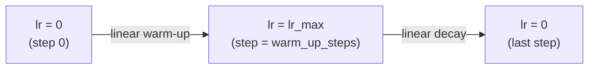

# Fine-tuning transformers for downstream tasks

A pre-trained transformer has learned general language representations from billions of tokens. Fine-tuning adapts these representations to a specific task by continuing training on a small labeled dataset. It is one of the most practically important skills in applied NLP — the same pre-trained BERT or GPT can be adapted to sentiment analysis, named entity recognition, question answering, or summarization in minutes with a few hundred labeled examples.

## One-line definition

Fine-tuning initializes a task-specific model from a pre-trained transformer's weights and continues training on a supervised dataset at a low learning rate — preserving the pre-trained knowledge while adapting the representations to the target task.

![BERT fine-tuned for classification — a task-specific head (usually a single Linear layer) is added on top of the [CLS] token representation and trained on labeled data](https://jalammar.github.io/images/BERT-classification-spam.png)
*Source: [Jay Alammar — The Illustrated BERT](https://jalammar.github.io/illustrated-bert/)*

## Why this topic matters

Almost every production NLP system today uses a fine-tuned transformer. Understanding fine-tuning explains why these models generalize from huge corpora to specialized domains, why catastrophic forgetting is a concern, and what hyperparameters matter most. It is also the foundation for understanding parameter-efficient fine-tuning (LoRA, adapters) discussed in the next note.

## The two adaptation approaches

### Full fine-tuning

Update all parameters of the pre-trained model plus the new task head:

```
PretrainedModel → [All parameters trainable] → Task-specific head
```

- Best performance on the target task
- Requires a GPU — the full model must fit in memory
- Risk of catastrophic forgetting on small datasets (the pre-trained knowledge is overwritten)

### Feature extraction (frozen encoder)

Freeze the pre-trained model, add a head, train only the head:

```
PretrainedModel → [Frozen] → Task-specific head → [Trainable]
```

- Faster, less compute
- Weaker performance (representations not adapted to the task)
- Useful when the dataset is tiny (for example, fewer than 1,000 examples) or the domain is very close to pre-training

In practice, full fine-tuning at a very low learning rate (2e-5 to 5e-5) is almost always better than feature extraction for modern tasks.

## Task-specific heads

Different task types require different heads attached to the transformer output:

| Task | Input to head | Head | Output |
|---|---|---|---|
| Text classification | `[CLS]` vector $(d_{\text{model}},)$ | Linear → softmax | Class distribution |
| Token classification (NER) | All token vectors $(n, d_{\text{model}})$ | Linear (per token) → softmax | Per-token label |
| Extractive QA (SQuAD) | All token vectors | 2 linear layers → start/end logits | Start + end position |
| Regression | `[CLS]` vector | Linear (1 output) | Scalar |
| Seq2seq (summarization) | Encoder output | Decoder + LM head | Token sequence |

## Fine-tuning recipe

The standard recipe for BERT-style models:

```
1. Load pre-trained model (bert-base-uncased / roberta-base / etc.)
2. Attach task-specific head
3. Train with:
   - Learning rate: 2e-5 to 5e-5
   - Batch size: 16 or 32
   - Epochs: 2–4
   - Warm-up steps: 6–10% of total training steps
   - Linear decay to 0 after warm-up
   - Weight decay: 0.01
   - Gradient clipping: max_norm = 1.0
4. Evaluate on dev set; pick best checkpoint
```

For GPT-style models, the same recipe applies but with a causal LM head or a classification head on the last token.

## The learning rate schedule

The warm-up + linear decay schedule is critical for BERT fine-tuning:



**Why warm-up?** Pre-trained weights are well-calibrated. Large early gradients can destroy the pre-trained representations before the model has adapted. Warm-up starts with tiny updates that gradually increase — the model adapts gently.

**Without warm-up**: training often diverges or reaches a bad local minimum in the first few hundred steps.

## Python code: complete fine-tuning pipeline

```python
# pip install transformers datasets evaluate
import torch
import torch.nn as nn
from torch.utils.data import DataLoader, Dataset
from transformers import (
    BertTokenizer, BertForSequenceClassification,
    get_linear_schedule_with_warmup,
    AutoModelForTokenClassification,
)
from torch.optim import AdamW


# ============================================================
# 1. Text Classification Fine-tuning (Sentiment Analysis)
# ============================================================

class SentimentDataset(Dataset):
    def __init__(self, texts, labels, tokenizer, max_length=128):
        self.encodings = tokenizer(
            texts,
            padding=True,
            truncation=True,
            max_length=max_length,
            return_tensors="pt",
        )
        self.labels = torch.tensor(labels)

    def __len__(self):
        return len(self.labels)

    def __getitem__(self, idx):
        return {
            "input_ids":      self.encodings["input_ids"][idx],
            "attention_mask": self.encodings["attention_mask"][idx],
            "labels":         self.labels[idx],
        }


def fine_tune_bert_classifier(
    train_texts, train_labels, val_texts, val_labels,
    model_name="bert-base-uncased",
    num_labels=2,
    num_epochs=3,
    learning_rate=2e-5,
    batch_size=16,
):
    """
    Fine-tune BERT for binary classification.
    Returns the trained model.
    """
    device = torch.device("cuda" if torch.cuda.is_available() else "cpu")
    tokenizer = BertTokenizer.from_pretrained(model_name)

    # Load pre-trained model with classification head
    model = BertForSequenceClassification.from_pretrained(
        model_name, num_labels=num_labels
    ).to(device)

    # Datasets and loaders
    train_dataset = SentimentDataset(train_texts, train_labels, tokenizer)
    val_dataset = SentimentDataset(val_texts, val_labels, tokenizer)
    train_loader = DataLoader(train_dataset, batch_size=batch_size, shuffle=True)
    val_loader = DataLoader(val_dataset, batch_size=batch_size)

    # Optimizer: AdamW with weight decay on non-bias/norm params
    no_decay = ["bias", "LayerNorm.weight"]
    optimizer_groups = [
        {"params": [p for n, p in model.named_parameters()
                    if not any(nd in n for nd in no_decay)],
         "weight_decay": 0.01},
        {"params": [p for n, p in model.named_parameters()
                    if any(nd in n for nd in no_decay)],
         "weight_decay": 0.0},
    ]
    optimizer = AdamW(optimizer_groups, lr=learning_rate)

    # Learning rate schedule: warm-up then linear decay
    total_steps = len(train_loader) * num_epochs
    warmup_steps = int(0.06 * total_steps)
    scheduler = get_linear_schedule_with_warmup(
        optimizer,
        num_warmup_steps=warmup_steps,
        num_training_steps=total_steps,
    )

    # Training loop
    for epoch in range(num_epochs):
        model.train()
        total_loss = 0

        for batch in train_loader:
            batch = {k: v.to(device) for k, v in batch.items()}
            outputs = model(**batch)
            loss = outputs.loss

            optimizer.zero_grad()
            loss.backward()
            torch.nn.utils.clip_grad_norm_(model.parameters(), max_norm=1.0)
            optimizer.step()
            scheduler.step()
            total_loss += loss.item()

        # Validation
        model.eval()
        correct = 0
        with torch.no_grad():
            for batch in val_loader:
                batch = {k: v.to(device) for k, v in batch.items()}
                outputs = model(**batch)
                preds = outputs.logits.argmax(dim=-1)
                correct += (preds == batch["labels"]).sum().item()

        avg_loss = total_loss / len(train_loader)
        acc = correct / len(val_dataset)
        print(f"Epoch {epoch+1}: loss={avg_loss:.4f}, val_acc={acc:.4f}")

    return model, tokenizer


# ============================================================
# Demo with tiny synthetic data
# ============================================================
train_texts = [
    "This movie was fantastic!",
    "I really enjoyed this.",
    "Excellent performance.",
    "Terrible waste of time.",
    "I hated every minute.",
    "Disappointing and boring.",
]
train_labels = [1, 1, 1, 0, 0, 0]

val_texts = ["Great film, highly recommend!", "Awful, do not watch."]
val_labels = [1, 0]

model, tokenizer = fine_tune_bert_classifier(
    train_texts, train_labels,
    val_texts, val_labels,
    num_epochs=2,
)


# ============================================================
# 2. Inference after fine-tuning
# ============================================================
def predict(texts, model, tokenizer, device=None):
    """Run inference on a list of texts."""
    if device is None:
        device = next(model.parameters()).device
    model.eval()
    encoded = tokenizer(
        texts, padding=True, truncation=True, max_length=128, return_tensors="pt"
    ).to(device)
    with torch.no_grad():
        logits = model(**encoded).logits
    probs = logits.softmax(dim=-1)
    preds = preds = logits.argmax(dim=-1)
    return preds.tolist(), probs.tolist()


preds, probs = predict(["I loved this!", "This was terrible."], model, tokenizer)
print(f"\nPredictions: {preds}")   # [1, 0]
print(f"Probabilities: {[[f'{p:.3f}' for p in row] for row in probs]}")


# ============================================================
# 3. Feature extraction (frozen encoder)
# ============================================================
from transformers import BertModel

class FrozenBertClassifier(nn.Module):
    """BERT encoder frozen — only the head is trained."""

    def __init__(self, num_labels=2):
        super().__init__()
        self.bert = BertModel.from_pretrained("bert-base-uncased")
        # Freeze all BERT parameters
        for param in self.bert.parameters():
            param.requires_grad = False
        # Only the head is trainable
        self.head = nn.Sequential(
            nn.Dropout(0.1),
            nn.Linear(768, num_labels),
        )

    def forward(self, input_ids, attention_mask):
        with torch.no_grad():
            outputs = self.bert(input_ids=input_ids, attention_mask=attention_mask)
        cls = outputs.last_hidden_state[:, 0, :]   # [CLS]
        return self.head(cls)


frozen_model = FrozenBertClassifier()
trainable = sum(p.numel() for p in frozen_model.parameters() if p.requires_grad)
total = sum(p.numel() for p in frozen_model.parameters())
print(f"\nFrozen BERT: {trainable:,} trainable / {total:,} total params")
# Only ~1,540 parameters (head) are trainable vs 110M in full fine-tuning
```

## Catastrophic forgetting

When fine-tuning on small datasets, the model can "forget" its pre-trained knowledge as it adapts to the new task:

| Symptom | Cause | Fix |
|---|---|---|
| Loss drops fast then performance plateaus | Forgetting general language understanding | Reduce learning rate |
| Fine-tuned model worse than zero-shot GPT | Too many epochs, large LR | Reduce epochs, use warmup |
| Loss is unstable | LR too high without warmup | Add warmup steps |
| Overfitting on 100 examples | Fine-tuning all layers | Freeze lower layers; only fine-tune top layers |

**Gradual unfreezing** (from ULMFiT): fine-tune top layer first, then progressively unfreeze lower layers. This helps preserve general representations in lower layers.

## Fine-tuning vs. from-scratch training

| Approach | Data needed | Training time | Performance |
|---|---|---|---|
| Fine-tune BERT (all layers) | 100–100k examples | Minutes–hours | High |
| Feature extraction (frozen) | 50–10k examples | Seconds–minutes | Moderate |
| Train from scratch | Millions of examples | Days–weeks | Highest (if enough data) |
| Zero-shot (prompt GPT) | 0 examples | Seconds | Varies |

Fine-tuning is almost always the right choice for production NLP with labeled data.

## Interview questions

<details>
<summary>What is catastrophic forgetting and how does it apply to fine-tuning?</summary>

Catastrophic forgetting is when a neural network overwrites previously learned knowledge when trained on a new task. During fine-tuning, if the learning rate is too high or training runs too long, the model updates its weights aggressively to fit the small fine-tuning dataset, destroying the rich language representations built during pre-training. Symptoms: the model fits the fine-tuning data well but fails on out-of-distribution examples that a fresh pre-trained model would handle. Mitigations: low learning rate (2e-5 vs. 1e-3), few epochs (2–4), learning rate warmup, weight decay.
</details>

<details>
<summary>Why use AdamW instead of Adam for fine-tuning transformers?</summary>

Adam modifies the gradient before applying weight decay, which causes weight decay to have different effects on different parameters — biases are barely regularized while large weights are over-regularized. AdamW (Loshchilov & Hutter, 2019) decouples weight decay from the gradient update, applying it directly to the weights: $\theta \leftarrow \theta - \eta \hat{m} / (\sqrt{\hat{v}} + \epsilon) - \eta \lambda \theta$. This gives correct and consistent L2 regularization across all parameters and generally improves fine-tuning performance for transformers.
</details>

<details>
<summary>What is the difference between fine-tuning for classification vs. for generation?</summary>

Classification fine-tuning: adds a linear head on top of the `[CLS]` token (for encoders) or last token (for decoders), trains with cross-entropy loss, produces a probability distribution over a fixed set of classes. Generation fine-tuning: the LM head is already present (it's the pre-training head), trains with teacher-forcing CLM loss, produces a token distribution at each position. Generation fine-tuning can be on instruction-following data (supervised fine-tuning), which teaches the model to follow specific output formats.
</details>

## Common mistakes

- Using the same learning rate as pre-training (1e-4) for fine-tuning — too high, causes instability and forgetting
- Not using a learning rate scheduler — fine-tuning benefits greatly from warmup + linear decay
- Training without weight decay (`optimizer = Adam(params, lr=2e-5)` — use `AdamW` and `weight_decay=0.01`)
- Not separating no-decay parameters (biases and LayerNorm weights should have zero weight decay)

## Final takeaway

Fine-tuning is the bridge from pre-trained language model to production NLP application. Load the pre-trained model, attach a task-specific head, and train at a low learning rate with warmup. Full fine-tuning outperforms feature extraction in almost all settings. The key hyperparameters are learning rate (2e-5 to 5e-5), warm-up steps (6% of total), and number of epochs (2–4). When data is very limited or compute is constrained, parameter-efficient methods (LoRA, adapters) are the alternative.

## References

- Devlin, J., et al. (2019). BERT: Pre-training of Deep Bidirectional Transformers. NAACL.
- Howard, J., & Ruder, S. (2018). Universal Language Model Fine-tuning for Text Classification (ULMFiT). ACL.
- Loshchilov, I., & Hutter, F. (2019). Decoupled Weight Decay Regularization (AdamW). ICLR.
