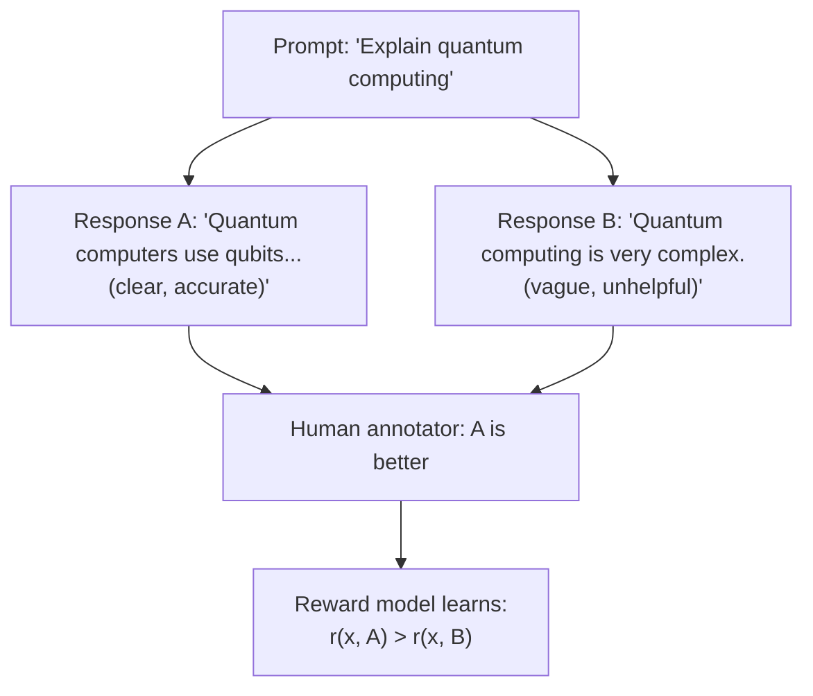
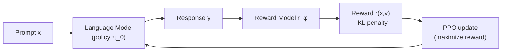
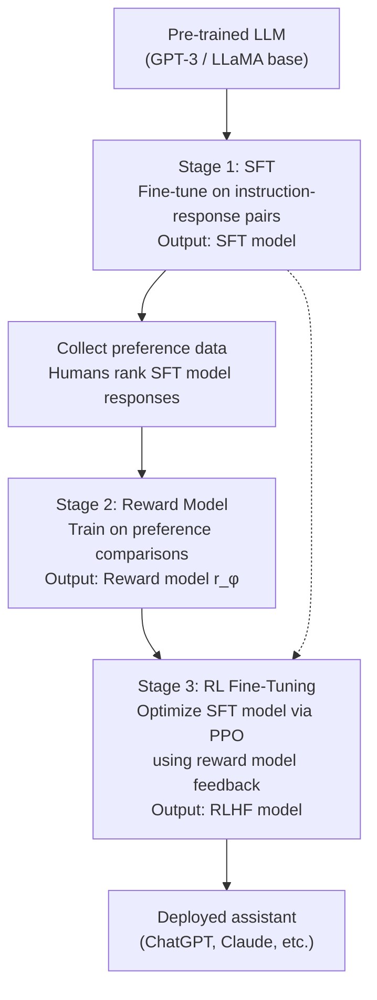

# RLHF and instruction tuning

> **TL;DR.** A base LLM predicts tokens — it doesn't follow instructions, refuse harmful requests, or stay polite. **RLHF** closes that gap in three stages: (1) **SFT** — supervised fine-tune on `(instruction, ideal response)` pairs; (2) **Reward modeling** — train a small model that scores responses based on human preference comparisons; (3) **PPO** — use reinforcement learning to push the LLM toward outputs the reward model rates highly. The same model that produced text completions now produces ChatGPT-quality conversations. Modern alternatives like **DPO** skip the reward model entirely.

A pre-trained language model is trained to predict the next token on web text. This produces a model that completes text — but not one that follows instructions, avoids harmful outputs, or gives coherent multi-turn responses. The gap between "predicts tokens" and "helpful AI assistant" is closed by **instruction tuning** (supervised fine-tuning on human-written examples) and **Reinforcement Learning from Human Feedback (RLHF)** (learning from human preference comparisons). Together, these produced ChatGPT, Claude, and Gemini.

## Try it interactively

- **[Compare base vs RLHF'd model](https://replicate.com/explore)** — try `llama-2-7b` (base) and `llama-2-7b-chat` (RLHF'd) on the same prompt; the difference is dramatic
- **[Hugging Face TRL library](https://github.com/huggingface/trl)** — production library for SFT, DPO, PPO, and GRPO
- **[OpenAI Fine-tuning API](https://platform.openai.com/docs/guides/fine-tuning)** — supervised fine-tune GPT-3.5/4 on your own instruction data
- **[Anthropic Constitutional AI paper](https://arxiv.org/abs/2212.08073)** — the RLAIF variant Claude uses (model-generated feedback instead of human)
- **[InstructGPT paper](https://arxiv.org/abs/2203.02155)** — the original three-stage pipeline, with examples
- **[OpenAssistant Conversations dataset](https://huggingface.co/datasets/OpenAssistant/oasst1)** — open-source instruction-following dataset to try SFT on

## One-line definition

RLHF is a three-stage pipeline: supervised fine-tuning on instruction-response pairs, training a reward model on human preference comparisons, and using PPO reinforcement learning to optimize the language model toward high-reward responses.


*Source: [Jay Alammar — The Illustrated BERT](https://jalammar.github.io/illustrated-bert/)*

## Why this topic matters

RLHF is the key technology that turned raw GPT-3 (which would complete harmful prompts as readily as helpful ones) into ChatGPT (which follows instructions, refuses harmful requests, and maintains helpful conversation). Every deployed LLM assistant uses some form of instruction tuning and human feedback. Understanding RLHF explains why models behave the way they do in production.

## The alignment problem

A pre-trained LLM optimizes for predicting web text — it learned that web text includes harmful content, toxic text, and disinformation. Asked "How do I make explosives?", it might complete the sentence literally. Asked "Write a story about a helpful assistant", it might produce an inconsistent narrative. The model has no concept of "helpful" or "safe" — it only knows "what text typically follows this text".

**Goal**: align the model's outputs with human values — helpful, harmless, and honest (Anthropic's HHH framework).

## Stage 1: Supervised Fine-Tuning (SFT)

Train the pre-trained LLM on a dataset of high-quality instruction-response pairs written by humans (prompt contractors):

```
Instruction: "Write a Python function to reverse a list"
Response: "def reverse_list(lst):\n    return lst[::-1]\n\nThis function uses Python's slice notation..."

Instruction: "Explain recursion to a 10-year-old"
Response: "Imagine you have a set of Russian dolls..."
```

The SFT model learns the instruction-following format and produces coherent, helpful responses. However:
- Human-written demonstrations are expensive to scale
- They cannot capture the full space of preferences (safe vs. unsafe, helpful vs. verbose)
- The model may overfit to the specific styles of the human writers

SFT alone produces a capable but imperfect assistant. RLHF refines it further.

## Stage 2: Reward Model Training

For the same prompt, ask annotators to rank multiple model responses from best to worst. This is easier and cheaper than writing ideal responses from scratch.

**Data format**: for each prompt $x$, two responses $(y_w, y_l)$ where $y_w$ is preferred over $y_l$ by human annotators.

**Reward model**: a transformer (usually a copy of the SFT model with a linear head) trained to assign a scalar reward $r(x, y)$ to response $y$ given prompt $x$:

$$
\mathcal{L}_{\text{RM}} = -\mathbb{E}_{(x, y_w, y_l) \sim \mathcal{D}} \left[ \log \sigma\!\left(r(x, y_w) - r(x, y_l)\right) \right]
$$

This is the **Bradley-Terry model**: the probability that $y_w$ is preferred over $y_l$ is $\sigma(r_w - r_l)$.



## Stage 3: RL Fine-Tuning with PPO

Use the reward model to provide feedback signal and optimize the SFT model via Proximal Policy Optimization (PPO):

**At each step**:
1. Sample prompt $x$ from dataset
2. Generate response $y$ from the current policy (LM)
3. Compute reward $r = r_\phi(x, y)$ from reward model
4. Add KL penalty: $R = r - \beta \cdot \text{KL}(π_\theta \| \pi_{\text{SFT}})$
5. Update policy $\pi_\theta$ via PPO gradient to maximize $R$

The KL divergence penalty prevents the LM from "gaming" the reward model by diverging too far from the SFT distribution (producing nonsensical text that happens to score high):

$$
\mathcal{L}_{\text{RLHF}} = \mathbb{E}_{x \sim \mathcal{D}, y \sim \pi_\theta} [r_\phi(x, y)] - \beta \mathbb{E}_x [\text{KL}(\pi_\theta(y|x) \| \pi_{\text{SFT}}(y|x))]
$$



## Direct Preference Optimization (DPO): RLHF without RL

DPO (Rafailov et al., 2023) eliminates the need for a separate reward model and PPO by directly optimizing the language model on preference data:

$$
\mathcal{L}_{\text{DPO}}(\pi_\theta; \pi_{\text{ref}}) = -\mathbb{E} \left[ \log \sigma\!\left(\beta \log \frac{\pi_\theta(y_w|x)}{\pi_{\text{ref}}(y_w|x)} - \beta \log \frac{\pi_\theta(y_l|x)}{\pi_{\text{ref}}(y_l|x)}\right) \right]
$$

DPO increases the probability of preferred responses and decreases the probability of dispreferred responses relative to the reference model, all in a single supervised training objective.

**Advantages over RLHF/PPO**:
- No reward model needed
- Much more stable training (no RL instability)
- Standard supervised fine-tuning loop
- Similar or better performance

DPO has largely replaced PPO-based RLHF in research and many production systems.

## The full RLHF pipeline



## Python code: DPO training (simpler than PPO)

```python
# pip install transformers trl datasets
import torch
from transformers import AutoModelForCausalLM, AutoTokenizer
from trl import DPOTrainer, DPOConfig
from datasets import Dataset


# ============================================================
# DPO: Direct Preference Optimization
# The simplest way to do RLHF-style alignment
# ============================================================

model_name = "gpt2"   # Use a small model for demo
tokenizer = AutoTokenizer.from_pretrained(model_name)
tokenizer.pad_token = tokenizer.eos_token

# Load model (policy) and reference model (frozen SFT model)
model = AutoModelForCausalLM.from_pretrained(model_name)
ref_model = AutoModelForCausalLM.from_pretrained(model_name)   # frozen reference


# ============================================================
# Preference dataset format for DPO
# Each item: (prompt, chosen_response, rejected_response)
# ============================================================
preference_data = {
    "prompt": [
        "Explain what a neural network is.",
        "Write a Python function to add two numbers.",
    ],
    "chosen": [
        "A neural network is a machine learning model inspired by the brain. "
        "It consists of layers of neurons that transform input data into output predictions.",
        "def add(a, b):\n    \"\"\"Add two numbers.\"\"\"\n    return a + b",
    ],
    "rejected": [
        "Neural networks are complicated and very hard to understand.",
        "Just use the + operator, it's not that hard.",
    ],
}

dataset = Dataset.from_dict(preference_data)

# ============================================================
# DPO training configuration
# ============================================================
dpo_config = DPOConfig(
    output_dir="./dpo_output",
    num_train_epochs=3,
    per_device_train_batch_size=1,
    learning_rate=1e-5,
    beta=0.1,          # KL penalty coefficient — how close to stay to reference
    max_length=512,
    max_prompt_length=128,
    remove_unused_columns=False,
    logging_steps=1,
)

trainer = DPOTrainer(
    model=model,
    ref_model=ref_model,
    args=dpo_config,
    train_dataset=dataset,
    tokenizer=tokenizer,
)

# trainer.train()   # Uncomment to actually train


# ============================================================
# Manual reward model: understand the Bradley-Terry loss
# ============================================================
import torch.nn as nn
import torch.nn.functional as F


class RewardModel(nn.Module):
    """
    Reward model: transformer encoder + scalar head.
    Takes (prompt, response) pair and outputs a scalar reward.
    """

    def __init__(self, backbone_model):
        super().__init__()
        self.backbone = backbone_model   # pre-trained LLM
        d = self.backbone.config.n_embd   # GPT-2 hidden size
        self.reward_head = nn.Linear(d, 1)

    def forward(self, input_ids, attention_mask):
        outputs = self.backbone(
            input_ids=input_ids,
            attention_mask=attention_mask,
            output_hidden_states=True,
        )
        # Use the last token's hidden state as the sequence representation
        last_hidden = outputs.hidden_states[-1][:, -1, :]   # (batch, d)
        reward = self.reward_head(last_hidden)               # (batch, 1)
        return reward.squeeze(-1)


def bradley_terry_loss(reward_chosen, reward_rejected):
    """
    Loss for reward model training.
    Maximizes probability that chosen response has higher reward.
    """
    return -F.logsigmoid(reward_chosen - reward_rejected).mean()


# Demo reward model
base_model = AutoModelForCausalLM.from_pretrained("gpt2")
reward_model = RewardModel(base_model)

# Simulate a batch of (chosen, rejected) pairs
batch_size = 2
chosen_ids = torch.randint(0, 1000, (batch_size, 20))
rejected_ids = torch.randint(0, 1000, (batch_size, 20))
mask = torch.ones_like(chosen_ids)

r_chosen = reward_model(chosen_ids, mask)
r_rejected = reward_model(rejected_ids, mask)

loss = bradley_terry_loss(r_chosen, r_rejected)
print(f"Reward model Bradley-Terry loss: {loss.item():.4f}")
print(f"Chosen rewards:   {r_chosen.detach().tolist()}")
print(f"Rejected rewards: {r_rejected.detach().tolist()}")


# ============================================================
# Constitutional AI / RLAIF (reward from AI not humans)
# ============================================================
# In practice, Claude uses Constitutional AI:
# 1. Generate responses
# 2. Ask a model to critique the response against a constitution
# 3. Ask the model to revise the response
# 4. Use revised responses as "chosen" for DPO training
# This scales without requiring human annotations for every preference.
print("\n=== Constitutional AI outline ===")
constitution = [
    "Choose the response that is most helpful to the human.",
    "Choose the response that is least likely to cause harm.",
    "Choose the response that is most honest and accurate.",
]
print("Example constitution principles:")
for p in constitution:
    print(f"  - {p}")
```

## RLHF vs. DPO vs. SFT-only comparison

| Method | Requires human data | Stability | Performance | Complexity |
|---|---|---|---|---|
| SFT only | Instruction pairs | Stable | Good baseline | Low |
| RLHF (PPO) | Preferences + reward model | Unstable | Best (in theory) | High |
| DPO | Preferences only | Stable | Near RLHF | Medium |
| RLAIF | Constitution + AI feedback | Stable | Scalable | Medium |
| KTO | Binary human signals | Stable | Competitive | Low |

## What alignment changes in practice

| Before RLHF (base model) | After RLHF (aligned model) |
|---|---|
| Completes harmful prompts | Refuses harmful requests |
| Ignores instructions | Follows multi-turn instructions |
| Provides raw text completions | Maintains consistent format |
| No self-awareness | Says "I don't know" when unsure |
| Generates disinformation as readily as facts | Attempts to be accurate |

RLHF does not eliminate all failure modes — it reduces them. Hallucination, jailbreaking, and inconsistency remain active research problems.

## Interview questions

<details>
<summary>What are the three stages of RLHF and what does each accomplish?</summary>

Stage 1 (SFT): fine-tune the pre-trained LLM on expert-written instruction-response pairs. The model learns to follow instructions and produce coherent responses but at the cost and quality of human demonstrations. Stage 2 (Reward Model): train a model to predict human preferences given pairs of model responses. This is easier to scale than writing ideal responses. Stage 3 (RL Fine-Tuning): use PPO to optimize the SFT model toward higher reward model scores, with a KL penalty to stay close to the SFT distribution. This further aligns the model toward human-preferred behavior beyond what explicit demonstrations could cover.
</details>

<details>
<summary>Why is there a KL penalty in the RLHF objective?</summary>

The KL penalty $\beta \cdot \text{KL}(\pi_\theta \| \pi_{\text{SFT}})$ prevents reward hacking: the LM might learn to output text that scores very highly on the reward model but is nonsensical or low-quality in reality (because the reward model is imperfect). By keeping the policy close to the SFT model (which produces reasonable text), the KL penalty ensures the RL optimization stays in a sensible distribution. $\beta$ controls the trade-off: high $\beta$ → conservative updates, low $\beta$ → more aggressive optimization but risk of reward hacking.
</details>

<details>
<summary>What is DPO and why did it largely replace PPO for alignment fine-tuning?</summary>

DPO (Direct Preference Optimization) shows that the RLHF objective — under a certain optimal policy formulation — can be rewritten as a supervised classification loss on preference pairs. There is no need to train a separate reward model or run PPO. The training loop is the same as standard SFT (teacher forcing), making it much simpler and more stable. DPO achieves similar or better alignment than PPO-RLHF on most benchmarks, with dramatically lower implementation complexity and training stability.
</details>

## Common mistakes

- Thinking SFT alone is sufficient — SFT gives instruction-following but the model still generates harmful, biased, or unhelpful content without preference-based alignment
- Confusing RLHF with "the model learns from user feedback" — in production RLHF, the feedback comes from specially trained annotators, not live users
- Assuming aligned models are safe by default — RLHF reduces harmful outputs but does not eliminate them; jailbreaks and adversarial prompts remain possible
- Forgetting the KL penalty when implementing PPO for LLMs — the model will collapse to reward-hacking outputs quickly without it

## Final takeaway

RLHF is the three-stage pipeline that transforms a raw pre-trained language model into a helpful assistant: SFT on instructions, reward model from preferences, PPO optimization. DPO has largely replaced PPO-based RLHF by reformulating the problem as a simple classification objective. Constitutional AI (Anthropic) scales alignment by using AI-generated preferences based on a written constitution. Alignment is not solved — it is an ongoing engineering challenge — but RLHF and its variants are the current industry standard for producing deployable, helpful LLMs.

## References

- Ouyang, L., et al. (2022). Training language models to follow instructions with human feedback (InstructGPT). NeurIPS.
- Rafailov, R., et al. (2023). Direct Preference Optimization: Your Language Model is Secretly a Reward Model. NeurIPS.
- Bai, Y., et al. (2022). Constitutional AI: Harmlessness from AI Feedback. Anthropic.
- Christiano, P., et al. (2017). Deep Reinforcement Learning from Human Preferences. NeurIPS.
